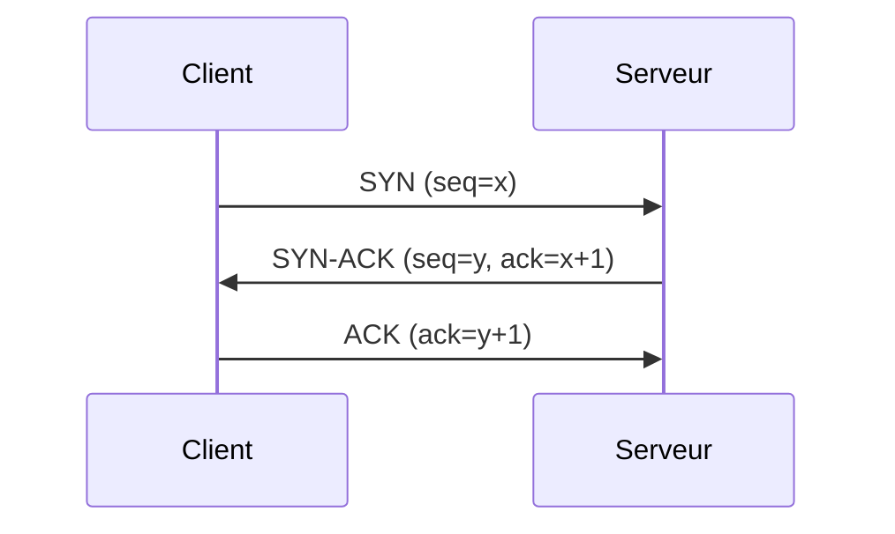

# Archetype Examples — Companion to CONVERSION-METHOD.md §0

These are illustrative, hand-constructed examples showing what each
archetype's conversion pattern looks like in practice. They are **NOT**
derived from actual course PDFs (none of these courses' materials have
been reviewed or converted yet). When a real course in one of these
archetypes is actually converted, follow the pattern shown here, but use
the real source content — do not treat these examples themselves as
source material.

Archetype 1 (proof-heavy theory) already has its real worked example in
[`CONVERSION-METHOD.md` §5](./CONVERSION-METHOD.md#5-worked-example)
(fast exponentiation, from the algorithms course that's actually being
converted) — not repeated here.

Below, §1 is a **second** Archetype 1 example, for Graph Theory — added
because Archetype 1 spans several courses (Algorithms, Automata Theory,
Formal Logic, Numerical Methods, Graph Algorithms) and one worked example
doesn't show that the pattern is course-agnostic. One important
difference from the other four sections: Graph Theory's PDFs **have**
already been through the fidelity-only conversion pass (see
`docs/Year 1/Semester 2/Graphe/`) — real transcribed content exists,
including a real, unproven statement of the Euler theorem. The
before/after pair below is still invented, not lifted from that real
proof text (I don't have the source PDF's actual proof wording), so the
same rule applies: when this course's enhancement pass actually happens,
use the real source content, not this example's specific proof text.

## 1. Proof-heavy theory (second example: Graph Theory)

*Illustrative topic: the Handshaking Lemma.*

### Before

```md
Dans un graphe non orienté G(S,A), on définit le degré d'un sommet i,
noté deg(i), comme le nombre d'arêtes incidentes à i. On peut montrer
que la somme des degrés de tous les sommets d'un graphe est toujours
égale au double du nombre d'arêtes, c'est-à-dire somme sur i dans S de
deg(i) = 2|A|. En effet, chaque arête (i,j) du graphe a exactement deux
extrémités, i et j, et contribue donc exactement 1 au degré de i et 1
au degré de j, soit 2 au total à la somme des degrés. Comme ceci est
vrai pour chaque arête indépendamment, en sommant sur toutes les
arêtes on obtient bien que la somme des degrés vaut deux fois le
nombre d'arêtes. Une conséquence immédiate de ce résultat est que le
nombre de sommets de degré impair dans un graphe est toujours pair,
puisque si ce nombre était impair, la somme des degrés serait elle
aussi impaire, ce qui contredirait le fait qu'elle vaut 2|A|, un
nombre pair. Par exemple, dans un graphe à 4 sommets où trois sommets
ont degré 3, 3, 2, le quatrième sommet doit nécessairement avoir un
degré impair pour que le compte des sommets de degré impair reste
pair — ici deg = 1, 2, 2, ... (l'énoncé source poursuit avec un exemple
chiffré complet avant d'enchaîner sur le théorème d'Euler).
```

### After

````md
## Lemme des poignées de main

Dans un graphe non orienté $G(S,A)$, chaque arête relie exactement deux
sommets — ça suffit à contraindre fortement la somme des degrés.

:::note Théorème
$$
\sum_{i \in S} \deg(i) = 2|A|
$$
:::

<details>
<summary>Proof</summary>

Chaque arête $(i,j)$ a deux extrémités et contribue exactement 1 au
degré de $i$ et 1 au degré de $j$ — 2 au total. En sommant cette
contribution sur les $|A|$ arêtes du graphe, indépendamment les unes
des autres, on obtient $\sum_i \deg(i) = 2|A|$.

</details>

:::tip Example
4 sommets de degrés $3, 3, 2, x$ : $\sum \deg(i)$ doit être pair, donc
$x$ doit être impair — ici $x = 2$ est impossible, il faut $x \in
\{1, 3, 5, \ldots\}$.
:::

Une conséquence directe : le nombre de sommets de degré impair est
toujours pair (sinon la somme serait impaire). Tu retrouveras cette
même idée de parité juste après, dans la condition du **théorème
d'Euler** sur l'existence d'une chaîne eulérienne.
````

**Demonstrates:** the same Definition-free, Theorem → Proof → Example
shape as the exponentiation example in `CONVERSION-METHOD.md` §5, on a
genuinely different course within Archetype 1 — confirming the pattern
isn't Algorithms-specific. The bridging sentence at the end follows §2's
"connective reasoning" rule (added, second-person voice) exactly as in
the original worked example.

## 2. Applied/tool-based programming

*Illustrative topic: a small inheritance example in OOP.*

### Before

```md
Pour illustrer l'héritage, on définit une classe Animal avec un attribut
nom et une méthode parler() qui affiche un son générique. Ensuite on
définit une classe Chien qui hérite d'Animal et redéfinit parler() pour
afficher "Wouf". Pour créer la classe Animal en Java il faut d'abord
importer les paquets nécessaires, déclarer le package, écrire le
constructeur avec le mot-clé public, initialiser l'attribut nom via
this.nom = nom, ajouter les accesseurs getNom() et setNom(), puis écrire
la méthode parler() qui fait System.out.println. Ensuite pour Chien on
répète la même structure de constructeur et d'accesseurs, on ajoute
extends Animal, on appelle super(nom) dans le constructeur, et on
redéfinit parler() avec @Override. Attention à ne pas oublier @Override
sinon Java considère que c'est une nouvelle méthode et non une
redéfinition, ce qui casse le polymorphisme si on stocke l'objet dans
une variable de type Animal.
```

### After

````md
## Redéfinir une méthode héritée

Une sous-classe peut **redéfinir** (override) une méthode de sa classe
parente pour lui donner un comportement différent, tout en gardant la
même signature.

```java
class Chien extends Animal {
    @Override
    void parler() {
        System.out.println("Wouf");
    }
}
```

<details>
<summary>Constructeurs et accesseurs complets</summary>

```java
class Animal {
    private String nom;
    public Animal(String nom) { this.nom = nom; }
    public String getNom() { return nom; }
    public void setNom(String nom) { this.nom = nom; }
    void parler() { System.out.println("..."); }
}

class Chien extends Animal {
    public Chien(String nom) { super(nom); }
    @Override
    void parler() { System.out.println("Wouf"); }
}
```

</details>

:::tip
`super(nom)` appelle le constructeur de la classe parente — sans ça, le
constructeur de `Animal` ne s'exécute jamais et `nom` reste non
initialisé.
:::

:::warning
Sans `@Override`, Java traite `parler()` comme une méthode nouvelle, pas
comme une redéfinition — le polymorphisme casse silencieusement si tu
stockes l'objet dans une variable de type `Animal`.
:::
````

**Demonstrates:** boilerplate (constructor/getter/setter ceremony)
collapsed into `<details>`, the one line that matters (`@Override` +
the new `parler()` body) kept visible in the main code block, Tip/Warning
admonitions used in place of Definition/Theorem vocabulary — per
CONVERSION-METHOD.md §0's Archetype 2 row.

## 3. Hardware/circuits/systems

*Illustrative topic: a simple RC timing circuit (charging curve).*

### Before

```md
Le circuit RC série est composé d'une résistance R et d'un condensateur
C branchés en série avec une source de tension E. Quand on ferme
l'interrupteur, le condensateur se charge progressivement. La tension
aux bornes du condensateur suit une loi exponentielle Vc(t) =
E(1-e^(-t/RC)) où RC est appelé constante de temps tau, exprimée en
secondes. Après une durée de 5*tau, on considère le condensateur comme
quasiment chargé (99% de E). Ce comportement s'explique par le fait que
le courant de charge diminue progressivement à mesure que la tension du
condensateur se rapproche de E, réduisant la différence de potentiel qui
alimente le courant selon la loi d'Ohm.
```

### After

````md
## Charge d'un condensateur (circuit RC)

```
   R
E ─/\/\/──┬──── +
          │
          ═  C
          │
──────────┴──── −
```

Fermer l'interrupteur charge $C$ à travers $R$. La tension aux bornes du
condensateur suit :

$$
V_C(t) = E\left(1 - e^{-t/RC}\right)
$$

où $RC = \tau$ (la **constante de temps**, en secondes) fixe l'échelle
de temps de la charge : après $5\tau$, $C$ est chargé à 99 % de $E$.

<details>
<summary>Pourquoi une exponentielle</summary>

Le courant de charge diminue à mesure que $V_C$ se rapproche de $E$,
réduisant la différence de potentiel qui l'alimente (loi d'Ohm) — la
vitesse de charge ralentit proportionnellement à ce qu'il reste à
charger, ce qui est exactement la signature d'une décroissance
exponentielle.

</details>
````

*(A real conversion would use an actual circuit diagram image or a
proper Mermaid/SVG rendering here — the ASCII sketch above stands in for
one, since the real circuit topology doesn't exist yet to reproduce
faithfully.)*

**Demonstrates:** the diagram sits directly above the equation it
explains, not several paragraphs before it (split-attention rule); the
derivation ("why an exponential") is collapsed by length, but the
diagram itself is never collapsed or replaced with a placeholder — per
CONVERSION-METHOD.md §0's Archetype 3 row, diagrams are never
optional in this archetype.

## 4. Prose/conceptual

*Illustrative topic: organizational management structures.*

### Before

```md
Il existe plusieurs types de structures organisationnelles en entreprise.
La structure hiérarchique classique repose sur une chaîne de commandement
verticale où chaque employé a un seul supérieur direct, ce qui facilite
la clarté des responsabilités mais peut ralentir la communication entre
départements. La structure matricielle combine une hiérarchie verticale
par fonction avec une hiérarchie horizontale par projet, ce qui améliore
la coordination transversale mais crée une double autorité pouvant
générer des conflits de priorités pour l'employé. La structure plate
réduit le nombre de niveaux hiérarchiques pour accélérer la prise de
décision, ce qui convient bien aux petites structures mais devient
difficile à maintenir à mesure que l'entreprise grandit.
```

### After

```md
## Structures organisationnelles

### Hiérarchique

Chaque employé a un seul supérieur direct. Clarté des responsabilités,
mais la communication entre départements peut être lente.

### Matricielle

Combine une hiérarchie par fonction et une hiérarchie par projet.
Meilleure coordination transversale, au prix d'une double autorité —
source fréquente de conflits de priorités.

### Plate

Peu de niveaux hiérarchiques, décisions rapides. Fonctionne bien à
petite échelle ; difficile à maintenir en grandissant.

:::info Key Takeaway
Le choix de structure est un compromis entre clarté d'autorité, vitesse
de décision, et coordination transversale — aucune structure ne
maximise les trois à la fois.
:::
```

**Demonstrates:** plain header-per-subtopic split, short paragraphs, a
single "Key Takeaway" callout at the end and nothing else — the lightest
conversion lift of all five archetypes, per CONVERSION-METHOD.md §0's
Archetype 4 row.

## 5. Protocol/process-heavy, mixed

*Illustrative topic: the TCP three-way handshake.*

### Before

```md
L'établissement d'une connexion TCP se fait en trois étapes, appelées le
three-way handshake. D'abord le client envoie un segment SYN au serveur
pour demander l'ouverture de la connexion, avec un numéro de séquence
initial x. Ensuite le serveur répond par un segment SYN-ACK qui accuse
réception du SYN du client (ACK = x+1) et propose son propre numéro de
séquence initial y. Enfin le client répond par un segment ACK (ACK = y+1)
qui accuse réception du SYN-ACK du serveur, et la connexion est
établie. Ce mécanisme garantit que les deux parties se sont mises
d'accord sur les numéros de séquence initiaux avant tout échange de
données, ce qui est nécessaire pour la fiabilité de TCP.
```

### After

````md
## Établissement d'une connexion TCP (three-way handshake)



Les trois étapes se lisent directement sur le diagramme ci-dessus :

1. Le client propose son numéro de séquence initial `x` (`SYN`).
2. Le serveur accuse réception (`ack = x+1`) et propose le sien, `y`
   (`SYN-ACK`).
3. Le client accuse réception à son tour (`ack = y+1`) — la connexion
   est établie.

Les deux parties se sont mises d'accord sur leurs numéros de séquence
initiaux avant tout échange de données, ce qui est nécessaire pour la
fiabilité de TCP.
````

*(If this same course also has a scheduling or complexity-heavy section —
e.g. round-robin quantum analysis — that section follows the Archetype 1
pattern instead: Definition → Theorem → Proof → Example. Archetype
classification is per-section, not per-course, per CONVERSION-METHOD.md
§0.)*

**Demonstrates:** a Mermaid sequence diagram for the protocol exchange
itself, with the numbered explanation directly beneath it rather than
separated by other content (split-attention rule) — per
CONVERSION-METHOD.md §0's Archetype 5 row.

## Self-check

None of the four archetype examples in §2–§5 uses the Definition →
Theorem → Proof → Example pattern — no `:::note Theorem` or bare
theorem-statement admonition appears in any of them, and no
`<details><summary>Proof</summary>` block wraps a mathematical proof
(the two `<details>` blocks that do appear — boilerplate code in §2, a
derivation explanation in §3 — collapse code and prose, not a formal
proof, matching each archetype's own offload rule instead of
Archetype 1's).

Conversely, §1 (Graph Theory) *does* use that pattern — `:::note
Théorème`, `<details><summary>Proof</summary>` wrapping an actual
proof, `:::tip Example` — which is correct here, since §1 is Archetype 1
and that's the pattern this whole document elsewhere confirms Archetype
1 owns exclusively.
