import Tabs from '@theme/Tabs';
import TabItem from '@theme/TabItem';

<Tabs>
<TabItem value="markdown" label="Markdown" default>

# Modélisation dynamique

*II2-ENSI*

## Perspectives d'un système

- **Statique** (ce que le système EST)
- **Fonctionnel** (ce que le système FAIT)
- **Dynamique** (comment le système EVOLUE)

## Aspects dynamiques du système

- Jusqu'ici, le système est décrit statiquement : → Le diagramme de classes
  - Décrit les messages (méthodes ou opérations) que les instances des classes peuvent recevoir mais ne décrit pas l'émission de ces messages
  - Ne montre pas le lien entre ces échanges de messages et les processus généraux que l'application doit réaliser
- Il faut maintenant décrire comment le système évolue dans le temps

## Modélisation dynamique — Objectifs

- Introduire les diagrammes d'interaction
- Introduire les diagrammes de comportement

## Diagrammes d'interactions

- Les diagrammes de séquences et les diagrammes de communication (ou collaboration) d'instances sont deux types de diagrammes d'interaction. Les diagrammes d'interaction représentent une interaction, c'est-à-dire un ensemble d'objets et leurs relations, y compris les messages qu'ils peuvent échanger. Ils présentent une vue dynamique d'un système.
- Les diagrammes de séquence sont des diagrammes d'interaction qui mettent l'accent sur le classement chronologique des messages, alors que les diagrammes de communication d'instances sont des diagrammes d'interaction qui mettent l'accent sur l'organisation structurelle des éléments qui envoient et reçoivent des messages.
- Les diagrammes de séquence et les diagrammes de communication d'instances sont isomorphes, c'est-à-dire que l'un peut être transformé en l'autre.

## Diagramme d'interactions

Expression des Besoins (Cas d'utilisation) → Description de l'interaction du système avec les acteurs extérieurs → Diagramme d'interaction.

- **Modèle conceptuel** (Analyse dynamique) : Description de l'interaction moyennant les objets (de l'analyse) du système → Diagramme d'Interaction
- **Modèle logique** (Conception dynamique) : Description de l'interaction moyennant les objets (de la conception) du système

## Diagrammes de séquences

Dérivés des scénarios de OMT :

- Montrent des exemples de coopération entre objets dans la réalisation de processus de l'application
- Illustrent la dynamique d'enchaînement des traitements à travers les messages échangés entre objets
- le temps est représenté comme une dimension explicite (en général de haut en bas)
- Les éléments constitutifs d'un scénario sont :
  - Un ensemble d'objets (et/ou d'acteurs)
  - Un message initiateur du scénario
  - La chronologie des messages échangés subséquemment
  - Les contraintes de temps (aspects temps réel)

## Présentation

- Diagramme de séquence : montre la séquence dans le temps des interactions entre les objets du système au sein d'un scénario.
  - Objet passif : activation dépend d'un fil externe
  - Objet actif : possède son propre fil d'exécution
- Un diagramme de séquence a deux dimensions :
  - **dimension verticale** : le temps ; l'ordre d'envoi d'un message est déterminé par sa position sur l'axe vertical du diagramme ; le temps s'écoule "de haut en bas" de cet axe.
  - **dimension horizontale** : les objets (et les acteurs) ; l'ordre de disposition des objets sur l'axe horizontal est sans importance.

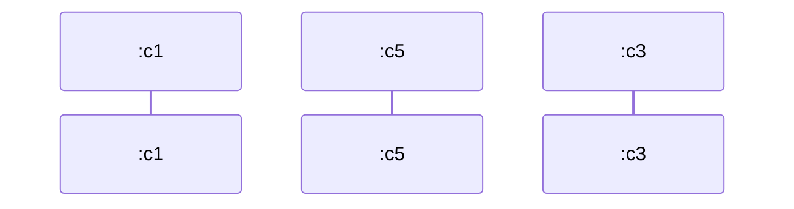

*(objets sur l'axe horizontal, temps sur l'axe vertical)*

## Syntaxe graphique

Objets et messages : `Nom Objet:NomClasse`, `Nom Objet1:NomClasse1` (Objets = Instances de classes)

`nom message (paramètres)` : Message nom message émis par `Nom Objet` vers `Nom Objet1`.

## Ligne de vie et activation

- La « ligne de vie » représente l'existence de l'objet à un instant particulier :
  - Commence avec la création de l'objet
  - Se termine avec la destruction de l'objet
- L'activation est la période durant laquelle l'objet exécute une action lui-même ou via une autre procédure

## Notation

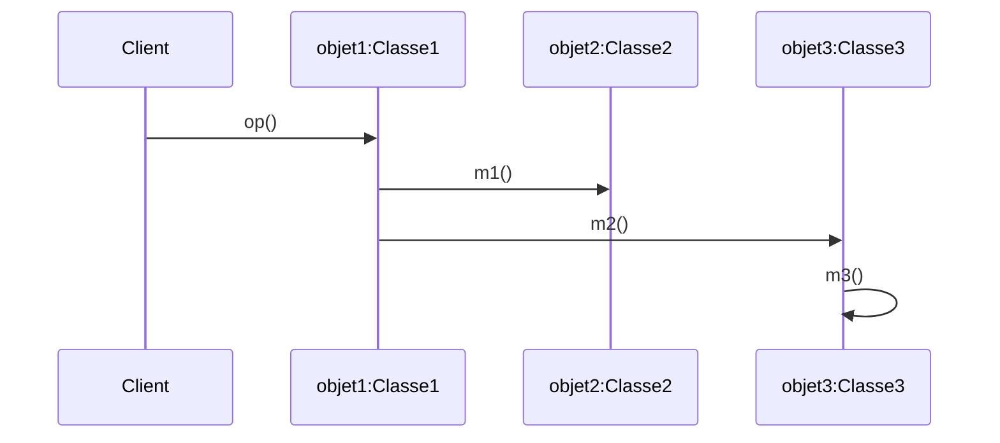

- Objet existant avant et après l'activation du scénario (objet2:Classe2)
- Objet créé dans le scénario (objet3:Classe3)
- Activité de l'objet / Ligne de vie

## Messages simples

- Communication entre objets
  - Des paramètres
  - Un retour
- Cas particuliers :
  - La récursivité
  - Les messages entraînant la construction d'un objet
  - Les destructions d'objets

## Messages synchrone vs asynchrone

- **Message synchrone** : Suite à l'envoi de son message, l'expéditeur (objet passif ou actif) perd le contrôle mais demeure en activation (invocation d'opération). Il demeure bloqué jusqu'à ce que le destinataire ait fini de traiter le message. Il retrouve ensuite le contrôle avec la réponse à son message (pouvant être représentée par une flèche pointillée).
- **Message simple** : L'expéditeur envoie un message au destinataire sans attendre de réponse (signal).
  - Si l'expéditeur est un objet passif : l'expéditeur perd le contrôle et termine son activation après l'envoi du message
  - Si l'expéditeur est un objet actif : l'envoi d'un message simple équivaut à l'envoi d'un message asynchrone.

## Catégorie de messages

Un objet actif initie et contrôle le flux d'activités. Graphiquement, la ligne pointillée verticale d'un objet actif est remplacée par un double trait vertical.

<!-- TODO: unclear in source, verify against original PDF page 234 — this slide illustrates "Représentation d'un objet actif (à gauche) et d'une exécution sur un objet passif (à droite)" as a diagram; no further text extracted. -->

## Mode d'interaction procédural (i.e. synchrone)

- Au plus un objet détient le contrôle à la fois.
- Un objet obtient le contrôle quand il reçoit un message (i.e. on invoque une de ses méthodes). Ce moment détermine le début de son activation.
- Un objet rend le contrôle à son destinateur lorsqu'il lui renvoie sa réponse. Ce moment détermine la fin de son activation.
- Lorsqu'un objet en activation a le contrôle, il peut :
  - faire des calculs,
  - ou envoyer des messages : dans ce cas, l'objet demeure en activation mais cède à son tour le contrôle à son destinataire. Il ne peut rien faire jusqu'à ce qu'il reçoive la réponse de son destinataire (message synchrone ou dit « bloquant »).

## Mode d'interaction procédural

- Les objets sont dits « passifs », car on doit leur envoyer un message pour déclencher leur activation.
- Un seul fil d'exécution.
- Dans ce mode, seul un acteur peut envoyer un message ou faire des calculs sans l'intervention de qui que ce soit. Son activation est constante…
- L'identité des objets en activation est gérée dans une pile :
  - Dessus de la pile = objet en activation qui possède le contrôle
  - On empile l'identité d'un objet qui débute une activation.
  - On dépile l'identité d'un objet qui termine une activation.
- Les messages sont numérotés de façon à refléter l'imbrication des envois de messages.
  - Le message 2.2 est envoyé après que la réponse au message 2.1 ait été reçue
  - Il faut attendre la réponse au message 2.2.3 avant de pouvoir répondre au message 2.2.

## Exemple : mode d'interaction procédural

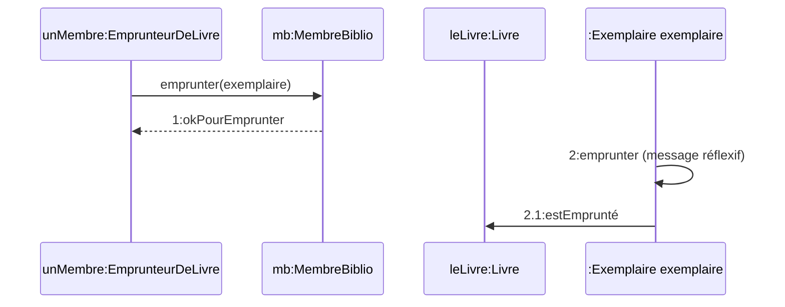

## Autres notations pour des interactions avancées

On peut alors avoir besoin de :

- Interactions concurrentes
- Conditions (gardes) sur les messages
- Ligne de vie à branches multiples
- Itérations
- Contraintes temporelles (temps réel)

## Mode d'interaction concurrent (i.e. asynchrone)

- Certains objets disposent d'un propre fil d'exécution. Ils ont leur propre contrôle et leur activation est constante. Ces objets sont dits « actifs », car ils peuvent faire des calculs et envoyer des messages sans l'intervention de qui que ce soit.
- Les objets actifs peuvent envoyer deux types de messages :
  - **synchrones** : ils attendent la réponse de leur destinataire avant de poursuivre…
  - **asynchrones** : ils poursuivent leurs activités sans attendre la réponse à leur message… Celle-ci leur sera signalée.
- N.b. En mode procédural, tous les messages sont synchrones…

## Mode d'interaction concurrent

Il existe différentes façons de créer de nouveaux fils de contrôle (threads) :

1. À la réception d'un message, un objet peut découpler le fil d'exécution en envoyant plusieurs messages simultanément (fork).

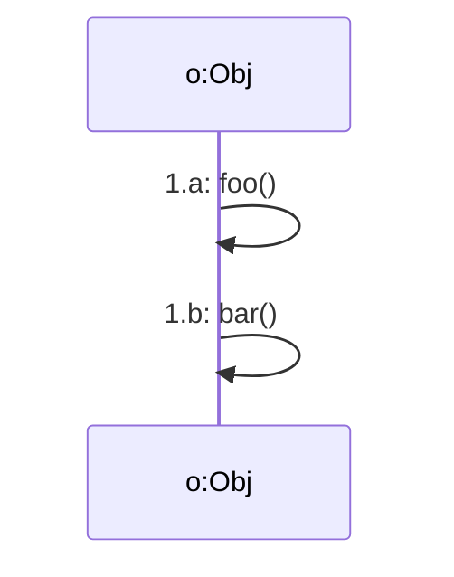

Branchement : Lorsque les messages n'ont pas de garde mutuellement exclusive, on en déduit qu'ils sont concurrents.

## Mode d'interaction concurrent

2. Un acteur peut spontanément décider d'envoyer un message et crée ainsi un nouveau fil d'exécution.
3. Un objet actif peut également découpler le fil d'exécution en envoyant un message asynchrone.
   - L'objet continue sans attendre le message de retour.
   - Il octroie ainsi un fil d'exécution indépendant à l'objet destinataire.

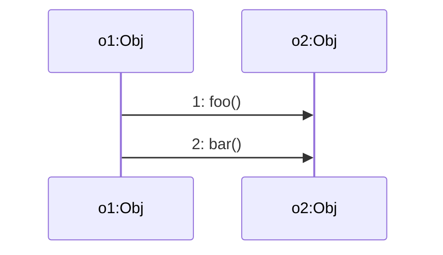

## Exemples de scénarios

**Appel téléphonique**

- Scénario : le numéro appelé est occupé
  - L'appelant décroche le téléphone
  - L'appelant commence à composer le numéro
  - L'appelant termine de composer le numéro
  - La tonalité "occupée" commence à sonner
  - L'appelant raccroche le téléphone
- Scénario : le numéro appelé n'est pas occupé
  - L'appelant décroche le téléphone
  - L'appelant commence à taper le numéro
  - L'appelant termine de taper le numéro
  - Le téléphone commence à sonner
  - L'appelé décroche
  - La conversation se déroule
  - L'appelé raccroche le téléphone

## Exemple mode d'interaction concurrent (asynchrone)

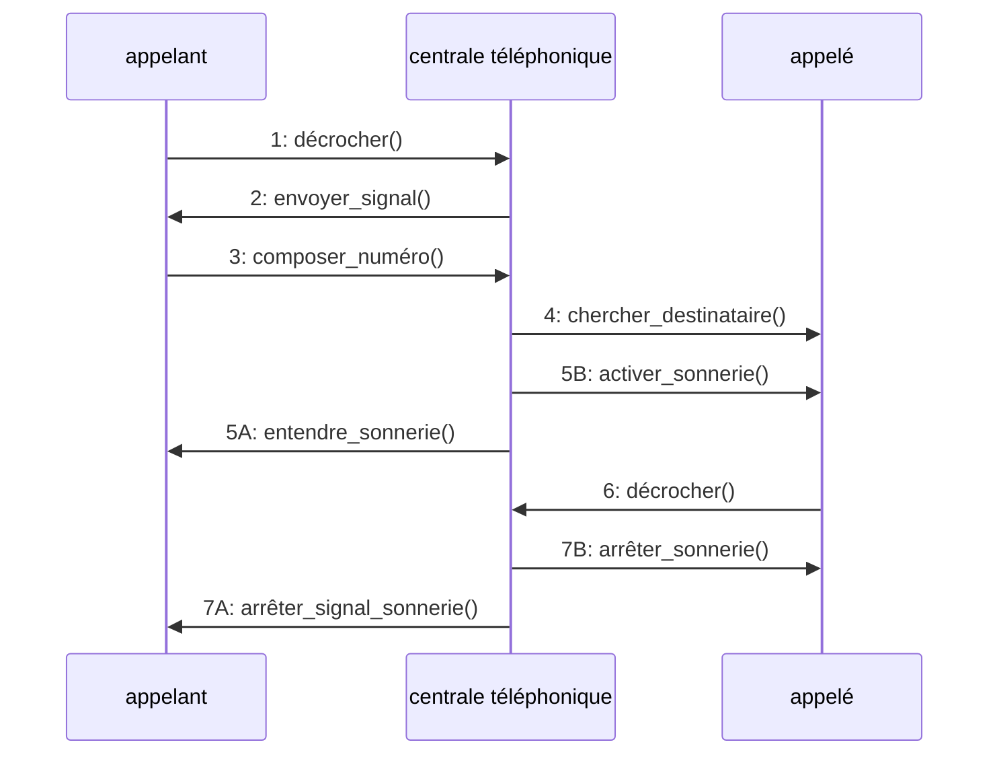

## Messages avec garde

- Permet d'exprimer les alternatives de comportement.
- Message envoyé seulement si la garde est vraie.
- Les gardes doivent être mutuellement exclusives pour signifier que l'envoi est conditionnel (et non concurrent).

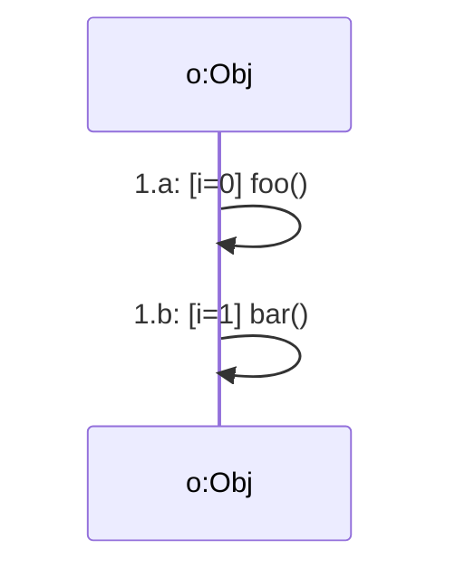

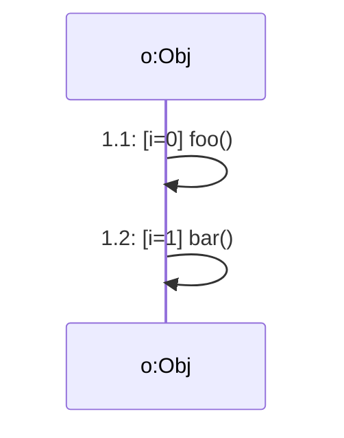

*(Différence ?)*

## Ligne de vie à branches multiples

Si deux messages, dont l'envoi est conditionnel à l'évaluation d'une garde, sont destinés à un même objet, on doit pouvoir exprimer le comportement de l'objet dans chaque cas…

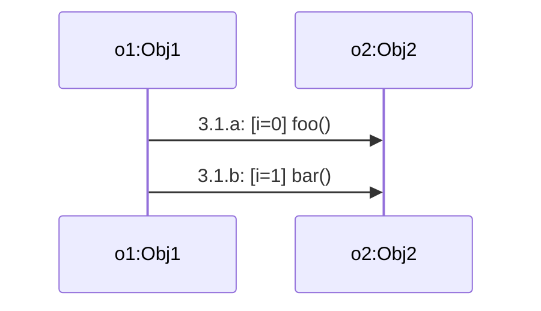

## Exemple : représentation de conditions

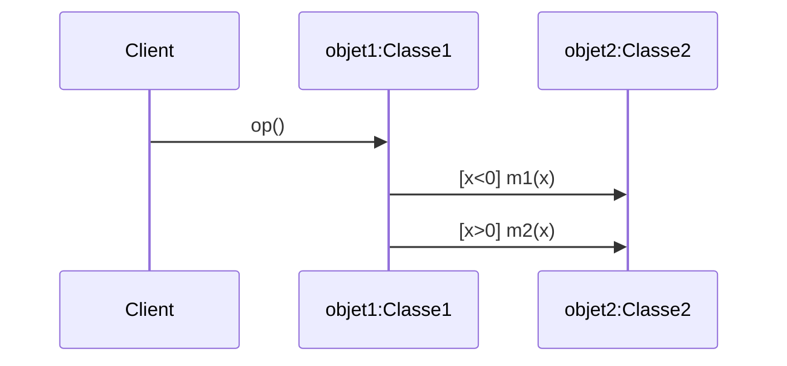

Branchement conditionnel.

## Itération

On ajoute une clause d'itération (introduite par un `*`) à côté du message pour spécifier le nombre d'itérations ou l'invariant de l'itération :

- `*[i:=1..10]` : Le message est envoyé 10 fois
- `*[x<10]` : Le message est envoyé de façon répétée jusqu'à ce que x soit plus grand ou égal à 10.
- `*[item not found]` : Le message est envoyé de façon répétée jusqu'à ce que l'item soit trouvé….

Ne pas répéter la clause d'itération chez le destinataire (elle est implicite)… à moins de vouloir une boucle imbriquée.

## Exemple : Itération

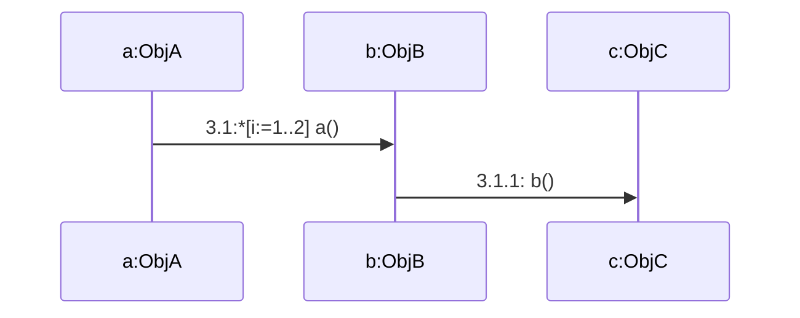

## Autre représentation : fragments d'interaction

Un fragment combiné représente des articulations d'interactions. Il est défini par un opérateur et des opérandes. L'opérateur conditionne la signification du fragment combiné. Les fragments combinés peuvent faire intervenir l'ensemble des entités participant au scénario ou juste un sous-ensemble.

Les principaux opérateurs en UML 2 :

- Opérateur "Alternative" (`alt`)
- Opérateur "Option" (`opt`)
- Opérateur "Break"
- Opérateur "Parallel" (`par`)
- Opérateur "Loop"

## Les fragments d'interaction — opérateur `alt`

L'opérateur "alt" désigne un choix, une alternative. Il représente des comportements possibles : c'est en quelque sorte l'équivalent du SI...ALORS...SINON : donc, une seule des branches alternatives sera réalisée dans un scénario donné.

- La condition d'exécution d'une des branches alternatives (l'équivalent du SI) peut être explicite ou implicite.
- L'utilisation de l'opérateur `else` permet d'indiquer que la branche est exécutée si la condition du `alt` est fausse.

L'exemple montre un opérateur "alt" : soit l'utilisateur rentre un code correct et dans ce cas le diagramme de séquence relatif à la vérification du code est appelé, soit l'utilisateur rentre un code erroné, trois fois, et sa carte est gardée.

## Les fragments d'interaction — opérateur `opt`

L'opérateur "opt" désigne un fragment combiné optionnel comme son nom l'indique : c'est-à-dire qu'il représente un comportement qui peut se produire... ou pas. Un fragment optionnel est équivalent à un fragment "alt" qui ne posséderait pas d'opérande `else` (qui n'aurait qu'une seule branche).

L'exemple montre un opérateur "opt" : l'utilisateur, s'il est mécontent, peut se défouler sur le distributeur de billets.

## Les fragments d'interaction — opérateur `break`

L'exemple montre un opérateur "break" : l'utilisateur, lorsque le distributeur lui demande son code, peut choisir de rentrer son code ou de consulter l'aide. S'il choisit de consulter l'aide, le flot d'interaction relatif à la saisie du code est interrompu.

L'opérateur "break" est utilisé pour représenter des scénarii d'exception. Les interactions de ce fragment seront exécutées à la place des interactions décrites en dessous. Il y a donc une notion d'interruption du flot "normal" des interactions.

## Les fragments d'interaction — opérateur `break` (suite)

L'équivalent de ce diagramme de séquence sans l'opérateur `break` correspond aux deux diagrammes de séquence suivants :

<!-- TODO: unclear in source, verify against original PDF page 255 — the two equivalent diagrams referenced here are images with no extractable OCR text. -->

## Les fragments d'interaction — opérateur `par`

L'opérateur "par" est utilisé pour représenter des interactions ayant lieu en parallèle. Les interactions des différents opérandes peuvent se mélanger, s'intercaler, dans la mesure où l'ordre imposé dans chaque opérande est respecté.

L'exemple montre qu'un développeur ayant accès à Internet peut consulter en parallèle, soit le site [http://www.developpez.com](http://www.developpez.com) soit le site [http://www.developpez.net/forums/](http://www.developpez.net/forums/) sans préférence d'ordre.

## Les fragments d'interaction — opérateur `Loop`

L'opérateur "Loop" (boucle) est utilisé pour décrire un ensemble d'interactions qui s'exécutent en boucle. En général, une contrainte appelée garde indique le nombre de répétitions (minimum et maximum) ou bien une condition booléenne à respecter.

L'exemple montre un exemple pour l'opérateur "loop" : le diagramme de séquence indique que lorsque l'utilisateur se trompe trois fois de code, la carte est gardée et le distributeur se remet en mode d'attente d'une carte.

## Les fragments d'interaction — les références

- Une référence (interaction occurrence) peut être vue comme un pointeur ou un raccourci vers un autre diagramme de séquence existant.
- Cela équivaut à copier le contenu du diagramme de séquence pointé en lieu et place de la référence.
- Cela permet de factoriser des parties de comportement utilisées dans plusieurs scénarios.

## Les fragments d'interaction — exemple

Cas d'utilisation principal : Jouer une partie de démineur

- Dans la boucle (`loop`) de jeu, il y a trois possibilités (`alt`) : perte, gain ou cas normal. Les cas de perte ou de gain arrêtent la partie (`break`). Sinon, le joueur passe son temps à découvrir ou (`alt`) marquer des cases.
- Ensuite, le joueur pourra (`opt`) entrer son nom dans les meilleurs scores s'il (`[]`) a le meilleur temps en fonction du niveau choisi.
- On peut ajouter la configuration du jeu comme étape optionnelle (`opt`) avant de commencer à jouer.

## Contraintes temporelles

**Lecture du scénario et chronologie**

- Un scénario se lit de haut en bas dans le sens chronologique d'échange des messages.
- Des contraintes temporelles peuvent être ajoutées au scénario.

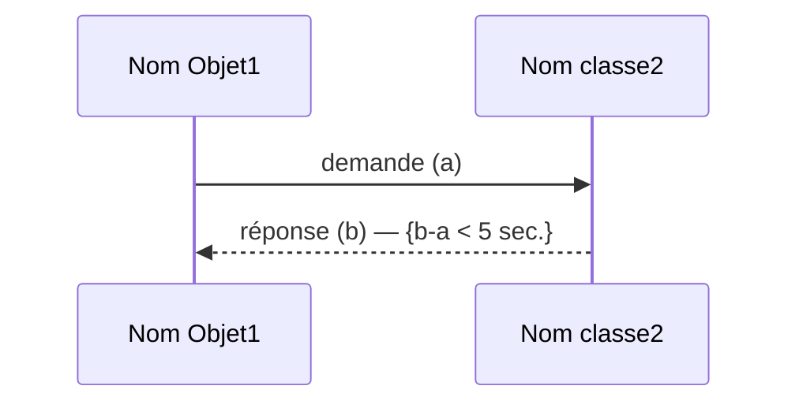

`{d'-d < 1 sec.}`

## Le diagramme de séquence système

- Le diagramme de séquence système (DSS) décrit les interactions entre les acteurs et le système selon un point de vue temporel (l'accent est mis sur la chronologie des envois/réceptions de messages entre les acteurs et le système).
- Le DSS permet la description de la dynamique du système vu de l'extérieur où le système est vu comme une « boîte noire ».
- Le système est donc vu de l'extérieur (par les acteurs) sans préjuger de comment il sera réalisé. La « boîte noire » sera ouverte (décrite) seulement en conception.

## Le diagramme de séquence système

- Le DSS est typiquement utilisé pour représenter le fonctionnement d'un cas d'utilisation sous la forme d'une séquence de messages échangés entre les acteurs et le système. Il représente la synthèse des scénarios liés aux cas d'utilisation.
- Un scénario : une suite spécifique d'événements (d'actions et d'interactions) entre les acteurs et le système (les DSS sont toujours lus du haut vers le bas, pour illustrer l'ordre dans lequel les messages sont envoyés entre les acteurs et le système).

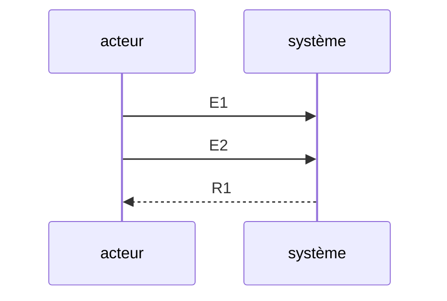

## Le diagramme de séquence système — les principaux concepts

<!-- TODO: unclear in source, verify against original PDF page 265 — this slide's body text was extracted with scrambled word order across two paragraphs (multi-column slide OCR artifact): "Les d'utilisation temps acteur «lifeline». acteurs verticale du et : cas ... " and "Le pendant Sur représenté ligne point les de diagrammes vie laquelle de graphiquement de contrôle l'objet. une de entité (barre séquence, en (acteur/système) d'activation) plaçant ce un point rectangle : de il effectue illustre contrôle au-dessus une la peut période action. de être la ▪ On séquence entité peut du diagramme. aussi système. inscrire Ces commentaires des commentaires peuvent sur être le diagramme reliés à toute de". Best-effort reading reconstructed below based on standard sequence-diagram terminology; verify against original page image before relying on exact wording. -->

- Les acteurs et le système : on retrouve dans le diagramme une ligne de vie associée à chaque acteur et au système, ils interagissent avec le système et à chaque cas d'utilisation est associée une ligne de vie « lifeline » verticale du temps.
- Ligne de vie : une entité (acteur/système) est représentée graphiquement en plaçant un rectangle au-dessus de la ligne de vie.
- Barre d'activation : illustre la période de contrôle pendant laquelle l'objet effectue une action. Sur les diagrammes de séquence, il peut être un point de contrôle.
- On peut aussi inscrire des commentaires sur le diagramme. Ces commentaires peuvent être reliés à toute entité du diagramme.

## Le diagramme de séquence système — les principaux concepts

- Les messages : sont représentés par des flèches directionnelles. Au-dessus des flèches directionnelles figure un texte informant du message envoyé entre les entités. Ils peuvent être :
  - **Synchrone** : l'acteur appelant attend le message de retour avant de continuer son exécution (équivalent d'une conversation téléphonique)
  - **Asynchrone** : l'objet appelant n'attend pas le message de retour (équivalent à un échange de courriels)
- Il est possible de montrer une entité qui s'envoie un message à elle-même à l'aide d'un message réflexif.
- Sur les diagrammes de séquence, les messages peuvent être dirigés de droite à gauche ou de gauche à droite.

## Les diagrammes de séquences — buts

1. décrire les cas d'utilisation (scénarios) / diagramme de séquence système
2. décrire les interactions entre objets : diagramme de séquence

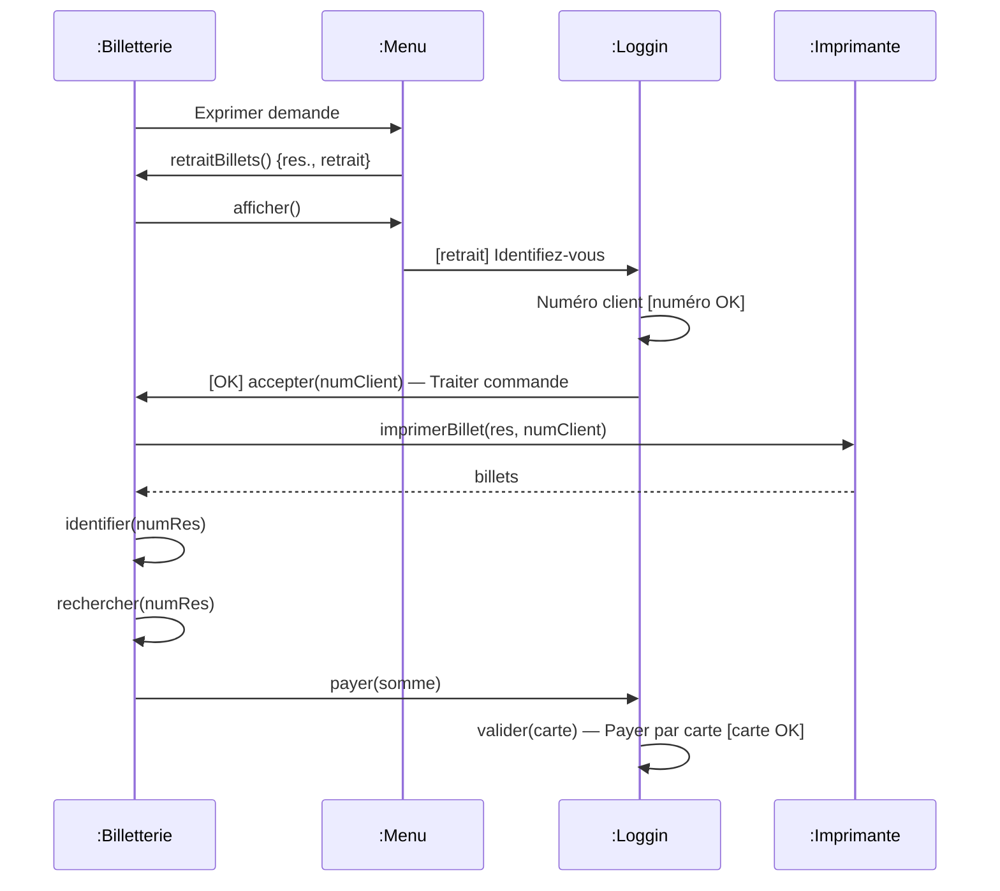

<!-- TODO: unclear in source, verify against original PDF page 267 — this "Billetterie" example sequence diagram is one of the most heavily garbled slides in the deck; the message ordering above is a best-effort reconstruction from fragments and should be verified against the original page image before being relied on. -->

## Diagrammes de communication

**But** : Diagramme illustrant les interactions entre les objets d'un système en mettant l'accent sur l'organisation structurelle des objets participants (et non pas sur l'ordre temporel des messages envoyés/reçus).

**Collaboration** =

1. Ensemble d'objets qui interagissent ensemble pour réaliser une tâche commune
2. Ensemble de liens (pertinents) existant entre ces objets

## Diagrammes de communication — introduction

- Les diagrammes de communication fournissent un second point de vue des aspects dynamiques. En effet un diagramme de communication correspond à une synthèse de l'ensemble des diagrammes objets et des diagrammes de séquences.
- Comme dans les diagrammes objets, les objets sont représentés par des rectangles, connectés par des lignes qui représentent des liens.
- **Remarque** : les relations entre les diagrammes de classes sont appelées des associations alors que les relations entre les objets sont appelées des liens. Dans les deux cas ils représentent des échanges de messages.
- Contrairement aux diagrammes d'objets, les nombres, les noms d'opérations ainsi que les flèches sont placés sur les liens pour indiquer un flot spécifique de message.

## Diagrammes de communication

- Les scénarios et diagrammes de collaboration :
  - Montrent des exemples de coopération des objets dans la réalisation de processus de l'application
- Les scénarios :
  - Illustrent la dynamique d'enchaînement des traitements d'une application en introduisant la dimension temporelle
- Les diagrammes de collaboration :
  - Dimension temporelle représentée par numéros de séquence : définition d'un ordre partiel sur les opérations
  - Représentation des objets et de leurs relations
  - Utilisent les attributs et opérations

## Utilisation des diagrammes de collaboration

- Ils peuvent être attachés à :
  - Une classe
  - Une opération
  - Un use-case
- Ils s'appliquent :
  - En spécification
  - En conception (illustration de design patterns)

## Éléments constitutifs

- Un contexte contenant les éléments mis en jeu durant l'opération :
  - Un acteur
  - Un ensemble d'objets, d'attributs et de paramètres
  - Des relations entre ces objets
  - Des interactions
  - Des messages
- Un message initiateur du diagramme provenant d'un :
  - Acteur de l'application,
  - Objet de l'application.
- Les numéros de séquence des messages échangés entre les objets de cet ensemble suite au message initiateur

## Représentation d'une collaboration (niveau instance)

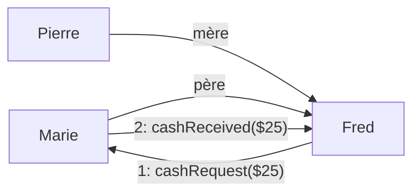

<!-- TODO: unclear in source, verify against original PDF page 273 — the exact link direction/roles between Marie, Pierre and Fred ("père"/"mère") is a best-effort reading; verify against original. -->

**Équivalent au diagramme de séquence** :

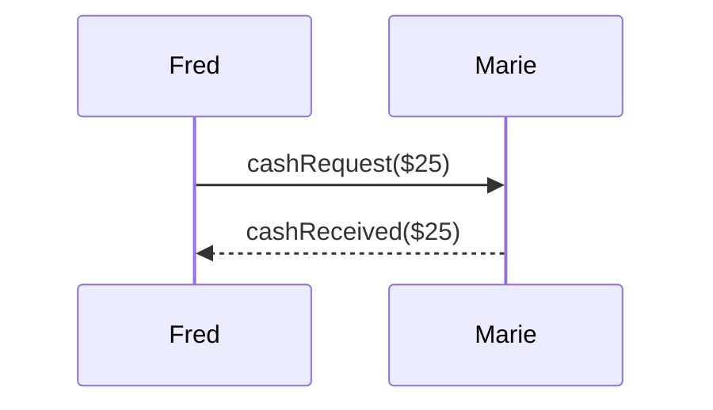

## Exemple (1)

- Les messages :
  - Opérations
  - Réception d'événements
- Le séquencement :
  - Les séquences consécutives
  - Les séquences imbriquées

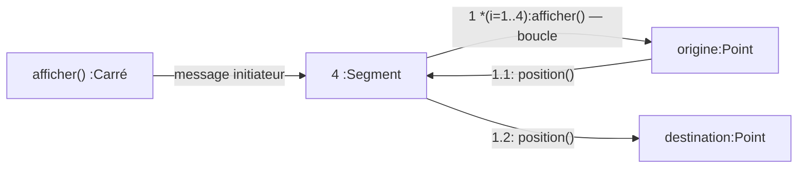

<!-- TODO: unclear in source, verify against original PDF page 275 — this communication-diagram example's exact link topology ("séquence imbriquée", numéro de séquence, opération) was reconstructed from garbled fragments; verify against original. -->

## Exemple (2) : création et destruction dynamiques d'objets

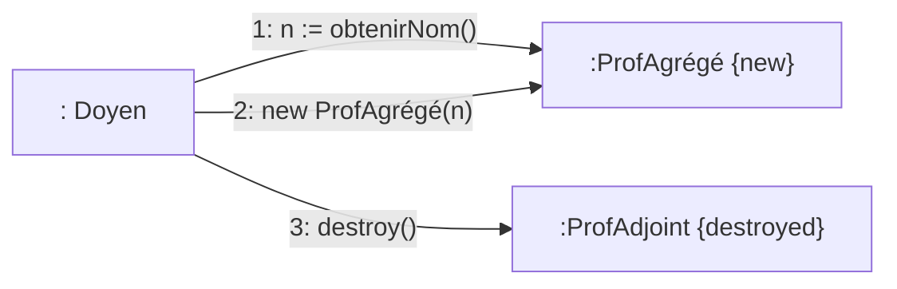

**Exemple** — Comme les diagrammes de séquence : interactions entre objets du système avec un accent particulier sur la structure spatiale statique des objets (contexte des objets). Les messages sont numérotés pour indiquer l'ordre des envois. Message : Asynchrone, Synchrone, etc.

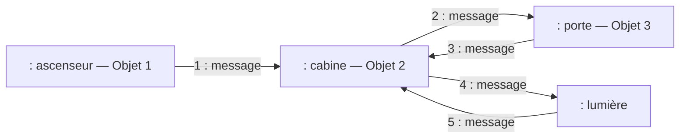

`1 : monter` / `2 : allumer` / `3 : fermer`

<!-- TODO: unclear in source, verify against original PDF page 277-278 — the exact numbering/direction of the "ascenseur/cabine/porte/lumière" communication diagram was reconstructed from garbled fragments; verify against original. -->

## Encore un exemple

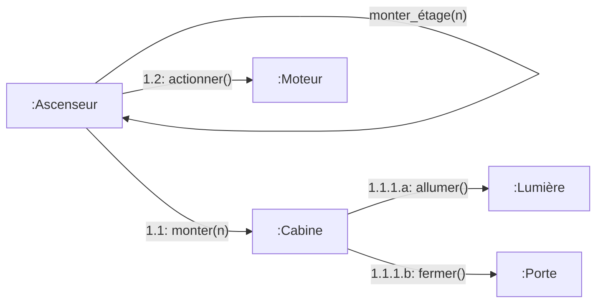

## Diagrammes de communication — buts

1. Décrire l'interaction des objets entre eux
2. Illustrer les scénarios des use cases
3. Valider les choix d'analyse et de conception (prototypage)
4. Aider à élaborer des diagrammes de classes de conception

```mermaid
flowchart LR
    Client[": Client"] -->|"1 : retraitBillets()"| x["x : ClasseA"]
    x -->|"1 : message"| y["y : ClasseB"]
    Menu[": Menu [validation]"] -->|"2 : afficher()"| x
    x -->|"2 : message"| z["z : ClasseB"]
    x -->|"3 : indentifier(numClient)"| Loggin[": Loggin [Interrogation]"]
    Loggin -->|"4.1 : accepter(numClient)"| x
    Loggin -->|"4.2 : refuser(numClient)"| x
```

<!-- TODO: unclear in source, verify against original PDF page 279 — this example mixes the generic "x:ClasseA / y:ClasseB / z:ClasseB" notation with a concrete "Client/Menu/Loggin" billeterie example in the same slide; the pairing was ambiguous in the OCR extraction, reproduced as a best-effort reading, verify against original. -->

## Diagrammes de communication — conventions

- `x : ClasseA [x] 1: message → y : ClasseB` — message soumis à la condition x
- `x : ClasseA 1.a : message1 → y : ClasseB` ; `x : ClasseA 1.b : message2 → z : ClasseC` — message1 et message2 en parallèle
- `x : ClasseA 1.1 : message1 → y : ClasseB` ; `x : ClasseA 1.2 : message2 → z : ClasseC` — choix entre message1.1 et message1.2
- `x : ClasseA [* 1..n] 1: message → y : ClasseB` — message envoyé n fois
- `x : ClasseA // 1: message → y : ClasseB` — message envoyé en parallèle à plusieurs instances de la classe B
- `x : ClasseA a := message → y : ClasseB` — a récupère la valeur renvoyée par l'exécution du message

## Diagramme d'états-transitions

**But** : Permet de décrire le comportement d'un objet (instance d'une classe) en fonction des événements et des messages reçus.

```mermaid
stateDiagram-v2
    [*] --> Disponible
    Disponible --> Verrouillé : verrouiller
    Verrouillé --> Disponible : déverrouiller
    Verrouillé --> Vendu : achète
    Disponible --> Vendu : attribué_sur_abonnement
    Vendu --> [*] : délai écoulé
```

*Diagramme d'état d'un billet de spectacle à vendre sur Internet*

<!-- TODO: unclear in source, verify against original PDF page 281 — the exact transitions between "Disponible", "Verrouillé", "Vendu" and their triggering events ("attribué_sur_abonnement", "déverrouiller", "délai écoulé", "verrouiller", "achète") were reconstructed from a garbled fragment order; verify against original. -->

## Principaux concepts

- État : `Nom_état`
- Transition : `événement / action`
- Marqueur d'état initial

## Principaux concepts — Transition

- Une transition (sortante) définit la réponse d'un objet, dans un état donné, à un événement donné.
- Les transitions sont étiquetées par un événement et (optionnellement) par une action :
  - **Événement** : Tout ce qui survient et peut affecter un objet. Élément déclencheur de la transition.
  - **Action** : Opération réalisée lorsqu'une transition est tirée.

```mermaid
stateDiagram-v2
    SurLesRayons: Sur les rayons
    SurLesRayons --> Emprunté : emprunter() / livre.emprunté(self)
    Emprunté --> SurLesRayons : retourner() / livre.retourné(self)
```

*Diagramme d'état pour la classe Exemplaire_de_livre*

## Principaux concepts — État

- Décrit un moment pendant la vie d'un objet.
- Un objet ne se trouve que dans un seul état à la fois.
- Tous les objets d'une classe qui se trouvent dans un même état réagissent de façon identique aux événements.
- Les objets qui se trouvent dans un état donné, à un moment donné, partagent l'une et/ou l'autre des caractéristiques suivantes :
  - Ils ont des valeurs d'attributs similaires.
  - Ils attendent un événement particulier.
  - Ils exécutent une activité particulière.
- Un état est généralement décrit par un nom.
- En UML, il existe différents types d'état : simple, concurrent, composite, etc.

## Événement

### Principaux concepts — types d'événements

Un événement peut être paramétré…

| Type d'événement | Description | Syntaxe |
| --- | --- | --- |
| Appel | Réception d'un message synchrone (pour lequel l'émetteur attend une réponse). Invocation d'une opération. | `op(p1:type, p2:type, …)` |
| Changement | Changement de valeur d'une condition booléenne. Satisfaction soudaine de cette condition. Condition fausse qui devient vraie. | `when(exp)` |
| Signal | Réception d'un message asynchrone. | `sname(p1:type, p2:type, …)` |
| Temps | Temps absolu atteint ou passage d'un certain intervalle de temps. Peut signaler le temps écoulé depuis l'entrée dans un état donné. | `after(time)` |

## Garde

### Gardes

- Une transition peut être conditionnelle à l'évaluation d'une garde.
- Si la garde est vraie, la transition est tirée.
- Si la garde est fausse, la transition n'a pas lieu.
- Notation : `événement [garde]`

```mermaid
stateDiagram-v2
    PeutEtreEmprunte: Peut être emprunté
    NePeutEtreEmprunte: Ne peut être emprunté
    PeutEtreEmprunte --> NePeutEtreEmprunte : est_emprunté(e) [dernier exemplaire]
    PeutEtreEmprunte --> PeutEtreEmprunte : est_emprunté(e) [pas dernier exemplaire]
    NePeutEtreEmprunte --> PeutEtreEmprunte : est_retourné(e)
    NePeutEtreEmprunte --> NePeutEtreEmprunte : est_retourné(e)
```

*Diagramme d'état d'un livre* — Cette transition est importante pour marquer que `retourner()` est bel et bien un message attendu et compris par cet automate dans cet état.

<!-- TODO: unclear in source, verify against original PDF page 291 — the exact self-transitions vs. cross-transitions for "est_retourné(e)" in each state were reconstructed from a garbled fragment order; verify against original. -->

## Gardes

- Garde :
  - expression conditionnelle
  - évaluée uniquement quand l'événement est déclenché
  - peut contenir des attributs de l'objet ou des paramètres de l'événement associé
- Lorsqu'un même événement est associé à plusieurs transitions, une garde (condition) peut être ajoutée pour préciser le contexte et déterminer la transition à effectuer.
- Les gardes associées à un même événement sur les transitions sortantes d'un état donné doivent être mutuellement exclusives.

## Action

### Principaux concepts — types d'actions

Les actions peuvent prendre des arguments… les paramètres effectifs des événements par exemple…

| Type d'action | Description | Syntaxe |
| --- | --- | --- |
| Affectation | Assigne une valeur à une variable. | `target:=expression` |
| Appel | Invocation (synchrone) d'une opération d'un objet. Peut retourner une valeur. | `opname(arg1, arg2, …)` / `object.opname(arg1, arg2, …)` |
| Envoi | Envoi d'un message (signal) asynchrone. | `sname(arg1, arg2, …)` |
| Création | Création d'un nouvel objet. | `new Cname(arg1, arg2, …)` |
| Destruction | Destruction d'un objet. | `object.destroy()` |
| Retour | Spécification d'une valeur retournée. | `return value` |
| Divers | Action décrite dans un autre langage… | `[description]` |
| Séquence | Séquence d'action | `action1; action2; …` |

## Transition réflexive sur un état

<!-- TODO: unclear in source, verify against original PDF page 296 — this slide is a diagram illustrating a self-transition (transition réflexive) with no extractable OCR text beyond the title. -->

## Actions d'un état

<!-- TODO: unclear in source, verify against original PDF pages 297-298 — these two slides are diagrams illustrating actions attached to a state with no extractable OCR text beyond the title. -->

## Actions d'entrée et de sortie

Certaines actions peuvent être rattachées à un état au lieu d'une transition :

- **Action d'entrée** : Action exécutée chaque fois qu'on entre dans l'état (quelle que soit la transition qui nous y amène…). Notation : `entry /action`
- **Action de sortie** : Action exécutée chaque fois qu'on sort de l'état (quelle que soit la transition qui nous en fait sortir). Notation : `exit/action`

```mermaid
stateDiagram-v2
    SurLesRayons: Sur les rayons
    SurLesRayons: exit/livre.emprunté(self)
    Emprunte: Emprunté
    Emprunte: exit/livre.retourné(self)
    SurLesRayons --> Emprunte : emprunter()
    Emprunte --> SurLesRayons : retourner()
```

*Diagramme d'état d'un exemplaire de livre* — Ordre d'exécution des actions ?

<!-- TODO: unclear in source, verify against original PDF page 299 — this appears to be the last extracted page of the deck; if the original PDF continues beyond this slide, the remainder was not captured by the OCR extraction. -->

</TabItem>
<TabItem value="pdf" label="PDF">

<PdfViewer file="/pdfs/acoo-analyse-modele-dynamique.pdf" />

</TabItem>
</Tabs>
