import Tabs from '@theme/Tabs';
import TabItem from '@theme/TabItem';

<Tabs>
<TabItem value="markdown" label="Markdown" default>

# Modèle structurel

*II2-ENSI*

:::info Vous allez apprendre
- distinguer les modèles de classes et d'objets, ainsi que leurs instances et leurs liens ;
- lire les rôles, cardinalités et directions de navigation d'une association UML ;
- choisir entre association, agrégation, composition, classe associative et association qualifiée ;
- interpréter la généralisation comme héritage et comme inclusion ensembliste.
:::

## Perspectives d'un système

- **Statique** (ce que le système EST)
- **Fonctionnel** (ce que le système FAIT)
- **Dynamique** (comment le système EVOLUE)

```mermaid
flowchart TB
    UC([Besoins des utilisateurs<br/>vue des cas d'utilisation])
    Logique[Vue logique<br/><br/>Vue logique statique<br/>(structure des objets)<br/><br/>Vue logique dynamique<br/>(comportement)]
    Processus[Vue des processus]
    Composants[Vue des composants]
    Deploiement[Vue de déploiement]
    UC --- Logique
    UC --- Processus
    UC --- Composants
    UC --- Deploiement
```

La vue des cas d'utilisation relie les besoins des utilisateurs aux vues logique, des processus, des composants et de déploiement. Ce chapitre traite la partie **logique statique** de cette vue.

## Modèle structurel

Une vue d'un système qui met l'accent sur la structure des objets, avec leurs classificateurs, leurs relations, leurs attributs et leurs opérations.

## Diagrammes structurels

- Montrent la structure statique d'un modèle :
  - Les entités qui existent (e.g., classes, interfaces, composants, nœuds)
  - Leur structure interne
  - Leurs relations avec d'autres entités
- Ne montrent pas :
  - Des informations temporelles ou dynamiques
- Le diagramme de classes et le diagramme d'objets sont les pièces maîtresses de la vue structurale
- Dans UML, ils sont répertoriés comme des diagrammes montrant la structure « statique »
- Les classes et les objets modélisent les objets matériels ou immatériels qui existent dans le système qu'on essaie de décrire.
- Les relations entre les classes et les objets établissent les connexions entre les divers éléments de modélisation et montrent l'agencement architectural.

## Réification

- Terme emprunté à la philosophie
- Étymologie :
  - Res = La chose
  - Facere = Faire
- Définition en modélisation :
  - Décision que prend le modélisateur de considérer une portion du réel comme un objet
  - Avec ce qu'implique la notion d'objet
- Le principe de réification pragmatique formulé par Jacques FERBER : « Si l'on parle de quelque chose en lui attribuant des propriétés, ou si cette chose doit être manipulée, alors il faut la représenter sous forme d'objet. »

## Réification

**En pratique**

- Réification = matérialiser un concept par un objet
- Un concept abstrait peut être « réifié » : l'événement « à 10h45 une carte bleue a été introduite »
- Une relation entre deux objets peut être « réifiée » : « Ali possède la voiture immatriculée 875 TU 129 » est réifiée dans le monde réel par une carte grise
- Réifier un concept permet de le manipuler concrètement
- Question ouverte : quels concepts réifier ?
- Une « bonne » vision objet réifie les « bons » concepts…

## Exemple de réification

Une personne travaille pour une entreprise. Cette relation est décrite par des informations.

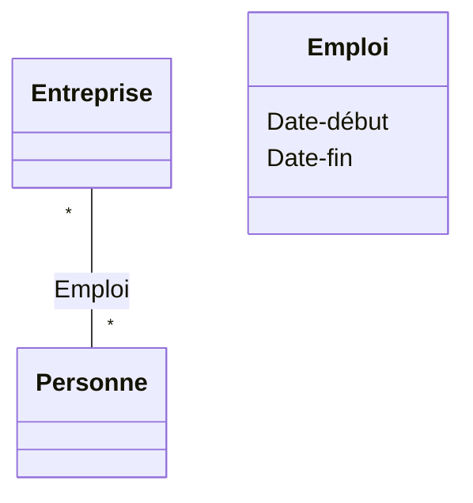

## Principe d'abstraction

Une abstraction fait ressortir les caractéristiques d'une structure qui la distinguent de tous les autres types de structures du domaine et donc procure des frontières conceptuelles rigoureusement définies par rapport au point de vue de l'observateur.

## Principe d'abstraction

- Pour être véritablement intéressant, un objet doit permettre un certain degré d'abstraction.
- Le processus d'abstraction consiste à identifier pour un ensemble d'éléments :
  - des caractéristiques communes à tous les éléments
  - des mécanismes communs à tous les éléments
- description générique de l'ensemble considéré : se focaliser sur l'essentiel, cacher les détails.

## Abstraction

L'abstraction est une ignorance sélective.

*L'objectif de l'abstraction n'est pas d'être vague, mais de créer un nouveau niveau sémantique dans lequel il est possible d'être très précis.* — Edsger Dijkstra

## Principe d'encapsulation

**Définition** : L'encapsulation est le procédé de séparation des éléments d'une abstraction qui constituent sa structure et son comportement. Elle permet de dissocier l'interface contractuelle de la mise en œuvre d'une abstraction.

## Encapsulation (…)

Le principe d'encapsulation consiste à regrouper dans un même élément informatique les aspects statique et dynamique spécifiques à une entité (c.a.d. les données et les fonctions). Cet élément informatique est appelé : « objet ».

- Les [structures de] données définies dans un objet sont appelées les attributs de l'objet ;
- Les fonctions [de manipulation] définies dans un objet sont appelées les méthodes de l'objet.

On a donc la relation fondamentale : `OBJET = attributs + méthodes`

`data1 data2…. fonction1 fonction2….`

## Encapsulation (…)

L'encapsulation du regroupement des éléments statique et dynamique d'une entité permet de définir deux niveaux de perception :

- **Le niveau externe** : perception de l'objet depuis l'extérieur. Il est constitué des attributs et méthodes publics de l'objet (appelés « éléments publics », à savoir les déclarations et prototypes visibles de l'extérieur). Ce niveau représente donc l'interface de l'objet.
- **Le niveau interne** : perception de l'objet depuis l'intérieur. Il est constitué des éléments visibles uniquement de l'intérieur (appelés « éléments privés »), correspondant à l'implémentation de cet objet. Ce niveau représente donc le corps de l'objet.

`Prototype des méthodes` / `Déclaration des attributs` → **Interface**

`Eléments privés` / `Définition des méthodes` → **Corps**

## Encapsulation (…)

Interface / réalisation — 2 rôles :

- **utilisateur** : manipule les éléments de l'abstraction qui constituent l'interface
- **implanteur** : réalise ce qui est encapsulé

## Objet et classe

```mermaid
classDiagram
    class Objet
    class Classe {
        Attributs
        Opérations
    }
    Objet ..> Classe : Objet:Classe
```

*(Approche objet : Classe, Héritage, Encapsulation, Polymorphisme)*

## Objets et classes

**Objet** : une entité concrète avec une identité bien définie qui encapsule un état et un comportement. L'état est représenté par des valeurs d'attribut et des associations, le comportement par des méthodes.

`maVoiture : Voiture` — marque = Renault, Modèle = Nevada, Immatriculation = 648ADX38, AnnéeModele = 1992, Kilométrage = 285 000

Un objet est une instance d'une classe.

**Classe** : une description d'un ensemble d'objets qui partagent les mêmes attributs, opérations, méthodes, relations et contraintes. Une classe peut posséder des attributs ou des méthodes « de classe ».

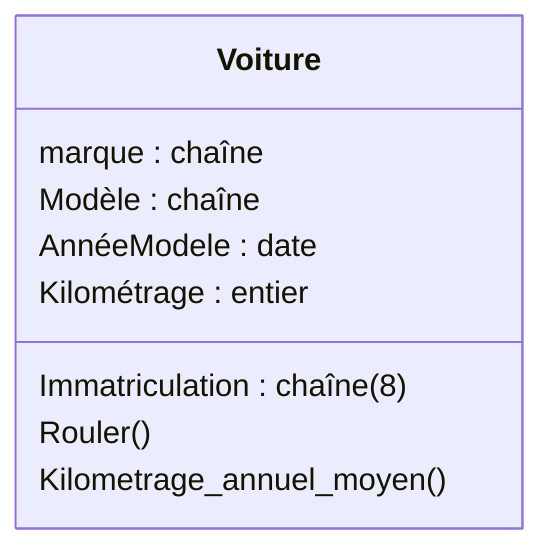

## Notation pour les classes

Représentation graphique d'une classe en UML.

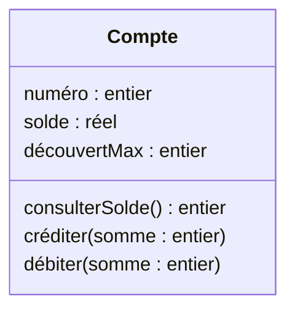

Nom de la classe / Attributs (nom, type) / Opérations (nom, paramètre, type du résultat) / Contraintes : `{ inv: solde > découvertMax }`

Par défaut, les attributs sont cachés et les opérations sont visibles.

## Notations simplifiées pour les classes

- Chaque classe est représentée sous la forme d'un rectangle divisé en trois compartiments : Nom de classe / Attributs / Opérations().
- Les compartiments peuvent être supprimés pour alléger les diagrammes.

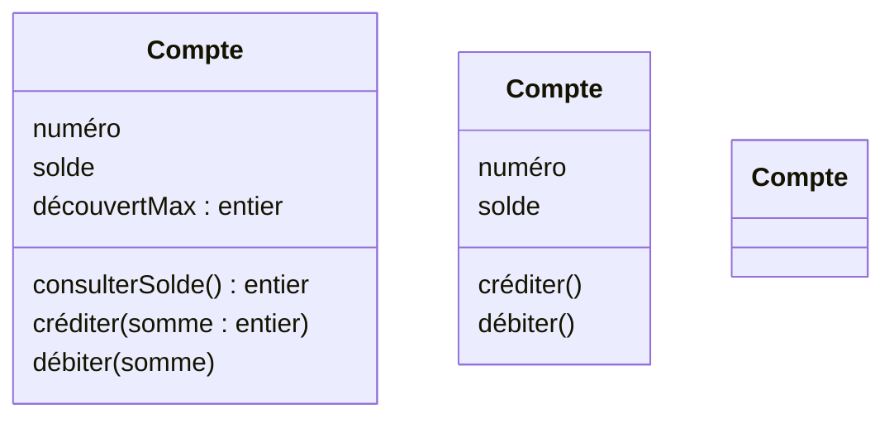

Note de style :

- les noms de classes commencent par une majuscule
- les noms d'attributs et de méthodes commencent par une minuscule

## Notations pour les objets

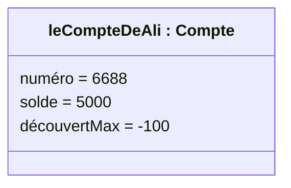

Une collection d'objets peut être représentée : `leCompteDeAli : Compte`, `: Compte`, …

Convention : les noms d'objets commencent par une minuscule et sont soulignés.

## Notations pour les objets

Représentation des instances (des objets) : un objet est une instance (avec un état précis) d'une classe.

## Classe vs. objets

Une classe spécifie la structure et le comportement d'un ensemble d'objets de même nature.

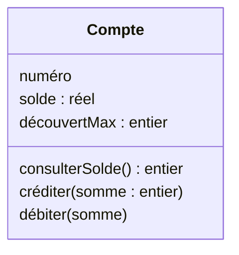

*(Diagramme de classes — la structure d'une classe est constante)*

`leCompteDeAli : Compte` (numéro = 6688, solde = 5000, découvertMax = -100), `leCompteDeSana : Compte` (numéro = 2275, solde = 10000, découvertMax = -1000), `: Compte` (numéro = 1200, solde = 150, découvertMax = 10)

*(Diagramme d'objets — des objets peuvent être ajoutés ou détruits pendant l'exécution ; la valeur des attributs des objets peut changer)*

## Diagramme d'objets

Structure statique d'un système, en termes d'objets et de liens entre ces objets. Ces objets et ces liens possèdent des attributs qui possèdent des valeurs. Un objet est une instance de classe et un lien est une instance d'association.

`Nom de l'objet : Classe` — `Attributs = valeurs`

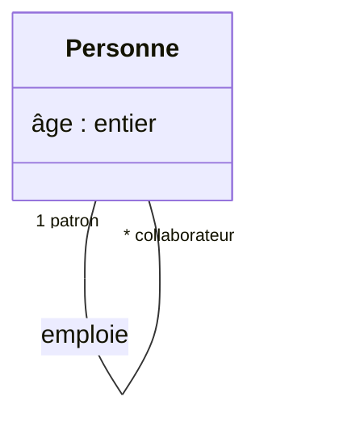

*(Diagramme de classes)*

`Etienne : personne` (âge = 35, rôle patron) — `Jean-Luc : personne` (âge = 25, rôle collaborateur)

*(Diagramme d'objets)*

## Liens (entre objets)

Un lien indique une connexion entre deux objets.

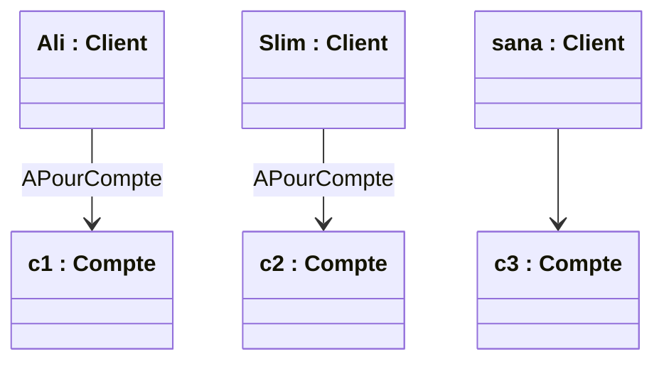

Note de style :

- les noms des liens sont des formes verbales et commencent par une majuscule
- `>` indique le sens de la lecture (ex : « ali APourCompte c1 »)

## Contrainte sur les liens

Au maximum un lien d'un type donné entre deux objets donnés (*).

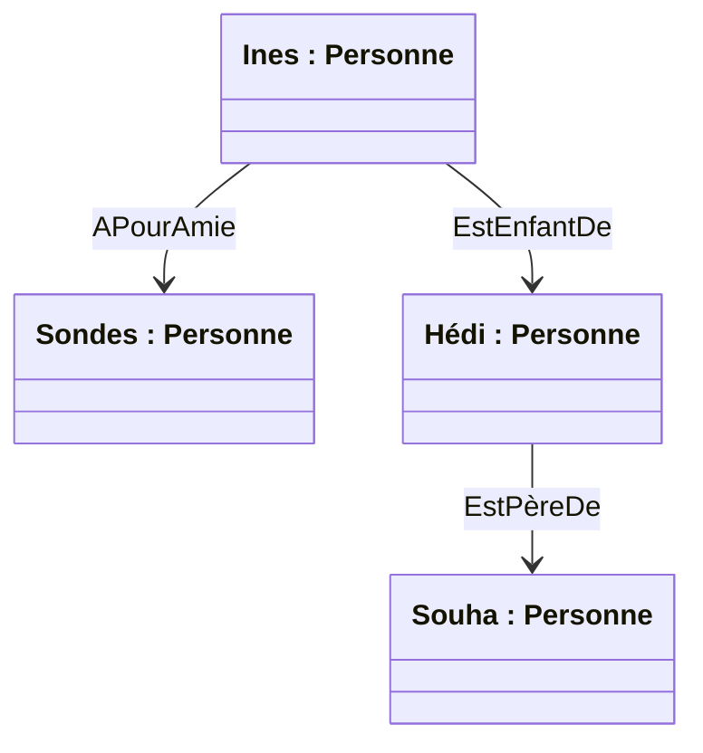

- Contrainte importante pour comprendre les "classes associatives"
- (*) Contrainte pouvant être relâchée via `{nonunique}` en UML 2.0 ... voir plus loin les concepts avancés

## Rôles

Chacun des deux objets joue un rôle différent dans le lien.

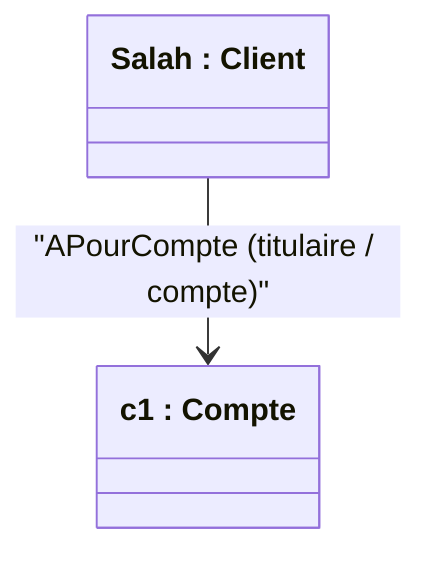

Note de style : choisir un groupe nominal pour désigner un rôle ; si un nom de rôle est omis, le nom de la classe fait office de nom.

## 3 noms pour 1 concept

Utilisations différentes selon le contexte : `a R b`, `f`, `g`.


- a R b
- salah a pour compte c1
- b "joue le rôle de" f "pour" a
- c1 joue le rôle de compte pour salah
- a "joue le rôle de" g "pour" b
- salah joue le rôle de titulaire pour c1

## Diagramme de classes

Structure statique d'un système, en termes de classes et de relations entre ces classes.

`Nom de classe` / `Attributs` / `Opérations()`

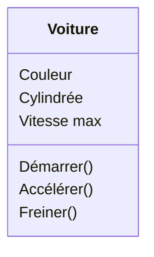

Syntaxe :

- `nom_attribut : type_attribut = valeur initiale`
- `nom_opération(nom_argument : type_argument = valeur_par_défaut, …) : type_retourné`

## Diagrammes de classes vs. d'objets

- Un diagramme de classes :
  - définit l'ensemble de tous les états possibles
  - les contraintes doivent toujours être vérifiées
- Un diagramme d'objets :
  - décrit un état possible à un instant t, un cas particulier
  - doit être conforme au modèle de classes
- Les diagrammes d'objets peuvent être utilisés pour :
  - expliquer un diagramme de classes (donner un exemple)
  - valider un diagramme de classes (le "tester")

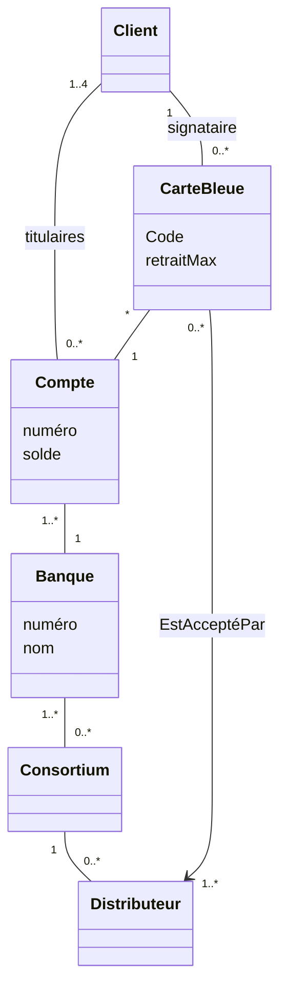

## Diagramme de classes : relations entre classes

- **Association** : relation structurelle entre classes
- **Généralisation** : factorisation des éléments communs d'un ensemble de classes dits sous-classes dans une classe plus générale dite super-classe. Elle signifie que la sous-classe est un ou est une sorte de la super-classe. Le lien inverse est appelé spécialisation.

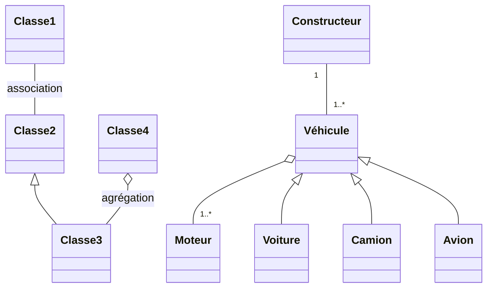

## Associations (entre classes)

Une association décrit un ensemble de liens de même "sémantique".

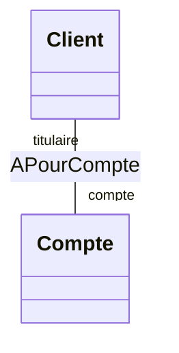

*(Diagramme de classes — modélisation)*

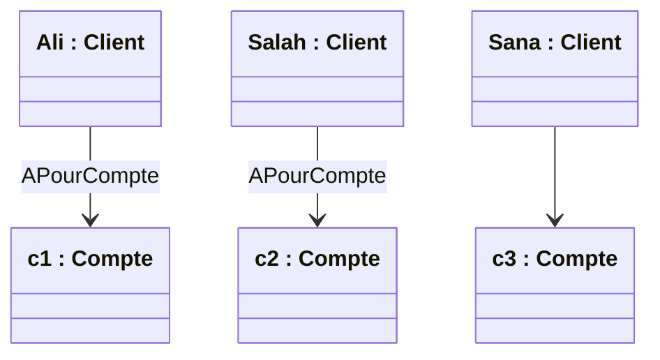

*(Diagramme d'objets — exemplaires)*

## Association vs. liens

- Un lien lie deux objets
- Une association lie deux classes
- Un lien est une instance d'association
- Une association décrit un ensemble de liens
- Des liens peuvent être ajoutés ou détruits pendant l'exécution (ce n'est pas le cas des associations)

Le terme "relation" ne fait pas partie du vocabulaire UML.

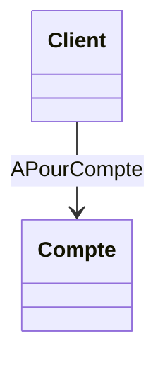

*(association / classe)*

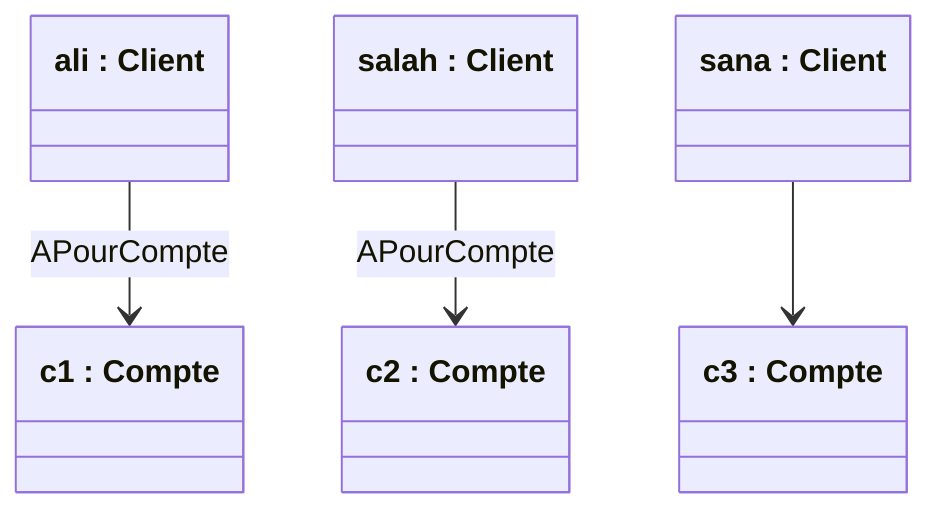

*(lien / objets)*

## Nommer les associations

Plusieurs façons de nommer une association, mais il faut respecter la cohérence entre identificateurs.

- `Compte — Banque` (rôle `banqueGérante`, rôle `comptes Gérés`)
- `Banque — Compte : Gère`
- `Banque — Compte : EstGéréPar` (rôle `banqueGérante`, rôle `Comptes Gérés`)

## Utiliser les rôles pour « naviguer »

```mermaid
classDiagram
    class Client
    class Compte
    Client "titulaire" -- "comptes" Compte : APourCompte
```

`ali.comptes = {c1}`, `salah.comptes = {c2, c3}`, `sana.comptes = { }`

`c1.titulaire = ali`, `c2.titulaire = salah`, `c3.titulaire = salah`

Nommer en priorité les rôles.

## Cardinalités d'une association

- `1..1` noté `1` : Un et un seul
- `0..1` : Zéro ou un
- `0..*` noté `*` : zéro ou plus
- `1..*` : au moins 1
- `n..m` : De n à m

Précise combien d'objets peuvent être liés à un seul objet source ; cardinalité minimale et cardinalité maximale (Cmin..Cmax).

```mermaid
classDiagram
    class Client
    class Compte
    Client "1 titulaire" -- "0..* comptes" Compte : APourCompte
```

« Un client a 0 ou plusieurs comptes » — « Un compte a toujours 1 et 1 seul titulaire »

`ali : Client — c1 : Compte` ; `salah : Client — c2 : Compte` ; `sana : Client — c3 : Compte`

## Exemple de lecture d'un diagramme

Un box peut être loué par au maximum un seul contrat à la fois. Un contrat concerne la location d'un ou plusieurs box (au minimum un). Un box est vide ou contient au maximum un véhicule. Un véhicule est autorisé à rester non loué. Un contrat concerne au moins un locataire mais ne peut souscrire qu'un seul locataire à la fois. Un locataire doit avoir souscrit un ou plusieurs contrats.

## Diagrammes d'objets

```mermaid
flowchart LR
    Fred[fred : Client] ---|titulaires| C4[c4 : Compte]
    Fred ---|signataire| CB1[: CarteBleue]
    CB1 --- C4
    C4 --- B1[: Banque]
    B1 --- K1[: Consortium]
    K1 --- D1
    CB1 -->|EstAcceptéPar| D1[: Distributeur]

    Ali[ali : Client] ---|titulaires| C1[c1 : Compte]
    Ali ---|signataire| CB2[: CarteBleue]
    Salah[salah : Client] ---|titulaires| C2[c2 : Compte]
    Salah ---|titulaires| C3[c3 : Compte]
    Sana[sana : Client] ---|titulaires| C3
    Sana ---|signataire| CB3[: CarteBleue]
    Sophie[sophie : Client]
    C1 --- B2[: Banque]
    C2 --- B2
    C3 --- B3[: Banque]
    B2 --- K2[: Consortium]
    B3 --- K2
    K2 --- D2
    CB2 -->|EstAcceptéPar| D2[: Distributeur]
    CB3 --- C3
    CB3 -->|EstAcceptéPar| D2
```

Cet instantané illustre la différence entre le modèle de classes et un état concret : plusieurs clients, comptes, cartes, banques et consortiums peuvent être reliés simultanément tout en respectant les cardinalités du modèle.

## Exercice de lecture d'un diagramme de classes

```mermaid
classDiagram
    class Client
    class Compte {
        numéro
        solde
    }
    class Consortium
    class Banque {
        numéro
        nom
    }
    class CarteBleue {
        Code
        retraitMax
    }
    class Distributeur
    Client "1..4" -- "0..*" Compte : titulaires
    Client "1" -- "0..*" CarteBleue : signataire
    CarteBleue "*" -- "1" Compte
    Compte "1..*" -- "1" Banque
    Banque "1..*" -- "0..*" Consortium
    Consortium "1" -- "0..*" Distributeur
    CarteBleue "0..*" --> "1..*" Distributeur : EstAcceptéPar
```

## Exercice n°2

Description d'un système de fichiers :

- Un utilisateur possède au moins un répertoire
- Un répertoire appartient à un et un seul utilisateur
- Un répertoire peut contenir d'autres répertoires
- Un utilisateur peut accéder à au moins un répertoire
- Un répertoire peut être accédé par au moins un utilisateur

<details>
<summary>Correction</summary>

### Exercice n°2 (solution)

```mermaid
classDiagram
    class Utilisateur
    class Repertoire["Répertoire"]
    Utilisateur "1..1" -- "1..*" Repertoire : "Est propriétaire de >"
    Repertoire "0..1 contenant" -- "0..* contenus" Repertoire : "Contient >"
    Utilisateur "1..*" -- "1..*" Repertoire : "Peut accéder à > (utilisateur autorisé)"
```

</details>

## Navigation

```mermaid
classDiagram
    class Client
    class Compte
    Client "1" --> "*" Compte : titulaire
```

Association unidirectionnelle : on ne peut naviguer que dans un sens.

En cas de doute, ne pas mettre de flèche !!! Son utilisation est surtout pour les modèles logiques et physiques (UML 2.0).

## Cas particulier d'associations : agrégation/composition

Relation asymétrique, transitive (relation de subordination). Une extrémité supporte la notion de responsabilité : toute opération du responsable peut se propager aux éléments contraints.

- **Agrégat / agrégé** : durée de vie des agrégés indépendante de l'agrégat
- **Composite / composant** : durée de vie des composants dépendante du composite / conteneur — on parle d'embarquement

## Agrégation

Agrégation = cas particulier d'association + contraintes décrivant la notion d'appartenance...

```mermaid
classDiagram
    class Figure
    class Point {
        xy
    }
    Figure "*" o-- "*" Point
```

Appartenance faible :

- Partage possible du composant avec d'autres Agrégat/Eléments Agrégés
- Une instance agrégée peut exister sans son agrégat et inversement

Utiliser avec précautions pendant l'analyse (ou ne pas utiliser...)

## Composition

Notion intuitive de "composants" et de "composites" ("Conteneur").

```mermaid
classDiagram
    class Voiture
    class Roue
    class Pneu
    class Jante
    Voiture "1" *-- "4" Roue
    Roue "1" *-- "1" Pneu
    Roue "1" *-- "1" Jante
```

Composition = cas particulier d'association + contraintes décrivant la notion de "composant"...

## Composition

Contraintes liées à la composition :

1. Un objet composant ne peut être que dans 1 seul objet composite
2. Un objet composant n'existe pas sans son objet composite
3. Si un objet composite est détruit (copié), ses composants aussi

```mermaid
classDiagram
    class Voiture
    class Roue
    class Pneu
    class Jante
    Voiture "1" *-- "4" Roue
    Roue "1" *-- "1" Pneu
    Roue "0..1" *-- "1" Jante
```

**Remarque** : la composition exprime une relation d'appartenance forte et une coïncidence des durées de vie après la création des composants.

- Les composants peuvent être créés après le composite.
- Les composants peuvent être enlevés avant la mort du composite.

Dépend de la situation modélisée ! (Ex : vente de voitures vs. casse)

## Composition

Contraintes liées à la composition :

1. Un objet composant ne peut être que dans 1 seul objet composite
2. Un objet composant n'existe pas sans son objet composite
3. Si un objet composite est détruit, ses composants aussi

```mermaid
classDiagram
    class Document
    class Chapitre
    class Section
    class Figure
    Document "1" *-- "1..*" Chapitre
    Chapitre "1" *-- "1..*" Section
    Section "0..1" *-- "0..*" Figure
```

## Composition

```mermaid
classDiagram
    class Document
    class Chapitre
    class Section
    class Figure
    Document "1" *-- "1..*" Chapitre
    Chapitre "1" *-- "1..*" Section
    Section "0..1" *-- "0..*" Figure
```

Instances : `: document`, `: chapitre`, `: section`, `: figure` (plusieurs, imbriqués)

Contrainte : le graphe d'objets forme un arbre (ou une forêt).

## Classes associatives

Pour associer des attributs et/ou des méthodes aux associations => classes associatives.

```mermaid
classDiagram
    class Personne
    class Société["Société"]
    class Emploi {
        salaire
        augmenter()
    }
    Personne "* employés" -- "0..2 sociétés" Société : Emploi
```

Le nom de la classe correspond au nom de l'association (problème : il faut choisir entre forme nominale et forme verbale).

## Classes associatives

```mermaid
classDiagram
    class Personne
    class Société["Société"]
    class Emploi {
        salaire
        augmenter()
    }
    Personne "* employés" -- "0..2 sociétés" Société : Emploi
```

`Mark : Personne` — `sana : Personne` — `xerox : Société` — `ST : Société`

- `e1 : Emploi` (salaire = 1500) — employé Mark / xerox
- `e2 : Emploi` (salaire = 5000) — employé sana / xerox
- `e3 : Emploi` (salaire = 1000) — employé sana / ST

Le salaire est une information correspondant ni à une personne, ni à une société, mais à un emploi (un couple personne-société).

## Classes associatives

**Rappel** : Pour une association donnée, un couple d'objets ne peut être connecté que par un seul lien correspondant à cette association (sauf si l'association est décorée par `{nonunique}` en UML2.0). Cette contrainte reste vraie dans le cas où l'association est décrite à partir d'une classe associative.

`p1 : Emploi > s1` — `: Emploi` (salaire = 1500), `p1 s1 : Emploi` (salaire = 700)

## Classes associatives

```mermaid
classDiagram
    class Personne
    class Société["Société"]
    class Emploi {
        salaire
    }
    Personne "* employé" -- "0..2 sociétés" Société : Emploi
```

`e1 : Emploi` — `p1 s1`

Ci-dessus, une personne peut avoir deux emplois, mais pas dans la même société.

## Exemple 2

```mermaid
classDiagram
    class Joueur
    class Match
    class Participation {
        nbDeButs
    }
    Joueur "* joueurs" -- "* matchs" Match : Participation
```

## Exemple 3

```mermaid
classDiagram
    class Personne
    class Voiture
    class CarteGrise {
        dateDélivrance
    }
    Personne "* propriétaires {non unique}" -- "* voitures {non unique}" Voiture : CarteGrise
```

## Classes associatives

Les classes associatives sont des associations mais aussi des classes. Elles ont donc les mêmes propriétés et peuvent par exemple être liées par des associations.

```mermaid
classDiagram
    class Personne
    class Société["Société"]
    class Emploi {
        salaire
        augmenter()
    }
    class FicheDePaye["FicheDePaye"]
    Personne "employé" -- "* société" Société : Emploi
    Emploi "0..2" -- "*" FicheDePaye
```

## Associations n-aires

Généralisation des classes associatives binaires : une association peut relier une, deux ou plusieurs classes.

```mermaid
classDiagram
    class Salle
    class Filière
    class Enseignant
    class Créneau {
        -date
        -heure
        -durée
    }
    Salle -- Créneau
    Filière -- Créneau
    Enseignant -- Créneau
```

## Associations qualifiées

Un qualifieur est un attribut (ou un ensemble d'attributs) dont la valeur sert à déterminer l'ensemble des instances associées à une instance via une association.

```mermaid
classDiagram
    class Repertoire["Répertoire"]
    class Fichier
    Repertoire "nom" -- "0..1" Fichier
```

« Pour un répertoire, à un nom donné on associe qu'un fichier (ou 0 s'il existe aucun fichier de ce nom dans ce répertoire). »

Correspond à la notion intuitive d'index, absente ci-dessous :

```mermaid
classDiagram
    class Repertoire["Répertoire"]
    class Fichier
    Repertoire -- "*" Fichier
```

## Exemple

```mermaid
classDiagram
    class Association1901["Association1901"] {
        titre : Titre
    }
    class Personne
    Association1901 "* membres" -- "0..1 President" Personne : ass2
    Association1901 "* membres" -- "* membres" Personne : ass1
```

`<<enumeration>> Titre` : Secretaire, President, Tresorier

Dans l'exemple, `ass1` a pour membres Anis et sylvia ; le qualifieur associe le titre **Trésorier** à sylvia, **Président** à ahmed et **Secrétaire** à Taha. `ass2` associe aussi Taha au titre **Président**.

## Cardinalité des associations qualifiées

- Cas classique : cardinalité `0..1` — `Banque — nc — Compte`
- Cas plus rare : cardinalité `*` (pas de contrainte particulière exprimée) — `Banque — titre — Employe`
- Cas plus rare : cardinalité `1` (généralement c'est une erreur) — `Echiquier (nl : NumLigne, nc : NumCol) — Case`

0 comme cardinalité minimale, sauf si le domaine de l'attribut qualifieur est fini et toutes les valeurs ont une image.

## Attributs de l'association

Les attributs qualifieurs sont des attributs de l'association, pas de la classe.

```mermaid
classDiagram
    class Repertoire["Répertoire"]
    class Fichier
    Repertoire "nom *" -- "0..1" Fichier
```

`r1 nom="a"` — `f1 nom="b"` ; `r2 nom="f"` — `f2`

Exemple : liens "hard" en Unix : un fichier peut correspondre à des noms différents dans des répertoires différents.

## Problème classique

Souvent l'index est également un attribut de classe indexée.

**Solution correcte** :

```mermaid
classDiagram
    class Repertoire["Répertoire"]
    class Fichier
    Repertoire "nom 1" -- "0..1" Fichier
```

Le nom du fichier correspond au nom `/nom` qu'a le fichier dans le répertoire.

**2 erreurs communes** :

```mermaid
classDiagram
    class Repertoire1["Répertoire"] {
        nom
    }
    class Fichier1["Fichier"] {
        nom
    }
    Repertoire1 "1" -- "1" Fichier1
```

## Synthèse sur les associations

`ClasseA (x : string)` — rôle `roleA` — `AssociationX (attributZ)` — cardinalité `0..*` — `ClasseB`

Éléments : sens de lecture, nom de rôle, nom d'association, cardinalités, navigation, composition (ou agrégation), classe associative.

## Généralisation / spécialisation

Une classe peut être la généralisation d'une ou plusieurs autres classes. Ces classes sont alors des spécialisations de cette classe.

```mermaid
classDiagram
    class Personne["Personne (Super classe)"]
    class Homme
    class Femme
    Personne <|-- Homme
    Personne <|-- Femme
```

```mermaid
classDiagram
    class Compte["Compte (Cas général)"]
    class CompteEpargne["Compte Epargne (Cas spécifique)"]
    Compte <|-- CompteEpargne
```

Deux points de vue liés (en UML) : relation d'héritage / relation de sous-typage.

## Règles de généralisation (…)

- La généralisation ne porte ni nom particulier ni valeur de multiplicité.
- La généralisation est une relation non réflexive : une classe ne peut pas dériver d'elle-même.
- La généralisation est une relation non symétrique : si une classe B dérive d'une classe A, alors la classe A ne peut pas dériver de la classe B.
- La généralisation est par contre une relation transitive : si C dérive d'une classe B qui dérive elle-même d'une classe A, alors C dérive également de A.

## Relation d'héritage

Les sous-classes « héritent » des propriétés des super-classes (attributs, méthodes, associations, contraintes).

```mermaid
classDiagram
    class Compte {
        solde
        créditer()
        débiter()
    }
    class CompteEpargne {
        tauxIntérêt
        calculIntérêts()
    }
    class Banque
    Compte <|-- CompteEpargne
    Compte "*" -- "1" Banque
```

`{inv: solde > -5000}` — `{inv: tauxIntérêt < 100}` — `{inv: solde > -5000 et tauxIntérêt < 100}`

## Relation d'héritage et redéfinitions

```mermaid
classDiagram
    class Compte {
        solde
        créditer()
        débiter()
    }
    class CompteEpargne {
        créditer()
        débiter()
        ajouterIntérêts()
    }
    Compte <|-- CompteEpargne
```

Une opération peut être "redéfinie" dans les sous-classes. Permet d'associer des méthodes spécifiques à chaque sous-classe pour réaliser une même opération.

## Relation de sous-typage, vision ensembliste

Tout objet d'une sous-classe appartient également à la super-classe.

```mermaid
classDiagram
    class Compte
    class CompteEpargne
    Compte <|-- CompteEpargne
```

*(Diagramme de classes)*

Instances : `c1`, `c2`, `c3`, `c4` : Compte ; `ce1`, `ce2`, `ce3` : CompteEpargne (sous-ensemble des instances de Compte).

## Synthèse des concepts de base

- **Classe** : attribut, opération
- **Association** : rôle, cardinalité, Agrég./Comp./Associative/Qualifiée
- **Héritage**
- **Objet**
- **Lien**
- **Inclusion ensembliste**

**Prochaine étape** : le [modèle dynamique](./acoo-analyse-modele-dynamique.md) complète cette vue statique en décrivant comment les objets évoluent et interagissent au cours du temps.

</TabItem>
<TabItem value="pdf" label="PDF">

<PdfViewer file="/pdfs/acoo-analyse-modele-structurel.pdf" />

</TabItem>
</Tabs>
