import Tabs from '@theme/Tabs';
import TabItem from '@theme/TabItem';

<Tabs>
<TabItem value="markdown" label="Markdown" default>

# Diagrammes de conception architecturale

*II2-ENSI*

## Développer un modèle architectural

- Commencer par faire une esquisse de l'architecture
  - En se basant sur les principaux requis des cas d'utilisation ; décomposition en sous-systèmes
  - Déterminer les principaux composants requis
  - Sélectionner un style architectural
- Raffiner l'architecture
  - Identifier les principales interactions entre les composants et les interfaces requises
  - Décider comment chaque donnée et chaque fonctionnalité sera distribuée parmi les différents composants
  - Déterminer si on peut réutiliser un cadriciel existant (réutilisation) ou si on peut en construire un (réutilisabilité)
  - Considérer chacun des cas d'utilisation et ajuster l'architecture pour qu'il soit réalisable
- Détailler l'architecture et la faire évoluer

## Les modèles d'architecture

- Indépendamment de la forme que prend un diagramme d'architecture, celui-ci ne représente toujours qu'un point de vue sur le système considéré.
- Un modèle de conception (ou d'architecture) :
  - est composé d'un ensemble de points de vue, chacun étant composé d'un ensemble de différentes sortes de diagrammes.
  - propose également des moyens pour lier les différentes vues et diagrammes les uns aux autres de manière à naviguer aisément ; il s'agit des mécanismes de traçabilité architecturale.

## Modéliser l'architecture avec UML

Les vues (structurelles) d'une architecture logicielle :

- **Vue logique**. Description logique du système décomposé en sous-systèmes (modules + interface). UML : diagramme de paquetages.
- **Vue d'implémentation**. Description de l'implémentation (physique) du système logiciel en termes de composants et de connecteurs. UML : diagramme de composants.
- **Vue de déploiement**. Description de la distribution de la partie logicielle sur la partie matérielle. UML : diagramme de déploiement.
- **Vue d'implémentation + Vue physique**. UML : diagramme combiné (déploiement/composants).

## Modéliser l'architecture avec UML

- Diagramme de paquetages
- Diagramme de composants
- Diagramme de déploiement
- Diagramme combiné de déploiement/composants

### Positionnement — classification selon l'axe de modélisation

Où se situent les diagrammes d'architecture ? Entre l'axe Structurel et l'axe Fonctionnel.

### Positionnement — classification selon le modèle des 4+1 vues

Où se situent les diagrammes d'architecture ?

- **Vue logique** — Vue des cas d'utilisation
- **Vue de développement** — Découpage indépendant d'un contexte d'exécution ; l'organisation du code de l'application
- **Vue de Processus**
- **Vue physique** — Description des ressources matérielles et la distribution de la partie logicielle sur la partie matérielle

<!-- TODO: unclear in source, verify against original PDF page 344 — the exact 4+1-views diagram layout (which view sits at the center, which are peers) did not extract reliably; reproduced as a flat list of the extracted labels rather than reconstructed by guess. -->

## Diagramme de packages

- Paquetage = Collection d'éléments de modélisation UML (e.g., classes) groupés ensemble.
- Élément de modélisation qui :
  - Contient d'autres éléments de modélisation (classes, autres paquetages, ...) — possibilité de ne pas représenter tous les éléments contenus
  - Définit un espace de nom (namespace)
- Il faut essayer de maximiser la cohésion au sein des paquetages et minimiser le couplage entre eux.
- Les paquetages permettent de structurer les modèles. Chaque paquetage contient un ou plusieurs diagrammes de classes. Il contient éventuellement d'autres types de diagrammes. Le découpage en paquetages correspond à une structuration verticale des applications.

## Dépendances entre paquetages

Les participations entre paquetages sont modélisées grâce aux relations de dépendance.

La gestion des contrats fait appel à la gestion des auteurs signant les contrats.

Éviter les dépendances circulaires ⇔ couplage fort entre les paquets.

## Exemple : diagramme de packages

<!-- TODO: unclear in source, verify against original PDF pages 347 and 349 — this slide's full class diagram (Client, CompagnieAerienne, Vol, VolGenerique «metaclasse», Reservation, Aeroport, InfosEscale, Ville, Passager and their associations/cardinalities) was extracted with heavily interleaved/scrambled fragments across two near-duplicate slides. The class list and rough associations are reproduced below as a best-effort reading; exact cardinalities, role names and the "metaclasse" stereotype placement should be verified against the original page images before relying on them. -->

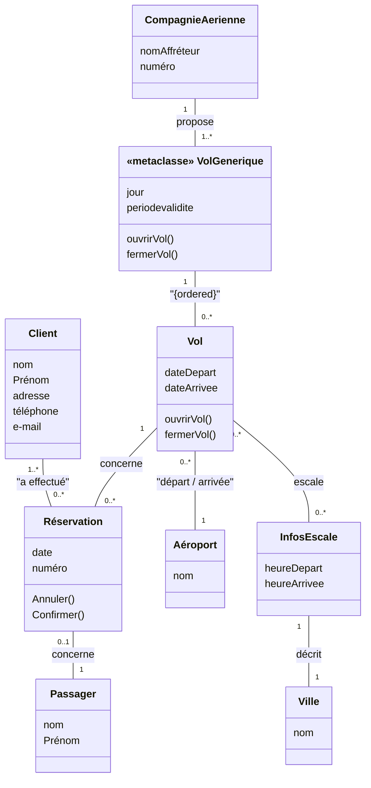

Le diagramme des classes peut être réorganisé en packages.

## Diagramme de packages

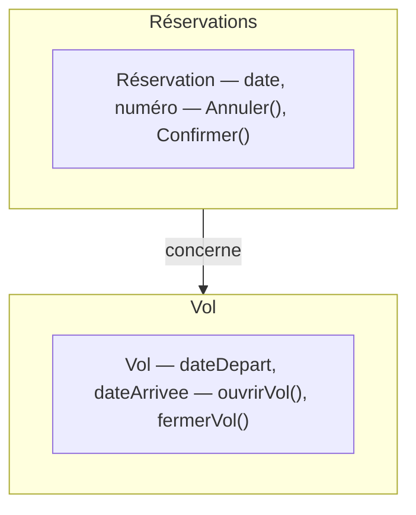

Réduire la dépendance mutuelle afin d'augmenter la modularité et l'évolutivité d'une application.

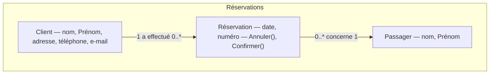

## Diagramme de packages

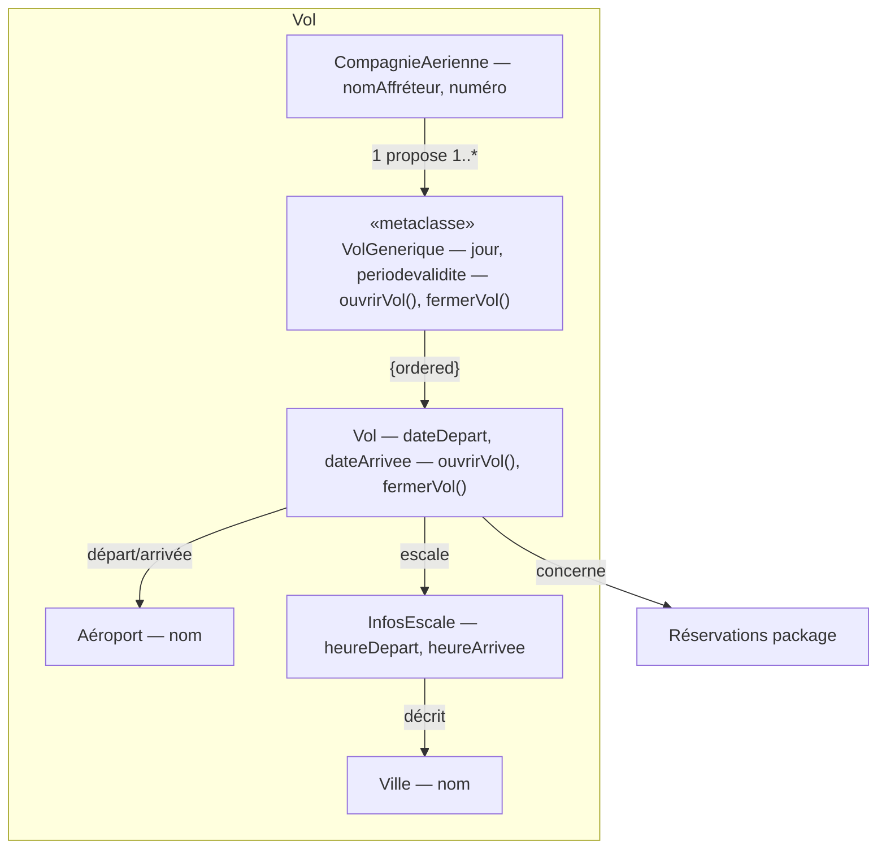

<!-- TODO: unclear in source, verify against original PDF page 349 — same caveat as above: the fine-grained cardinalities on this near-duplicate slide could not be reliably distinguished from the previous one in the OCR extraction. -->

## Diagramme de composants

- Le modèle de composants permet de spécifier l'architecture logicielle pour un environnement de développement donné. Il contient la définition des unités logiques de manipulation ou de compilation : les diagrammes de composants représentent l'architecture d'implémentation du système.
- Il représente les concepts de configuration logicielle.
- Il montre comment s'agencent les modules d'une application : fichiers sources, librairies, exécutables, …
- Il représente la vue d'implantation statique d'un système.

## Notion de composant

- Un composant est un élément encapsulé, réutilisable et remplaçable du logiciel.
- Un composant définit un comportement en termes d'interfaces fournies ou requises.
- On peut voir les composants comme des briques de construction : on les combine (créant peut-être des composants plus gros) afin de construire l'application.
- Les composants peuvent avoir une taille relativement petite, comme une classe, ou importante, comme un gros sous-système.

## Interaction entre composants

- Interaction entre composants au travers des interfaces fournies et requises.
- L'interface fournie est une interface qu'il est capable de mettre en œuvre (d'implémenter par ses classes).
- L'interface requise est une interface dont il a besoin pour fonctionner.

**La réalisation** / **L'utilisation** — Résumé : le composant est relié à ses interfaces offertes par une association de réalisation, alors qu'il est relié à ses interfaces requises par une relation de dépendance.

## Structure interne : port

- Un port est un point de connexion entre un composant et son environnement.
- Généralement, un port est associé à une interface requise ou offerte.
- L'utilisation des ports permet de modifier la structure interne d'un composant sans affecter les clients externes.

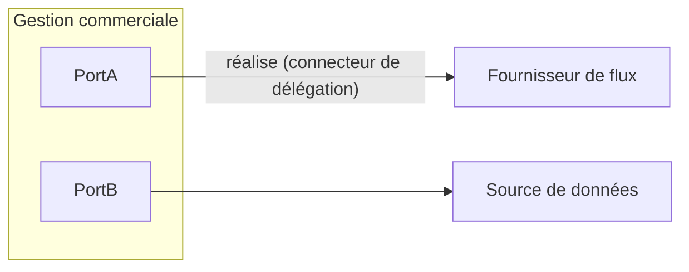

## Connecteurs de délégation

- L'interface fournie d'un composant peut être réalisée par l'une de ses parties internes.
- Son interface requise peut être imposée et utilisée par l'une de ses parties.
- Les connecteurs de délégation montrent que ces parties internes réalisent ou utilisent les interfaces du composant.

*(connecteur de délégation "réalise" / connecteur de délégation "utilise")*

## Utilisation

Un composant C1 dépend d'un autre composant C2 lorsque C1 requiert C2 pour son implémentation (C1 appelle un des services de C2). En d'autres mots, l'exécution de C1 requiert la présence de C2.

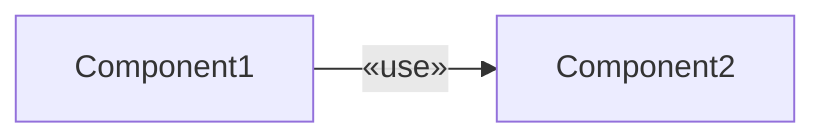

## Composition

Un composant peut être lui-même composé d'autres composants. Par exemple, le navigateur est composé de :

- `getManager` (gestionnaire des requêtes GET),
- `postManager` (gestionnaire des requêtes POST)
- et `GUI` (interface)

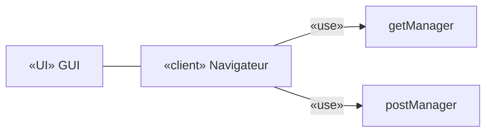

## Délégation

La délégation consiste à transférer les interfaces fournies/requises du composant interne vers le composant externe.

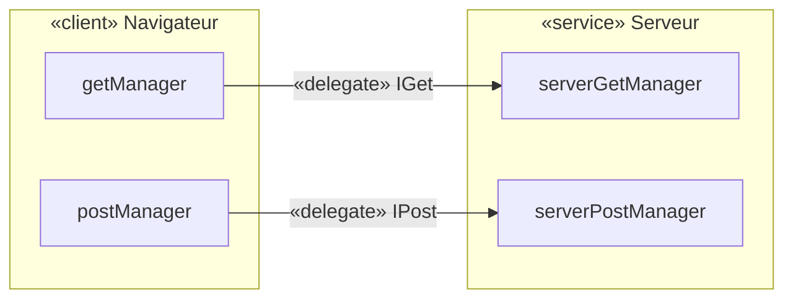

<!-- TODO: unclear in source, verify against original PDF page 361 — this slide repeats the "IGet"/"IPost" delegate labels multiple times in the OCR text in a way that suggests both provided and required interfaces are shown on both sides; simplified to one delegation link per manager above, verify against original. -->

## Diagramme de déploiement

- Le diagramme de composants s'intéresse à l'architecture d'un point de vue d'implémentation, tandis que le diagramme de déploiement s'y intéresse d'un point de vue physique.
- Le diagramme de déploiement est composé de nœuds et de connecteurs.
  - Un nœud représente un équipement dans le système.
  - Un connecteur représente une communication entre les nœuds.

## Nœud

- Un nœud peut avoir un stéréotype pour préciser sa nature.
- Deux stéréotypes très importants : `«device»` et `«execution environment»`.
  - Le stéréotype `«device»` représente un équipement hardware. Ex. : `<<device>> PC de Bureau`
  - Le stéréotype `«execution environment»` détermine un environnement où les processus s'exécutent.
- Les nœuds peuvent être imbriqués.

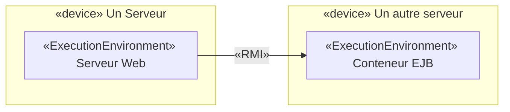

## Lien de communication

Le lien de communication est une association physique entre les nœuds qui modélise la communication entre ces nœuds.

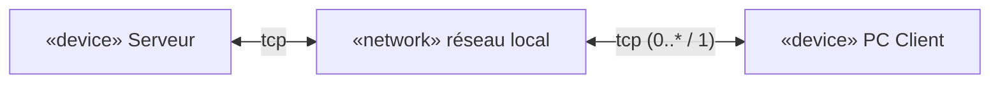

## Chemin de communication

Un chemin de communication (Communication Path) est une association entre deux nœuds au travers de laquelle les nœuds peuvent communiquer par l'échange de messages et de signaux.

On peut aussi faire figurer des chemins de communication entre des nœuds d'environnement d'exécution ; on obtient ainsi des représentations plus précises qu'avec des liens entre nœuds.

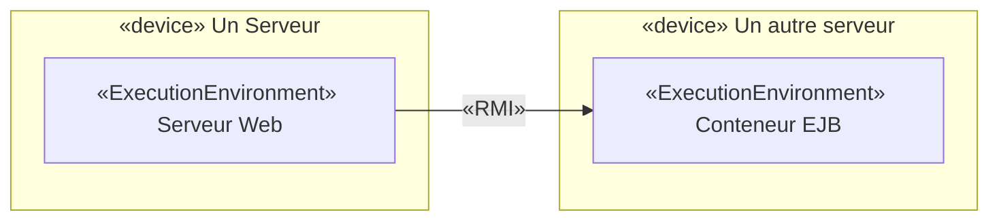

## Diagramme combiné déploiement/composants

- Modélisation du déploiement du système sur une architecture physique et montrer la disposition des artefacts sur les nœuds physiques.
- Les éléments :
  - Artefacts : instances de composants, processus, ...
  - Nœuds physiques : Ordinateur, Téléphone, Imprimante, ...
  - Moyens de communication entre les nœuds

## Diagramme combiné déploiement/composants

Les composants `Listener` et `Diagnostic` sont hébergés dans « Serveur ». Les artefacts représentent les exécutables associés.

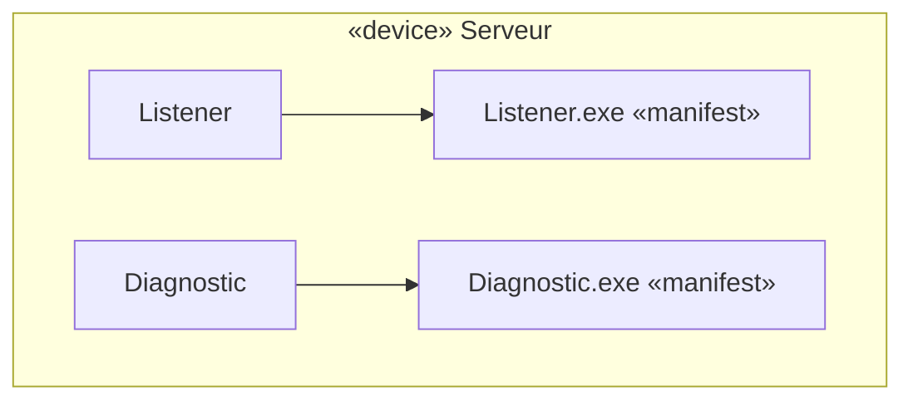

## Notion d'artefact

- Un artefact (artifact) est la spécification d'une partie d'information physique utilisée ou produite lors du processus de développement d'un logiciel.
- Voici quelques artéfacts communs :
  - Fichiers exécutables du type `.exe` ou `.jar`
  - Fichiers de bibliothèque comme les fichiers `.dll`
  - Fichiers sources, par exemple : `.java` ou `.cpp`
  - Fichiers de configuration utilisés par le système `.xml`, `.properties`…

`<<artifact>> MonProgramme.jar`

## Artefact déployé sur un nœud

Pour montrer qu'un élément (artefact ou composant) est affecté à un nœud, on peut représenter l'élément dans le nœud.

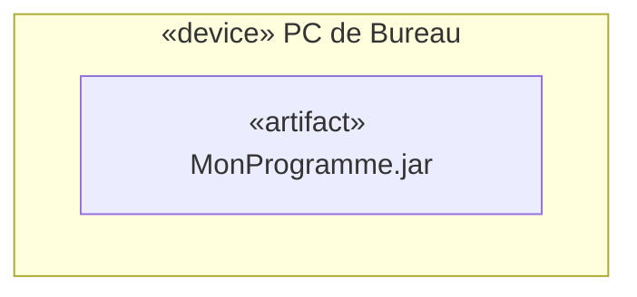

**Autre formalisation** — Ou bien les relier par une relation de dépendance stéréotypée `«deploy»` orientée de l'élément vers le nœud :

## Liste d'artefacts dans un nœud

On peut noter la liste des artefacts dans un nœud. Cela permet de synthétiser de façon claire le comportement du système. Cependant, la liste ne donne pas les relations de dépendance entre les différents artefacts.

`<<device>> Serveur` — artifacts : `activation.jar`, `axis.jar`, `mail.jar`, `Login.jar`

Une autre représentation est possible, à l'aide d'une relation de dépendance :

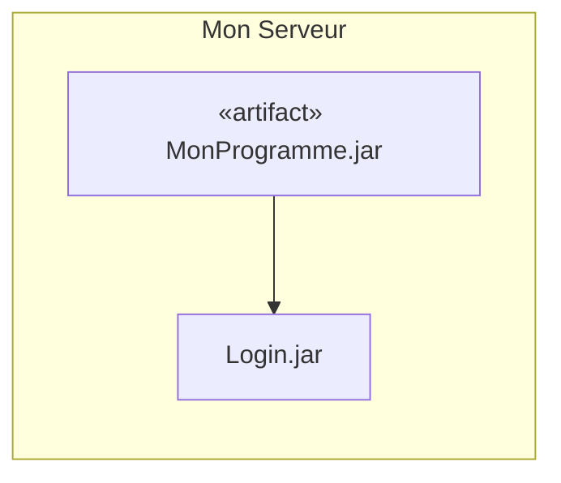

## Diagramme combiné déploiement/composants — exemple d'architecture 3-tiers

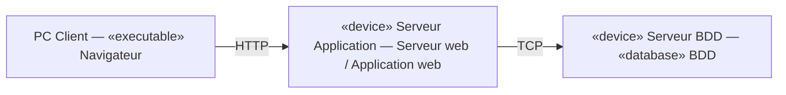

## Un autre exemple de diagramme combiné déploiement/composants

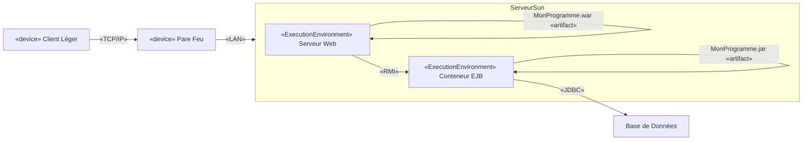

<!-- TODO: unclear in source, verify against original PDF page 372 — this final slide's exact nesting of "«device» Un Serveur"/"Serveur Sun" and the placement of the two artifacts (MonProgramme.war, MonProgramme.jar) relative to Serveur Web / Conteneur EJB was reconstructed from a garbled fragment order; verify against original page image. -->

</TabItem>
<TabItem value="pdf" label="PDF">

<PdfViewer file="/pdfs/acoo-diag-conception-architecturale.pdf" />

</TabItem>
</Tabs>
