import Tabs from '@theme/Tabs';
import TabItem from '@theme/TabItem';

<Tabs>
<TabItem value="markdown" label="Markdown" default>

# Diagrammes de conception détaillée

*II2-ENSI*

<!-- TODO: unclear in source, verify against original PDF page 374 — this slide contains a "4+1 views" diagram (Vue des processus, Vue logique statique (Structure des objets), Vue logique dynamique (Comportement), Vue logique, Vue des composants, Vue de déploiement, Besoins des utilisateurs = vue des cas d'utilisation) whose layout did not extract reliably; same content already reproduced in acoo-analyse-modele-structurel.md (page 139), omitted here to avoid duplicating an unreliable reconstruction — verify against original if needed. -->

## Les concepts sous-jacents à la conception (modèle logique)

Objets du monde réel — De quoi parle-t-on ? Analyse → Modèle conceptuel

Algorithme du monde réel — Comment 'logique' ? Conception → Modèle logique → Objets du logiciel

Algorithme du logiciel (scénario) — Comment 'physique' ? Code → Modèle physique → Objets du langage

<!-- TODO: unclear in source, verify against original PDF page 375 — this diagram's exact layout was reconstructed from garbled fragments (same recurring diagram seen in acoo-introduction.md and acoo-use-case.md); reproduced as a best-effort reading. -->

La phase de conception vise à :

- déterminer quels seront les composants du logiciel à développer,
- préciser les caractéristiques de ces composants,
- concevoir les algorithmes permettant à ces composants d'effectuer les activités dont ils sont responsables.

Le résultat de la phase de conception consiste en un modèle logique/physique du système, représenté par :

- des diagrammes de classes décrivant la structure statique,
- des diagrammes associés aux aspects dynamiques.

**NB** : Les classes qui doivent apparaître sur les diagrammes de classes se déterminent sur la base du modèle conceptuel. Les classes peuvent notamment correspondre à des concepts, des éléments de concepts, ou des composants logiciels auxiliaires nécessaires à la bonne marche du système.

## Conception objet

Deux niveaux de conception :

- **une étape logique** : indépendante de l'environnement de réalisation :
  - **Conception détaillée des classes** : trouver la meilleure manière de concevoir les structures logiques,
  - **Conception détaillée des associations** (typage, portée, rémanence) :
    - assurer la gestion des liens
    - traiter les classes associatives
    - optimiser la navigation
    - Délégation : dépendance des relations d'agrégation et de composition.
  - **Raffiner la généralisation/spécialisation** (héritage simple ou multiple) :
    - propriétés structurelles
    - Interface
    - propriétés comportementales (substitution)
- **une étape physique** : liée à des particularités des langages de programmation ou de l'environnement d'exécution

## Les classes en analyse

- Chaque classe est représentée sous la forme d'un rectangle divisé en trois compartiments.
- Les compartiments peuvent être supprimés pour alléger les diagrammes.

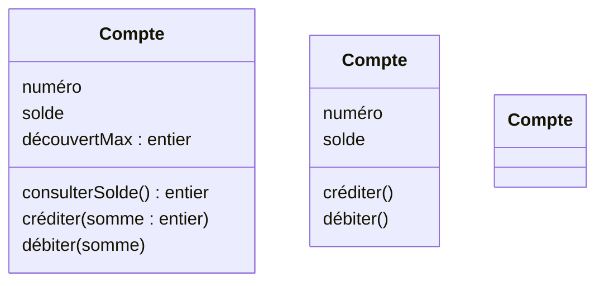

Note de style : les noms de classes commencent par une majuscule ; les noms d'attributs et de méthodes commencent par une minuscule.

## Déclaration d'attributs

`[/] [visibilité] nom [: type] [card ordre] [= valeur-initiale] [{props...}]`

- `/` : Attributs dérivés = calculés
- **Visibilité** : visibilité de l'attribut
- **type** : type de base (Entier, Chaîne, ...) ou type composé (structure, énumération, classe)
- **card ordre** : `[nbElt]` ou `[Min..Max]`
- **valeur-initiale** : valeur initiale à la création de l'objet
- **Props** : contraintes sur l'attribut

Exemples :

```
+age
/age
- solde : Integer = 0
# age : Integer [0..1]
# numsecu : Integer {frozen}
# motsClés : String [*] {addOnly}
nbPersonne : Integer
```

- Adapter le niveau de détail au niveau d'abstraction
- La non-précision de visibilité → privée

## Déclaration d'opérations

`[visibilité] nom [(params)] [: type] [{props...}]`

`params := [in | out | inout] nom [: type] [multiplicité] [=defaut] [{props...}]`

- **in** : Paramètre d'entrée passé par valeur.
- **out** : Paramètre de sortie uniquement
- **inout** : Paramètre d'entrée/sortie.
- Le type du paramètre peut être un nom de classe, un nom d'interface ou encore un type de donnée prédéfini.
- **Props** : Les propriétés sont des contraintes ou des informations complémentaires comme les exceptions, les préconditions, les postconditions ou encore l'indication qu'une méthode est abstraite (mot-clé `abstract`).

Exemples :

```
getAge()
+ getAge() : Integer
- updateAge(in date : Date) : Boolean
# getName() : String [0..1]
+getAge() : Integer {isQuery}
+main(in args : String [*] {ordered})
```

- Adapter le niveau de détail au niveau d'abstraction
- La non-précision de visibilité → public

## Conception détaillée des classes

- Définir le type des attributs identifiés en analyse.
- Spécifier les visibilités des attributs et méthodes + prise en compte des propriétés (`changeable`, `readOnly`, `frozen`)
  - Type de base + composé
  - Structure
  - Enumération
- Spécifier les structures de données.
- Spécifier les méthodes + celles spécifiques à l'implantation
- Montrer les dépendances + classes spécifiques

## Visibilité des éléments

- Restreindre l'accès aux éléments d'un modèle
- Contrôler et éviter les dépendances entre classes (et paquetages)

| Symbole | Visibilité | Description |
| --- | --- | --- |
| `+` | public | visible à l'extérieur de la classe |
| `#` | protégé | visible que dans la classe et ses sous-classes |
| `-` | privé | visible dans la classe uniquement |
| `~` | package | visible dans le package uniquement |

Soulignement = élément de classe.

**Remarques** :

- Utile lors de la conception et de l'implémentation, pas avant ! N'a pas de sens dans le modèle d'analyse.
- La sémantique exacte dépend du langage de programmation !

## Structure

**Définition** : Ensemble d'attributs pouvant être regroupés.

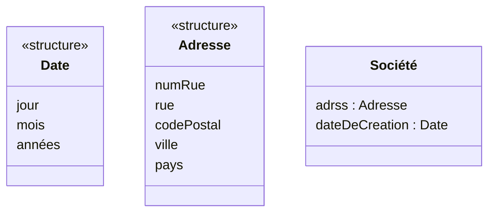

## Énumération

**Définition** : Ensemble de littéraux d'énumération, ordonné.

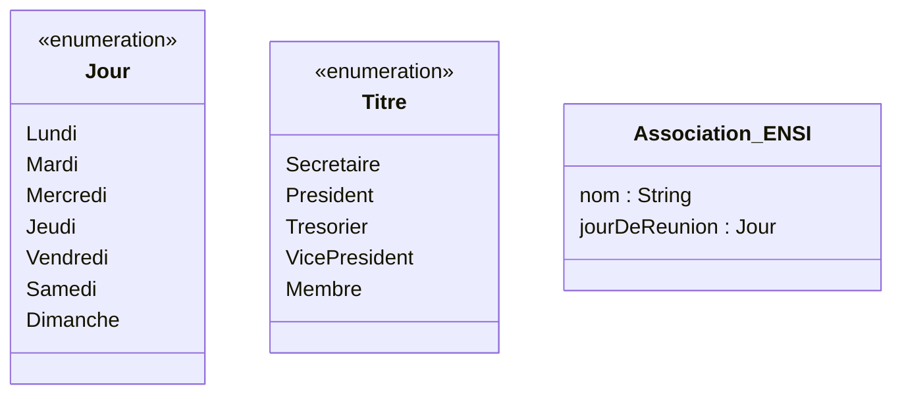

## Encapsulation

Implémentation / Interfaces.

## Dépendances

- Une dépendance est une relation unidirectionnelle formulant une dépendance sémantique entre des éléments du modèle (packages ou classes). Elle est représentée par un trait discontinu orienté. Elle indique que la modification de la cible peut impliquer une modification de la source.
- Une relation de dépendance entre une classe C1 (source) et une classe C2 (Cible) indique qu'une modification de C2 peut avoir une influence sur le fonctionnement de C1.
- En général, une relation de dépendance résulte du fait qu'une classe C1 connaît l'existence d'une classe C2. À cet effet, UML propose plusieurs stéréotypes :
  - `«call»` : la source appelle une opération de la cible
  - `«create»` : la source crée une instance de la cible
  - `«permit»` : la source est amie de la cible
  - `«use»` : la source a besoin de la cible pour être implémentée

**Remarque** : Seules les dépendances non triviales sont précisées sur les diagrammes.

## Conception détaillée des classes : classes spécifiques

- **Classe emboîtée** : Déclarée dans la portée lexicale d'une autre classe.
- **Classe utilitaire** :
  - Les classes utilitaires permettent de regrouper des éléments dans un module sans pour autant définir une classe complète.
  - Les classes utilitaires ne peuvent être instanciées car elles ne sont pas des types de données.
- **Classe Paramétrée** :
  - Modèle de classe
  - Paramètres formels génériques (types, opérations…)

```cpp
class A {
    // attributs de A
    class B { };
public:
    // méthodes de A
};
```

## Conception détaillée des classes : classes spécifiques

- **Classe Paramétrée**
  - Modèle de classe
  - Paramètres formels génériques (types, opérations…)

## Exercice

**Énoncé** : « Tout vol est caractérisé par son numéro (entier), sa destination (chaîne de caractères), sa ville de départ (chaîne de caractères), sa date de départ (structure date), son heure de départ, sa durée (entier) et sa date d'arrivée. Nous devons disposer des méthodes permettant de calculer l'heure d'arrivée, de calculer les points de fidélité procurés par le vol et d'afficher les caractéristiques d'un vol sous forme de : numéro – destination – date_départ (jour/mois/année) – heure de départ. Afin de faciliter le calcul de l'heure d'arrivée et de l'heure de départ des vols, on se propose d'utiliser une classe `Time`, représentant l'heure et les minutes. Cette classe possède la méthode `addition` permettant d'ajouter une durée donnée en minutes à une heure donnée ainsi que la méthode `afficher` permettant d'afficher l'horaire sous la forme : ‘heure’h‘minutes’, par exemple : 22h50. »

**TAF** : Donnez le diagramme de classes modélisant cet énoncé.

<details>
<summary>Correction</summary>

<!-- TODO: unclear in source, verify against original PDF page 390 — the "Proposition de correction" slide is a diagram/screenshot with no extractable OCR text. -->

</details>

## Conception détaillée des associations

- Spécifier la gestion des associés (gestion des liens entre objets)
- Traiter les classes associatives
- Optimiser la navigation

## Conception détaillée des associations

- Préciser la portée
- Spécifier les méthodes assurant la gestion des liens
- Spécifier les contraintes de gestion

<!-- TODO: unclear in source, verify against original PDF pages 392-393 — this slide's example object diagram (Client, Compte, Banque, Consortium, Distributeur instances with "titulaires" links) is one of the most heavily garbled fragments in the deck (repeated/interleaved OCR text: "titulaires", ": Compte", ": Client", ": Banque", ": Consortium", ": Distributeur"); no reliable reconstruction was possible from the extracted text — verify against original page images if this example is needed. -->

## Conception détaillée des associations

`A 1 R 1 B` — `A 1 R * B` — rôles `Ra`, `Rb`

```cpp
class A {
    // attributs de A
    B* Rb;
public:
    // méthodes de A
};
class B {
    // attributs de B
    A* Ra;
public:
    // méthodes de B
};
```

```cpp
class A {
    // attributs de A
    vector<B*> Rb;
public:
    // méthodes de A
};
class B {
    // attributs de B
    A* Ra;
public:
    // méthodes de B
};
```

### (i) Préciser la portée des associations

La portée → visibilité des rôles : `+`, `-`, `#`

`A -g R B +f` (cardinalité 1..1)

```cpp
class A {
    // attributs de A
public:
    B* f;
    // méthodes de A
};
class B {
    // attributs de B
    A* g;
public:
    // méthodes de B
};
```

### (ii) Spécifier les méthodes pour la gestion des liens

`A --- R (0..1 / 0..1) --- B` avec méthodes `set`/`get`

**Remarque** :

1. Les méthodes de gestion des liens (ajout/suppression) doivent préserver la cohérence des cardinalités.
2. Les méthodes doivent être cohérentes avec le type de collection utilisée pour l'implémentation de la navigation.
3. En cas de cardinalité `> 1` → possibilité à prévoir lors de la conception du sens de navigation.

`A (0..1) --- (0..*) B` avec méthodes : `add`, `remove`, `setAll`, `removeAll`, `insert`, `removeIdx`, `exist`, `getAll`, `nb`, `empty`.

## Conception détaillée des associations

`A 1 R 1 B` — `A 1 R * B` — rôles `Ra`, `Rb`

```cpp
class A {
    // attributs de A
    B* Rb;
public:
    // méthodes de A
    B* getRb() const;
    void setRb(B*);
};
class B {
    // attributs de B
    A* Ra;
public:
    // méthodes de B
    A* getRa() const;
    void setRa(A*);
};
```

```cpp
class A {
    // attributs de A
    vector<B*> Rb;
public:
    // méthodes de A
    void setall(B*);
    void insert(B*);
    void remove(B*);
    void removeAll();
    void removeIdx(int);
    bool exist(B*);
    vector<B*> getall();
    int nb();
    bool empty();
};
class B {
    // attributs de B
    A* Ra;
public:
    // méthodes de B
    A* getRa() const;
    void setRa(A*);
};
```

## (iii) Contraintes de gestion de l'association

Situation initiale S0 → S1 → S2 → Situation finale Sf `{frozen}`

<!-- TODO: unclear in source, verify against original PDF pages 397-400 — these four slides illustrate the {frozen}, {addOnly}, {addOnly, Ordered} and {Not unique} constraints as state-transition diagrams (S0→S1→S2→Sf) with no further extractable OCR text beyond the constraint label per slide. -->

## (iii) Contraintes de gestion de l'association

Par exemple :

- `{frozen}` : Un lien ne peut plus être modifié ni détruit après sa création : le tissage des liens est fixé lors de la création et ne peut pas changer.
- `{ordered}` : les éléments de la collection représentant le tissage des liens sont ordonnés
- `{addOnly}` : Il est possible de tisser de nouveaux liens mais impossible d'en supprimer
- `{nonUnique}` : Il est possible d'avoir plus qu'un lien entre deux objets avec la même association : répétitions possibles (UML2.0)

Il est possible de définir de nouvelles contraintes.

## Exercice

1. Une personne est née dans un pays et cela ne peut être modifié.
2. Une personne a visité un certain nombre de pays, dans un ordre donné, et le nombre de pays visités ne peut que croître. Une personne aimerait encore visiter toute une liste de pays, et selon un ordre de préférence.

Réponses attendues : `{frozen}` (1), `{ordered}` / `{addOnly, ordered}` (2).

Spécifier la gestion des liens : `getAll`, `exist`, `nb`, `empty`, `add`, `setAll`, `remove`, `removeAll`, `removeIdx`, `set`, `insert`, `get`.

- La gestion est définie par le concepteur — `{design tip=ignore}`
- Marquage standard UML — `{design tip=default}`

*(pas envisagé si `{frozen}`, pas envisagé si `{addOnly}`)*

## Exercice : le jeu d'échec

Un jeu d'échec se joue à deux joueurs sur un échiquier carré composé de 64 cases, alternativement noires et blanches. Chaque joueur possède initialement 8 pions, deux fous, deux cavaliers, un roi, une dame et deux tours. Un pion peut devenir une dame, une tour, un fou ou un cavalier, on dit qu'il est promu. Il y a au maximum une pièce par case. Une partie est une suite ordonnée de coups : les joueurs jouent alternativement chacun son tour. Lors de son tour, un joueur effectue un coup. Ce coup porte sur une de ses pièces sur l'échiquier et modifie sa position vers une nouvelle position. Un coup peut entraîner la capture d'une pièce de l'adversaire. La pièce capturée finit ainsi à l'extérieur de l'échiquier. Quand un coup mène à une position qui menace le roi adverse de prise au prochain coup, ce roi est en échec. Le jeu consiste à faire une séquence de coups alternée entre les deux joueurs jusqu'à l'échec et mat. Le mat est une situation dans laquelle le roi n'a pas d'échappatoire de l'échec. Chaque pièce a un déplacement spécifique. Par ailleurs, toutes les pièces, sauf les pions, capturent comme elles se déplacent : l'obstacle sur le trajet constitué par une pièce adverse est accessible avec capture de cette pièce adverse. Les pions ont un mode de prise particulier : ils capturent en avançant d'une case en diagonale.

<!-- TODO: unclear in source, verify against original PDF pages 405-408 — "Ebauche 1 de diagramme d'analyse", "Ebauche 2 de diagramme d'analyse", "Ebauche 1 de diagramme de conception détaillée" and "Diagramme de conception détaillée 2" are diagram slides (the exercise's proposed class diagrams) with no extractable OCR text beyond their titles. -->

## Optimiser la navigation

- ajouter un sens de navigation et/ou une contrainte d'appartenance
- ajouter de nouvelles associations,
- modifier/supprimer les anciennes associations

<!-- TODO: unclear in source, verify against original PDF pages 409-412 — "Optimiser la navigation" (x2) and "Diagramme de conception détaillée 3" are diagram slides with no extractable OCR text beyond `{frozen}`/`{ordered}` constraint labels. -->

## Délégation — dépendance des relations d'agrégation et de composition

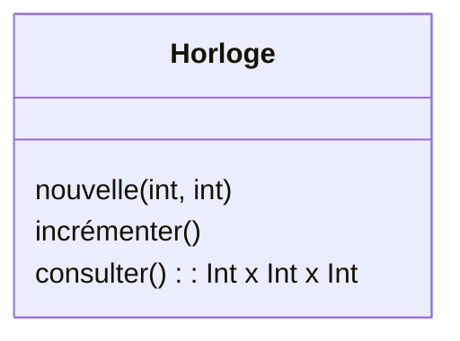

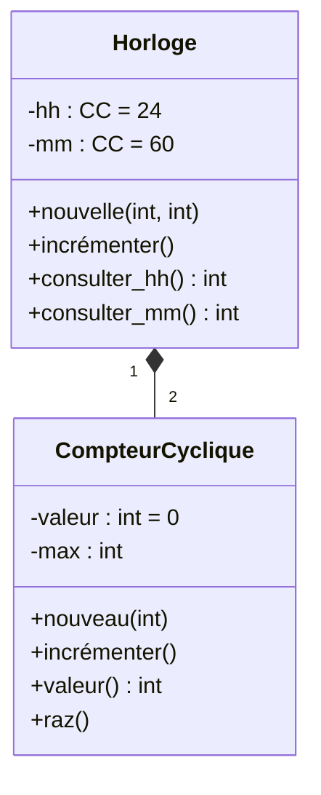

`{frozen}` sur `-max : int`.

<!-- TODO: unclear in source, verify against original PDF page 413 — the exact composition cardinality between Horloge and CompteurCyclique ("2") was reconstructed from a terse fragment; verify against original. -->

<!-- TODO: unclear in source, verify against original PDF page 414 — "Diagramme de conception détaillée 4" is a diagram slide with no extractable OCR text beyond the title. -->

## Traiter les classes associatives : placement des attributs selon les valeurs de multiplicité

- Pour les associations 1..1, les attributs de l'association peuvent être déplacés dans une des classes qui participent à l'association.
- Pour les associations 1 vers N, le déplacement est généralement possible vers la classe du côté N.
- La promotion de l'association au rang de classe pour augmenter la lisibilité ou en raison de la présence de l'association vers d'autres classes.
  - promotion en classe de la relation Etudiant-Travail, avec un attribut `Note`
  - attribut `Mention` qualifie un diplôme : il correspond à la conception de la relation Diplôme-Etudiant,
  - attribut `Numéro` qualifie une chambre : il correspond à la conception de la relation Etudiant-Chambre.

## Classes associatives : traduction

Transformation systématique pour revenir aux concepts de base.

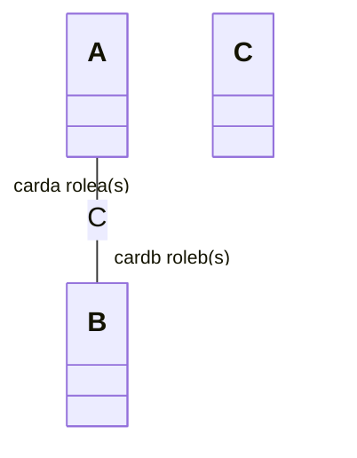

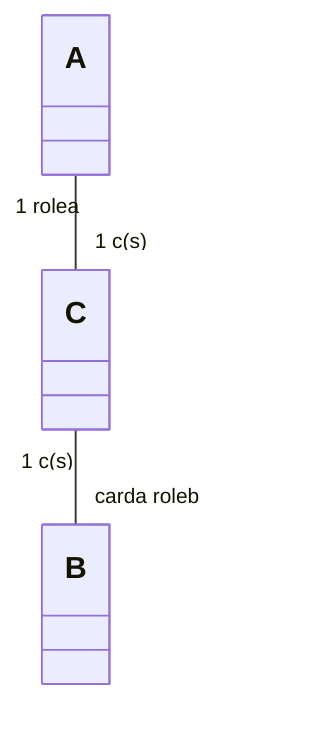

Il ne peut y avoir qu'un objet C entre un objet A et un objet B donné.

## Classes associatives : traduction

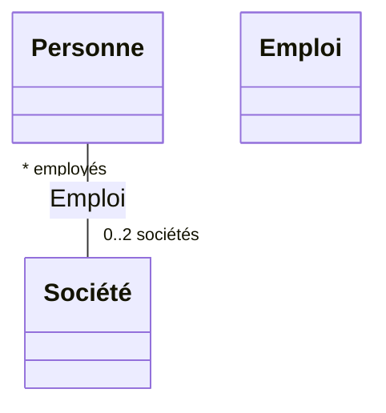

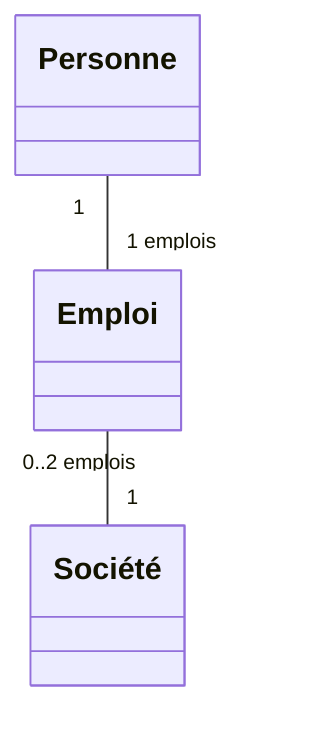

Il ne peut y avoir qu'un `Emploi` entre une `Personne` et une `Société`.

## Raffinement de l'héritage

- Raffiner les hiérarchies de classes
- Penser à la diversification des implémentations
- Contrôler la substitution

## Raffiner les hiérarchies de classes

Les hiérarchies de classes ou classifications permettent de gérer la complexité en ordonnant les objets au sein d'arborescences de classes d'abstraction croissante.

- **La généralisation** : il s'agit de prendre des classes existantes (déjà mises en évidence) et de créer de nouvelles classes qui regroupent leurs parties communes ; il faut aller du plus spécifique vers le plus général.
- **La spécialisation** : il s'agit de sélectionner des classes existantes (déjà identifiées) et d'en dériver de nouvelles classes plus spécialisées, en spécifiant simplement les différences.

## Règles de généralisation

La généralisation ne porte aucun nom particulier ; elle signifie toujours : est un ou est une sorte de. La généralisation ne concerne que les classes, elle n'est pas instanciable en liens et, de fait, ne porte aucune indication de multiplicité.

## Exemple

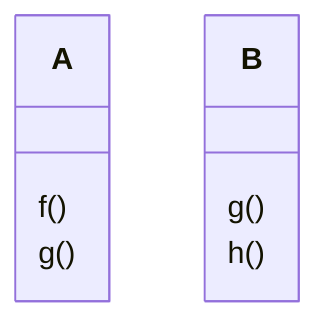

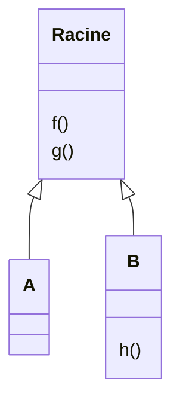

<!-- TODO: unclear in source, verify against original PDF page 421 — this slide illustrates factoring the common operation g() up into a "Racine" superclass; the exact before/after class contents were reconstructed from terse fragments, verify against original. -->

## Exemple 2 : spécialisation

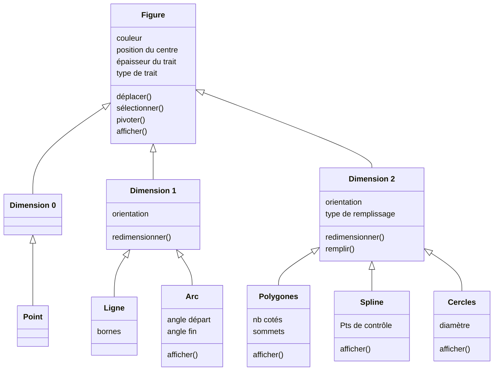

<!-- TODO: unclear in source, verify against original PDF page 422 — the exact attribute/operation placement across Dimension0/1/2 vs. their subclasses (Point, Ligne, Arc, Polygones, Spline, Cercles) was reconstructed from interleaved fragments; the "pivoter afficher" fragment attached near Cercles could not be placed with confidence, verify against original page image. -->

## Spécialisation

<!-- TODO: unclear in source, verify against original PDF page 423 — this slide is a diagram/screenshot with no extractable OCR text beyond the title. -->

## Les classes abstraites

- Les classes abstraites ne sont pas instanciables directement,
- Les classes abstraites forment une base pour les logiciels extensibles,
- Les nouveaux besoins, les extensions et les améliorations sont concentrées dans de nouvelles sous-classes,
- Une classe est désignée comme abstraite au moyen de la propriété booléenne `Abstraite` définie pour tous les éléments généralisables,
- La propriété `Abstraite` peut également être appliquée à une opération.

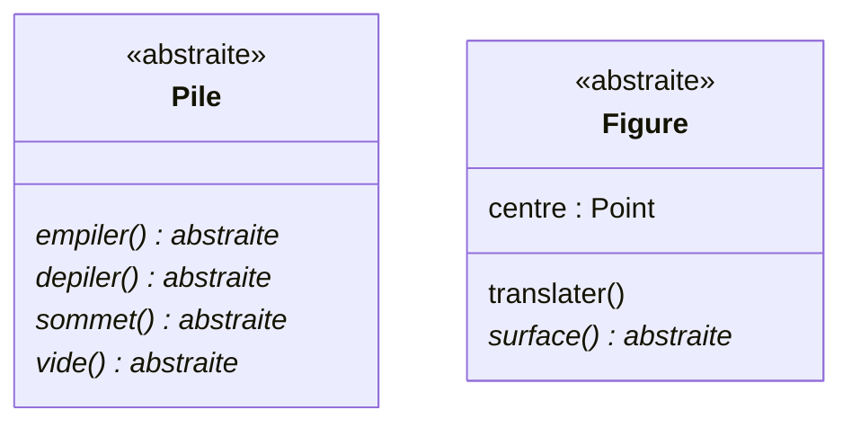

## Exemple

<!-- TODO: unclear in source, verify against original PDF page 425 — this slide is a diagram/screenshot with no extractable OCR text beyond the title. -->

## Substitution

Si deux concepts sont liés par une relation de spécialisation, alors toute instance du concept spécialisé doit pouvoir jouer le rôle d'une instance du concept général.

Il doit être possible de substituer une instance du concept spécialisé à une instance du concept général dans toutes les applications où ce dernier joue un rôle.

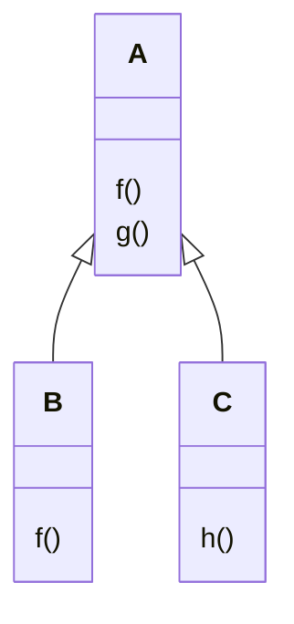

## Diversification des implémentations

Le concept d'interface a été introduit dans UML pour modéliser des techniques de description de composants qu'on trouve sur le marché. Une interface est la déclaration d'une collection d'opérations qui peuvent être utilisées pour définir un service. Une interface spécifie des opérations visibles d'une classe sans en définir la structure interne. Elle ne spécifie souvent qu'une partie limitée du comportement d'une classe. Les interfaces n'ont ni implémentation, ni attributs, ni états, ni associations. Elles peuvent cependant disposer de relations de généralisation.

Une interface est représentée par un petit cercle ayant un nom : représentation d'une interface au moyen d'un petit cercle relié à la classe qui fournit effectivement les services (une classe / une interface).

## Les interfaces

Pour montrer les opérations dans une interface, on la spécifie comme une classe avec le stéréotype `«interface»`.

**Exemple** :

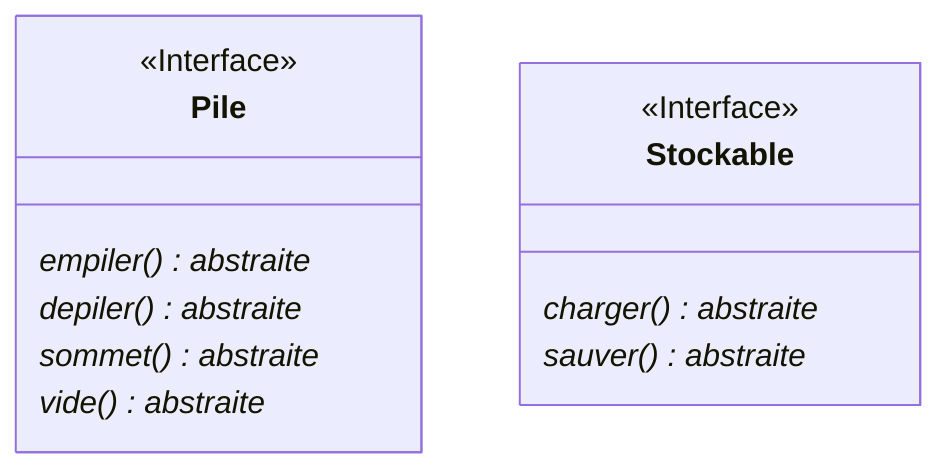

## Réalisation

La réalisation est une relation sémantique entre deux classificateurs, selon laquelle un des classificateurs décrit un contrat dont l'exécution est garantie par l'autre.

## Les interfaces

- Les interfaces jouent un rôle important dans la construction de systèmes.
- Une interface décrit le comportement visible d'une classe, d'un composant, d'un sous-système ou d'un package.
- Le comportement visible d'une interface est décrit par des opérations abstraites dont la visibilité est publique.
- Une interface est représentée par un petit cercle ayant un nom : représentation d'une interface au moyen d'un petit cercle relié à la classe qui fournit effectivement les services (une classe / une interface).

## Interface & réalisation

- Une interface peut être réalisée par plusieurs classes.
- Une même classe peut réaliser plusieurs interfaces.

**Exemple** :

```mermaid
classDiagram
    class Credit["Crédit"] {
        <<Interface>>
    }
    class Assurance {
        <<Interface>>
    }
    class Banque
    class Entreprise
    class Client
    Banque ..|> Credit
    Banque ..|> Assurance
    Entreprise ..>|"«utilise»"| Banque
    Client ..>|"«utilise»"| Banque
```

La classe `Banque` réalise les deux interfaces `Crédit` et `Assurance`.

## Conception détaillée : modélisation dynamique

- **Vue logique statique** (Structure des objets)
- **Vue logique dynamique** (Comportement)
- **Vue des processus**
- **Vue logique** — Besoins des utilisateurs = vue des cas d'utilisation
- **Vue des composants**
- **Vue de déploiement**

## Les diagrammes de séquences

**But** : décrire les interactions entre objets.

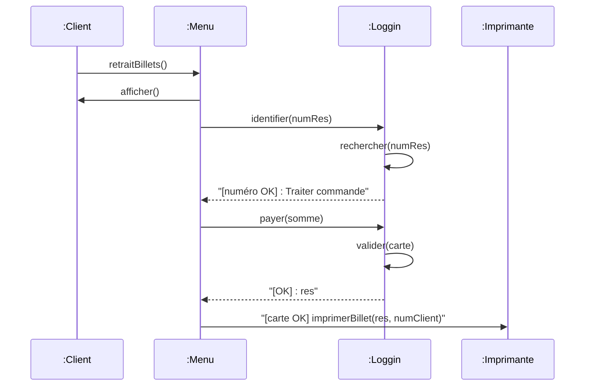

<!-- TODO: unclear in source, verify against original PDF page 434 — this is a near-duplicate of the "Billetterie" example already reproduced (with the same caveat) in acoo-analyse-modele-dynamique.md; the exact message order here was reconstructed from a similarly garbled fragment set, verify against original. -->

## Messages de création & destruction d'objets (surtout pour la conception)

- **Création** : Lorsqu'un objet est créé, on place la boîte qui le représente légèrement en bas, à l'endroit où il est créé.
- **Destruction** : La destruction d'un objet est représentée par un X à la fin de sa ligne de vie, là où elle se termine. Si l'objet est détruit par un autre objet (non par lui-même), un message issu de l'objet destructeur pointe sur le X.

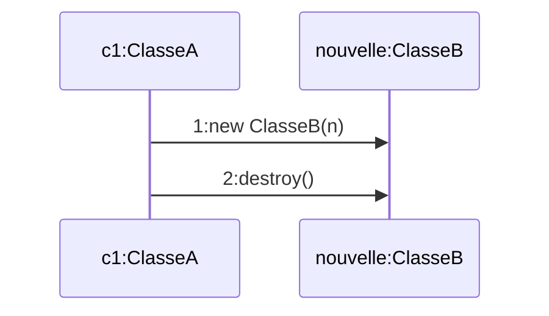

## Exemple : interaction simple

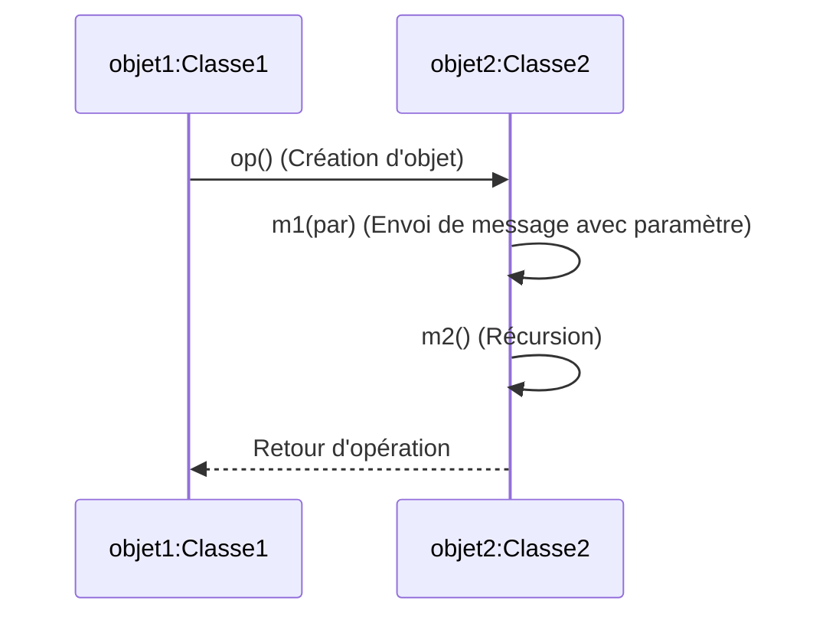

*(Destruction d'objet)*

## Diagrammes de communication — buts

1. Décrire l'interaction des objets entre eux
2. Valider les choix d'analyse et de conception (prototypage) — aider à élaborer des diagrammes de classes de conception

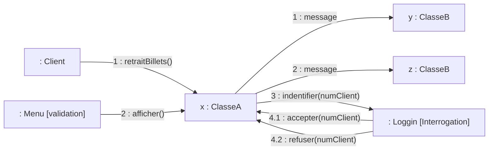

<!-- TODO: unclear in source, verify against original PDF page 437 — this is the same "Client/Menu/Loggin" communication-diagram example already noted as ambiguous in acoo-analyse-modele-dynamique.md; reproduced identically here, verify against original. -->

## Exemple (2) : création et destruction dynamiques d'objets

```mermaid
flowchart LR
    Doyen[": Doyen"] -->|"1: n := obtenirNom()"| ProfAgrege[":ProfAgrégé {new}"]
    Doyen -->|"2: new ProfAgrégé(n)"| ProfAgrege
    Doyen -->|"3: destroy()"| ProfAdjoint[":ProfAdjoint {destroyed}"]
```

## Diagrammes d'états / transitions

**But** : Décrire en détail le comportement des classes.

```mermaid
stateDiagram-v2
    [*] --> Attente
    Attente --> Validation : requête
    state Validation {
        [*] --> Interrogation
        Interrogation: entry / do : identifier
        Interrogation --> [*] : identifié
        Interrogation --> [*] : Non identifié / annuler
    }
    Validation --> AttentePaie : connu de la base
    Validation --> Erreur : inconnu
    state AttentePaie {
        AttentePaie2["Attente Paie"]
        AttentePaie2: entry : afficher prix
    }
    AttentePaie --> OK : Payé / imprimer
    AttentePaie --> Erreur : Impayé / annuler
    Attente --> [*] : éteindre
```

*(État composite)*

<!-- TODO: unclear in source, verify against original PDF page 439 — this state diagram's exact nesting (which states are composite, exact "exit:" action placement) was reconstructed from a garbled fragment order; verify against original page image. -->

## Diagrammes d'activités

**Buts** :

1. Décrire en détail le comportement d'une opération
2. Modéliser les processus métiers

*(Dual des diagrammes d'états / transitions)*

Notation : Activité, Objet [état], `Opération : identifier client`, Acteur 1 / Acteur 2, `[événement]`, flux de contrôle, flux des artefacts, mise en parallèle, synchronisation.

```mermaid
flowchart TD
    Start((Début)) --> InterrogerBase["Interroger base — ^base.identifier(numClient)"]
    InterrogerBase -->|"[connu]"| AfficherOK["Afficher OK — ^ecran.afficherOK()"]
    InterrogerBase -->|"[inconnu]"| Retourner["retourner faux"]
    AfficherOK --> End((Fin))
    Retourner --> End
```

<!-- TODO: unclear in source, verify against original PDF page 441 — this activity diagram's exact shape (guard placement for [connu]/[inconnu], the "Validation" swimlane with Acteur1/Acteur2, "Etat Objet") was reconstructed from a garbled fragment order; verify against original page image. -->

</TabItem>
<TabItem value="pdf" label="PDF">

<PdfViewer file="/pdfs/acoo-diag-conception-detaillee.pdf" />

</TabItem>
</Tabs>
