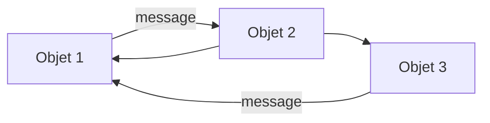
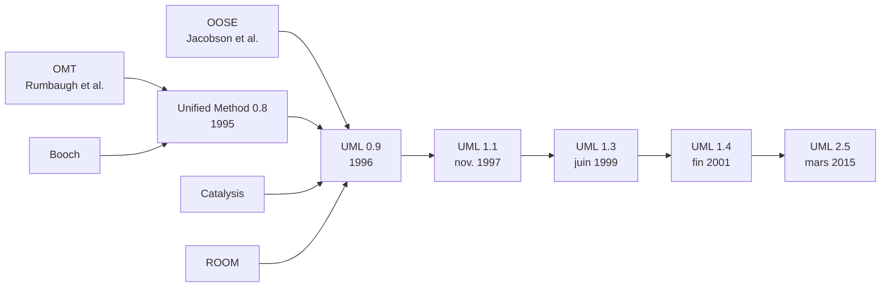
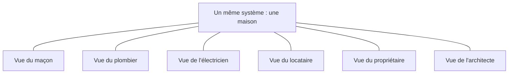
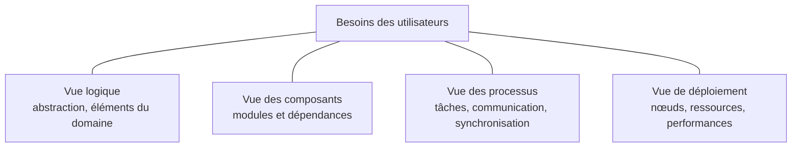
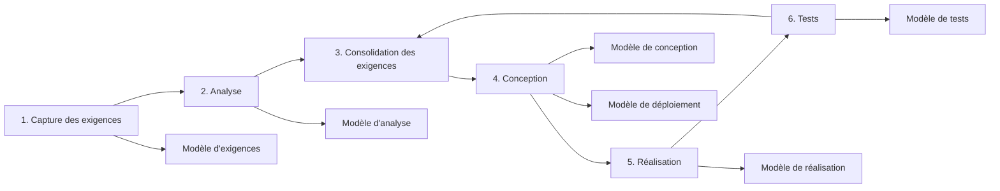

import Tabs from '@theme/Tabs';
import TabItem from '@theme/TabItem';

<Tabs>
<TabItem value="markdown" label="Markdown" default>

# Analyse et Conception Orientées Objet (II2)

*ENSI — II2*

## La mise en place d'un système

- Description d'un problème : **ANALYSE** — Analyse Quoi-Faire ?
- Description de la solution d'un problème : **CONCEPTION** — Conception Comment-Faire ?

## La complexité des logiciels

- Les systèmes peuvent être décomposés selon :
  - ce qu'ils font (approche fonctionnelle)
  - ce qu'ils sont (approche objet)
- L'approche objet gère plus efficacement la complexité :
  - Modèles basés sur le monde réel → stabilité
  - Structure indépendante des fonctions → évolutivité
  - Approche modulaire → maintenance, réutilisabilité

## Intérêt des objets ?

Structure d'une application objet => flots de messages entre un certain nombre d'objets, les objets sont « presque » indépendants les uns des autres.

- Cette indépendance (l'une des grandes forces de l'approche O.O.) permet la réutilisation des objets par de nombreuses applications.
- Les objets sont plus stables que les spécifications qui définissent leurs interactions => les applications sont plus simples à écrire et à faire évoluer.

## Historique des langages OO

- Langages de programmation orientés objets :
  - Simula (1967)
  - Smalltalk (1970)
  - C plus Classes (1980)
  - C++ (1985)
  - Eiffel (1988)
  - Java (1995)
  - C#, …
- SGBD orientés objets : utilisation des BDs avec un langage OO
- Genèse des méthodes d'analyse : Implémentation → Conception (solution informatique) → Analyse (comprendre et modéliser le problème) → …

## Les méthodes d'analyse

- **Méthodes orientées comportement** : on s'intéresse à la dynamique du système ; ex : réseaux de Pétri
- **Méthodes fonctionnelles** : s'inspirent de l'architecture des ordinateurs, on s'intéresse aux fonctions du système ; ex : SADT
- **Méthodes orientées données** : on ne s'intéresse pas aux traitements ; ex : Merise
- **Méthodes orientées objets** : on ne sépare pas les données et les traitements ; ex : Booch, OMT

## L'unification des méthodes

- La guerre des méthodes ne fait plus avancer la technologie des objets
- Recherche d'un langage commun unique :
  - Utilisable par toutes les méthodes
  - Adapté à toutes les phases du développement
  - Compatible avec toutes les techniques de réalisation
- Sur plusieurs domaines d'applications : Scientifique, Industriel, Gestion, Multimédia, …

## UML ?

UML = Unified Modeling Language = Langage unifié pour la modélisation objet.

Langage de modélisation des applications construites à l'aide d'objets, indépendant de la méthode utilisée.

- **C'est** :
  - Un langage de modélisation des applications construites à l'aide d'objets, indépendant de la méthode utilisée
  - Une notation, un langage de modélisation objet
  - Une description complète, évolutive, publique
  - Un standard
- **Ce n'est pas** :
  - Une méthode

## Genèse d'UML

- Utilisation d'un standard de modélisation « universel »
- Au départ, plus de 150 méthodes !
- Unification progressive de plusieurs méthodes, de remarques des utilisateurs, des partenaires
- 1989 : création de l'OMG (Object Management Group) ; groupe créé à l'initiative de grandes sociétés informatiques américaines afin de normaliser les systèmes à objets ; 1ère réalisation de l'OMG : CORBA (communication entre applications objets dans un système distribué hétérogène)
- La dernière version de la spécification validée par l'OMG est UML 2.5.1 (2017)

Cette chronologie illustre l'idée centrale : UML ne remplace pas une démarche de développement ; il unifie une **notation** issue de plusieurs méthodes.

## Devant et derrière, avant et après…

Méthode = Langage(s) + Démarche + Outils

Procédés industriels de production de logiciels et de systèmes : UML, OMT, SA/RT, ERD, Merise, JSD, SADT, DFD, etc.

## Les outils UML

**Fonctionnalités courantes** :

- Edition des modèles et diagrammes UML
- Gestion du dictionnaire de données
- Génération de code C++, Java,...
- Rétro-conception à partir de code existant
- …

**Quelques exemples** :

- Rational Rose de Rational Software ([www.rational.com](https://www.rational.com))
- Software Through Pictures d'AONIX ([www.ide.com](https://www.ide.com))
- Cayenne Class Designer de Cayenne Software ([www.cayennesoft.com](https://www.cayennesoft.com))
- AMC Designer, Poseidon, Visual Design, Spark ([www.cayennesoft.com](https://www.cayennesoft.com))
- STARUML, …

## Présentation du cours

- Module 45h.
- Cours
- Travaux dirigés/Travaux pratiques

## Objectifs du cours

- Présenter les différents diagrammes UML2.5
- Apprendre la modélisation objet
- Connaître et utiliser les patrons de conception

## Plan du cours

1. Introduction
2. Les diagrammes d'analyse
3. Les diagrammes de conception architecturale
4. Les diagrammes de conception détaillée
5. Les patrons de conception
6. Etude de cas

## Évaluation

- Examen Final (65 %)
- Contrôle continu (35 %)
  - Devoir surveillé
  - Tests oraux et/ou écrits
  - Devoirs à la maison

## Références

- Fowler Martin, *UML Distilled: A Brief Guide to the Standard Object Modeling Language* (3rd ed.). Addison-Wesley. ISBN 0-321-19368-7.
- Hugues BERSINI, *L'orienté objet — Cours et exercices en UML2 avec Python, Java, C# et C++*, EYROLLES, 2004, Bibliothèque ENSI (A-824.3).
- Craig Larman, *UML 2 et les Design Patterns* (3ème édition) (ISBN 2-7440-7090-4)
- Internet :
  - Cours sur le web : [http://uml.free.fr](http://uml.free.fr)
  - Site : [www.uml.org](https://www.uml.org) (OMG)

---

# Introduction — II2-ENSI

## Plan

- Sensibilisation à la modélisation
  - Importance de la modélisation
  - Principes de modélisation
  - Intérêt et limites des modèles
- UML
  - Définition
  - Historique
  - Buts d'UML
  - Diagrammes

## Modélisation des objets

**Objectif** : Représenter certains aspects de la réalité d'intérêt pour l'organisation.

Monde Réel → Monde de l'information : un objet réel (ex. *Colette skie vite, elle porte des pantalons rouges et un pull bleu*) → représentation de l'objet réel.

**Approche** :

- Observer le monde réel, identifier les objets et relations pertinentes, sélectionner les propriétés d'intérêt.
- Représenter les objets et relations réels par des objets informationnels en relation les uns avec les autres, leur associer les propriétés de leurs homologues réels, stocker les valeurs des propriétés.

## Vues multiples (aspects d'un système logiciel)

Chaque vue répond à des questions différentes ; elles sont partielles et complémentaires, non concurrentes.

## Modèle ?

Un système est représenté par des modèles.

*La mappemonde est un modèle de la Terre.*

## L'importance de la modélisation

**Qu'est-ce qu'un modèle ?**

Un modèle est une simplification de la réalité :

- Abstraction de la réalité
- Description de tout ou partie d'un système dans un langage bien défini
- Ensemble de concepts, règles, un formalisme
- Vue subjective mais pertinente de la réalité

**Pourquoi modéliser ?**

Les modèles permettent de mieux comprendre le système que l'on développe :

- Fournir des spécifications claires : produire, exploiter
- Clarifier les objets, les concepts, les référentiels, les processus

Nous construisons des modèles pour les systèmes complexes parce que nous ne sommes pas en mesure d'appréhender de tels systèmes dans leur intégralité.

**Des modèles plutôt que du code** : le code ne permet pas de simplifier/abstraire la réalité.

## Les quatre principes de modélisation

1. Le choix des modèles à créer a une forte influence sur la manière d'aborder un problème et sur la nature de sa solution.
2. Tous les modèles peuvent avoir différents niveaux de précision.
3. Les meilleurs modèles ne perdent pas le sens de la réalité.
4. Parce qu'aucun modèle n'est suffisant à lui seul, il est préférable de décomposer un système important en un ensemble de petits modèles presque indépendants.

## Différentes sortes de modèles

Un système peut être statique ou dynamique, et donc son modèle aussi : la carte est un modèle statique d'un système statique (autre exemple : un recensement).

## Intérêt du modèle

Le modèle est important pour :

- Comprendre un problème
- Supporter un travail coopératif d'ingénierie
- Prévoir et simuler la réalisation d'un développement
- Identifier et suivre les lots de travaux
- Guider, contrôler, automatiser la production

*Construire un bâtiment sans plan : est-ce possible ?*

**Évolution de la CAO** :

- Représentation des pièces mécaniques
- Vérification de la compatibilité de pièces
- Emission de plans de fabrication
- Pilotage des chaînes de production

*Et le logiciel ?*

## Limites et dangers des modèles

Tout modèle est faux, toute abstraction est fausse ! Ne pas confondre le modèle et le système.

*La pipe de Magritte* : l'image de la pipe ne permet pas de fumer, mais elle permet de raisonner sur la pipe (design, constitution, etc.) au niveau de l'instance ou du concept.

*La mappemonde est un modèle de la Terre* : permettant de poser certaines questions… mais pas d'autres.

## Perspectives d'un système

- Statique (ce que le système EST)
- Fonctionnel (ce que le système FAIT)
- Dynamique (comment le système EVOLUE)

## Emploi des modèles : limites et dangers

- Besoin de modèles pertinents et adaptés :
  - Adaptés au domaine
  - Compréhensibles par les intervenants
  - Apportant une plus-value d'abstraction suffisante (ex : Action semantics)
- Un modèle est un outil, dont il faut toujours mesurer la plus-value : pragmatisme sur le choix et l'usage des modèles
- Complémentarité avec d'autres approches (ex : prototypage, approche incrémentale, etc.)
- La « culture UML » doit se mettre en place dans les organisations

## Vers un langage unifié pour la modélisation

Booch, Jacobson et Rumbaugh se fixent 4 objectifs :

- Représenter des systèmes entiers (au-delà du seul logiciel) par des concepts objets (plusieurs vues)
- Établir un couplage explicite entre les concepts et les artefacts exécutables
- Prendre en compte les facteurs d'échelle inhérents aux systèmes complexes et critiques
- Créer un langage de modélisation utilisable à la fois par les humains et les machines

## UML : définition

UML : Unified Modeling Language (langage de modélisation unifié)

**Constat** :

- Né de plusieurs méthodes (Booch, OOSE…)
- UML est désormais la référence en modélisation objet

**But** : Modéliser un problème de façon standard.

## L'unification

Les créateurs d'UML insistent tout particulièrement sur le fait que la notation UML est un langage de modélisation objet et non pas une méthode objet. UML n'est pas une notation propriétaire ; elle est accessible à tous et les fabricants d'outils ainsi que les entreprises de formation peuvent librement en faire usage. En français, UML pourrait se traduire par langage unifié pour la modélisation objet, mais il est plus probable qu'UML se traduise plutôt par notation unifiée, voire notation UML…

## UML : historique

- Création en 1995 (fusion des méthodes Booch et OMT, puis par la suite OOSE)
- 1996 : Proposition à l'OMG (Object Management Group)
- 1997 : Standardisation OMG
- Aujourd'hui, nous sommes à la version 2.5

## Les contributions à UML

- **Meyer** : Conception par contrat, invariants
- **Rumbaugh/Jacobson** : la description des opérations, le nombre de messages (Fusion)
- **Harel** : diagrammes à état
- **Embley** : les classes singletons
- **Gamma et al.** : Frameworks, patterns, notes
- **Wirfs-Brock** : les responsabilités
- **Shlaer-Mellor** : les cycles de vie
- **Odell** : les classifications

Le développement d'UML a été fait par un large échantillon de l'industrie : HP, ICON Computing, IBM, I-Logix, Intellicorp, MCI Systemhouse, Microsoft, ObjectTime, Oracle, Platinium Technology, Ptech, Reich Technologies, Softeam, Sterling Software, Taskon, et Unisys.

## UML - langage

- UML comble une lacune importante des technologies objet. Il permet d'exprimer et d'élaborer des modèles objet, indépendamment de tout langage de programmation.
- UML normalise les concepts objet.
- Un langage de modélisation des applications construites à l'aide d'objets, indépendamment de la méthode utilisée.
- **C'est** :
  - Une notation
  - Une description complète, évolutive, publique
  - Un standard
- **Ce n'est pas** :
  - Une méthode
  - Une méthodologie
  - Un processus de modélisation
  - Une démarche de modélisation

## Objectifs d'UML

- Représenter des systèmes entiers (plusieurs vues)
- Prendre en compte les facteurs d'échelle
- Créer un langage de modélisation :
  - Utilisable par les hommes et les machines
  - Compatible avec toutes les techniques de réalisation
  - Adapté à toutes les phases du développement
  - Sans rejeter les méthodes existantes
  - Indépendant des langages de programmation

UML est un langage conçu pour :

- **Visualiser** : chaque symbole graphique a une sémantique
- **Spécifier** : de manière précise et complète, sans ambiguïté
- **Construire** : les classes, les relations, …
- **Documenter** : les diagrammes, notes, contraintes, exigences — les artefacts d'un système à forte composante logicielle

## Modélisation orientée objet

Domaine de l'application → Domaine de la solution.

Modèle du système (Concepts) en Analyse (ex : `TrafficControl`, `MapDisplay`, `SummaryDisplay`, `Aircraft`, `TrafficController`, `FlightPlanDatabase`, `Airport`, `FlightPlan`) → Modèle du système (Concepts) en Conception (Package UML, `TrafficControl`).

## Les préoccupations en UML

- Il n'existe pas une seule manière de regarder un système informatique (le point de vue de l'analyste, du concepteur, d'architecte…).
- Il n'existe pas un seul axe d'intérêt pour représenter un système informatique (sa vue fonctionnelle, structurelle et comportementale).
- UML permet de représenter les systèmes informatiques selon plusieurs préoccupations partielles et complémentaires.

Les préoccupations (facettes) de modélisation d'UML peuvent être catégorisées selon plusieurs classifications :

- Classification selon le point de vue de l'acteur qui va modéliser (analyste, architecte, concepteur, développeur…)
- Classification selon l'axe de modélisation (fonctionnel, structurel ou comportemental)
- Classification selon le modèle des 4+1 vues

→ Tous les diagrammes d'UML vont être catégorisés selon ces classifications.

## Les niveaux d'abstraction

| Niveau | Ce que le modèle représente |
|---|---|
| Capture des besoins | Les frontières fonctionnelles du système. |
| Analyse | Les concepts manipulés par les utilisateurs, aux points de vue statique et dynamique. |
| Conception | Les concepts employés par les outils, langages ou plates-formes. |
| Déploiement | Les matériels et logiciels à interconnecter. |

## Les briques de base

Les briques de base de UML sont :

- Les éléments de modèle (classes, interfaces, composant, etc.)
- Les relations (associations, généralisation, dépendances, etc.)
- Les diagrammes (diagramme de classe, diagramme de cas d'utilisation, diagramme d'interaction, etc.)

Les briques de base simples sont utilisées pour construire des structures plus complexes et plus grandes.

## Les représentations possibles : le modèle 4+1 vues

Le modèle 4+1 organise des vues indépendantes et complémentaires autour des besoins des utilisateurs.

| Vue | Question principale |
|---|---|
| Logique | Quels éléments, relations et mécanismes du domaine ? |
| Composants (réalisation) | Quels modules réalisent le modèle et quelles dépendances ont-ils ? |
| Processus | Comment le système est-il découpé en tâches qui communiquent et se synchronisent ? |
| Déploiement | Sur quelles ressources matérielles répartir le logiciel ? |
| Cas d'utilisation (« +1 ») | Quels besoins et scénarios guident et justifient les quatre autres vues ? |

## Le langage UML

**Les mécanismes généraux** :

- Les paquetages
- Les stéréotypes
- Les étiquettes
- Les notes
- Les contraintes

**Les diagrammes de base** :

- Les diagrammes de classes
- Les diagrammes d'objets
- Les diagrammes de cas d'utilisation
- Les diagrammes de séquence
- Les diagrammes de communication
- Les diagrammes d'états/transitions
- Les diagrammes d'activités
- Les diagrammes de composants
- Les diagrammes de déploiement

*(avec la contribution de Pierre-Alain Muller)*

## Modèles d'UML

- Le modèle des classes qui capture la structure statique
- Le modèle des états qui exprime le comportement dynamique des objets
- Le modèle des cas d'utilisation qui décrit les besoins des utilisateurs
- Le modèle d'interaction qui représente les scénarios et les flots de messages
- Le modèle de réalisation qui montre les unités de travail
- Le modèle de déploiement qui précise la répartition des processus

## Les diagrammes d'UML 2.5

- **Diagramme de cas d'utilisation** : montre les interactions fonctionnelles entre les acteurs et le système à l'étude.
- **Diagramme de classes** : montre les briques statiques (classes, associations, opérations,…)
- **Diagramme d'objets** : montre les instances des éléments structurels et leurs liens.
- **Diagramme de packages** : montre l'organisation logique du modèle et les relations entre packages.
- **Diagramme de séquence** : montre la séquence verticale des messages passés entre éléments au sein d'une interaction.
- **Diagramme de communication** : montre la communication entre éléments dans le plan au sein d'une interaction.
- **Diagramme d'états** : montre les différents états et transitions possibles des objets d'une classe à l'exécution.
- **Diagramme d'activités** : montre l'enchaînement des actions au sein d'une activité.
- **Diagramme de vue globale d'interaction** : combine les diagrammes d'activité et de séquence pour organiser des fragments d'interaction avec des décisions et des flots.
- **Diagramme de temps** : combine les diagrammes d'états et de séquence pour montrer l'évolution de l'état d'une ligne de vie au cours du temps et les messages qui modifient cet état.
- **Diagramme de structure composite** : montre l'organisation interne d'un élément structurel complexe.
- **Diagramme de composants** : montre des structures complexes avec leurs interfaces fournies et requises.
- **Diagramme de déploiement** : montre le déploiement physique des artéfacts sur les ressources matérielles.
- **Diagramme de profil** : définit un profil spécifique à un domaine ou une problématique par extension du méta-modèle UML. Ce 14ème type de diagramme, introduit officiellement par UML 2.3, n'est utilisé que par ceux qui souhaitent définir une variante d'UML pour un domaine spécifique (SysML : Systems Modeling Language est un exemple de profil UML2).

## Processus basé sur la réalisation de modèles

1. Capture des exigences → Modèle d'exigences
2. Analyse → Modèle d'analyse
3. Consolidation des exigences
4. Conception → Modèle de conception, Modèle de déploiement
5. Réalisation → Modèle de réalisation
6. Tests → Modèle de tests

## Phases non outillées par UML

- **Codage** : transcription dans un langage de programmation objet des objets du dossier de conception.
- **Tests** :
  - Réaliser les tests unitaires des classes
  - Faire les tests des modules correspondant aux paquetages
  - Tester les scénarios
  - Valider le système du point de vue externe
- **Intégration** : introduction des classes ou paquetages par étapes.

## Conclusion — les bénéfices d'UML

- Une notation unique et standard, connue des intervenants, exploitable à tous les niveaux du développement et dans des domaines au-delà du logiciel.
- Une sémantique définie par un méta-modèle.
- Un format d'échange entre ateliers : **XMI**.
- Un mécanisme d'extension par les **profils**, pour adapter UML à un contexte ; SysML est un exemple de profil UML.

</TabItem>
<TabItem value="pdf" label="PDF">

<PdfViewer file="/pdfs/acoo-introduction.pdf" />

</TabItem>
</Tabs>
