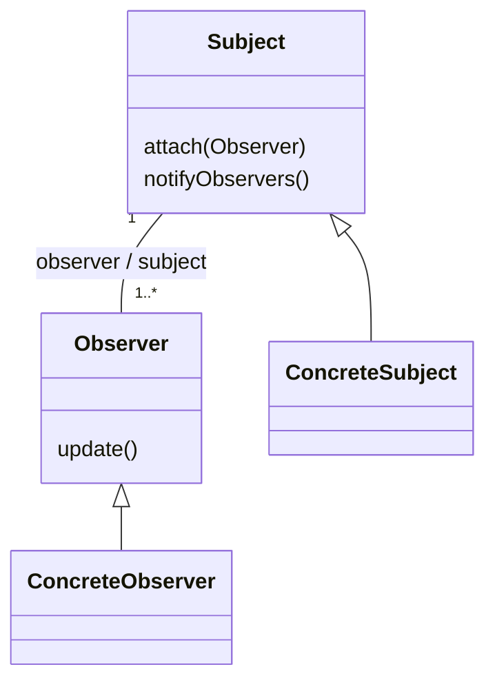
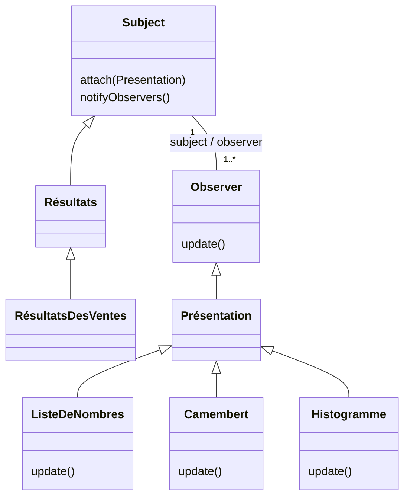

import Tabs from '@theme/Tabs';
import TabItem from '@theme/TabItem';

<Tabs>
<TabItem value="markdown" label="Markdown" default>

# Patrons de conception

*II2-ENSI*

## Contexte

- En conception, il n'est pas rare de faire face à un problème qui a déjà été rencontré et résolu par d'autres personnes.
- Réutiliser les solutions trouvées par ces autres personnes permet de gagner non seulement du temps mais aussi de la qualité.

→ Recherche de solutions standards

- Secret → Expérience
- Abstrait (Interface) / Concret (Class)

Pour rendre cette idée concrète, on a défini le concept de patron de conception.

## Qu'est-ce qu'un design pattern ? (patron de conception)

« Une solution à un problème dans un contexte. »

- **Contexte** = Ensemble de situations récurrentes auxquelles le pattern s'applique.
- **Problème** = Ensemble de buts et de contraintes qui se présentent dans le contexte.
- **Solution** = Schéma de conception canonique ou règle de conception qui peut être utilisé pour résoudre le problème. Micro-architecture réutilisable qui décrit les structures statiques et dynamiques des collaborations entre les éléments du design.

Les fondateurs : Le Gang of Four (GoF), composé de Erich Gamma, Richard Helm, Ralph Johnson et John Vlissides, qui ont écrit *Design Patterns: Elements of Reusable Object-Oriented Software* chez Addison Wesley en 1995.

## Design patterns

**Pourquoi les étudier ?**

- Catalogue de solutions.
- Bénéficier du savoir-faire d'experts dans des contextes éprouvés (fiables, robustes & connus).
- Faciliter la conception.

**Pourquoi les utiliser ?**

- Ne pas réinventer la roue.
- Faciliter la communication entre développeurs.
- Pour résoudre un problème.

**Objectifs (Finalités) / Avantages ?**

- Minimiser les interactions qu'il peut y avoir entre les différentes classes
- Diminuer le temps nécessaire au développement d'un logiciel
- Augmenter la qualité du résultat
- Faciliter la maintenance d'une application
- Faciliter la communication entre les différents développeurs

=> Ces patrons sont décrits sous une forme abstraite, sans s'attacher aux détails du problème à résoudre (solutions indépendantes des langages, solutions abstraites de haut niveau, souvent orientés vers le bon découpage en package — modularité, flexibilité, réutilisabilité — exprimé sous forme d'architecture reliant quelques classes très abstraites).

## Description des patrons

Une brève description qui répond aux questions suivantes :

- Que fait le design pattern ?
- Quels sont son objectif et sa justification ?
- Quel problème de conception particulier vise-t-il ?

Un scénario qui illustre un problème de conception et comment la structuration des classes et des objets dans ce pattern le résolvent. Le scénario devra aider à comprendre la description plus abstraite du pattern qui suit.

Les Design Patterns sont représentés par :

- **Nom** : qui permet de l'identifier clairement
- **Problématique** : description du problème auquel il répond
- **Solution** : description de la solution souvent accompagnée d'un schéma UML — une représentation graphique des classes dans le pattern utilisant une notation comme UML, c.-à-d. les classes et/ou les objets qui participent au design pattern et leurs responsabilités : comment les participants collaborent pour tenir leurs responsabilités.
- **Conséquences** : les avantages et les inconvénients de cette solution (conséquences de l'application du pattern)
- **Autres** :
  - Exemples d'utilisation du pattern trouvés dans des systèmes réels.
  - Exemples d'implantation : portions de code qui illustrent comment vous pourriez implémenter ce pattern
  - Conseil d'implantation

## Classification des patterns

Les patterns de Gamma (3 catégories) :

- **Patterns de création** : Solutions permettant de créer des objets de façon flexible. (S'intéressent à la construction des objets : Comment organiser et déléguer la création dynamique d'instances ?)
- **Patterns structuraux** : Solutions permettant d'organiser l'agencement structurel d'un ensemble d'objets de façon à en faciliter l'accès et la maintenance — structure statique des collaborations. (Permettent d'organiser les classes d'une application : Comment composer classes et objets pour obtenir des structures plus complexes ? Travaillent essentiellement sur des aspects statiques, à « l'extérieur » des classes)
- **Patterns comportementaux** : Solutions permettant d'organiser les interactions d'un ensemble d'objets de façon efficace et facilement maintenable — structure dynamique des collaborations. (Expliquent comment organiser les objets pour qu'ils collaborent entre eux : Comment faire collaborer classes ou objets pour construire une partie de l'application et des traitements ? Travaillent essentiellement sur des aspects dynamiques, à « l'intérieur » des classes et parfois au niveau des instances)

Catalogue de patterns sur Internet :

- [http://sourcemaking.com/design_patterns](http://sourcemaking.com/design_patterns)
- [http://www.dofactory.com/Patterns/Patterns.aspx#list](http://www.dofactory.com/Patterns/Patterns.aspx#list)

## Classification des patterns

| But | Création | Structure | Comportement |
| --- | --- | --- | --- |
| **Classe** | Fabrication (Factory Method) | Adaptateur (Adapter (classe)) | Interprète (Interpreter), Patron de méthode (Template Method), Chain of Responsibility |
| **Objet** | Fabrique abstraite (Abstract Factory), Monteur (Builder), Prototype, Singleton | Adaptateur (Adapter (objet)), Pont (Bridge), Composite, Décorateur (Decorator), Façade (Facade), Poids mouche (Flyweight), Procuration (Proxy) | Command, Iterator, Médiateur (Mediator), Mémento (Memento), Observateur (Observer), Etat (State), Stratégie (Strategy), Visiteur (Visitor) |

## Patrons de création

- **Abstract Factory** : interface pour la création de familles d'objets sans spécifier les classes concrètes.
- **Builder** : séparation de la construction d'objets complexes de leur représentation afin qu'un même processus de construction puisse créer différentes représentations.
- **Factory Method** : définition d'une interface pour la création d'objets associés dans une classe dérivée.
- **Prototype** : spécification des types d'objet à créer en utilisant une instance prototype.
- **Singleton** : comment assurer l'unicité de l'instance d'une classe.

## Patrons de structure

- **Adapter** : traducteur adaptant l'interface d'une classe en une autre interface convenant aux attentes des classes clientes.
- **Bridge** : découplage de l'abstraction de l'implémentation pour faire varier les deux indépendamment.
- **Composite** : structure pour la construction d'agrégations récursives.
- **Decorator** : extension d'un objet de manière transparente.
- **Façade** : unification de plusieurs interfaces de sous-systèmes.
- **Flyweight** : partage efficace de plusieurs objets.
- **Proxy** : approximation d'un objet par un autre.

## Patrons de comportement

- **Chain of Responsibility** : délégation des requêtes à des responsables de services.
- **Command** : encapsulation de requêtes par des objets afin de permettre à un objet de traiter plusieurs types de requêtes.
- **Interpreter** : étant donné un langage, représentation de la grammaire le définissant pour l'interpréter.
- **Iterator** : parcours séquentiel de collections.
- **Mediator** : coordination d'interactions entre des objets associés.
- **Memento** : capture et restauration d'états d'objets.
- **Observer** : mise à jour automatique des dépendants d'un objet.
- **State** : permettre à un objet de modifier son comportement lorsque son état interne change.
- **Strategy** : abstraction pour sélectionner un algorithme parmi plusieurs.
- **Visitor** : représentation d'opérations devant être appliquées à des éléments d'une structure hétérogène d'objets.

## Exemple de design patterns de création

- **Nom** : Singleton
- **Problème** : Assurer qu'une classe ne dispose que d'une unique instance et fournir un moyen d'accès global à cette instance.
- **Solution** :
  - Le constructeur de la classe singleton doit être déclaré `Private`, pour interdire son instanciation depuis une autre classe
  - Déclarer une variable statique privée du type de la classe singleton, qui va être la seule instance de la classe
  - Déclarer une méthode statique publique, qui va retourner cette instance ; cette méthode représente le point d'accès global pour les classes externes afin d'obtenir une instance de la classe singleton

<!-- TODO: unclear in source, verify against original PDF page 452 — this slide's description of the constructor/variable/method steps was extracted with scrambled word order (multi-column slide OCR artifact); reproduced above as a best-effort reconstruction, verify against original page image. -->

`getInstance()` vérifie :

- si `uniqueInstance` est nulle. Si oui, il crée une instance, enregistre le pointeur vers cette instance dans `uniqueInstance` et retourne le contenu de `uniqueInstance`.
- Si une instance existe déjà, il retourne le contenu de `uniqueInstance`.

## Exemple d'implémentation

<!-- TODO: unclear in source, verify against original PDF page 453 — this slide is a diagram/screenshot with no extractable OCR text beyond the title. -->

## Exemple

Ballon de foot pendant un match. Après application du patron de conception Singleton :

```java
public class Ballon {
    private float volume;
    private Equipe eq_posseuse;
    private static Ballon Instance;

    private Ballon() { } // constructeur privé

    public static Ballon GetInstance() {
        if (Instance == null) // instance pas encore créée
            Instance = new Ballon(); // créer une instance
        return Instance;
    }
    // ...les autres méthodes de Ballon …
}
```

## Autres exemples

- Gestion centralisée d'une ressource : votre système a besoin d'un seul gestionnaire de fenêtre, un seul spool d'impression, un seul point d'accès vers un moteur de base de données, etc.
- Classes qui ne devraient avoir qu'une seule instance à la fois :
  - Fenêtre principale d'une application
  - Générateur de nombre aléatoire (random number generator)
  - Etc.

## Les patrons de création : Factory Method pattern

- **Nom** : Factory Method pattern / Patron Fabrique
- **Problème** : Le patron de conception Factory Method intervient généralement lorsqu'il y a un besoin de créer des objets, mais le type exact de ces objets peut varier en fonction du contexte ou des besoins de l'application. Lorsque le code client dépend directement des classes concrètes pour créer des objets, cela peut entraîner plusieurs problèmes :
  1. **Couplage fort** : Le code client est directement lié aux classes concrètes, ce qui rend le système moins flexible. Si vous souhaitez ajouter un nouveau type d'objet ou modifier la manière dont les objets sont créés, vous devez modifier le code client.
  2. **Difficulté d'extension** : L'ajout de nouveaux types d'objets nécessite des modifications directes dans le code client, violant ainsi le principe ouvert/fermé (Open/Closed Principle). L'idéal est de pouvoir étendre le système sans avoir à modifier le code existant.
  3. **Manque de personnalisation** : Si des parties spécifiques de l'application ou des clients ont besoin de personnaliser le processus de création d'objets, cela peut être difficile à réaliser sans introduire un niveau élevé de complexité et de couplage.
- **Solution** : Le patron de conception Factory Method résout ces problèmes en introduisant une interface commune (parfois une classe abstraite) pour la création d'objets. Voici comment le Factory Method Pattern adresse ces problèmes :
  1. **Définition d'une interface commune** : La classe créatrice (Creator) définit une interface commune (méthode abstraite ou interface) pour la création d'objets. Cette interface permet de créer un objet sans spécifier explicitement sa classe concrète.
  2. **Implémentation dans les sous-classes** : Les sous-classes (ConcreteCreators) fournissent des implémentations concrètes de la méthode de création. Chaque sous-classe est responsable de créer un type spécifique d'objet.
  3. **Décision retardée** : La décision sur le type d'objet à créer est retardée au moment de l'exécution. Les sous-classes déterminent le type d'objet en fournissant leur propre implémentation de la méthode de création.
  4. **Extension facile** : L'ajout de nouveaux types d'objets se fait en introduisant de nouvelles sous-classes sans modifier le code client existant. Cela permet d'étendre le système sans violer le principe ouvert/fermé.
  5. **Personnalisation dans les sous-classes** : Les sous-classes peuvent personnaliser le processus de création en fournissant leur propre logique dans la méthode de création. Cela permet une personnalisation spécifique au type d'objet sans affecter les autres parties du système.

## Les patrons de création : Factory Method pattern

**But** :

- Définition d'une interface pour l'instanciation d'objets
- L'instanciation est faite par les sous-classes
- les sous-classes (classes dérivées) décident des classes à instancier
- Définition d'un constructeur "virtuel"

*Source : [https://refactoring.guru/design-patterns/factory-method](https://refactoring.guru/design-patterns/factory-method)*

Imaginons que nous développons une simulation de jeu de football où différents types de joueurs peuvent être créés, tels que les attaquants, les milieux de terrain et les défenseurs. Chaque type de joueur doit être créé de manière différente, car ils ont des attributs et des comportements spécifiques.

Dans cet exemple, `PlayerCreator` est l'interface commune pour les créateurs de joueurs, et chaque sous-classe (`StrikerCreator`, `MidfielderCreator`, `DefenderCreator`) fournit une implémentation spécifique de la méthode `create_player` pour créer un type particulier de joueur.

## Les patrons de création : Factory Method pattern — code

```python
# Interface commune pour les créateurs de joueurs
class PlayerCreator:
    def create_player(self):
        pass

# Implémentation concrète de créateur pour l'attaquant
class StrikerCreator(PlayerCreator):
    def create_player(self):
        return Striker()

# Implémentation concrète de créateur pour le milieu de terrain
class MidfielderCreator(PlayerCreator):
    def create_player(self):
        return Midfielder()

# Implémentation concrète de créateur pour le défenseur
class DefenderCreator(PlayerCreator):
    def create_player(self):
        return Defender()

# Interface commune pour les produits (joueurs)
class Player:
    def perform_action(self):
        pass
```

## Les patrons de création : Factory Method pattern — code (suite)

```python
# Implémentation concrète de l'attaquant
class Striker(Player):
    def perform_action(self):
        return "Shoots and scores!"

# Implémentation concrète du milieu de terrain
class Midfielder(Player):
    def perform_action(self):
        return "Passes the ball to a teammate."

# Implémentation concrète du défenseur
class Defender(Player):
    def perform_action(self):
        return "Blocks the opponent's attack."

# Fonction client qui utilise le Factory Method
def select_and_perform_action(creator):
    player = creator.create_player()
    print(player.perform_action())

# Utilisation du Factory Method
striker_creator = StrikerCreator()
midfielder_creator = MidfielderCreator()
defender_creator = DefenderCreator()

select_and_perform_action(striker_creator)     # Affiche : "Shoots and scores!"
select_and_perform_action(midfielder_creator)  # Affiche : "Passes the ball to a teammate."
select_and_perform_action(defender_creator)    # Affiche : "Blocks the opponent's attack."
```

`PlayerCreator` est l'interface commune pour les créateurs de joueurs, et chaque sous-classe (`StrikerCreator`, `MidfielderCreator`, `DefenderCreator`) fournit une implémentation spécifique de la méthode `create_player` pour créer un type particulier de joueur. La fonction client `select_and_perform_action` utilise le Factory Method pour créer un joueur en fonction du type spécifique sélectionné (attaquant, milieu de terrain, défenseur) et affiche ensuite l'action spécifique du joueur. Cela permet de créer des joueurs sans avoir à connaître les détails spécifiques de leur création.

## Les patrons de création : Factory Method pattern — autre exemple

*Source : [https://refactoring.guru/design-patterns/factory-method](https://refactoring.guru/design-patterns/factory-method)*

<!-- TODO: unclear in source, verify against original PDF page 460 — this slide is a diagram/screenshot with no extractable OCR text beyond "Autre exemple". -->

## Exemple de design patterns structurels — Composite

- **Nom** : Composite
- **Problème** : établir des structures arborescentes entre des objets et les traiter uniformément
- **Solution** : Organiser les objets en des structures arborescentes pour représenter des hiérarchies composant/composé pour permettre aux clients de traiter de la même façon les objets individuels et les combinaisons de ceux-ci. => Avec une structure composite, nous pouvons appliquer les mêmes opérations aux composites et aux composants.
- **Conséquences** :
  - hiérarchies de classes dans lesquelles l'ajout de nouveaux composants est simple : simplification du client qui n'a pas à se préoccuper de l'objet accédé
  - MAIS il est difficile de restreindre et de vérifier le type des composants
- **Exemples** :
  - `java.awt.Component`
  - `java.awt.Container`

## Participants

- **Client** : Manipule les objets à travers l'interface `Component` : exécute les mêmes opérations sur tous les composants qu'ils soient simples (`Feuille`) ou composés (`Composite`)
- **Component** :
  - Déclare l'interface des objets faisant partie du composite.
  - Implémente le comportement par défaut de l'interface partagée par toutes les classes
  - Déclare une interface pour accéder et gérer les fils
  - Définit une interface pour accéder au père dans la structure récursive et l'implémente le cas échéant (optionnel)
- **Leaf** :
  - Représente les feuilles du composite.
  - Une feuille n'a pas de fils.
  - Définit le comportement des objets primitifs du composite.
- **Composite** :
  - Définit le comportement des composantes qui ont des fils.
  - Emmagasine les fils.
  - Implémente les méthodes liées aux fils de l'interface `Component`.

Exemple : Éléments de dessin.

## Exemple de design patterns de comportement — Observer

- **Nom** : Observer
- **Problème** : Il est parfois extrêmement utile qu'un objet puisse suivre en continu l'état d'un autre objet. Mais c'est en général à l'objet observé de faire tout le travail consistant à prévenir ceux qui sont intéressés par son changement d'état. Par ailleurs, plus il y a d'observateurs, plus l'objet observé se trouve fortement couplé. On veut donc assurer la cohérence entre des classes coopérant entre elles tout en maintenant leur indépendance.
- **Solution** : Définir une dépendance 1-n entre un objet o et d'autres objets : si l'objet o change d'état, tous les objets qui en dépendent en sont informés.

## Observer

- Généralisation du savoir-faire de l'Observer dans une classe abstraite.
- Fournir à l'observé (`Subject`) une classe de gestion des Observers concrets.
- Permettre au sujet d'envoyer un message générique de notification de son changement d'état à tous les Observers.
- Définir une interface Sujet pour l'objet principal
- Définir une interface pour les objets observateurs
- Définir une méthode `update` pour les observateurs qui sera appelée lors de changements du sujet
- Définir un protocole pour que les observateurs puissent s'enregistrer auprès du sujet
- S'assurer que le sujet appelle `update()` lors de changements
- Chaque objet `ConcreteSubject` peut être associé à plusieurs objets `ConcreteObserver`. Quand il change d'état, son opération "notify" lance l'opération "update" sur tous ses objets associés qui se mettent alors à jour.

*Le Design Pattern Observer — Structure statique*



## Participants

- **Le Sujet** :
  - Garde une trace de ses observateurs
  - Propose une interface pour ajouter ou enlever des observateurs
- **L'Observateur** :
  - Définit une interface pour la notification de mises à jour
- **Le sujet concret** :
  - C'est l'objet observé
  - Enregistre son état intéressant les observateurs
  - Envoie une notification à ces observateurs quand il change d'état
- **L'Observateur concret** :
  - Il observe l'objet concret
  - Il stocke l'état qui doit rester consistant avec celui de l'objet observé
  - Il implémente l'interface de mise à jour permettant à son état de rester consistant avec celui de l'objet observé

*Le Design Pattern Observer — Structure dynamique*

## Exemple

Répercuter les changements de l'état d'un objet vers un ou plusieurs autres objets (ex. : IHM, surveillance de données).



Les résultats peuvent être affichés de trois manières différentes. Lorsqu'un objet `Résultats` est modifié, il en notifie ses objets associés `Présentation` qui se mettent à jour.

## Observer — Java

<!-- TODO: unclear in source, verify against original PDF pages 468-469 — this Java code sample was extracted with individual letters separated by spaces throughout (a PDF text-extraction artifact from a monospaced/kerned code block, e.g. "c la s s c la s s P r in c ip al e"). The code below is a best-effort reconstruction with the letter-spacing removed to restore readable Java; the logic (Observer pattern applied to Resultats/Presentation classes) matches the surrounding slide description, but exact original formatting/whitespace could not be recovered and should be verified against the original PDF page images. -->

```java
class Principale {
    public static void main(String args[]) {
        Resultats res = (Resultats) new ResultatsDesVentes();
        ListeDeNombres p1 = new ListeDeNombres(res);
        Camembert p2 = new Camembert(res);
        Histogramme p3 = new Histogramme(res);
    } // fin de la methode main
} // fin de class Principale

abstract class Presentation {
    Resultats sujet;

    public Presentation(Resultats r) {
        r.attach(this);
        sujet = r;
    } // fin du constructeur

    public void update(String s, Resultats sujet) {
        // ...
    } // fin de la methode update
} // fin de la classe Presentation

class ListeDeNombres extends Presentation {
    public ListeDeNombres(Resultats r) {
        super(r);
    } // fin du constructeur

    void update(String s, Resultats r) {
        Vector chiffres = r.chiffresMois(s);
        /* affichage de la liste des chiffres reçus dans le vecteur chiffres */
        .....
    } // fin de la methode update
} // fin de la classe ListeDeNombres

abstract class Resultats {
    private Vector observers = new Vector();

    public void attach(Presentation s) {
        observers.addElement(s);
    } // fin de la methode attach

    public void notifyObservers(String s) {
        for (int i = 0; i < observers.size(); i++) {
            observers.elementAt(i).update(s, this);
        } // fin du for
    } // fin de la methode notifyObservers
} // fin de la classe Resultats

class ResultatsDesVentes extends Resultats implements ItemListener {
    public ResultatsDesVentes() {
        /* affiche une fenetre avec un radio bouton par mois de l'annee */
        .....
    } // fin du constructeur

    public void itemStateChanged(ItemEvent e) {
        if (e.getStateChanged() == ItemEvent.SELECTED) {
            JRadioButton selection = (JRadioButton) e.getSource();
            notifyObservers(selection.paramString());
        }
    } // fin de la methode itemStateChanged

    public Vector chiffresMois(String s) {
        Vector chiffres = new Vector();
        /* recuperation des chiffres du mois indiqué par le parametre s */
        .....
        return chiffres;
    } // fin de la methode chiffresMois
} // fin de la classe ResultatsDesVentes
```

## Conclusion

- Capitalisation de l'expérience
- Un niveau d'abstraction plus élevé => Meilleure qualité
- Lisibilité et maintenance plus aisées
- Forcer l'utilisation d'un patron dans un logiciel est une mauvaise pratique de développement
- Nécessite un apprentissage et de l'expérience (difficulté à identifier quand un pattern s'applique, les patterns sont nombreux)
- Au-delà du GoF : les patrons GRASP, Object Pool, etc.

</TabItem>
<TabItem value="pdf" label="PDF">

<PdfViewer file="/pdfs/acoo-patrons-de-conception.pdf" />

</TabItem>
</Tabs>
