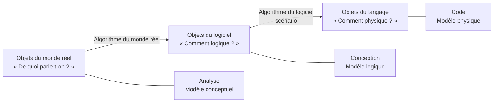
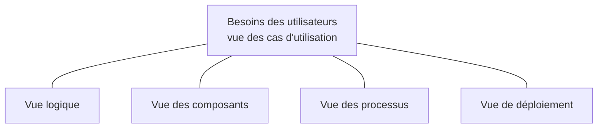
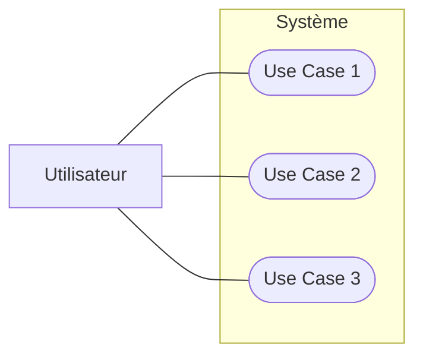
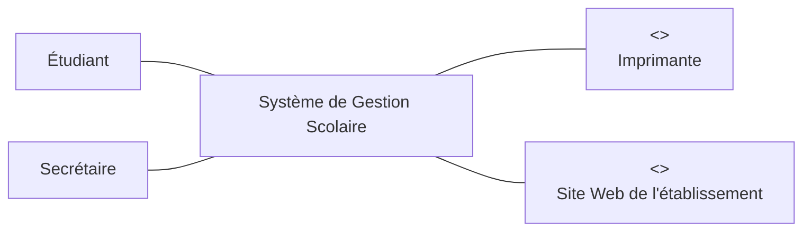
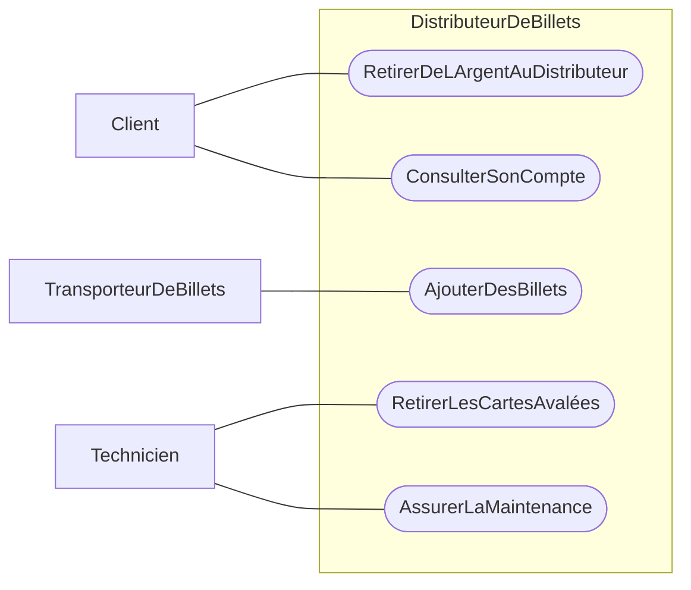
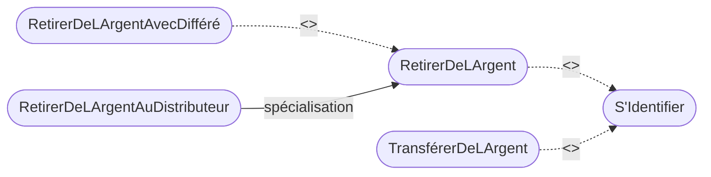
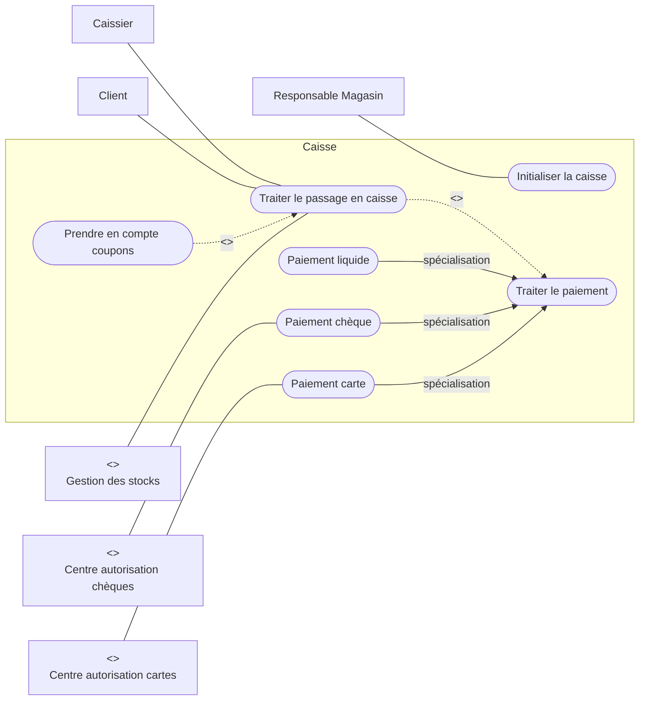

import Tabs from '@theme/Tabs';
import TabItem from '@theme/TabItem';

<Tabs>
<TabItem value="markdown" label="Markdown" default>

# Les diagrammes d'analyse — Cas d'utilisation

*ENSI — II2 — ACOO*

## Introduction

- Objets du monde réel — « De quoi parle-t-on ? » → **Analyse** → modèle conceptuel.
- Algorithme du monde réel — « Comment 'logique' ? » → **Conception** → modèle logique → objets du logiciel.
- Algorithme du logiciel (scénario) — « Comment 'physique' ? » → **Code** → modèle physique → objets du langage.

Description d'un problème : **ANALYSE — QUOI ?** (Analyse Quoi-Faire ?). Description de la solution d'un problème : **CONCEPTION** (Conception Comment-Faire ?).



## Modélisation des besoins — perspectives d'un système

- Statique (ce que le système EST)
- Fonctionnel (ce que le système FAIT)
- Dynamique (comment le système EVOLUE)

## Motivation

Pourquoi les cas d'utilisation :

- Un système est conçu pour les utilisateurs :
  - ils savent ce que le système doit faire mais pas comment le faire ;
  - ils connaissent l'aspect fonctionnel du système.
- Le système doit donc être bâti à partir des descriptions des utilisateurs.

La vue des cas d'utilisation exprime les besoins des utilisateurs et motive les vues logique, des composants, des processus et de déploiement.



## Diagramme des cas d'utilisation

Un diagramme de cas d'utilisation est modélisé par :

- des acteurs qui utilisent le système ;
- les « services » offerts par le système.

**Intérêt des cas d'utilisation** :

- les use cases permettent de délimiter le système (les acteurs sont à l'extérieur du système) ;
- ils permettent de lever les ambiguïtés du cahier des charges à l'aide d'un formalisme graphique ;
- les use cases peuvent servir à concevoir les tests puisqu'ils représentent les utilisations nominales du système ;
- ils initient le travail d'équipe.

## L'utilisateur et le système

Un utilisateur interagit avec un `Système` qui offre des services via plusieurs cas d'utilisation (`Use Case 1`, `Use Case 2`, `Use Case 3`).



Le diagramme de cas d'utilisation répond aux questions suivantes :

- Quelles sont les tâches principales réalisées par les acteurs (entités matérielles ou logicielles externes au logiciel qui entrent en interaction) ?
- Les informations manipulées par les acteurs ?
- Les informations manipulées par le logiciel ?
- Le diagramme contient les acteurs, les cas d'utilisation (services) et les applications.

## Diagramme de cas d'utilisation — description

Un diagramme de cas d'utilisation :

- décrit le système, les acteurs, les cas d'utilisation ;
- contient des descriptions textuelles.

## Principaux concepts des diagrammes de cas d'utilisation

- Acteurs
- Système
- Cas d'utilisation
- Relations (entre cas d'utilisation, entre acteurs, entre acteurs et cas d'utilisation)

## Le système

- Le système est un ensemble de cas d'utilisation.
- Le système ne comprend pas les acteurs.
- Le système est modélisé par un ensemble de cas d'utilisation, vu comme une boîte noire.
- Le système contient : les cas d'utilisation, mais pas les acteurs.

Un modèle de cas d'utilisation permet de définir :

- les fonctions essentielles du système,
- les limites du système,
- le système par rapport à son environnement,
- délimiter le cadre du projet !

## Acteurs

Un **Acteur** = élément externe qui interagit avec le système (prend des décisions, des initiatives — il est « actif »), c'est un rôle qu'un « utilisateur » joue par rapport au système.

Ex. : un client, un guichetier, un responsable maintenance, …

Un acteur est représenté par :

- un petit bonhomme (« stick man ») avec son nom dessous, ou
- un rectangle contenant le mot-clé `<<actor>>` avec son nom dessous,
- ou par un mélange de ces 2 représentations (acteur humain / acteur non humain).

Pour les identifier : quelles sont les entités externes au système qui interagissent directement avec le système ?

## Utilité des acteurs

La définition d'acteurs permet :

- d'identifier les cas d'utilisation (ex : que peut faire un guichetier ? un client ? le directeur ?)
- de voir le système de différents points de vue
- de déterminer des droits d'accès par type d'acteur
- de fixer des ordres de priorité entre acteurs
- ...

## Acteurs vs. utilisateurs

Ne pas confondre la notion d'Acteur et de personne utilisant le système :

- Une même personne physique peut jouer le rôle de plusieurs acteurs. Ex. : Maurice est un Chef d'agence et est aussi un client de la banque.
- Plusieurs personnes peuvent jouer un même rôle. Ex. : Paul et Pierre sont deux clients.
- Un acteur n'est pas forcément un être humain, ex : un distributeur de billets peut être vu comme un acteur.

## Le recensement des acteurs

**Comment ?**

- Par un dialogue avec le client et les utilisateurs ;
- en repérant les frontières du système.

**Qui sont-ils ?**

- Des utilisateurs humains : utilisateurs du logiciel à travers son interface graphique, par exemple ;
- des périphériques manipulés par le système (imprimantes, capteurs, …) ;
- des logiciels déjà disponibles à intégrer dans le projet, qui communiquent avec le système grâce à une interface logicielle (API, ODBC, …) ;
- attention à ne pas oublier les acteurs qui administrent le système ;
- un même utilisateur peut avoir plusieurs rôles et être plusieurs acteurs.

Exemple : `Etudiant`, `Secrétaire` interagissent avec un `Système de Gestion Scolaire`, qui interagit avec `<<acteur>> Imprimante` et `<<acteur>> Site Web de l'établissement`.



## Différents types d'acteurs

- Utilisateurs principaux, ex : client, guichetier
- Utilisateurs secondaires, ex : contrôleur, directeur, ingénieur système, administrateur...
- Périphériques externes, ex : un capteur, une horloge externe, …
- Systèmes externes, ex : systèmes bancaires

**Exemple** (`DistributeurDeBillet` — « Système informatique de la banque ») : `Client` — `RetirerDeLArgentAuDistributeur`, `ConsulterSonCompte` ; `TransporteurDeBillets` — `AjouterDesBillets`, `RetirerLesCartesAvalées` ; `Technicien` — `AssurerLaMaintenance`.



## Acteurs principaux et secondaires

Du point de vue système, on distingue deux types :

- **Acteur principal d'un CU** : celui pour qui le CU produit un résultat observable. Placé à gauche des CU. Rôle indiqué éventuellement sur l'association côté acteur : `<<principal>>` (valeur par défaut).
- **Acteur secondaire d'un CU** : celui pour qui le CU ne produit pas un résultat observable par l'utilisateur. Souvent sollicité pour des informations complémentaires. Peut uniquement consulter ou informer le système (pas d'objectif à part entière de la part de l'acteur secondaire). Placé à droite des CU. Rôle indiqué éventuellement sur l'association côté acteur : `<<secondaire>>`. Ex. : système d'authentification appelé par le distributeur de billets.

## Cas d'utilisation (CU)

- Une manière d'utiliser le système.
- Une suite d'interactions entre un acteur et le système.
- Correspond à une fonction du système visible par l'acteur.
- Doit être utile en soi.
- Permet à un acteur d'atteindre un but.
- Regroupe un ensemble de scénarii correspondant à un même but.

## Cas d'utilisation : définition

« Description d'un ensemble de séquences d'actions, comportant éventuellement des variantes, que le système exécute pour produire un résultat tangible et qui a de la valeur pour l'utilisateur. »

Exemples : `Payer cotisation membre`, `Consulter catalogue`, `Enregistrer nouvel utilisateur`, `Emprunter un livre`, `Réserver un livre`.

## Cas d'utilisation

Les cas d'utilisation :

- Permettent de modéliser les attentes (besoins) des utilisateurs.
- Représentent les fonctionnalités du système.
- Suite d'événements, initiée par des acteurs, qui correspond à une utilisation particulière du système.
- L'image d'une fonctionnalité du système, déclenchée en réponse à la stimulation d'un acteur externe.

Un cas d'utilisation est représenté par une ellipse en trait plein, contenant son nom.

## Relations entre éléments de base

- Relations acteurs ↔ cas d'utilisation ?
- Relations acteurs ↔ acteurs ?
- Relations cas d'utilisation ↔ cas d'utilisation ?

## Relation acteur - cas d'utilisation

- Point de vue besoin : représente la possibilité d'atteindre un but.
- Point de vue système : représente un canal de communication.
  - Échange de messages, potentiellement dans les deux sens.
  - Protocole particulier concernant le cas d'utilisation considéré.

## Une relation de communication

Association acteur/CU vue comme un canal de communication : décrit le comportement du système vu de l'extérieur, échange de messages.

Exemple : `Client` ↔ `RetirerDeLArgentAuDistributeur`.

## Diagramme de cas d'utilisation (exemple distributeur)

`Client` — `RetirerDeLArgentAuDistributeur`, `ConsulterSonCompte` ; `TransporteurDeBillets` — `AjouterDesBillets`, `RetirerLesCartesAvalées` ; `Technicien` — `AssurerLaMaintenance` (sur `DistributeurDeBillets`).

## Relation de communication acteur-acteur

Les communications externes ne sont pas modélisées : UML se concentre sur la description du système et de ses interactions avec l'extérieur.

Exemple : `Client` — `ConsulterSonCompte`, `RetirerDeLArgentAuDistributeur` (sur `Système Bancaire`) ; `Guichetier` — `RetirerDeLArgentParChèque`.

## Relation acteur - acteur : généralisation

La seule relation entre acteurs est la relation de généralisation.

Exemple : `GuichetierEnChef` (spécialisation de `Guichetier`) — `CréerUnCompte`, `AnnulerUnCompte`, `RetirerDeLArgentDUnCompte` ; `Guichetier` — `CréerUnCompte`, `FermerUnCompte`.

Un acteur peut être une spécialisation d'un autre acteur déjà défini. Dans ce cas, on utilise la relation de généralisation/spécialisation (`Acteur général` → `Acteur spécialisé`).

```mermaid
flowchart BT
    General[Guichetier] <|-- Specialise[GuichetierEnChef]
```

## Relations cas d'utilisation - cas d'utilisation

UML définit trois types de relations standardisées entre cas d'utilisation :

- Une relation d'inclusion, formalisée par la dépendance `<<include>>`
- Une relation d'extension, formalisée par la dépendance `<<extend>>`
- Une relation de généralisation/spécialisation

Les trois types de relations sont :

- l'inclusion (`<<include>>`) quand le cas source comprend le cas destination ;
- l'extension (`<<extend>>`) quand le cas source ajoute optionnellement son comportement au cas destination ;
- la généralisation quand le cas enfant est une spécialisation du cas parent.

**Exemple de relations entre cas d'utilisation** (inclusion, extension et spécialisation) : `RetirerDeLArgent` et `TransférerDeLArgent` `<<include>>` `S'Identifier` ; `RetirerDeLArgentAvecDifféré` `<<extend>>` `RetirerDeLArgent` ; `RetirerDeLArgentAuDistributeur` spécialise `RetirerDeLArgent`.



## Relation d'inclusion

A inclut B : le cas A inclut obligatoirement le comportement défini par le cas B ; permet de factoriser des fonctionnalités partagées. Le cas d'utilisation pointé par la flèche (B) est une sous-partie de l'autre cas d'utilisation (A).

Exemple : les cas d'utilisation `Déposer de l'argent`, `Retirer de l'argent`, `Effectuer des virements` et `Consulter solde` incorporent de façon explicite le cas d'utilisation `S'authentifier`, à un endroit spécifié dans leurs enchaînements (chacun `<<include>>` `S'authentifier`).

**Remarques** :

- La relation `include` n'a pour seul objectif que de factoriser une partie de la description d'un cas d'utilisation qui serait commune à d'autres cas d'utilisation.
- Le cas d'utilisation inclus dans les autres cas d'utilisation n'est pas à proprement parler un vrai cas d'utilisation car il n'a pas d'acteur déclencheur ou receveur d'évènement. Il est juste un artifice pour faire de la réutilisation d'une portion de texte.

## Relation d'extension

Le CU source (B) ajoute, sous certaines conditions, son comportement au CU destination (A). En d'autres termes, le CU B peut être appelé au cours de l'exécution du CU A. Le comportement ajouté s'insère au niveau d'un point d'extension défini dans le CU destination.

- Le cas d'utilisation de destination peut fonctionner tout seul, mais il peut également être complété par un autre cas d'utilisation, sous certaines conditions.
- On utilise principalement cette relation pour séparer le comportement optionnel (les variantes) du comportement obligatoire.

Exemple : au moment de l'authentification, il se peut que le guichet retienne la carte — `Retenir la carte` `<<extend>>` `S'authentifier`.

## Relations d'inclusion vs d'extension

- La relation `extend` montre une possibilité d'exécution d'interactions qui augmenteront les fonctionnalités du cas étendu, mais de façon optionnelle, non obligatoire.
- La relation `include` suppose une obligation d'exécution des interactions dans le cas de base.

## Relation d'héritage

Il peut également exister une relation d'héritage entre cas d'utilisation. Cette relation exprime une relation de spécialisation/généralisation au sens classique.

**Exemple** : dans un système d'agence de voyage, un acteur `Touriste` peut participer à un cas d'utilisation de base qui est `Réserver voyage`, qui suppose par exemple des interactions basiques au comptoir de l'agence. Une réservation peut être réalisée par téléphone ou par Internet.

- On voit qu'il ne s'agit pas d'une relation `extend`, car la réservation par Internet n'étend pas les interactions ni les fonctionnalités du cas d'utilisation `Réserver voyage`.
- Les deux cas d'utilisation `Réservation voyage` et `Réserver voyage par Internet` sont liés : la réservation par Internet est un cas particulier de réservation.
- De façon générale en objet, une situation de cas particulier se traduit par une relation de généralisation/spécialisation.

Diagramme : `Réserver voyage` généralise `Réserver voyage par téléphone` et `Réserver voyage par Internet`.

## Relations entre cas d'utilisation — résumé

Les cas peuvent être structurés par des relations :

- A inclut B : le cas A inclut obligatoirement le comportement défini par le cas B ; permet de factoriser des fonctionnalités partagées.
- A étend B : le cas A est une extension optionnelle du cas B à un certain point de son exécution.
- A généralise B : le cas B est un cas particulier du cas A.

**Exemple** : un client peut effectuer un retrait bancaire. Le retrait peut être effectué sur place ou par Internet. Le client doit être identifié (en fournissant son code d'accès) pour effectuer un retrait, mais si le montant dépasse 500DT, la vérification du solde de son compte est réalisée.

## Description des cas d'utilisation

- Le diagramme de cas d'utilisation décrit les grandes fonctions d'un système du point de vue des acteurs.
- Mais il n'expose pas de façon détaillée le dialogue entre les acteurs et les cas d'utilisation.
- → nécessité de décrire ce dialogue.

## Description de l'interaction

Exemple : `Client` — `RetirerDeLArgentAuDistributeur`. Description du dialogue :

- via une description textuelle, ou
- via des diagrammes de séquences « systèmes » (voir plus tard dans le cours).

Exemple de dialogue : le distributeur affiche un message d'accueil demandant à un client d'introduire sa carte bancaire ; le client introduit sa carte bancaire ; le distributeur demande le mot de passe de la carte ; ...

## L'élaboration des cas d'utilisation

Les use cases peuvent être décrits sous la forme de flots d'événements de différentes façons.

### Scénario

- Pour décrire ou valider un CU.
- Un scénario est un exemple : une manière particulière d'utiliser le système… par un acteur particulier… dans un contexte particulier.
- cas d'utilisation = ensemble de scénarios ; scénario = une exécution particulière d'un CU.

**Exemples de scénarios (appel téléphonique)** :

- Scénario : le numéro appelé est occupé — l'appelant décroche le téléphone, commence à composer le numéro, termine de composer le numéro, la tonalité « occupée » commence à sonner, l'appelant raccroche le téléphone.
- Scénario : le numéro appelé n'est pas occupé — l'appelant décroche le téléphone, commence à taper le numéro, termine de taper le numéro, le téléphone commence à sonner, l'appelé décroche, la conversation se déroule, l'appelé raccroche le téléphone.

L'élaboration des cas d'utilisation : un cas d'utilisation est généralement décrit par plusieurs scénarios :

- Regroupe une famille de scénarios d'utilisation (cas nominal, alternatives, exceptions).
- Est une abstraction du dialogue système/utilisateurs.
- Quand un acteur interagit avec le système : le cas d'utilisation instancie un scénario.

**Exemple de scénario (`RetirerDeLArgentAuDistributeur`)** : Paul insère sa carte dans le distributeur ; le système accepte la carte et lit le numéro de compte ; le système demande le code ; Paul tape « 1234 » ; le système indique que ce n'est pas le bon code ; le système affiche un message et propose de recommencer ; Paul tape « 6222 » ; le système affiche que le code est correct ; le système demande le montant du retrait ; Paul tape 5000 Euros ; le système vérifie s'il y a assez d'argent sur le compte ; ...

## Description textuelle des cas d'utilisation

Il n'existe pas de norme (UML) établie pour la description textuelle des cas d'utilisation. Généralement, on y trouve pour chaque cas d'utilisation :

- son nom,
- un bref résumé de son déroulement,
- le contexte dans lequel il s'applique,
- les acteurs qu'il met en jeu,
- une description détaillée :
  - le déroulement nominal de toutes les interactions,
  - les cas nécessitant des traitements d'exception,
  - les effets du déroulement sur l'ensemble du système,
  - des contraintes,
  - etc.

**Gabarit de description** : sommaire d'identification (titre, type, résumé, acteurs, date de création/mise à jour, version, auteur(s)) ; description des enchaînements (pré-conditions, scénario nominal, enchaînements alternatifs/exceptions, contraintes).

| Sommaire d'identification | Description des enchaînements |
|---|---|
| Titre, type, résumé, acteurs | Préconditions, scénario nominal, enchaînements alternatifs / exceptions, contraintes |
| Date de création et de mise à jour, version, auteur(s) | Étapes numérotées du scénario |

## Exemple de description détaillée d'un CU (`RetirerDeLArgentAuDistributeur`)

- **Précondition** : le distributeur contient des billets, il est en attente d'une opération, il n'est ni en panne, ni en maintenance.
- **Début** : lorsqu'un client introduit sa carte bancaire dans le distributeur.
- **Fin** : lorsque la carte bancaire et les billets sont sortis.
- **Postcondition** : si de l'argent a pu être retiré, la somme d'argent sur le compte est égale à la somme d'argent qu'il y avait avant, moins le montant du retrait. Sinon, la somme d'argent sur le compte est la même qu'avant.

**Déroulement normal** :

1. Le client introduit sa carte bancaire.
2. Le système lit la carte et vérifie si la carte est valide.
3. Le système demande au client de taper son code.
4. Le client tape son code confidentiel.
5. Le système vérifie que le code correspond à la carte.
6. Le client choisit une opération de retrait.
7. Le système demande le montant à retirer.
   …

**Variantes** :

- (A) Carte invalide : au cours de l'étape (2), si la carte est jugée invalide, le système affiche un message d'erreur, rejette la carte et le cas d'utilisation se termine.
- (B) Code erroné : au cours de l'étape (5) ...

**Contraintes non fonctionnelles** :

- (A) Performance : le système doit réagir dans un délai inférieur à 4 secondes, quelle que soit l'action de l'utilisateur.
- (B) Résistance aux pannes : si une coupure de courant ou une autre défaillance survient au cours du cas d'utilisation, la transaction sera annulée, l'argent ne sera pas distribué. Le système doit pouvoir redémarrer automatiquement dans un état cohérent et sans intervention humaine.
- (C) Résistance à la charge : le système doit pouvoir gérer plus de 1000 retraits d'argent simultanément ...

## Exercice de cas d'utilisation : fonctionnement des caisses enregistreuses d'un supermarché

Un système simplifié de caisse enregistreuse de supermarché :

- Un client arrive à la caisse avec des articles à payer.
- Le caissier enregistre le numéro d'identification de chaque article, ainsi que la quantité si elle est supérieure à un.
- La caisse affiche le prix de chaque article et son libellé.
- Lorsque tous les achats sont enregistrés, le caissier signale la fin de la vente.
- La caisse affiche le total des achats.
- Le client choisit son mode de paiement :
  - Liquide : le caissier encaisse l'argent reçu, la caisse indique la monnaie à rendre au client.
  - Chèque : le caissier vérifie la solvabilité du client en transmettant une requête à un centre d'autorisation via la caisse.
  - Carte de crédit : un terminal bancaire fait partie de la caisse. Il transmet une demande d'autorisation en fonction du type de carte.
- La caisse enregistre la vente et imprime le ticket.
- Le caissier donne le ticket de caisse au client.
- Après saisie article, le client peut présenter des coupons de réduction.
- Lorsque le paiement est terminé, la caisse transmet les informations sur le nombre d'articles vendus au système de gestion des stocks.
- Tous les matins, le responsable du magasin initialise les caisses pour la journée.

### Diagramme de cas d'utilisation de la caisse

`Responsable Magasin` — `Initialiser la caisse` ; `Caissier` — `Traiter le passage en caisse` (`<<inclut>>` `Traiter le Paiement`, `<<étend>>` `Prendre en compte coupons`) ; `Client` ; acteurs secondaires : `<<Acteur>> Gestion des stocks`, `<<Acteur>> Centre autorisation cartes`, `<<Acteur>> Centre autorisation chèques` ; sous-cas de `Traiter le Paiement` : `Paiement Liquide`, `Paiement Chèque`, `Paiement Carte`.



### Description des cas d'utilisation « Caisse »

- **Titre** : Traiter le passage en caisse
- **Résumé** : un client arrive à une caisse avec des articles à acheter. Le caissier enregistre les achats et récupère le paiement. À la fin de l'opération, le client part avec les articles.
- **Acteurs** : Caissier (P), Client (S), Gestion des stocks (S)
- **Version** : 1 — **Auteur(s)** : Mr Foulen
- **Pré conditions** : la caisse est en service : un caissier y est connecté.
- **Scénario nominal** : représente le déroulement normal d'un cas d'utilisation, les différentes interactions utilisateur/système permettant l'exécution réussie du traitement.

**Description (suite)** :

1. Ce CU commence quand un client arrive à la caisse avec des articles à acheter.
2. Le caissier enregistre chaque article. S'il y a plus d'un exemplaire, il indique également la quantité.
3. La caisse détermine le prix de l'article en cours. La caisse affiche la description et le prix de l'article.
4. Après avoir enregistré tous les articles, le caissier indique que la vente est terminée.
5. La caisse calcule et affiche le montant total de la vente.
6. Le caissier annonce le montant total au client.
7. Le client choisit le type de paiement :
   a. En cas de paiement liquide …
   b. En cas de paiement par chèque …
   c. En cas de paiement par carte …
8. La caisse enregistre la vente et imprime le ticket.
9. Le caissier donne le ticket de caisse au client.

**Enchaînement alternatif** : quand l'enchaînement précisé par le scénario nominal ne peut pas se dérouler comme prévu, le cas d'utilisation converge tout de même.

Exemple : numéro d'identification d'un article inconnu — l'enchaînement démarre au point 2 du scénario nominal. 3. La caisse indique que le numéro d'identification de l'article est inconnu. L'article ne peut alors pas être pris en compte dans la vente en cours. Le scénario reprend au point 2.

**Enchaînement d'erreur** : quand l'enchaînement précisé par le scénario nominal ne peut pas se dérouler, le cas d'utilisation se termine par un échec.

Exemple : client ne pouvant payer (ou le centre d'autorisation refuse le paiement) — l'enchaînement démarre au point 6 du scénario nominal. 7. Le client ne peut pas payer le total avec aucun des moyens autorisés. 8. Le caissier annule l'ensemble de la vente et le cas d'utilisation se termine en échec : → la vente ne peut pas avoir lieu.

## Conclusion

Les cas d'utilisation sont une forme possible de documentation des besoins d'un système :

- une description textuelle peut suffire ;
- un maquettage simple représentant l'interface graphique d'un système est très utile.

Les cas d'utilisation décrivent le « quoi » d'un système mais pas le « comment ». Il y a en général peu de cas d'utilisation mais beaucoup de scénarios.

**Avantages** :

- Un formalisme simple : les concepts proposés sont faciles à comprendre et à utiliser.
- Les modélisations résultats (UC) sont faciles à comprendre, à lire et à interpréter.
- Un bon moyen de communication : client/concepteur et concepteur/concepteur.

**Limitations** :

- Subjectifs, dépendants de l'utilisateur : peuvent être peu précis, ne reflétant pas les besoins majeurs de l'utilisateur ou interprétés différemment.
- Pas formels : pas de vérification automatique possible ni de génération des autres diagrammes, …

</TabItem>
<TabItem value="pdf" label="PDF">

<PdfViewer file="/pdfs/acoo-use-case.pdf" />

</TabItem>
</Tabs>
