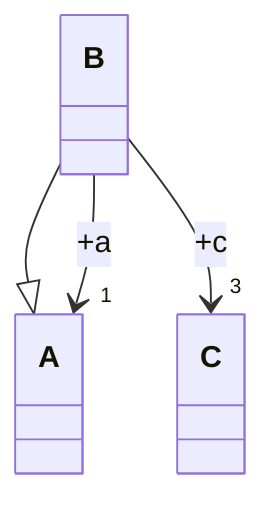
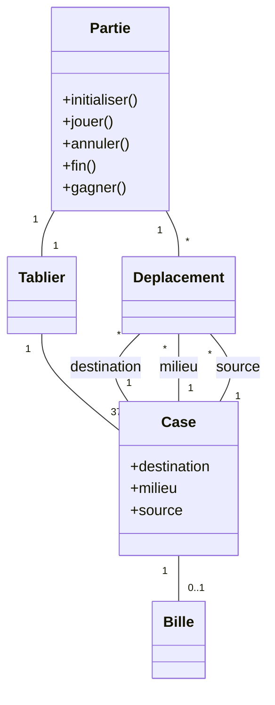

import Tabs from '@theme/Tabs';
import TabItem from '@theme/TabItem';

<Tabs>
<TabItem value="markdown" label="Markdown" default>

# Devoir Surveillé — Analyse et Conception Orientées Objets

*Université de La Manouba — École Nationale des Sciences de l'Informatique — A.U. : 2012-2013 — Niveau : II2 — Date : samedi 17 novembre 2012 — Durée : 2h — Documents non autorisés — Enseignants : Y. Jamoussi, I. Fliss, W. Chaker, M. Farhat*

*NB : Ne répondez pas à l'aveuglette. La précision, la consistance, la clarté seront appréciées.*

<!-- TODO: no correction attached to this source PDF (statement only, 4 pages). -->

## Exercice 1 : Questions de réflexion (5 pts)

1. Soit le diagramme de classes UML suivant :

   Un objet instance de B peut accéder à combien d'objets instances de A et à combien d'objets instances de C ? Justifier votre réponse.

2. Sachant que les contraintes conditionnent l'évolution d'un diagramme d'objets, indiquer pour chacune des associations ci-dessous s'il est cohérent ou pas d'avoir cette combinaison de contraintes. Si la réponse est « non », argumenter. Si la réponse est « oui », illustrer la possibilité d'évolution en donnant deux diagrammes d'objets correspondant à deux moments successifs de cette évolution.

   a. A `{not frozen}` `*` —— `*` `{frozen}` B

   b. A `1` —— `1` `{not unique, addOnly}` B

   c. A `{unique}` `1` —— `*` `{not unique, ordered}` B

## Exercice 2 : Analyse (5 pts)

Le dessin ci-dessous représente des figures (triangles, carrés ou cercles) emboîtées. Les triangles contiennent une ou plusieurs figures. Les carrés ne contiennent rien. Les cercles contiennent exactement une figure. Les figures possèdent des « côtés ». On dira que les cercles ont un seul côté, les triangles trois côtés et les carrés quatre côtés.

*(Le dessin source montre un grand triangle contenant un carré et un triangle plus petit ; ce petit triangle contient à son tour deux carrés et un cercle, ce cercle contenant lui-même un carré — voir le PDF source pour le dessin exact.)*

1. À partir du texte précédent, déterminer les classes du domaine et donner la partie du diagramme de classes modélisant seulement les généralisations (héritage) des classes.
2. Dessiner un diagramme d'objets correspondant au dessin sans dessiner les instances de la classe "Côté".
3. Dessiner un diagramme de classes correspondant à la description du dessin en question. Le diagramme comprendra les classes "Figure", "Cercle", "Carré", "Triangle" et "Côté" et des associations à déterminer. Essayer de promouvoir, autant de fois que possible, vos associations en composition ou à la limite des agrégations (en cas de retrait des figures emboîtées, n'oubliez pas de prendre en considération la spécificité du dessin).

## Exercice 3 : Conception (10 pts)

Le solitaire est un jeu de réflexion qui, comme l'indique son nom, se pratique seul. Dans ce jeu, le joueur fait une partie qui consiste à déplacer des billes placées initialement sur un tablier. Dans le cadre de cet exercice, un tablier a la forme d'un octogone régulier qui comporte 37 cases (figure 1 : tablier vide).

Chaque case comporte un trou qui peut contenir au maximum une bille. Il convient de mentionner que le tablier est formé de 7 lignes et de 7 colonnes. Chaque case est ainsi repérée par un couple (n° ligne, n° colonne) (n° ligne dans [1..7], n°colonne dans [1..7]).

*Remarque : certains couples (tq (1,1), (1,2)) ne correspondent pas à une case du tablier.*

À chaque déplacement, le joueur joue en déplaçant une bille sur le tablier et à condition de respecter les conditions suivantes :

- Une bille déplacée doit sauter sur une autre. La bille ne peut sauter que sur une bille adjacente (immédiatement voisine) qui est suivie d'une case vide. Auquel cas, la première bille « saute » par-dessus la seconde et rejoint la case vide. La seconde bille est alors retirée du tablier.
- Le saut ne peut se faire que sur l'horizontale ou sur la verticale et bien sûr à l'intérieur du tablier.

La partie se termine lorsqu'il ne reste plus de billes à déplacer. Ainsi, le joueur est déclaré :

- « Gagnant » quand il reste qu'une seule bille sur le tablier.
- « Perdant » quand il reste deux billes ou plus non adjacentes.

Gagner à ce jeu revient à résoudre un casse-tête assez compliqué. En effet, si un joueur fait un mauvais choix de déplacement, il risque de perdre ses chances de victoire. C'est pourquoi il est parfois utile de faire des retours en arrière pour annuler certains déplacements.

Lors de la conception du jeu solitaire, un développeur a proposé le diagramme de classes UML **incomplet** suivant (figure 2) :

**Travail à faire**

On se propose de comprendre et compléter la modélisation UML proposée par le développeur afin de concevoir en partie le jeu en question.

### Question 1

Élaborer deux diagrammes d'objets conformément au diagramme de classes proposé par le développeur relatifs aux 2 situations suivantes :

a) Un tablier reflétant une partie comportant initialement 3 billes (figure 3 : tablier avec 3 billes placées).
b) La terminaison de la partie susmentionnée dans le cas où le joueur gagne.

*Remarque : pour des raisons de clarté, on vous demande de représenter que les cases occupées initialement ou lors du déplacement. Nommer vos objets cases comme suit : $c_{i,j}$ (i est le n° de ligne et j est le n° de colonne).*

### Question 2

Pour comprendre les règles de gestion gouvernant l'évolution des liens entre les objets, on se propose de décorer les associations par les contraintes `{ordered}`, `{addOnly}`, `{frozen}`, `{notUnique}`. Donner pour chacune de ces associations les contraintes appropriées tout en justifiant votre réponse.

### Question 3

L'implémentation de l'association « Partie-Déplacement » nécessite l'utilisation d'une structure qui implémente une collection (non définie dans le modèle UML proposé par le développeur). Choisir parmi les collections suivantes : tableau statique, tableau dynamique, liste simplement chaînée, liste doublement chaînée, pile. Justifier brièvement votre choix.

### Question 4

Afin de faciliter l'implémentation des associations, on se propose de limiter au maximum possible la navigation. Préciser, autant de fois que possible, le sens de navigation unidirectionnel sur le diagramme de classes proposé par le développeur.

### Question 5

On se propose d'ajouter le commentaire (design tip = `{ignore}`) pour toutes les associations du modèle. Donner en conséquence et moyennant la notation UML les changements nécessaires. Il s'agit de donner la signature des méthodes de gestion relatives aux associations.

### Question 6

La méthode `jouer()` est invoquée par un joueur ordonnant un déplacement (saut d'une bille sur une autre).

a) Proposer, conformément à la notation UML, la signature de la méthode `jouer()`.
b) Conformément à vos réponses précédentes, donner l'algorithme de cette méthode selon une notation de votre choix (pseudo-langage, C++, Java).

### Question 7

Dans le but d'explorer d'autres solutions de diagrammes de classes, on se propose de supprimer la classe 'Bille' et de supprimer la classe 'Tablier'. De plus, on se propose de créer une nouvelle association entre 'Partie' et 'Case' dont les cardinalités des deux côtés sont égales exactement à 1.

a) Ces changements nécessitent-ils la révision des attributs et/ou des associations ? Si oui, donner les changements à apporter au diagramme de classes, sinon justifier votre réponse.
b) Sachant qu'on souhaite optimiser la méthode `jouer()`, expliquer s'il faut retenir cette variante de diagramme de classes ou celle proposée initialement par le développeur.

</TabItem>
<TabItem value="pdf" label="PDF">

<PdfViewer file="/pdfs/acoo-ds-2012-2013.pdf" />

</TabItem>
</Tabs>
