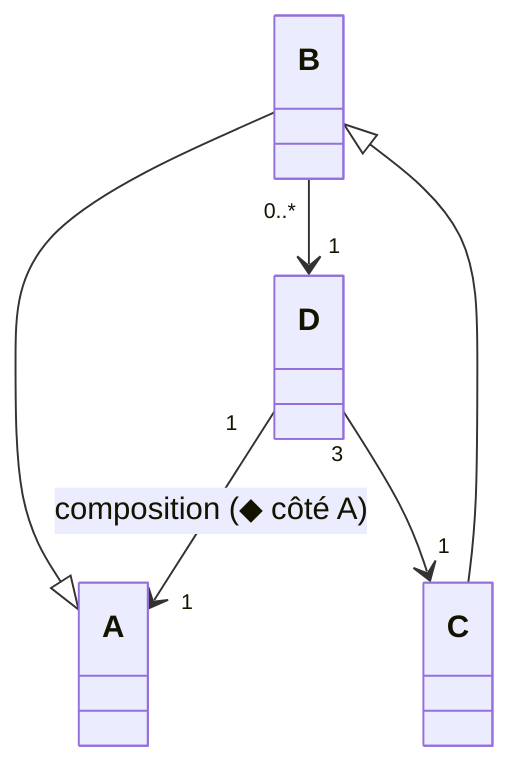

import Tabs from '@theme/Tabs';
import TabItem from '@theme/TabItem';

<Tabs>
<TabItem value="markdown" label="Markdown" default>

# Devoir Surveillé — Analyse et Conception Orientées Objets

*Université de La Manouba — École Nationale des Sciences de l'Informatique — A.U. : 2013-2014 — Niveau : II2 — Date : vendredi 15 novembre 2013 — Durée : 2h — Documents non autorisés — Enseignants : I. Fliss, W. Chaker, I. Boukhris, O. Fakhfakh*

*NB : Ne répondez pas à l'aveuglette. La précision, la consistance, la clarté seront appréciées.*

<!-- TODO: no correction attached to this source PDF (statement only, 4 pages). -->

## Exercice 1 : Questions de réflexion (5 pts)

1. Précisez le type de relation (association, héritage, « extend », « include », etc.) dans chacune des situations suivantes tout en justifiant votre réponse :
   a) un cas d'utilisation « Acheter un produit » et un cas d'utilisation « Vérifier la disponibilité du produit »
   b) une classe 'Ordinateur' et une classe 'Système d'Exploitation'
   c) une classe 'Outil' et une classe 'Marteau'
   d) un acteur 'Peintre', un acteur 'Artiste' et un acteur 'Chanteur'
   e) un cas d'utilisation « Jouer à la loterie » et un cas d'utilisation « Gagner à la loterie »
   f) une classe 'Document' et une classe 'Feuille'

2. Soit le diagramme de classes UML suivant :

<!-- TODO: unclear in source, verify against original PDF page 1 — the exact direction/nature (composition vs. plain association, navigability) of the D-A and D-C relations is reconstructed from a small diagram; the cardinalities (1 at A, 0..*/1 for B-D, 3/1 for D-C) and the inheritance arrows (B->A, C->B) are clear, but double-check the composition diamond placement against the source. -->

   Un objet instance de la classe 'B' peut accéder à combien d'objets instances de la classe 'D' et à combien d'objets instances de la classe 'C' ? Justifiez votre réponse.

## Exercice 2 : Diagramme de cas d'utilisation (5 pts)

Nous nous intéressons dans cet exercice à la modélisation du Système d'Information (SI) d'un libraire grâce aux diagrammes de cas d'utilisation. Celui-ci inclut les sous-systèmes de gestion de stock, de facturation et de gestion de commandes.

Le libraire Ali a une boutique sur Tunis. Il vend des articles, de natures différentes, qui possèdent chacun un code barre : des livres, des articles de papeterie et des journaux. Les livres sont caractérisés par un titre, un numéro ISBN, un prix HT, un nom d'auteur, un éditeur, un nombre de pages. Les articles de papeterie sont caractérisés par un libellé et un prix HT. Les journaux sont caractérisés par un titre, une date de parution, un nombre de pages et un prix HT.

Chaque fois qu'un client choisit un article et passe en caisse, le libraire fait lire le code barre à un lecteur optique qui va lire sa référence dans la base de données articles. Le système de gestion de stock de la boutique enregistre alors l'achat et décrémente le stock lié à l'article.

Le libraire édite une facture qui est émise à partir du système de facturation de la boutique. Cette facture indique : la date de l'achat, le montant TTC et la TVA.

Si un client arrive dans la boutique et qu'il n'y a plus ou pas l'article demandé, le client peut commander l'article auprès du libraire en indiquant la quantité souhaitée. Le libraire enregistre la commande dans le système de gestion des commandes.

Le client a alors le choix :

- Soit payer dès l'initialisation de la commande, la facture est alors éditée avec la mention « en commande ». Quand le libraire est approvisionné, il appelle le client ou il lui envoie un mail. Le client vient alors chercher le(s) article(s). Le libraire saisit l'information que les articles commandés ont été approvisionnés. Il édite alors un bon de livraison avec la mention « payée » et le numéro de la facture.
- Soit payer quand le libraire reçoit les articles. Le libraire édite la facture avec la mention « payée ».

Dans les deux cas, une commande donne lieu à une seule facture. Pour l'édition de la facture, le client donne son nom, son prénom, son adresse, son mail et son numéro de téléphone. Le libraire saisit ces informations dans le système informatique et l'enregistre dans la base de données clients.

À la fin de la journée, le libraire demande au système de gestion du stock de lancer un « état du stock ». Le système de gestion du stock vérifie alors les articles dont la quantité est inférieure au niveau de stock prévu par article. Si la quantité est inférieure au niveau de stock prévu par article, le libraire peut lancer une commande auprès du fournisseur. Si le fournisseur ne livre pas dans les 3 jours, le libraire relance par mail le fournisseur. Les informations fournisseurs se trouvent dans une base de données fournisseurs. Chaque article est fourni par un seul fournisseur, et pour chaque type d'article (livre, article de papeterie…), un stock minimum est prévu.

**Travail à faire**

1. Identifiez le(s) acteur(s) du Système d'Information (SI) du libraire. Précisez à chaque fois le type de l'acteur (principal ou secondaire) en justifiant votre réponse.
2. Représentez le diagramme de cas d'utilisation du système en question.

## Exercice 3 : Diagrammes de classes d'analyse et diagrammes d'objets (10 pts)

Une agence gère un ensemble de biens immobiliers d'habitation (studios, appartements et maisons) à louer ou à acheter. Un client correspond à toute personne s'adressant à ses services pour louer ou acheter un bien immobilier. Il devient acquéreur s'il loue ou achète un bien immobilier par l'intermédiaire de l'agence. Un propriétaire est une personne qui possède des biens immobiliers et s'adresse à l'agence pour les proposer à la vente ou à la location. Un propriétaire peut posséder plusieurs biens immobiliers. Un bien immobilier ne peut être la propriété que d'un seul propriétaire. À un instant donné, un bien immobilier est soit à louer, soit à acheter. Un numéro permet de l'identifier parmi tous les biens immobiliers.

Un bien passe par plusieurs états. Seul un bien « libre » peut être réservé par un client (pour achat ou bien location) ; un contrat de location est créé lorsqu'un bien « réservé » devient « loué » et un contrat d'achat est créé lorsqu'un bien « réservé » devient « acheté ». Seul un bien « libre » peut être réservé par un client. On note la date de réservation de chaque client pour chaque bien. Le bien sera loué ou vendu au premier client qui l'a réservé. Un bien « réservé » ou « loué » peut être à tout moment libéré par le client. Le bien redevient à nouveau « libre ». Un contrat de location est défini par une date début et une date fin. Un contrat d'achat est défini par une date d'achat. L'agent immobilier peut à tout moment créer un contrat, résilier un contrat de location, réserver un bien. Le directeur de l'agence quant à lui peut ajouter un bien.

Dans le cadre de cet exercice, un bien est soit un bien élémentaire (studio, appartement ou maison) soit un bien complexe qui regroupe une suite d'appartements. Pour des raisons internes à l'agence, nous distinguons les appartements de type simplex et les appartements de type duplex. Un appartement simplex est caractérisé par sa superficie. Un appartement duplex est caractérisé par le nombre total de ses pièces.

De manière à pouvoir servir efficacement, à la fois, les propriétaires (offrants) et les clients (demandeurs), un certain nombre de « classes standards » de biens immobiliers sont définies ; par exemple : la classe des maisons d'habitation à louer comprenant au minimum deux pièces et dont le loyer mensuel serait inférieur à 700 DT, la classe des maisons d'habitation à acheter comprenant au minimum trois pièces et dont le prix demandé serait inférieur à 200.000 DT.

Une classe standard est identifiée par un code de classe et est caractérisée par le type de biens immobiliers qui la composent (maison, appartements, studio), leur mode d'offre (à louer, à acheter), un prix maximum et une superficie minimum. Un bien immobilier appartient toujours à une et une seule classe standard. Une classe standard peut ne contenir aucun bien immobilier.

Dans le cas d'appartement à louer, le prix maximum correspond à un prix mensuel maximum de location ; pour les biens à acheter, il correspond à un prix maximum d'achat.

Dans le cas d'appartement ou maison, la superficie minimale correspond à un nombre de pièces ; dans le cas de studios, la superficie minimale correspond à une superficie exprimée en m². Pour exercer son activité, l'agence immobilière gère les informations suivantes :

- pour chaque propriétaire : son nom, son adresse (rue et numéro, code postal, localité), deux numéros de téléphone (privé et travail) et les heures de présence à ces numéros, ainsi que la liste des biens qu'elle est chargée de négocier pour eux.
- pour un client : son nom, son adresse, son numéro de téléphone, les types de biens qu'il recherche, c'est-à-dire la liste des classes standards qui correspondent aux types de biens qui l'intéressent.
- pour tout bien immobilier : son statut (libre, réservé, loué ou acheté), la classe standard à laquelle il appartient, la date à laquelle le bien lui a été soumis, sa localisation (rue et numéro, code postal et localité), la date de mise en disposition, la liste des clients qui ont demandé à visiter ainsi que les dates et heures de chaque visite, et les coordonnées de la personne de l'agence responsable de celle-ci. Enfin, s'il y a lieu, les coordonnées du client acquéreur (nom, adresse, téléphone), les prix et date effectifs d'achat ou de location et le numéro de référence du contrat.
- pour tout bien immobilier à louer : le montant de la caution locative, le loyer mensuel, le montant mensuel des charges, le type de bail, la « garniture » (meublé, non meublé) et les pénalités en cas de non paiement.
- pour tout bien immobilier à acheter : le prix d'achat demandé, l'état (à restaurer, correct, impeccable).

Lors de l'analyse, un débutant en UML a recensé les classes suivantes : 'Contrat', 'Client', 'Propriétaire', 'GestionDeLocation', 'Bien', 'Bien_à_louer', 'Bien_à_acheter', 'EnsembleDeBiens', 'Appartement', 'SuiteAppartements', 'Pièce', 'Classe_Standard'.

**Travail à faire**

On se propose dans cet exercice de réaliser un diagramme de classes relatif à l'étape d'analyse.

### Question 1

a. L'agent immobilier peut à tout moment créer un contrat, résilier un contrat de location, réserver un bien. A-t-on besoin de rajouter la classe 'Agent' ? Si la réponse est « oui », justifiez votre réponse. Sinon, indiquez l'information qui manque dans l'énoncé pour avoir besoin de la classe 'Agent'.
b. Le directeur peut ajouter un bien. A-t-on besoin de modéliser la classe 'Directeur' ? Justifiez votre réponse.
c. Pour les autres classes recensées par le débutant en UML, sont-elles toutes correctes (pertinentes) ? Justifiez brièvement votre réponse. Pensez-vous qu'il y a des classes qui manquent. Si oui, lesquelles ?

### Question 2

On se propose dans cette question d'élaborer un diagramme de classes avec les classes retenues dans la question n°1.

a. Donnez la partie du diagramme de classes relative à la généralisation de biens (c.-à-d. aux différentes formes sous lesquelles les biens peuvent apparaître).
b. Un bien passe par plusieurs états : libre, réservé, loué ou acheté. Proposez une manière de représentation de cette information dans le diagramme de classes. Commentez brièvement votre solution.
c. Un contrat de location est créé lorsqu'un bien « réservé » par un client devient « loué » et un contrat d'achat est créé lorsqu'un bien « réservé » par un client devient « acheté ». Ajoutez la ou les associations nécessaires pour répondre à ce besoin.
d. Quelle est la modification qu'il faut apporter si on désire garder la trace de la liste des clients qui ont demandé à visiter les biens ainsi que les dates et heures de chaque visite ?
e. Un propriétaire est une personne qui possède des biens immobiliers et s'adresse à l'agence pour les présenter à ses clients. Comment peut-on modéliser cet énoncé ?
f. Ajoutez les associations possibles qui relient la classe 'Classe_Standard' aux autres classes retenues dans la question 1. Argumentez votre réponse.
g. Donnez une version complète du diagramme de classes de cette application tout en ajoutant les opérations et les attributs nécessaires en s'appuyant sur le texte de l'énoncé. On se propose de promouvoir dans la mesure du possible les associations en compositions ou en agrégations. Argumentez votre réponse.

### Question 3

Élaborez le diagramme d'objets conformément à vos réponses aux questions précédentes illustrant chacune des situations suivantes :

a. « Ali Ben Salah vient de signer un contrat de location pour un duplex de 2 pièces, dont le propriétaire est l'entreprise Constructions ABC »
b. « Emna Louati vient de signer un contrat d'achat d'un duplex de 4 pièces de la classe des maisons d'habitation après trois visites au duplex qu'elle a réservé le 15 septembre 2013 »

</TabItem>
<TabItem value="pdf" label="PDF">

<PdfViewer file="/pdfs/acoo-ds-2013-2014.pdf" />

</TabItem>
</Tabs>
