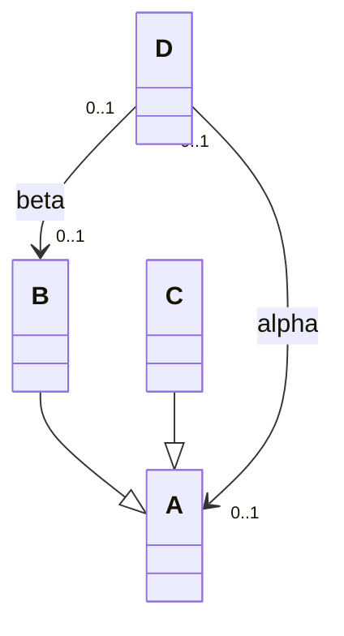
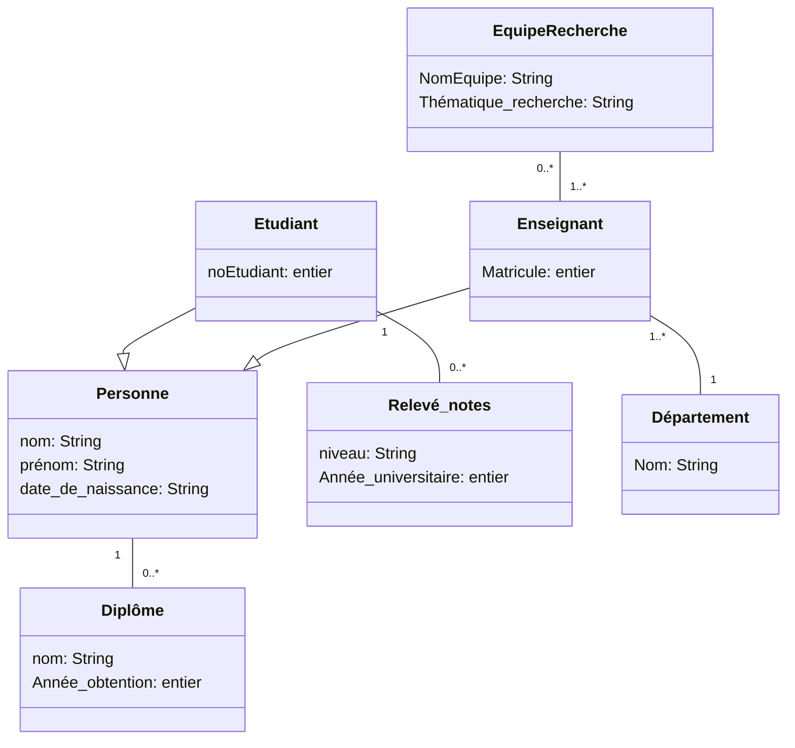

import Tabs from '@theme/Tabs';
import TabItem from '@theme/TabItem';

<Tabs>
<TabItem value="markdown" label="Markdown" default>

# Devoir Surveillé — Analyse et Conception Orientées Objets

*Université de La Manouba — École Nationale des Sciences de l'Informatique — A.U. : 2014-2015 — Niveau : II2 — Date : vendredi 14 novembre 2014 — Durée : 2h — Documents non autorisés — Enseignantes : I. Fliss, I. Boukhris, L. Bouallegue*

*NB : Ne répondez pas à l'aveuglette. La précision, la consistance, la clarté seront appréciées.*

<!-- TODO: no correction attached to this source PDF (statement only, 4 pages). -->

## Exercice 1 : Questions de réflexion (7 pts)

1. Un diagramme de cas d'utilisation permet-il de spécifier l'ordre d'exécution des cas ? Expliquez.
2. Soit le diagramme de classes et les trois diagrammes d'objets (1), (2) et (3) suivants :

Diagramme d'objets (1) : `b:B` —(alpha1)— `d:D`
Diagramme d'objets (2) : `c:C` —(beta1)— `d:D`
Diagramme d'objets (3) : `a:A` —(beta1)— `d:D`

   Sachant que a, b, c et d sont des instances (objets) respectivement des classes A, B, C et D ; alpha1 et beta1 sont des liens représentatifs des associations alpha et beta.

   Indiquez pour chacun des diagrammes d'objets (1), (2) et (3) s'il est conforme ou pas au diagramme de classes ? Justifiez votre réponse.

3. Considérons le diagramme de classes d'analyse suivant :

   a) Commentez les relations qui figurent dans le diagramme.
   b) Précisez les différences entre la composition et l'agrégation.
   c) On se propose de promouvoir dans la mesure du possible les associations du diagramme de classes en compositions ou en agrégations. Proposez une nouvelle version du diagramme de classes d'analyse tout en justifiant vos réponses (ce n'est pas la peine de représenter les attributs).
   d) Nous proposons dans un second lieu de rajouter des détails à ce diagramme d'analyse afin d'aboutir à une première version de diagramme de classes de conception.
      i. Quels sont les détails à rajouter pour les différents attributs présents dans le diagramme de classes ? Donnez une nouvelle version du diagramme de classes prenant en compte les détails des attributs que vous avez jugés utiles.
      ii. Pour comprendre les règles de gestion gouvernant l'évolution des liens entre les objets, on se propose de décorer les associations par les contraintes `{ordered}`, `{addOnly}`, `{frozen}`, `{notUnique}`.
         1) Rappelez brièvement la signification de chaque contrainte de gestion.
         2) Décorez, directement sur le diagramme de classes de la question (d-i), chacune des associations par les contraintes de gestion appropriées.

## Exercice 2 : Diagramme de cas d'utilisation (7 pts)

Nous nous proposons d'étudier les fonctionnalités d'un site web gastronomique spécialisé dans la restauration tunisienne. Les restaurateurs peuvent s'inscrire sur le site pour mieux faire connaître leur(s) restaurant(s). Le site stocke, pour chaque restaurateur, son nom, son email, un mot de passe et un numéro de téléphone de contact. Le site publie les informations (nom, adresse, prix moyen et prix de la réservation) sur chaque restaurant. Les consommateurs peuvent consulter librement ces informations sur le site Web. Les consommateurs peuvent aussi évaluer un restaurant (uniquement s'ils sont inscrits au site). Ils peuvent ainsi noter les restaurants et déposer des commentaires s'ils le souhaitent.

L'inscription au site permet aussi aux consommateurs de réserver une table dans les restaurants. Dans ce cas, le consommateur remplit une demande de réservation sur le site. Cette demande est validée par le restaurateur (il peut la confirmer ou l'annuler). S'il la confirme, le site devra enregistrer la réservation et envoyer un mail de confirmation au client. Ceci sera réalisé par un composant du système, responsable de la gestion des réservations. Par ailleurs, lorsqu'un restaurateur propose un restaurant, l'équipe de rédaction du site devra l'accepter. Cette acceptation peut être conditionnée à une visite, si le restaurant paraît suspect.

**Travail à faire**

1. Identifiez le(s) acteur(s) du site web. Précisez à chaque fois le type de l'acteur (principal ou secondaire) en justifiant votre réponse.
2. Représentez le diagramme de cas d'utilisation du site web en question en utilisant au moins deux relations « include », une relation d'héritage et une relation « extend » (le nombre max de cas est fixé à neuf).
3. Considérons le cas d'utilisation « demander une réservation de table ». Imaginez un scénario nominal et un scénario exceptionnel. Donnez, en langage naturel, une description claire (détaillée) pour chaque scénario.

## Exercice 3 : Diagramme de classes d'analyse + diagramme d'objets (6 pts)

Une grande chaîne de cinémas veut mettre en place un nouveau système de réservation de places de cinéma. L'objectif de cet exercice est l'analyse structurelle de ce système. Le cinéma est constitué d'un certain nombre de salles, ayant chacune un numéro et nombre de places défini.

Chaque cinéma projette, dans différentes séances, un certain nombre de films : des nouveautés ou des reprises. Une séance est caractérisée par le film qu'elle diffuse, la date et l'horaire de la projection, la salle dans laquelle elle a lieu. Un film est identifié par son titre, son réalisateur, sa date de première sortie et sa durée. Selon l'équipement de la salle, la projection est analogique ou numérique. Un film peut également être projeté en 3D, 5D ou 7D mais uniquement dans une salle ayant des équipements de projection appropriés. Les clients du système de réservation peuvent réserver une ou plusieurs places pour une séance d'un film dans un cinéma donné. Le client peut payer par carte bancaire les places réservées au moment de la réservation ou utiliser sa carte d'abonné s'il en possède une (identifiée par un numéro et une date de fin de validité). Un abonnement est payé pour un an et permet un nombre de séances illimité pour l'abonné pendant cette période. Un abonné ne peut pas réserver une place pour quelqu'un d'autre que lui sur sa carte. Il devra justifier à l'entrée du cinéma de son statut d'abonné. Il peut par contre réserver plusieurs places pour une séance mais il devra payer pour les autres places que la sienne. Le prix d'une place est fixé par le cinéma, ainsi que le supplément pour les projections 3D, 5D et 7D lorsque le cinéma est équipé. Le prix d'une réservation sera calculé à partir du prix des places dans le cinéma pour le film considéré, de la nature de la séance (3D, 5D, 7D ou non), du nombre de places réservées pour cette séance et de l'utilisation ou non d'une carte d'abonnement (une place gratuite). On voudrait dans ce système enregistrer les entrées effectuées dans les différentes salles et calculer et afficher le taux d'occupation et le chiffre d'affaires produit par chaque salle lorsque la vente des billets pour la séance est terminée.

**Travail à faire**

1. En s'appuyant sur le texte de l'énoncé, proposez un diagramme de classes d'analyse pour la modélisation de ce système.
2. On considère maintenant que les places dans le cinéma ne sont pas toutes au même prix mais que les places dans la salle sont réparties en catégories à différents tarifs. Chaque catégorie a un nombre de places limité. Les catégories d'une salle sont les mêmes quel que soit le film qui a lieu dans cette salle. Modifiez le diagramme de classes de manière à prendre en compte cette évolution. Représentez seulement la portion du diagramme qui va représenter cette modification.
3. Élaborez le diagramme d'objets relatif à la situation suivante : « Ali ayant une carte d'abonnement numéro 25678 voudrait réserver une place dans la séance de 16h le 16 novembre 2014 à la Salle 3 du cinéma « Cinema1 » afin d'assister au film « Film1 ». »

</TabItem>
<TabItem value="pdf" label="PDF">

<PdfViewer file="/pdfs/acoo-ds-2014-2015.pdf" />

</TabItem>
</Tabs>
