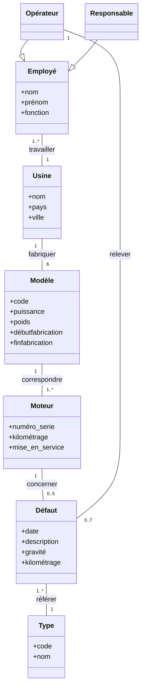
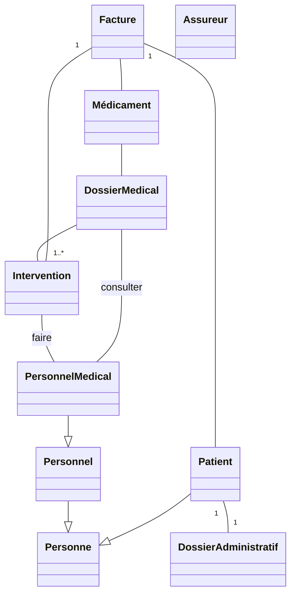

import Tabs from '@theme/Tabs';
import TabItem from '@theme/TabItem';

<Tabs>
<TabItem value="markdown" label="Markdown" default>

# Devoir Surveillé — Analyse et Conception Orientée Objet

*Université de La Manouba — École Nationale des Sciences de l'Informatique — A.U. : 2017-2018 — Niveau : II2 — Date : jeudi 16 novembre 2017 — Durée : 2h — Documents non autorisés — Barème indicatif : 5, 15 — Enseignants : I. Fliss, N. Bellamine, C. Ben Othmen, N. Ben Yahia, R. Drira, M.A. Mezghich*

*NB : Ne répondez pas à l'aveuglette. La précision, la consistance, la clarté seront appréciées.*

*Correction : "Barème détaillé éléments de réponses - DS_ACOO 2017_2018 -.doc - Google Docs", reprise ci-dessous question par question via les blocs Correction.*

## Questions de réflexion (5pts)

**1.** a. Quelles sont les différences entre composition et agrégation ? (0.5)

Correction

L'agrégation représente une relation d'inclusion structurelle ou comportementale d'un élément (agrégé) dans un ensemble (agrégat). La durée de vie des agrégés est indépendante de celle de l'agrégat. Il est possible de rattacher les agrégés à plus d'un agrégat. La composition représente la relation de contenance structurelle (appartenance totale). La durée de vie des composants est liée à celle du composite (si un objet composite est détruit, ses composants aussi).

**1.** b. Précisez le type de relation (agrégation ou composition) pour chacun des exemples suivants tout en justifiant votre réponse : classe 'Pièce' et classe 'Mur' (0.5), classe 'Mur' et classe 'Brique' (0.5), classe 'Être_Humain' et classe 'Squelette' (0.5)

Correction

- **Pièce et Mur** : agrégation (un mur peut être commun à plusieurs pièces).
- **Mur et Brique** : composition (une brique n'appartient qu'à un mur).
- **Être_Humain et Squelette** : composition (le squelette n'appartient qu'à un seul être humain).

**2.** À quoi correspond la notion de spécialisation/généralisation dans l'approche orientée objet ? (0.5) Dans quel(s) diagramme(s) UML apparaît cette notion ? (0.5 = 0.25×2)

Correction

La notion de généralisation/spécialisation correspond à la réutilisation d'un concept (ou classe) pour la spécification d'un nouveau concept (ou classe), soit par la spécialisation d'un concept plus général en plusieurs concepts plus spécifiques, soit par la généralisation de plusieurs concepts dans un concept plus général. Cette notion apparaît dans deux diagrammes UML : entre classes dans les diagrammes de classes, ou encore entre acteurs et entre cas d'utilisation dans les diagrammes de cas d'utilisation.

**3.** Soit le diagramme de classes suivant :

a. Une instance de la classe 'Responsable' peut accéder au minimum et au maximum à combien d'instances de la classe 'Type' ? Justifiez. (0.5)

Correction

Par héritage de la classe `Employé` (qui peut accéder à `0..*` instances de la classe `Type` : `Employé-Usine-Modèle-Moteur-Défaut-Type`), une instance de `Responsable` peut accéder au minimum à 0 et au maximum à `*` instances de la classe `Type`.

b. Une instance de la classe 'Opérateur' peut accéder au minimum et au maximum à combien d'instances de la classe 'Type' ? Justifiez. (0.5)

Correction

Par héritage de la classe `Employé` (qui peut accéder à `0..*` instances de la classe `Type` : `Employé-Usine-Modèle-Moteur-Défaut-Type`) et par accès indirect (`Opérateur-Défaut-Type` : min 0 et max 7), une instance de la classe `Opérateur` peut accéder au minimum à 0 et au maximum à `*` instances de la classe `Type`.

c. Donnez le diagramme d'objets modélisant la situation suivante :

« Ali Ben Salah est un employé et plus précisément un opérateur qui travaille pour l'usine BicoMotors installée en France. Cette usine fabrique six modèles de moteurs : M1, M2, M3, M4, M5 et M6. Le modèle M1 correspond à deux moteurs qui ne sont concernés par aucun défaut. Le modèle M2 correspond à un seul moteur concerné par cinq défauts avec une référence de type pour chacun. Le modèle M3 correspond à trois moteurs qui ne sont concernés par aucun défaut. Les modèles M4 et M6 correspondent à trois moteurs concernés chacun par trois défauts avec une référence de type pour chaque défaut. Le modèle M5 correspond à un moteur qui n'est concerné par aucun défaut. Ali Ben Salah a relevé sept défauts tout en référant le type de chaque défaut. »

Correction

Diagramme d'objets attendu : soulignement des noms des objets, absence de cardinalités et d'héritage sur un diagramme d'objets.

<!-- TODO: unclear in source, verify against original PDF — le corrigé de cette question (schéma du diagramme d'objets) n'est pas reproduit clairement dans le texte OCR du barème. -->

## Problème (15pts)

Une clinique souhaite informatiser le suivi de ses patients, à travers un nouveau système informatique de suivi « SISC ». Celui-ci sera utilisé par le personnel médical (médecin, infirmier, anesthésiste) et administratif (réceptionniste, comptable, administrateur). Par contre, les fonctionnalités de chacun seront distinctes. Le personnel administratif s'occupera notamment de l'admission des patients et de l'édition de factures, alors que le personnel médical s'occupera du dossier médical.

Le processus d'admission (réception) débute lorsque le patient se présente à la clinique avec un ordre d'admission (émis par un médecin de la clinique) ou en tant que cas d'urgence. À partir de ce moment, un employé de la clinique (un(e) réceptionniste) le prendra en charge. Il fera, d'abord, l'inscription administrative du patient et cherchera une chambre et attribuera un médecin pour lui. Par contre, si aucune chambre n'est disponible dans la clinique, l'employé qui accueille le patient devra coordonner avec le médecin traitant et contacter d'autres cliniques pour rediriger le patient vers une autre institution.

L'inscription administrative correspond à la saisie des données administratives du patient si celui-ci est un nouveau patient, ou la récupération de ses données dans la base de données s'il s'agit d'un patient qui a déjà séjourné dans la clinique (on utilise le numéro d'assurance maladie et le nom et le prénom comme identifiants du patient pour savoir s'il est nouveau ou pas). Les données administratives correspondent aux coordonnées du patient, telles que son identité (son nom et prénom, numéro d'assurance maladie, adresse, numéro de téléphone, numéro CIN) et le nom du médecin traitant et ses coordonnées. En plus de cela, le dossier administratif du patient comprend le numéro de la chambre et les dates d'arrivée et de sortie du patient. Chaque patient doit aussi avoir un dossier médical. Le dossier médical comprend toutes les données médicales du patient : son groupe sanguin, ses allergies, ses maladies, ses médicaments avec leurs doses, les résultats d'analyses et tests, les valeurs de température et de tension artérielle, les interventions médicales faites et tous les commentaires que le médecin traitant juge nécessaires. S'il s'agit d'un patient admis avec ordre d'admission, le dossier médical est téléchargé depuis le lien présent dans l'ordre d'admission. S'il s'agit d'un ancien patient reçu de nouveau avec un ordre d'admission, une mise à jour de son dossier médical sera faite automatiquement en fusionnant le dossier téléchargé et les informations médicales sauvegardées. Dans le cas d'un nouveau patient en cas d'urgence, le médecin attribué peut demander au médecin traitant de transférer le dossier médical du patient et ces informations seront sauvegardées dans la base des données médicales du patient. Dès la réception d'un patient, une facture est créée. Dans cette facture, les médicaments et les doses prises et les interventions faites sont initialement nuls. Les médicaments pris sont caractérisés par leurs libellés, les quantités utilisées, prix unitaire.

Une fois que le patient sera installé dans la chambre qui lui a été attribuée, un infirmier effectuera un premier contrôle médical (tension artérielle, température…) et fera la saisie de ces informations dans le dossier médical du patient. En parallèle, le (la) réceptionniste contacte par téléphone le médecin traitant attribué. On distingue entre deux types d'attributions de médecins traitants : attribution nominative (le/la patient(e) doit explicitement voir ce médecin, ex. s'il s'agit d'un rendez-vous précisé sur l'ordre d'admission pour faire une opération) et les attributions flottantes (attribution à n'importe quel médecin disponible ayant les bonnes qualifications). Pour faciliter l'attribution du personnel médical, le système « SISC » permet à un administrateur de gérer les dossiers du personnel médical œuvrant au sein de la clinique. Pour chaque membre du personnel médical, l'administrateur saisit le nom, les coordonnées, la spécialité, les données contractuelles (min et max de présence), les procédures pour lesquelles ils/elles ont été certifiés, et les modalités de rémunération. Il spécifie aussi l'horaire du personnel médical. La spécification de l'horaire se fait par plage horaire par jour de semaine (ex. mardi de 8:30 à 12:30), avec fréquence (toutes les semaines, toutes les premières semaines du mois, une semaine sur deux, etc.), avec des exceptions (sauf le mois de juillet, sauf la semaine du 13 au 17 novembre, etc.). On peut mettre un horaire préliminaire qu'on pourra éditer par la suite.

À tout moment, le personnel médical peut consulter le dossier médical contenant les données médicales relatives à un patient et ajouter de nouvelles données (résultat d'examens médicaux, interventions médicales, médicaments pris, etc.). Les données médicales sont consultables : soit par interrogation générale, qui ne fournit que les données de base sur l'état de santé du patient (groupe sanguin, allergies, etc.), soit par interrogation détaillée, qui donne un accès intégral au dossier médical du patient. Cette dernière n'est ouverte qu'aux médecins (les autres membres du personnel médical n'y ont pas accès). Le personnel administratif n'a pas le droit de consulter les données médicales d'un patient, mais uniquement les données administratives qui, elles, sont interdites au personnel médical. La facture d'un patient est mise à jour automatiquement dès qu'une intervention ou un médicament est noté dans le dossier médical. Une intervention est caractérisée par une dénomination, type, local, une date et un coût. À la fin du séjour du patient, le comptable peut éditer les factures correspondant aux soins prodigués. La facture comporte la liste des médicaments consommés et leurs coûts (unitaires et totaux) et la liste des interventions faites et leurs coûts en plus des informations personnelles du patient à savoir son nom, prénom, numéro d'assurance maladie et CIN. Il y a différentes modalités de paiement, qui dépendent du type d'assurance détenu par le patient. Le système « SISC » calcule le coût de l'intervention et la fraction payée par l'assureur. Si la totalité est à payer par l'assureur, le système transmet la facture directement à l'assureur. Le système produit alors une facture (à donner au patient) avec la note « à payer par l'assureur ». Si une partie ou la totalité de la facture est à payer directement par le patient, le système transmet la portion à payer par l'assureur directement à l'assureur. Le système produit une facture (à donner au patient) indiquant le total et le montant à payer directement par le patient. Le comptable demande au patient de choisir entre payer en espèces (au comptant) ou utiliser une carte de crédit. Si le paiement au comptant a été sélectionné et le montant a été payé par le client, le comptable confirme au système la réception du montant. Le système modifie la facture en précisant que le montant était payé comptant. Si le patient choisit de payer via une carte de crédit, il la présente au comptable qui la scanne. Le système initie une transaction carte de crédit. Il vérifie que la carte est valide et le solde est suffisant, sinon la transaction sera refusée, dans ce cas le patient sera ramené à utiliser une autre carte de crédit ou à payer au comptant. Dans le cas où la transaction est acceptée, le système imprime une copie de la transaction. Le comptable remet la copie de transaction au patient pour signature. Le patient signe. Alors le comptable confirme que la transaction est terminée avec succès. Le système modifie la facture en précisant que le montant était payé via une carte de crédit. Avant de remettre toute facture au patient, le comptable met sa signature et le cachet de la clinique.

Lors de l'analyse du système informatique de suivi « SISC », un développeur a proposé le diagramme de classes UML **incomplet** suivant :

**Travail à faire**

L'objectif de ce problème est d'analyser en partie le système informatique de suivi « SISC », grâce aux diagrammes UML vus en cours.

### Partie 1 : Expression des besoins (7pts)

**1.** Identifiez le(s) acteur(s) du système « SISC ». Précisez à chaque fois le type de l'acteur (principal ou secondaire) en justifiant votre réponse. (1.75)

Correction

- Personnel médical (médecin, infirmier, anesthésiste) → acteurs principaux
- Personnel administratif (réceptionniste, comptable, administrateur) → acteurs principaux
- Assureur → acteur secondaire

**2.** Complétez le diagramme de cas d'utilisation suivant (déjà amorcé avec deux cas d'utilisation, « Recevoir des patients » et « Éditer des factures », à l'intérieur du système « Système SISC »). Il s'agit de représenter : a. les acteurs (de la question 1) ; b. les autres cas d'utilisation du logiciel en question ; c. les relations entre acteurs-cas d'utilisation, entre acteurs-acteurs (si besoin) et les dépendances entre les cas d'utilisation (si besoin). (3.25)

Correction

0.5pt : système « SISC ». 0.5pt : relations acteurs-cas d'utilisation + relation d'héritage entre acteurs. Cas d'utilisation attendus : `Recevoir des patients`, `Éditer des factures` (parmi d'autres).

<!-- TODO: unclear in source, verify against original PDF — le barème détaillé de cette question (au-delà des points bruts déjà indiqués) et le schéma corrigé complet ne sont pas reproduits dans le texte OCR. -->

**3.** Concernant le cas d'utilisation « recevoir des patients », imaginez deux variantes de scénarii relatifs à ce cas (un scénario nominal et un scénario alternatif). Représentez chaque scénario par un diagramme de séquence système. (1pt = 0.5 + 0.5)

Correction

<!-- TODO: unclear in source, verify against original PDF — les diagrammes de séquence système du corrigé (schémas) ne sont pas reproduits dans le texte OCR du barème. -->

**4.** Proposez un diagramme d'activités qui illustre la dynamique du cas d'utilisation « éditer des factures ». (1pt)

Correction

Dans ce cas : il faut considérer que le comptable précise le mode de paiement et le type d'assurance détenu par le patient : 1. paiement comptant, 2. paiement par carte de crédit, 3. paiement par transmission à l'assurance du patient. Finalement et dans tous les cas, un reçu est remis au patient avec indication du mode de paiement.

### Partie 2 : Analyse structurelle (4,5pts)

**5.** Le diagramme de classes proposé par le développeur est incomplet. Ajoutez sur le diagramme de classes ci-dessus les cardinalités et les associations manquantes. (2pts)

Correction

<!-- TODO: unclear in source, verify against original PDF — le schéma corrigé (cardinalités et associations ajoutées) n'est pas reproduit dans le texte OCR du barème. -->

**6.** Ajoutez les attributs et les méthodes correspondants à chaque classe. (2.5pts)

Correction

<!-- TODO: unclear in source, verify against original PDF — le schéma corrigé (attributs et méthodes ajoutés) n'est pas reproduit dans le texte OCR du barème. -->

### Partie 3 : Analyse dynamique (3,5pts)

**7.** On se propose de comprendre l'évolution de la classe 'Facture'. En vous basant sur l'énoncé, donnez le diagramme d'états-transitions de cette classe. (2.5)

Correction

<!-- TODO: unclear in source, verify against original PDF — le diagramme d'états-transitions corrigé (schéma) n'est pas reproduit dans le texte OCR du barème. -->

**8.** En vous basant sur le diagramme de classes que vous avez proposé dans la question (5), construisez un diagramme de séquence (diagramme de séquences objet) décrivant l'émission de la facture pour le patient X, sachant qu'il va payer la totalité de la somme sans avoir recours à l'assureur. N'oubliez pas de préciser toutes les méthodes que vous devez ajouter au diagramme de classes proposé (on suppose que tous les messages échangés sont des messages synchrones). (1pt)

Correction

<!-- TODO: unclear in source, verify against original PDF — le diagramme de séquence corrigé (schéma) n'est pas reproduit dans le texte OCR du barème. -->

</TabItem>
<TabItem value="pdf-statement" label="PDF (énoncé)">

<PdfViewer file="/pdfs/acoo-ds-2017-2018-statement.pdf" />

</TabItem>
<TabItem value="pdf-reponses" label="PDF (feuilles réponses)">

<PdfViewer file="/pdfs/acoo-ds-2017-2018-reponses.pdf" />

</TabItem>
<TabItem value="pdf-bareme" label="PDF (barème/corrigé)">

<PdfViewer file="/pdfs/acoo-bareme-ds-2017-2018.pdf" />

</TabItem>
</Tabs>
