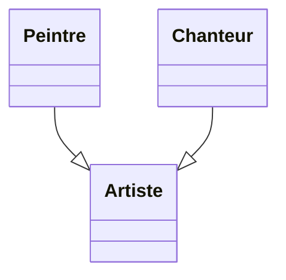
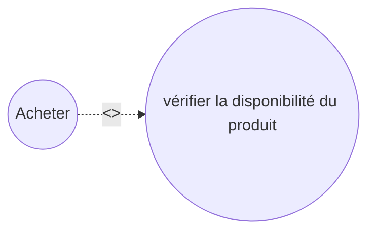
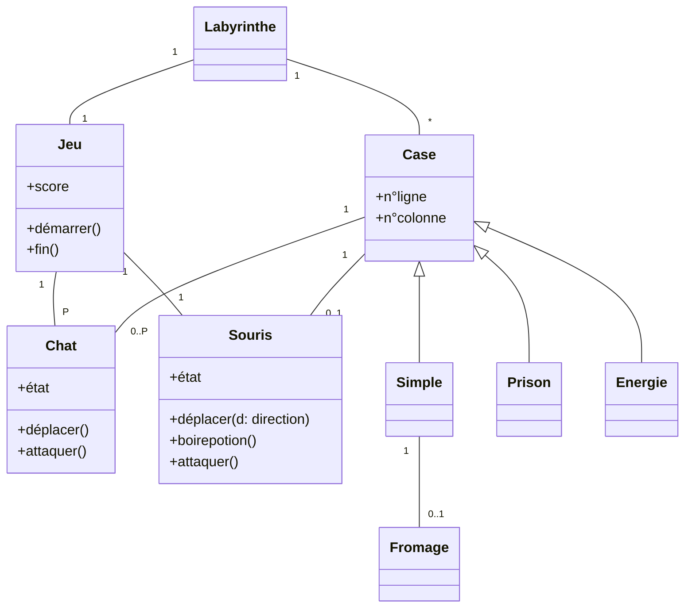
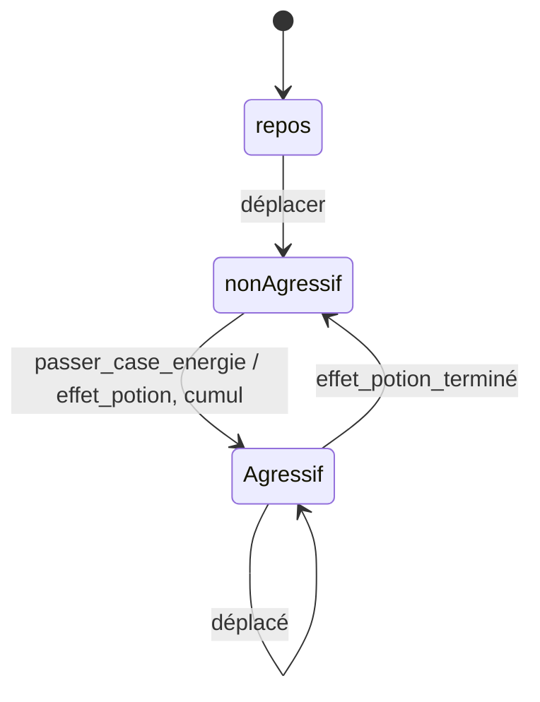
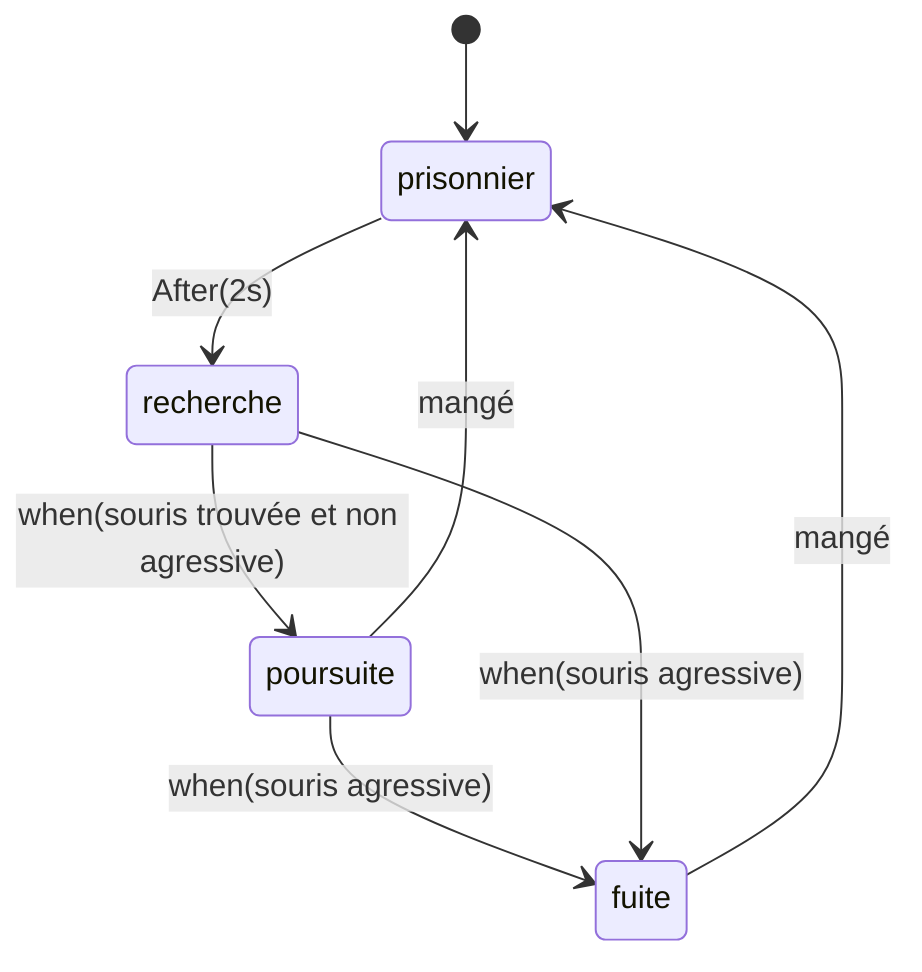
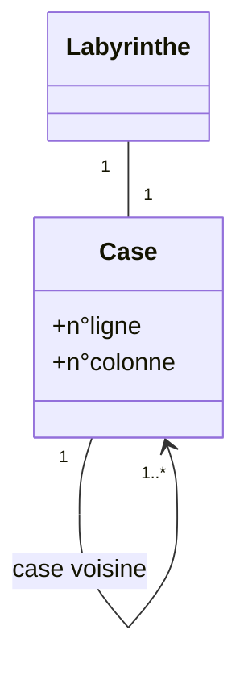

import Tabs from '@theme/Tabs';
import TabItem from '@theme/TabItem';

<Tabs>
<TabItem value="markdown" label="Markdown" default>

# Devoir Surveillé — Analyse et Conception Orientées Objet

*Université de La Manouba — École Nationale des Sciences de l'Informatique — A.U. : 2018-2019 — Niveau : II2 — Date : mercredi 7 novembre 2018 — Durée : 2h — Documents non autorisés — Barème indicatif : 4, 6, 10 — Enseignants : I. Fliss, C. Ben Othmen, N. Ben Yahia, M.A. Mezghich, S. Mathlouthi*

## Exercice 1 : Questions de réflexion (4 points)

1. Est-il possible, uniquement avec un diagramme de cas d'utilisation, de spécifier qu'un cas d'utilisation doit s'exécuter obligatoirement avant un autre cas d'utilisation ? Expliquez.

Correction

**Non** (0.25 pt). Justification (0.5pt) : la notion de précédence n'est pas offerte dans le diagramme de cas d'utilisation ; pour la présenter, nous pouvons nous référer aux pré-conditions (documentation qui accompagne les cas d'utilisation).

2. Dans un diagramme de cas d'utilisation, les acteurs liés aux cas d'utilisation sont-ils forcément des bénéficiaires (client des fonctionnalités) ? Expliquez.

Correction

**Non** (0.25pt). Explication (0.5pt) : dans un diagramme de cas d'utilisation, nous pouvons aussi trouver des acteurs secondaires qui ne sont pas des bénéficiaires de fonctionnalités mais plutôt contribueront à la réalisation de services.

3. Pour chacune des phrases suivantes, donnez la modélisation UML adéquate :
   a) Willy est un Dauphin (0.5pt)
   b) L'acteur 'Peintre' et l'acteur 'Chanteur' sont des acteurs 'Artiste' (0.5pt)
   c) Il y a un passage obligatoire inconditionnel entre les cas d'utilisation « Acheter un produit » et « Vérifier la disponibilité du produit ». (0.5pt)

Correction

a) Diagramme d'objets : `Willy : Dauphin`

b)

c)

4. Considérons les scénarii illustrés par les diagrammes de séquences suivants :

   **Scénario A** : `:A` envoie `msg()` qui crée `:B` (message de création).
   **Scénario B** : `:A` envoie plusieurs fois (`*`) `msg()` à `:B`.

   Donnez en langage naturel une description de l'algorithme correspondant à chaque scénario.

Correction

**Scénario A** : un objet instance de la classe A envoie un message (`msg`) qui crée une instance de la classe B. (0.5pt)

**Scénario B** : un objet instance de la classe A envoie à une instance de la classe B plusieurs fois le message (`msg`). (0.5pt)

## Exercice 2 : Diagramme de cas d'utilisation + diagramme de séquence système (6 points)

Nous nous proposons d'étudier les fonctionnalités d'un logiciel de planification et de sondages « Planif_Sond ». Ce logiciel permet à tout internaute, sans inscription préalable, de créer un sondage permettant d'établir un choix en accord avec les invités du sondage. Il peut s'agir d'une date de réunion ou de n'importe quel autre type d'options.

Pour créer un sondage, l'internaute renseigne son nom et son adresse e-mail, et donne un titre au sondage ainsi qu'une description. S'il choisit la planification d'événements, il lui faut choisir des dates possibles pour l'événement, puis des horaires pour chacune des dates. S'il choisit un autre type de sondage, il doit nommer les différentes options possibles. Enfin, quel que soit le type de sondage choisi, il peut donner une liste de personnes invitées à répondre à ce sondage, en renseignant leurs adresses e-mail. Lorsqu'il confirme la création de l'événement, un e-mail contenant l'URL vers le sondage est envoyé par « Planif_Sond » à chaque personne invitée. Un e-mail de confirmation de la création du sondage est également envoyé à l'organisateur, contenant l'URL du sondage muni des fonctions d'administration. Seuls les invités d'un sondage et son organisateur peuvent consulter ce sondage et y répondre. Un invité répond à un sondage en donnant son nom et en cochant les options qui lui conviennent, puis en validant sa participation au sondage. Il peut également laisser un commentaire visible par tous les invités à propos de ce sondage. À chaque fois qu'un invité répond au sondage ou publie un commentaire, l'organisateur de ce sondage en est informé par e-mail. Les réponses des invités et les commentaires sont visibles par tous les invités au sondage. L'organisateur peut à tout moment supprimer le sondage qu'il a créé. Il peut également en modifier le titre ou la description, il peut ajouter ou supprimer des options, ou inviter des personnes supplémentaires au sondage. Lorsque tous les invités ont répondu au sondage, ou lorsque l'organisateur le souhaite, il peut déclarer le sondage clos en fixant une option parmi celles possibles. Il coche pour cela l'option choisie et valide son choix. Un e-mail est alors envoyé à tous les invités (ainsi qu'à l'organisateur) pour les informer de l'option retenue. Le sondage est désormais fermé (il n'accepte plus de réponses) mais est toujours consultable jusqu'à ce que l'organisateur le supprime.

**Travail à faire**

1. Identifiez les acteurs du système « Planif_Sond ». Précisez à chaque fois le type de l'acteur (principal ou secondaire) en justifiant votre réponse.
2. Représentez le diagramme de cas d'utilisation du système en question.
3. Proposez un diagramme de séquence système qui illustre un scénario nominal du cas d'utilisation « créer sondage ».

Correction

**1)** Internaute, invité et organisateur (1,5pt), acteurs principaux (0.25pt). *(On peut aussi accepter invité et organisateur seulement : acteurs principaux, 1,75pt. -0.75 pour toute réponse flagrante du type « système ».)*

**2)** 0.5pt : système ; 0.5pt : relation acteurs-cas d'utilisation + relation d'héritage entre internaute et organisateur.

Cas principaux (ou équivalent) :

- Internaute : *créer sondage* (0.5 pt)
- Invité : *consulter info sondage* (0.5 pt), *répondre sondage* (0.5pt), *commenter sondage* (0.25 pt)
- Organisateur : *consulter notifications* (0.5pt), *modifier sondage* (0.5pt), *supprimer sondage* (0.5pt)

**3)** Un scénario avec déroulement de succès pour la création de sondage : 1pt.

## Exercice 3 : Diagramme de classes + diagramme d'objets + diagramme d'états-transitions (10 points)

L'objectif de cet exercice est d'analyser, en partie, une version simplifiée d'un jeu mettant en opposition une souris et plusieurs chats. Ce jeu a pour but de permettre à un joueur de déplacer sa souris dans un labyrinthe contenant des chats. La souris doit manger un nombre de morceaux de fromage et atteindre la case d'arrivée tout en évitant au maximum les chats. Ce jeu comporte plusieurs niveaux. Chaque niveau est caractérisé par un nombre N de morceaux de fromage à manger et un nombre P de chats à éviter.

La partie est gagnée quand la souris a mangé N morceaux de fromage et a atteint la case d'arrivée. La partie est perdue quand la souris est tuée par un chat ou la case d'arrivée est atteinte sans manger le nombre demandé de morceaux de fromage. Dans le cadre de ce problème, on suppose que le labyrinthe est composé d'un ensemble de cases (n lignes, m colonnes) et, par conséquent, il est de forme rectangulaire. Avant de démarrer le jeu, le joueur peut choisir le niveau qu'il veut, sinon le niveau facile avec N=22, P=4, n=5 et m=5 est lancé.

Les cases du labyrinthe peuvent être de l'une de ces 5 catégories : 'Départ', 'Simple', 'Prison', 'Énergie' ou 'Arrivée'. La case de départ est la case qui abrite la souris au démarrage du jeu. Elle ne contient aucun morceau de fromage et aucune portion d'énergie. Le déplacement de la souris est commandité par le joueur. Au démarrage du jeu, la souris est donc placée dans la case « Départ » et les P chats sont placés dans la case « Prison ».

Dès que le jeu commence, le joueur peut donc déplacer sa souris dans toutes les autres cases sauf la case « prison » ; les chats à leur tour quittent la case « prison » pour attraper la souris. La souris peut visiter à plusieurs reprises la case de départ, les cases simples et les cases d'énergie afin d'atteindre la case d'arrivée. Le joueur lui donne une direction (haut, bas, gauche, droite).

Chaque case simple de ce labyrinthe peut contenir au plus un morceau de fromage. Chaque case d'énergie de son côté contient toujours une potion d'énergie (à chaque passage par cette case la souris peut boire une potion d'énergie et la potion bue est systématiquement remplacée dès que la souris quitte la case). Toutes les cases sauf la case « prison » et la case d'arrivée peuvent abriter un nombre quelconque d'occupants de types différents : la souris et/ou des chats. Si deux occupants de natures différentes se trouvent sur la même case, ils s'attaquent et, en fonction de leurs états respectifs, l'un d'eux tue l'autre. On suppose aussi que le déplacement d'un occupant se fait sur l'une des quatre cases voisines à la sienne. Dans le cas où le déplacement fait ressortir l'occupant du labyrinthe, ce dernier réapparaît sur le côté opposé du labyrinthe. La souris ne peut pas visiter la case « prison » et dans le cas où elle la rencontre dans son chemin, elle s'arrête. Si la souris atteint la case d'arrivée et elle a mangé le nombre de morceaux de fromage demandé (et même plus), le jeu est donc gagné, sinon le jeu est perdu. Le score du jeu correspond au nombre de morceaux de fromage mangés.

La souris est initialement dans un état 'non agressif'. Dans cet état, elle peut être attaquée par un chat. Mais la souris peut à son tour attaquer quand elle est à l'état 'agressif'. La souris passe à l'état 'agressif' lorsqu'elle passe par une case d'énergie et dans ce cas boit systématiquement une potion d'énergie. L'effet d'une potion bue devient inactif après 3 secondes. La souris peut accumuler l'effet de plusieurs potions d'énergie (de plusieurs cases d'énergie).

Les chats, quant à eux, sont dirigés aléatoirement à des fréquences périodiques. Ils vont poursuivre la souris dans le labyrinthe. Les chats apparaissent dans la case « prison » où ils ne font rien, puis sont libérés par la suite, chacun à son tour. En se libérant, chaque chat passe à l'état de 'recherche' d'une souris. Dans ce cas, il se déplace de manière aléatoire à l'intérieur du labyrinthe. Lorsque la souris est dans l'état 'non agressif' et se trouve dans un même couloir que le chat, ce dernier passe à l'état de 'poursuite' et son déplacement se fait dans la direction de la souris dans l'espoir de la rattraper. Par contre, le chat va tenter de fuir la souris quand cette dernière est à l'état 'agressif', jusqu'à ce que la souris passe à l'état 'non agressif'. Quand un chat est mangé par la souris, il va être replacé dans la « prison » et en ressortira après 2 secondes.

Un jeune développeur a commencé une ébauche de l'analyse de ce jeu et a proposé le diagramme de classes UML **incomplet** suivant (cardinalités partiellement manquantes) :

**Travail à faire**

On se propose de comprendre, compléter et améliorer la modélisation UML proposée par le développeur.

1. Précisez les cardinalités manquantes des associations.
2. On se propose de promouvoir dans la mesure du possible les associations en compositions ou en agrégations. Cochez une seule réponse pour chaque proposition en justifiant brièvement votre réponse.
3. « Ce jeu comporte plusieurs niveaux. Chaque niveau est caractérisé par un nombre N de morceaux de fromage à manger et un nombre P de chats à éviter. » Proposez une manière de représentation de ces informations dans le diagramme de classes. Expliquez brièvement votre solution.
4. « À chaque passage par la case d'énergie, la souris peut boire une potion d'énergie. L'effet d'une potion bue devient inactif après 3 secondes. » Proposez une manière de représentation de ces informations dans le diagramme de classes. Expliquez brièvement votre solution.
5. Nous considérons un cas de niveau facile (avec N=22, P=4, n=5 et m=5). Élaborez deux diagrammes d'objets conformément à vos réponses aux questions précédentes illustrant les deux situations suivantes (un diagramme d'objets pour chaque situation) :
   a) Un labyrinthe reflétant la situation initiale. (1pt)
   b) Un labyrinthe reflétant la terminaison du jeu dans le cas où le joueur gagne. (1pt)

   *NB : pour des raisons de clarté, on vous demande de représenter que les cases occupées par la souris ou les chats. Nommez vos objets cases comme suit : $c_{i,j}$ (i est le n° de ligne et j est le n° de colonne). La case de départ est la case $C_{0,0}$, la case prison est la case $C_{2,2}$ et la case d'arrivée est la case $C_{4,4}$.*

6. Donnez les diagrammes états-transitions des classes 'Souris' et 'Chat'.
7. Pour des besoins d'optimisation, on se propose de changer la cardinalité de l'association entre le labyrinthe et la case. Cette association devient de cardinalité '1' et non plus '*'. Quelles sont les rectifications à apporter au diagramme de classes pour tenir compte de cette modification ? Reflétez ces rectifications sur le diagramme de classes (ne représentez que les classes concernées). (0.5pt)
8. Le jeune développeur propose de rajouter une classe « Joueur » au diagramme de classes. Discutez cette proposition. (0.5pt)

Correction

**1) Cardinalités manquantes** (0.25pt chacune) : chat-jeu : P–1 ; case-chat : 1–0..P ; simple-fromage : 1–0..1 ; case-Souris : 1–0..1.

**2) Composition / agrégation** (3.5pts = 0.25×7 réponse + 0.25×7 justification) :

| Association | Type | Justification |
| --- | --- | --- |
| Jeu–Labyrinthe | **Composition** | Appartenance totale : notion tout et partie, et si le tout disparaît, les parties disparaissent |
| Jeu–Souris | **Composition** | Idem |
| Jeu–Chat | **Composition** | Idem |
| Labyrinthe–Case | **Composition** | Idem |
| Case–Souris | **Agrégation** | Notion d'appartenance (comportementale), et si le tout disparaît, les parties ne disparaissent pas |
| Case–Chat | **Agrégation** | Idem |
| Simple–Fromage | **Composition** | Appartenance totale : notion tout et partie, et si le tout disparaît, les parties disparaissent |

**3)** Proposition : classe `Niveau` avec attributs `nombreChats` + `nombreFromage`. (0.5pt)

**4)** (0.5pt, non détaillé dans la copie — représenter, par exemple, un attribut de durée/minuterie sur l'association Souris-Énergie, ou un attribut `nbPotionsActives` avec horodatage sur la classe Souris.)

**5-6)** Diagrammes états-transitions proposés :

*(Souris — 0.5pt)*

*(Chat — 1pt)*

**7)**

**8)** Selon la description donnée, nous n'avons pas besoin de la classe « Joueur ». Nous en aurions besoin dans le cas où nous allons enregistrer, pour chaque joueur, son score et recenser les dix meilleurs scores, par exemple.

</TabItem>
<TabItem value="pdf" label="PDF">

<PdfViewer file="/pdfs/acoo-ds-2018-2019.pdf" />

</TabItem>
</Tabs>
