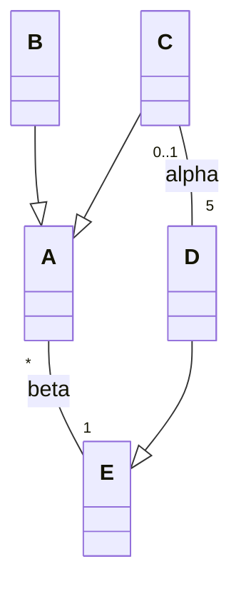

import Tabs from '@theme/Tabs';
import TabItem from '@theme/TabItem';

<Tabs>
<TabItem value="markdown" label="Markdown" default>

# Devoir Surveillé — Analyse et Conception Orientées Objet

*Université de La Manouba — École Nationale des Sciences de l'Informatique — A.U. : 2020-2021 — Niveau : II2 — Date : jeudi 10 décembre 2020 — Durée : 1h30 — Nombre de pages : 2 — Enseignantes : I. Fliss, A. Hedhili, C. Ben Othmen, N. Ben Yahia, Y. Sayeb, W. Rebhi*

<!-- TODO: no correction attached to this source PDF (statement only, 2 pages). -->

## Exercice 1 : Questions de réflexion (4 points)

1. Quels diagrammes UML sont les mieux adaptés à la vue comportementale d'un logiciel ? (1pt)
2. Donnez un exemple d'héritage entre acteurs dans un diagramme de cas d'utilisation. (0.5pt)
3. Soit le diagramme de classes UML suivant :

   a. Un objet instance de la classe 'C' peut accéder à combien d'objets instances de la classe 'D' ? Justifiez votre réponse. (1 pt)
   b. Proposez un diagramme d'objets instanciant ce diagramme de classes. (1.5pts)

## Problème (16 points)

### Partie 1 : diagramme de cas d'utilisation + diagramme de séquence système

Nous nous proposons initialement d'étudier les fonctionnalités d'un système qui automatise les réservations des salles de réunions d'un hôtel. L'application "Reserv_S_H" à mettre en place doit permettre à tout internaute de consulter les informations concernant les salles de réunion proposées (nom, capacité, photo, etc.).

Tout internaute peut s'inscrire à "Reserv_S_H" en fournissant une adresse électronique. Il recevra par courrier électronique un mot de passe provisoire, qu'il devra modifier pour finaliser la création de son compte.

Un internaute inscrit peut enregistrer de nouvelles réservations ou annuler des réservations en cours. Lors de la réservation, l'usager a accès au calendrier des disponibilités de la salle qu'il souhaite réserver, ainsi qu'à la liste des équipements disponibles pour cette salle.

Pour réserver une salle, l'usager (internaute inscrit) doit fournir le nom de la salle ainsi qu'une date et une plage horaire. Si la salle est disponible sur le créneau demandé, le système indique le tarif de location et l'état des équipements de la salle, après quoi l'usager peut confirmer la réservation. Il reçoit en retour un numéro de réservation, qui identifie la réservation pour les autres opérations, notamment l'annulation, ainsi qu'un courrier électronique de confirmation.

Un gestionnaire peut éditer les factures et enregistrer les paiements. En cas de retard de paiement, le système envoie automatiquement chaque semaine un rappel par courrier électronique à l'usager retardataire. Après trois relances, le système envoie un message au gestionnaire qui peut envoyer un courrier recommandé à l'usager ou procéder à un recouvrement.

Les agents chargés d'entretenir et d'apprêter les salles peuvent se connecter au système via un compte personnel pour consulter les calendriers de réservation et mettre à jour l'état des salles (disponibilité des différents équipements, entretien). Ils reçoivent quotidiennement un courrier électronique précisant quelles salles doivent être apprêtées.

**Travail à faire**

1. Représentez le diagramme de cas d'utilisation du système « Reserv_S_H ». (5pts)
2. Proposez un diagramme de séquence système qui illustre un scénario nominal du cas d'utilisation « réserver salle de réunion ». (1,5pts)

### Partie 2 : diagramme de classes + diagramme d'activités + diagramme d'états-transitions

Nous nous focalisons dans cette partie à la structuration interne de l'application "Reserv_S_H". Dans cette vue, les salles à réserver et à louer font partie des bâtiments. Un bâtiment appartient à l'hôtel. Il contient un certain nombre de salles. Chaque salle est caractérisée par un nom, affiché au-dessus de la porte. Les salles sont aussi caractérisées par leur superficie. Il existe trois types de salles pouvant être réservées et éventuellement louées :

- Petite salle de réunion : salle équipée d'une table ronde et de 6 chaises pouvant accueillir au plus 6 personnes.
- Grande salle de réunion : salle équipée d'une grande table et de chaises pouvant accueillir jusqu'à 30 personnes et d'un vidéoprojecteur.
- Très grande salle de réunion : salle équipée d'un vidéoprojecteur et de chaises pouvant accueillir jusqu'à 200 personnes.

Certaines salles possèdent du matériel (table, vidéoprojecteur, etc.). D'autres équipements sont possibles et sont gérés à la demande par les services techniques de l'hôtel (ordinateurs, tableau blanc, câbles, etc). Les bâtiments sont tous équipés de commodités. Les tarifs de location varient en fonction de la superficie, du type de salle demandé (avec vidéo, avec tableau, etc.), du moment de location (matinée, après-midi, soirée), de l'origine du demandeur (résident/non-résident), du titre du demandeur (particulier, association, entreprise), et du type de manifestation (réunion, banquet, spectacle). On mémorise l'identité de l'usager qui fera la réservation (nom, adresse, adresse mail). Chaque réservation d'une ou de plusieurs salles donne lieu à une facture ayant un numéro, un montant et une date d'émission. Les réservations peuvent être confirmées ou annulées.

Chaque réservation correspond à une plage horaire (date, heure de début, heure de fin). Le système doit permettre de vérifier si une salle est libre dans une plage horaire donnée. Si la plage est libre, elle peut être réservée pour l'usager demandeur du service. Le système permet de fournir des plannings d'occupation par salle. Des factures hebdomadaires par usager peuvent être imprimées et des taux d'occupation hebdomadaires de salles peuvent être calculés.

**Travail à faire**

1. On se propose de promouvoir dans la mesure du possible les associations en compositions ou en agrégations. Donnez un diagramme de classes d'analyse pour ce système en précisant si possible les attributs et les opérations de chaque classe. (5pts)
2. Donnez un diagramme d'activités illustrant la réservation d'une salle de réunion. (3pts)
3. Lorsqu'un usager effectue une réservation, la salle libre qu'il choisit devient alors réservée. À son arrivée à l'hôtel, la salle libre qui lui est destinée devient alors occupée. Mais si le client ne se présente pas au créneau prévu, la salle réservée redevient libre. Lorsque le client quitte l'hôtel, la salle doit être nettoyée avant d'être à nouveau disponible.

   Donnez le diagramme états-transitions de la classe 'Salle'. (1,5pts)

</TabItem>
<TabItem value="pdf" label="PDF">

<PdfViewer file="/pdfs/acoo-ds-2020-2021.pdf" />

</TabItem>
</Tabs>
