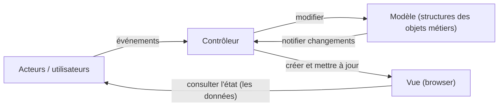

import Tabs from '@theme/Tabs';
import TabItem from '@theme/TabItem';

<Tabs>
<TabItem value="markdown" label="Markdown" default>

# Chapitre 4 : La Conception — Partie 2 : Conception architecturale

*Cours « Génie Logiciel » Niveau II2*

<!-- TODO: unclear in source, verify against original PDF (slide deck text extraction reorders some bullet fragments) — best-effort reconstruction below, see task summary -->

## 5. Conception architecturale

### Définitions

- Processus durant lequel on doit IMAGINER, PROPOSER une architecture pour satisfaire les spécifications (objectifs et contraintes).
- Décomposition en modules, et mise en évidence des frontières entre ces modules, structuration de l'ensemble.
- Recherche de plusieurs solutions, comparaison et choix entre les différentes alternatives de conception.
- À la fin de cette étape on doit disposer d'un modèle : COMPLET, COHÉRENT, MAINTENABLE, TESTABLE.
- Entrée : document de spécification.
- Tâches : définir l'architecture du logiciel (les composants de l'architecture ; les interfaces/relations entre les composants).
- Sortie (document produit) : document de conception globale (architecture du logiciel à réaliser).

L'architecture d'un logiciel comprend les éléments logiciels, leurs propriétés visibles et leurs relations. La structure (ou les structures) correspond à l'organisation entre les composants nécessaires, et leur composition définit l'environnement informatique qui supporte, ainsi que les principes fondamentaux qui guident la conception et l'évolution du logiciel. Elle se définit par les modules, les composants, les notions de découpage en couches, patterns et frameworks.

Une architecture logicielle est une représentation abstraite d'un système exprimée essentiellement à l'aide de composants logiciels en interaction via des connecteurs.

- Ne fournit que les propriétés externes des éléments structurants.
- Ne se préoccupe pas des détails d'implantation.

L'architecture informatique définit la structuration d'un système informatique (i.e. matériel et logiciel) en termes de composants et d'organisation de ses fonctions. La définition de l'architecture logicielle consiste à :

- Décrire l'organisation générale d'un système et sa décomposition en sous-systèmes ou composants.
- Déterminer les interfaces entre les sous-systèmes.
- Décrire les interactions et le flot de contrôle entre les sous-systèmes.
- Décrire également les composants utilisés pour implanter les fonctionnalités des sous-systèmes : les propriétés de ces composants ; leur contenu (e.g., classes, autres composants) ; les machines ou dispositifs matériels sur lesquels ces modules seront déployés.

### Structurer ?

La structuration du système peut être vue sous différents angles, selon que l'on considère :

- le découpage « logique » → **Vue Logique** : montre le découpage en modules sans se soucier des détails physiques d'exécution (machines, OS, réseaux, etc.). Vue en couches = layer view.
- le découpage « physique » → **Vue Physique** : s'intéresse au déploiement physique prenant en compte le contexte d'exécution. Vue en niveaux = tier view.

La littérature propose des modèles standards de structuration qui couvrent les types classiques d'applications (styles architecturaux).

### Pourquoi développer une architecture logicielle ?

- Pour permettre à tous de mieux comprendre le système.
- Pour permettre aux développeurs de travailler sur des parties individuelles du système en isolation.
- Pour préparer les extensions du système.
- Pour faciliter la réutilisation et la réutilisabilité.

### Comment choisir une architecture ?

- Il n'y a pas une architecture unique permettant de réaliser un système, il y en a plusieurs.
- Le choix de l'architecture implique plusieurs choix dont les technologies, les frameworks, les serveurs à utiliser, etc.
- Le choix dépend des exigences fonctionnelles et non fonctionnelles du logiciel.
- Choix favorisant la stabilité : l'ajout de nouveaux éléments sera facile et ne nécessitera en général que des ajustements mineurs à l'architecture.
- Influencé par certains « modèles connus » de décomposition en composants (styles architecturaux).

## Styles architecturaux

### Plan

1. Définitions d'un style architectural
2. Style architectural Vs Patron de conception
3. Typologie des styles architecturaux
4. Les styles architecturaux logiques
5. Les styles architecturaux physiques

### 1. Définition d'un style architectural

Un style architectural ou Patron d'architecture :

- Est un patron décrivant une architecture logicielle permettant de résoudre un problème particulier.
- Définit : un ensemble de composants et de connecteurs (et leurs types) ; les règles de configuration des composants et des connecteurs (topologie) ; une spécification du comportement du patron ; des exemples de systèmes construits selon ce patron.
- Constitue un modèle éprouvé et enrichi par l'expérience de plusieurs développeurs (compréhensibilité, maintenance, évolution, réutilisation, performance, documentation, etc.).

Un style architectural est déterminé par :

- Un ensemble de types de composantes (e.g. dépôt de données, processus, procédure),
- Une structuration topologique des composantes indiquant leurs relations durant l'exécution,
- Un ensemble de contraintes sémantiques sur les composantes et leurs interrelations,
- Un ensemble de connecteurs (e.g. appel de procédures, interruptions, etc.) pour médier la communication et la coordination entre les composantes.

### 2. Style architectural vs patron de conception

- Les patrons d'architecture (architectural patterns) se situent à un niveau plus élevé d'abstraction, au niveau de la conception globale. Ils apportent des solutions sur la manière de concevoir l'organisation à grande échelle (architecture) d'un logiciel en faisant abstraction des détails ; comportent des guides de bonnes pratiques et des règles générales qui ne peuvent pas être traduites directement en code source.
- Les patrons de conception (design patterns) sont plus proches de préoccupations locales liées à l'implémentation du code, au niveau de la conception détaillée. Ils suggèrent un arrangement, une manière d'organiser des classes ; décrivent une organisation de classes fréquemment utilisée pour résoudre un problème récurrent ; parlent d'instances, de rôles et de collaboration.

### 3. Typologie des styles architecturaux

La structuration du système peut être vue sous différents angles :

- La vue ou le découpage « logique » : indépendant des considérations physiques, hors de tout contexte d'exécution (machines, OS et réseaux).
- La vue ou le découpage « physique » : prenant en compte le contexte d'exécution.

**Description des styles architecturaux** — la description d'un style architectural fixera : la nature des composants et des connecteurs ; les contraintes sur la façon dont le graphe peut être construit. Les questions qui vont diriger cette étude comparée sont : comment peut-on décrire ce style ? Quels sont les invariants/propriétés maintenus par ce style ? Quels sont les exemples d'utilisation de ce style ? Quelles sont ses variantes ? Quels sont les avantages et les inconvénients de ce style ?

Typologie :

- **Logique** : flux de données (pipeline/pipes and filters, batch séquentiel) ; centrés données (dépôt/repository, tableau noir/blackboard) ; appels & retours (programme et routines, multicouches, MVC, orientés objets, orientés services) ; orientés agents.
- **Physique** : 1-tiers ; 2-tiers (client-serveur, pair-à-pair) ; N-tiers.

## 4. Les styles architecturaux logiques

### 4.1 Style centré flots de données

- Convient aux systèmes de traitement et de transformation de données.
- **Composant = filtre** = composant qui traite l'information. Reçoit ses données d'un ou plusieurs canaux d'entrée. Effectue la transformation/traitement des données et envoie les données de sortie produites sur un ou plusieurs canaux de sortie. Fonctionnent en concurrence : chacun traite les données au fur et à mesure qu'il les reçoit.
- **Connecteur = Pipe** = canaux par lesquels transitent l'information. Unidirectionnel, au travers duquel circule un flot de données (stream). Synchronisation et utilisation d'un tampon parfois nécessaire pour assurer le bon fonctionnement entre filtre producteur et filtre consommateur.
- La configuration détermine l'ordre des traitements.

**Pipeline (pipes & filters)** : architecture composée de « filtres » connectés par des « canaux de transfert ».

- Filtre = composant de transformation indépendant. Convertisseur qui attend des données d'entrée et produit des données de sortie dans des formats (types) prédéfinis.
- Pipes ou canaux : connecteurs qui relient les composantes source et récepteur et propagent les données. Échange de données entre les filtres.
- **Batch** : une variante de l'architecture pipeline où les filtres sont en séquence.
- Inspiré des shells Unix : `cat input.txt | grep "text" | sort > output.txt`
- Modèle strictement dirigé par les données. Les filtres ne partagent pas d'états entre eux. Les filtres sont spécifiés uniquement en fonction des inputs qu'ils acceptent et des outputs qu'ils produisent (aucune interaction).
- Exemples : application de traitement de son, compilateur (analyse lexicale, syntaxique, sémantique).

**Bilan** :

- Avantages : diviser pour régner (les filtres peuvent être conçus séparément) ; cohésion forte (les filtres sont un type de cohésion fonctionnelle) ; couplage faible (les filtres n'ont qu'une entrée et une sortie en général) ; abstraction (les filtres cachent généralement bien leurs détails internes) ; réutilisabilité et réutilisation.
- Inconvénients : les performances dépendent des pipes ; difficulté de supporter les systèmes interactifs (avec événements).

### 4.2 Styles centrés sur les données

- Dans cette architecture, un composant central (SGBD, Datawarehouse, Blackboard) est responsable de la gestion des données (conservation, ajout, retrait, mise-à-jour, synchronisation, ...).
- Les composants périphériques, baptisés clients ou accesseurs, utilisent le composant central, baptisé serveur de données (centre de données).
- Le centre de données peut être passif (dépôt de données) ou actif (tableau noir — une mémoire de travail « tableau noir », accessible à plusieurs composants-clients, sert à communiquer des résultats intermédiaires et à coordonner ces transferts d'information entre clients).
- Exemples : système bancaire, système de facturation, environnement de programmation.

**Architecture centrée données (shared data)** :

- Composants : un composant central détenant les données et des processus indépendants.
- Connecteurs : des transactions.
- Si c'est l'état du composant central qui provoque l'exécution des processus, on parle d'architecture à tableau noir (« blackboard architecture »). Si ce sont les modifications apportées au composant central qui provoquent l'exécution des processus, il s'agit d'une base de données classique.

**Dépôt de données (repository)** — parfois, les composantes d'un système doivent partager des données. Options : conserver les données dans un dépôt central (BD ou fichiers) auquel peuvent accéder tous les sous-systèmes ; ou maintenir dans chaque sous-système un dépôt et passer explicitement les données d'un sous-système à un autre. Lorsqu'on a un grand volume de données à partager, un dépôt commun est habituellement utilisé. Exemple : environnement de programmation, architecture d'un outil CASE.

**Tableau noir (blackboard)** — système qui contient : un dépôt central de données (la structure de tableau noir), des sources de connaissance (KS), et les composantes de traitement qui dépendent de l'application. En pratique : besoin d'un module de contrôle élaboré, associer les événements du blackboard aux KS, choix des prochains KS qui modifient le contenu du tableau.

**Bilan** :

- Avantages : manière efficace pour partager de grands volumes de données ; avantageux pour les applications impliquant des tâches complexes et nombreuses sur les données (les sous-systèmes n'ont pas à se préoccuper de comment les données sont stockées et gérées : backup, contrôle d'accès, sécurité…).
- Inconvénients : le dépôt de données peut facilement constituer un goulot d'étranglement, tant du point de vue de sa performance que du changement (trop d'accès simultanés).

### 4.3 Styles appels et retours

Le style « call and return » est simple et classique, décomposant le système en une hiérarchie de contrôle. Ce style, également appelé style requête-réponse ou décomposition fonctionnelle, consiste à découper une fonctionnalité en sous-fonctionnalités qui sont également divisées en sous-sous-fonctionnalités et ainsi de suite. Si à l'origine cette architecture était fondée sur l'utilisation de fonctions, le passage à une méthode modulaire ou objet est tout naturel — on parle alors de hiérarchie de contrôle. Une forme dérivée est l'architecture distribuée où les fonctions, modules ou classes sont répartis sur un réseau. Plusieurs souches : programme principal et sous-routines ; orientée objets ; orientée services ; en couches (layered) ; ….

#### 4.3.1 Programme principal - sous-routines

- Approche de contrôle centralisée.
- Contrôle descendant (top-down).
- Composantes : les sous-routines.
- Connecteurs : les appels fonctionnels.

#### 4.3.2 Architecture orientée objets

- Se base sur la structuration d'un système en un ensemble de modules faiblement couplés.
- Composantes : paquets ou composants.
- Connecteurs : les interfaces bien définies des composants.
- Pour l'implantation, on ajoute un modèle de contrôle : diagramme de séquence ou de collaboration, pour coordonner les opérations des objets.

**Bilan** :

- Avantages : faible couplage entre les objets, ce qui rend possible leur modification sans affecter les autres objets ; les objets représentent des entités du domaine d'application ; représente les fonctionnalités verticales du système (aspects métiers).
- Inconvénients : les entités complexes sont parfois difficiles à représenter comme des objets ; les fonctionnalités horizontales de l'application s'étalent (traversent un grand nombre de modules), des éléments de code impossibles à factoriser en une même méthode ; l'héritage ne permet pas d'éviter complètement la duplication du code.

#### Architecture multicouches

- Composants : les couches. Chaque couche réalise un service.
- Connecteurs : dépendent du protocole d'interaction souhaité entre couches.
- **Système fermé** : une couche n'a accès qu'aux couches adjacentes. Les connecteurs ne relient que les couches adjacentes. Exemple : Reference Model of Open Systems Interconnection (OSI model) — Application, Présentation, Session, Transport, Réseau, Ligne de données, Physique.
- **Système ouvert** : toutes les couches ont accès à toutes les autres. Les connecteurs peuvent relier deux couches quelconques.

- Chaque couche est un composant avec une interface bien définie utilisée par la couche juste au-dessus (i.e., externe).
- La couche supérieure (externe) voit la couche inférieure (interne) comme un ensemble de services offerts.
- Il est important d'avoir une couche séparée pour l'IU. Les couches juste au-dessous de l'IU offrent les fonctions applicatives définies par les cas d'utilisation. Les couches les plus basses offrent les services généraux (e.g., communication réseau, accès à la base de données).

**Bilan** :

- Avantages : diviser pour régner (les couches peuvent être conçues séparément) ; cohésion (des couches bien conçues seront cohésives) ; couplage (des couches inférieures bien conçues ne devraient rien savoir à propos des couches supérieures) ; abstraction (on n'a pas à connaître les détails d'implémentation des couches inférieures) ; réutilisabilité et réutilisation.
- Inconvénients : la bonne décomposition en couches (n'est pas triviale).

**Variante 1 : modèle trois couches** — Présentation (IHM : gère les interactions utilisateur/machine) ; Logique applicative (contrôles effectués au niveau du dialogue avec l'IHM, services métiers de l'application) ; Données (gère le stockage des données et l'accès à ces dernières).

**Variante 2 : modèle cinq couches** — Présentation (affichage des IHM) ; Contrôleur/Coordination (contrôle de la cinématique des écrans et invocation des appels de services) ; Services (logique métier) ; Domaine (gestion des objets métiers) ; Persistance (services de stockage des données et mapping entre formes des objets métiers du domaine, e.g. hibernate pour le mapping objet-relationnel). Chaque couche a ses propres responsabilités et utilise la couche située en dessous d'elle.

**Le motif MVC (Modèle-Vue-Contrôleur)** — l'architecture applicative de gestion des interactions utilisateur est généralement mise en œuvre autour du motif MVC :

- **Modèle** : représente l'ensemble des composants chargés de réaliser des appels à la couche Services et de mettre les résultats de l'appel à la disposition de la Vue.
- **Vue** : représente l'interface utilisateur.
- **Contrôleur** : gère la synchronisation entre la Vue et le Modèle. Réagit aux actions de l'utilisateur en effectuant les actions nécessaires sur le Modèle ; surveille les modifications du modèle et informe la Vue des mises à jour nécessaires.

- Avantages : approprié pour les systèmes interactifs, particulièrement ceux impliquant plusieurs vues du même modèle de données. Peut être utilisé pour faciliter la maintenance de la cohérence entre les données distribuées.
- Inconvénient : goulot d'étranglement possible.
- D'un point de vue conception : diviser pour régner (les 3 composants peuvent être conçus indépendamment) ; cohésion meilleure que si l'interface utilisateur et le contrôle étaient dans la même vue ; couplage minimal (le nombre de canaux de communication entre composants est minimal) ; réutilisabilité (des composants de contrôle et de vue existants peuvent être conçus à partir de la vue) ; flexibilité (il est facile de changer l'interface utilisateur) ; testabilité (il est possible de tester indépendamment l'application de l'interface).

#### Architecture orientée services (SOA)

- Type d'architecture reposant sur les standards de l'Internet permettant à des applications de communiquer sans préoccupation des technologies d'implantation utilisées de part et d'autre.
- Priorité : interopérabilité.
- SOA est basée sur des services faiblement couplés, indépendants des protocoles, basés sur les standards et distribués. Les services sont : autonomes ; composables (créer un service à partir d'autres services) ; réutilisables ; basés sur des standards.
- Un service SOA dialogue avec ses consommateurs sous une forme standardisée, tant sur le plan technique que sur le plan métier.

Composants de SOA : le consommateur utilise le service ; le fournisseur assure le service ; le registre fait le lien entre le fournisseur et le consommateur.

- L'architecture orientée service constitue un style d'architecture basée sur le principe de séparation de l'activité métier en une série de services. Ces services peuvent être assemblés et liés entre eux selon le principe de couplage lâche pour exécuter l'application désirée. Ces services sont définis à un niveau supérieur de la traditionnelle approche composants.
- L'AOS se base sur l'émergence d'une couche de services, qui offrent une vue logique des traitements et données existant déjà ou à développer.

**Systèmes orientés services** — dans le modèle orienté objets (POO), le nombre important d'objets requiert de la couche client de manipuler directement de nombreux objets métiers, et pose un problème d'indépendance entre couches. Dans le modèle orienté services (SOA), on manipule des services qui agissent comme des boîtes noires — les objets métiers se trouvent dans la couche présentation directement, mais faisant passer par des bibliothèques de services très restreints réduit la complexité et le nombre d'appels d'indirection.

**Bilan** :

- Avantages : interopérabilité ; indépendance et facilité de découverte ; réutilisation/réutilisabilité ; permet l'utilisation des applications depuis n'importe quel équipement (PC, mobile, etc.) ; localisation et interfaçage transparents (les services agissent comme des boîtes noires) ; possibilité de mise en place facilitée à partir d'une application objet existante ; réduction des coûts en phase de maintenance et d'évolution (les services sont par construction autonomes) ; facilité d'amélioration des performances pour des applications importantes.
- Désavantage : nécessité d'appréhender de nouvelles technologies (coûts).

#### Systèmes orientés agents

- L'architecture orientée agents correspond à un paradigme où l'objet, de composant passif, devient un composant projectif. Dans la conception objet, l'objet est essentiellement un composant passif offrant des services et utilisant d'autres objets pour réaliser ses fonctionnalités (extension de l'architecture en appels et retours, déterministe et prédictible).
- L'agent logiciel, par contre, utilise de manière relativement autonome, avec une capacité d'exécution propre, les autres agents pour réaliser ses objectifs : il établit des dialogues avec les autres agents, négocie et échange de l'information, décide à chaque instant avec quels agents communiquer en fonction de ses besoins immédiats et des disponibilités des autres agents.
- Modèles basés sur des agents : système interactif = ensemble d'unités computationnelles (agents). Un agent a une capacité à réagir et à gérer des événements, est caractérisé par un état, possède une capacité d'expertise (rôle).
- Correspondance avec l'approche à objets : catégorie d'agents (réactifs) → classe ; événement → méthode ; encapsulation (l'agent/l'objet est seul à modifier directement son état) ; mécanisme de sous-classe → modifiabilité.
- Système interactif = agents réactifs (≠ agents cognitifs). Modularité et parallélisme, conception itérative (modifiabilité), dialogue à plusieurs fils, mise en œuvre des collecticiels.

## 5. Les styles architecturaux physiques

En règle générale, une application est découpée en 3 niveaux d'abstraction :

- **La couche présentation ou IHM** (Interface Homme/Machine) : gère les interactions utilisateur/machine.
- **La logique applicative** : décrit les traitements à réaliser par l'application et gère la logique métier. Elle peut être découpée en : traitements locaux (contrôle et aide à la saisie, dialogue avec l'IHM) ; traitements globaux (l'application elle-même).
- **La couche d'accès aux données (DAL : Data Access Layer)** : gère le stockage et l'accès aux données. Plus exactement, regroupe l'ensemble des mécanismes permettant la gestion des informations stockées par l'application.

Ces 3 niveaux peuvent être imbriqués ou répartis de différentes manières entre plusieurs machines physiques suivant les contraintes d'utilisation ou les contraintes techniques : architecture 1-tiers, 2-tiers, 3-tiers, N-tiers.

### 5.1 Architecture 1-tiers

- **Architecture centralisée** : tout est sur la même machine. Les trois couches applicatives sont intimement liées et s'exécutent sur le même ordinateur.
- Traditionnellement, une application informatique est un programme exécutable sur une seule machine qui représente la logique de traitement des données manipulées par l'application. Les traitements, les données d'entrée, les données de sortie sont sur une seule machine.
- Architecture 1-tiers dans le contexte multi-utilisateurs : application sur site central (Mainframe) ; application répartie sur des machines indépendantes communiquant par partage de fichiers.

**Application sur Mainframe** — les utilisateurs se connectent aux applications exécutées par le serveur central (le mainframe) à l'aide de terminaux passifs. C'est le serveur central qui prend en charge l'intégralité des traitements, y compris l'affichage qui est simplement déporté sur des terminaux passifs.

**Applications un tiers déployées** — application un tiers sur plusieurs ordinateurs indépendants (dBase, Ms Access, Lotus Approach, Paradox…). Dans un contexte multi-utilisateurs, plusieurs utilisateurs se partagent des fichiers de données stockés sur un serveur commun ; le moteur de base de données est exécuté indépendamment sur chaque poste client. Solution à réserver à des applications non critiques exploitées par de petits groupes de travail : la gestion des conflits d'accès aux données doit être prise en charge par chaque programme de façon indépendante ; la cohabitation de plusieurs moteurs de base de données indépendants peut devenir assez instable ; risque d'altération de l'intégrité des données et difficulté d'assurer la confidentialité.

**Bilan** :

- Avantages : mainframe → fiabilité des solutions sur site central qui gèrent les données de façon centralisée ; un tiers déployé → interface utilisateur moderne des applications.
- Limites : mainframe → interface utilisateur en mode caractères ; un tiers déployé → cohabitation d'applications exploitant des données communes peu fiable au-delà d'un certain nombre d'utilisateurs.

Pour concilier ces avantages, il a fallu scinder les applications en plusieurs parties distinctes et coopérantes : gestion centralisée des données, gestion locale de l'interface utilisateur. Ainsi est né le concept du client-serveur.

### 5.2 Architecture 2-tiers

L'architecture 2-tiers vise à répartir un système informatisé sur des machines distantes, grâce à des matériels et des protocoles standards. Il existe deux variantes : **Architecture Client/Serveur** et **Architecture Pair-à-Pair**.

L'architecture client-serveur désigne un mode de communication à travers un réseau entre plusieurs logiciels de deux types : l'un, qualifié de client, envoie des requêtes ; l'autre, qualifié de serveur, attend les requêtes des clients et y répond. Par extension, le client désigne également l'ordinateur sur lequel est exécuté le logiciel client, et le serveur, l'ordinateur sur lequel est exécuté le logiciel serveur.

- Le client, c'est le programme qui provoque le dialogue.
- Le serveur, c'est le programme qui se contente de répondre au client.

En général, les serveurs sont des ordinateurs dotés de capacités supérieures à celles des ordinateurs personnels en termes de puissance de calcul, d'entrées-sorties et de connexions réseau. Les clients sont souvent des ordinateurs personnels ou des appareils individuels (téléphone, tablette). On appelle **middleware**, littéralement « élément du milieu », l'ensemble des couches réseau et services logiciels qui permettent le dialogue entre les différents composants d'une application répartie. Ce dialogue se base sur un protocole applicatif commun, défini par l'API du middleware. L'objectif principal du middleware est d'unifier, pour les applications, l'accès et la manipulation de l'ensemble des services disponibles sur le réseau, afin de rendre l'utilisation de ces derniers presque transparente.

- **Middleware = API + FAP** — API : Application Programming Interface (si standard, permet la portabilité) ; FAP : Format And Protocols (permet de passer d'un espace d'adressage à un autre et d'une machine à une autre).
- Exemples de middleware : SQL\*Net (interface propriétaire faisant dialoguer une application cliente avec une base de données Oracle) ; ODBC (interface standardisée isolant le client du serveur de données, composée d'un gestionnaire de driver standardisé, d'une API et d'un driver correspondant au SGBD utilisé).

**Classification du Gartner Group** — trois types de clients :

- **Client léger** : l'application fonctionne entièrement sur le serveur, le poste client y accède via un navigateur Web. Le terme « client léger » (thin client) s'oppose au client lourd. Client à fonctionnalité minimale (terminaux X, stations de travail sans disque dur, Network Computer). Beaucoup de charge sur le serveur. Le navigateur est parfois appelé client universel. L'origine du terme provient de la limitation du HTML, qui ne permet de faire des interfaces relativement pauvres en interactivité, si ce n'est par le biais de JavaScript, DHTML, XHTML, etc.
- **Client lourd** : le poste client est capable d'afficher en local des IHM et d'exécuter une partie des traitements. Le terme « fat client » ou « heavy client » désigne une application graphique exécutée sur le système d'exploitation de l'utilisateur. Il possède généralement des capacités de traitement (logique applicative) évoluées et une interface graphique sophistiquée. Néanmoins, ceci tend à mêler la présentation avec la logique applicative, demande un effort de développement. On ne peut pas soulager la charge du poste client, qui supporte la grande majorité des traitements applicatifs ; le poste client doit être mis à jour régulièrement ; la conversation entre client et serveur est assez bruyante et s'adapte mal à des bandes passantes étroites ; la relation étroite entre programme client et organisation de la partie serveur complique les évolutions ; ce type d'architecture est grandement rigidifié par les coûts et la complexité de sa maintenance.
- **Client riche** : le poste client est capable d'afficher en local des IHM, d'exécuter une partie des traitements et de gérer une partie des données en local. Un « client riche » est un compromis entre le client léger et le client lourd. Objectif : proposer une interface graphique décrite avec une grammaire basée sur XML, obtenir des fonctionnalités similaires à celles d'un client lourd (glisser déposer, onglets, multi-fenêtrage, menus déroulants…). Standards : XAML (Microsoft), XUL (fondation Mozilla), Flex (Macromedia).

**Peer-à-pair** : généralisation du modèle client-serveur — une composante peut agir selon les deux modes, doit contenir des services pour localiser les peers et les ressources.

### 5.3 Architecture 3-tiers et N-tiers

- La présentation est toujours prise en charge par le poste client.
- La logique applicative est prise en charge par un serveur intermédiaire : c'est le serveur applicatif.
- Les données sont toujours gérées de façon centralisée, par un système de gestion de bases de données.
- Dans l'architecture N-tiers, le serveur d'application de l'architecture 3-tiers est décomposé en plusieurs serveurs d'application (par exemple un serveur par région).
- L'avantage de l'architecture N-tiers par rapport à celle 3-tiers est en termes de performance, c'est-à-dire le délai de réponse aux requêtes clients.

</TabItem>
<TabItem value="pdf" label="PDF">

<PdfViewer file="/pdfs/gl-ch4-conception-partie2.pdf" />

</TabItem>
</Tabs>
