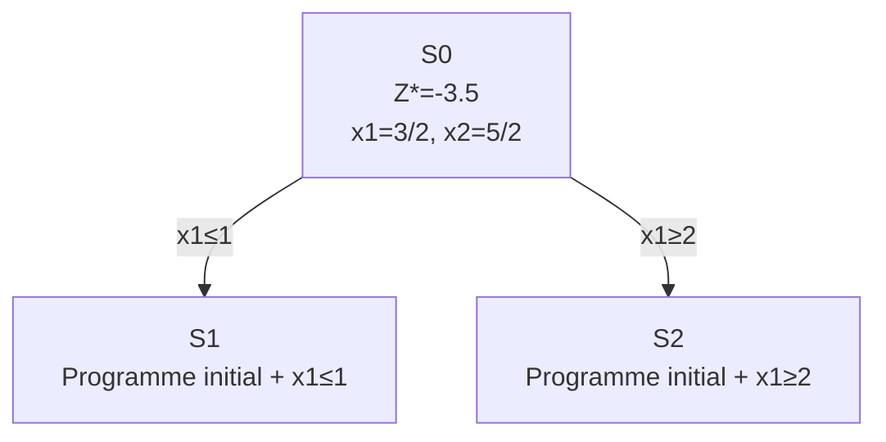
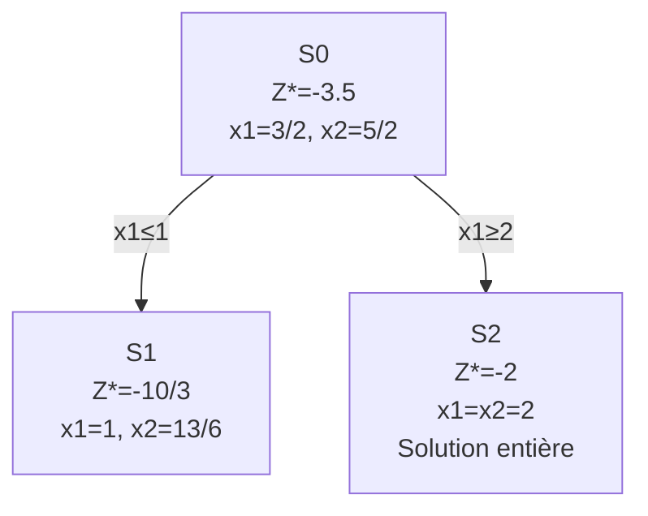
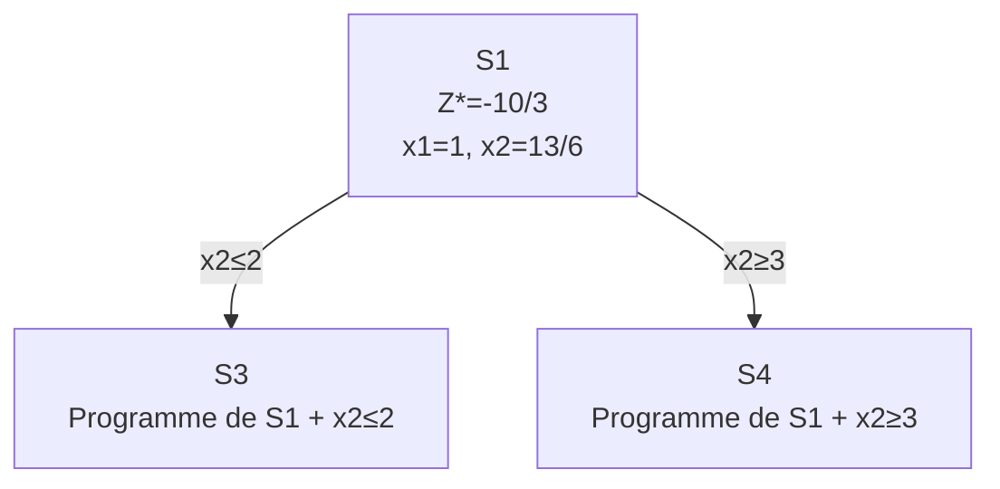
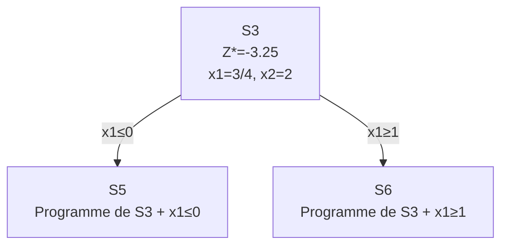
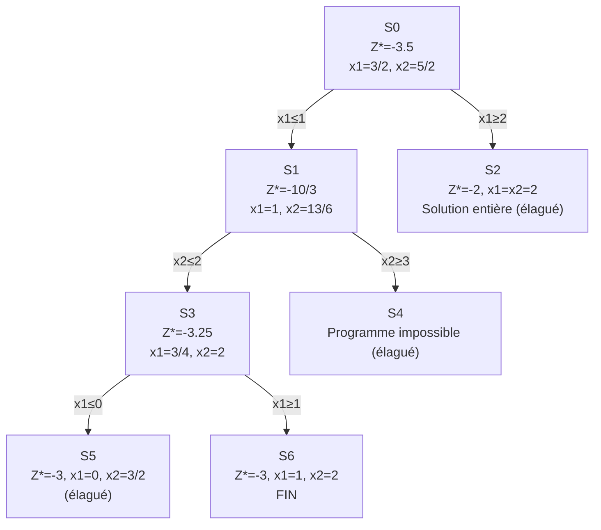

import Tabs from '@theme/Tabs';
import TabItem from '@theme/TabItem';

<Tabs>
<TabItem value="markdown" label="Markdown" default>

# Exemple Branch-and-Bound

*ENSI — RO : Programmation linéaire — notes manuscrites, worked example accompanying the Branch & Bound chapter*

<!-- TODO: this is a handwritten (scanned) worked example. The overall problem, branching tree, and final answer are legible and transcribed faithfully below; the exact digit-by-digit content of several intermediate simplex tableaux (pages 3, 6, 8 of the source) is hard to read with full certainty from the handwriting — those cells are marked individually below. Verify against the original PDF page images if you need to re-derive every pivot step. -->

## Énoncé

$$
\left\{
\begin{aligned}
&\text{Minimiser } Z = x_1 - 2x_2 \\
&\text{s.c.} \\
&-4x_1 + 6x_2 \le 9 \\
&x_1 + x_2 \le 4 \\
&x_i \in \mathbb{N}
\end{aligned}
\right.
$$

## 1) Résolution de la relaxation continue

Forme standard avec variables d'écart $y_1, y_2$ : $-4x_1 + 6x_2 + y_1 = 9$, $x_1 + x_2 + y_2 = 4$.

**Tableau initial** :

|        |     | $x_1$ | $x_2$ | $y_1$ | $y_2$ |
|--------|-----|-------|-------|-------|-------|
| $(-Z)$ | 0   | -1    | 2     | 0     | 0     |
| $y_1$  | 9   | -4    | 6     | 1     | 0     |
| $y_2$  | 4   | 1     | 1     | 0     | 1     |

Pivot sur la colonne $x_2$, ligne $y_1$ (pivot = 6).

**Après 1ère itération** :

|        |     | $x_1$ | $x_2$ | $y_1$ | $y_2$ |
|--------|-----|-------|-------|-------|-------|
| $(-Z)$ | 3   | 1/3   | 0     | -1/3  | 0     |
| $x_2$  | 3/2 | -2/3  | 1     | 1/6   | 0     |
| $y_2$  | 5/2 | 5/3   | 0     | -1/6  | 1     |

Pivot sur la colonne $x_1$, ligne $y_2$ (pivot = 5/3).

**Tableau optimal** :

|        |     | $x_1$ | $x_2$ | $y_1$ | $y_2$ |
|--------|-----|-------|-------|-------|-------|
| $(-Z)$ | 7/2 | 0     | 0     | -3/10 | -1/5  |
| $x_2$  | 5/2 | 0     | 1     | 1/10  | 2/5   |
| $x_1$  | 3/2 | 1     | 0     | -1/10 | 3/5   |

**Solution optimale** : $Z^* = -3.5$, $x^* = (x_1 = 3/2,\ x_2 = 5/2)$ — **solution non entière**.

## Conclusion (nœud $S_0$)

La solution de la relaxation continue est non entière. Pour l'instant, la meilleure borne inférieure est $Z^* = -3.5$. On branche sur $x_1$. $x_1 = 3/2$, donc on considère $x_1 \le 1$ et $x_1 \ge 2$.

## Nœud $S_1$ : $x_1 \le 1$

Rajouter la contrainte $x_1 \le 1$ au tableau optimal obtenu à l'itération précédente du programme de la relaxation continue.

Selon le tableau optimal : $x_1 = \dfrac{3}{2} + \dfrac{1}{10}y_1 - \dfrac{3}{5}y_2$

$x_1 \le 1 \;\Rightarrow$ variable d'écart $y_3$ : $x_1 + y_3 = 1 \;\Rightarrow\; \dfrac{1}{10}y_1 - \dfrac{3}{5}y_2 + y_3 = -\dfrac{1}{2}$

**Tableau avec la nouvelle contrainte** (algorithme dual de simplexe à utiliser) :

|        |      | $x_1$ | $x_2$ | $y_1$ | $y_2$ | $y_3$ |
|--------|------|-------|-------|-------|-------|-------|
| $(-Z)$ | 7/2  | 0     | 0     | -3/10 | -1/5  | 0     |
| $x_2$  | 5/2  | 0     | 1     | 1/10  | 2/5   | 0     |
| $x_1$  | 3/2  | 1     | 0     | -1/10 | 3/5   | 0     |
| $y_3$  | -1/2 | 0     | 0     | 1/10  | -3/5  | 1     |

Pivot (dual simplexe) sur la ligne $y_3$, colonne $y_2$.

<!-- TODO: the resulting tableau on page 3 of the source (columns x1,x2,y1,y2,y3, rows (-Z), x2, x1, y2) is handwritten and the individual cell values for the y2-row and the y1-column entries are not fully legible with certainty; the clearly legible results are the objective and solution below. Verify exact tableau cells against the original image if needed. -->

**Tableau optimal (nœud $S_1$)** : $Z^* = -\dfrac{10}{3}$, $x^* = \left(x_1 = 1,\ x_2 = \dfrac{13}{6}\right)$.

## Nœud $S_2$ : $x_1 \ge 2$

Rajouter la contrainte $x_1 \ge 2$ au tableau optimal obtenu à l'itération précédente.

$x_1 = \dfrac{3}{2} + \dfrac{1}{10}y_1 - \dfrac{3}{5}y_2$ ; $x_1 \ge 2 \;\Leftrightarrow\; -x_1 \le -2$ et $-x_1 + y_4 = -2$

$$\Rightarrow -\frac{1}{10}y_1 + \frac{3}{5}y_2 + y_4 = -\frac{1}{2}$$

|        |      | $x_1$ | $x_2$ | $y_1$ | $y_2$ | $y_4$ |
|--------|------|-------|-------|-------|-------|-------|
| $(-Z)$ | 7/2  | 0     | 0     | -3/10 | -1/5  | 0     |
| $x_2$  | 5/2  | 0     | 1     | 1/10  | 2/5   | 0     |
| $x_1$  | 3/2  | 1     | 0     | -1/10 | 3/5   | 0     |
| $y_4$  | -1/2 | 0     | 0     | -1/10 | 3/5   | 1     |

Après résolution (algorithme dual de simplexe) :

$$Z^* = -2, \qquad x^* = (x_1 = 2,\ x_2 = 2) \qquad \textbf{solution entière}$$

Tableau optimal : solution entière — je n'ai pas besoin de terminer le tableau.

## Interprétation

- Meilleure borne inf. connue à ce stade : $-\dfrac{10}{3}$.
- Le nœud $S_2$ présente une solution entière : c'est un nœud à élaguer, avec $Z^* = -2$ et $x_1 = x_2 = 2$.
- $-\dfrac{10}{3} \le$ solution optimale $\le -2$.
- Solution obtenue au niveau de $S_1$ : $x_1 = 1,\ x_2 = \dfrac{13}{6}$, donc on branche sur $x_2$. $x_2 = 2.1\overline{6}$, donc $x_2 \le 2$ et $x_2 \ge 3$.

## Nœud $S_3$ : $x_2 \le 2$

Rajouter $x_2 \le 2$ au tableau optimal de $S_1$. Selon le tableau de $S_1$ :

$$x_2 = \frac{13}{6} - \frac{7}{10}y_1 - \frac{2}{3}y_3$$

$$x_2 + y_5 = 2 \;\Rightarrow\; -\frac{7}{10}y_1 - \frac{2}{3}y_3 + y_5 = -\frac{1}{6}$$

<!-- TODO: the two tableaux on page 6 of the source (columns x1,x2,y1,y2,y3,y5) are handwritten and several individual cell fractions are hard to read with full confidence; the legible bottom-line result carried forward to page 7 is transcribed below. Verify exact tableau cells against the original image if needed. -->

**Tableau optimal (nœud $S_3$)** : $Z^* = -3.25$, $x^* = \left(x_1 = \dfrac{3}{4},\ x_2 = 2\right)$.

Meilleure borne inf. actuelle : $Z^* = -3.25$. $-3.25 \le Z_{optimal} \le -2$.

On branche sur $x_1$ : $x_1 \le 0$ et $x_1 \ge 1$.

## Nœud $S_5$ : $x_1 \le 0$

$x_1 \le 0$ c-à-d $x_1 = 0$. On a $-4x_1 + 6x_2 \le 9$, $x_1 + x_2 \le 4$, $x_2 \le 2$ et $x_1 = 0$.

$$\Rightarrow \text{la solution optimale est } (x_1 = 0,\ x_2 = 3/2) \text{ et } Z^* = -3$$

## Nœud $S_6$ : $x_1 \ge 1$

Rajouter $x_1 \ge 1$ au tableau optimal obtenu en $S_3$. D'après le tableau :

$$x_1 = \frac{3}{4} + \frac{1}{4}y_1 - \frac{3}{2}y_5$$

$$x_1 \ge 1 \;\Leftrightarrow\; -x_1 \le -1 \text{ et } -x_1 + y_6 = -1 \;\Rightarrow\; -\frac{1}{4}y_1 + \frac{3}{2}y_5 = -\frac{1}{4}$$

|        |      | $x_1$ | $x_2$ | $y_1$  | $y_2$ | $y_3$ | $y_5$ | $y_6$ |
|--------|------|-------|-------|--------|-------|-------|-------|-------|
| $(-Z)$ | 13/4 | 0     | 0     | -1/4   | 0     | 0     | -1/2  | 0     |
| $x_2$  | 2    | 0     | 1     | 0      | 0     | 0     | 1     | 0     |
| $x_1$  | 3/4  | 1     | 0     | -1/4   | 0     | 0     | 3/2   | 0     |
| $y_2$  | 5/4  | 0     | 0     | 1/4    | 1     | 0     | -5/2  | 0     |
| $y_3$  | 1/4  | 0     | 0     | 21/20  | 0     | 1     | -3/2  | 0     |
| $y_6$  | -1/4 | 0     | 0     | -1/4   | 0     | 0     | 3/2   | 1     |

Après pivotage : $x_1 = \dfrac{3}{4} + \dfrac{1}{4}\times 1 = 1$, $x_2 = 2 + 0\times 1 = 2$, $Z^* = \dfrac{13}{4} - \dfrac{1}{4}\times 1 = -3$.

**Solution optimale (nœud $S_6$)** : $Z^* = -3$, $x_1 = 1$, $x_2 = 2$.

## Conclusion

Le nœud $S_2$ ($Z^*=-2$) est éliminé au profit d'une borne inférieure meilleure ($S_1$). Après exploration complète, la meilleure solution entière trouvée est celle de $S_6$ : $x_1 = 1$, $x_2 = 2$, $Z^* = -3$.

### Interprétation géométrique

<!-- TODO: page 10 is a hand-drawn geometric figure showing the feasible triangle for the continuous relaxation, split by the branching cuts x1≤1 / x1≥2 / x2≤2 / x2≥3 into regions labeled S1, S2 (green, retained) and an "Éliminée" (eliminated) middle strip, with the solutions of S0, S1, S2, S3, S5, S6 marked on the boundary — genuine plotted figure, described here rather than re-rendered; see PDF tab for the figure. -->

</TabItem>
<TabItem value="pdf" label="PDF">

<PdfViewer file="/pdfs/pl-exemple-branch-and-bound.pdf" />

</TabItem>
</Tabs>
