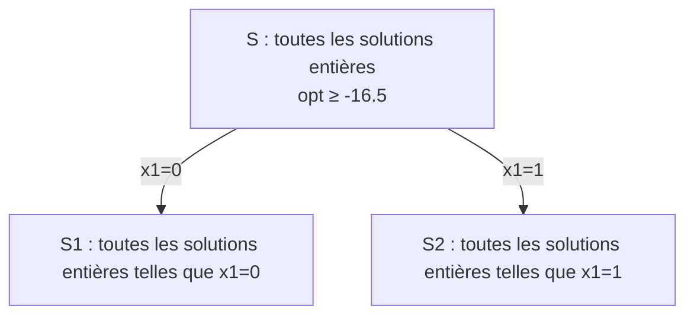
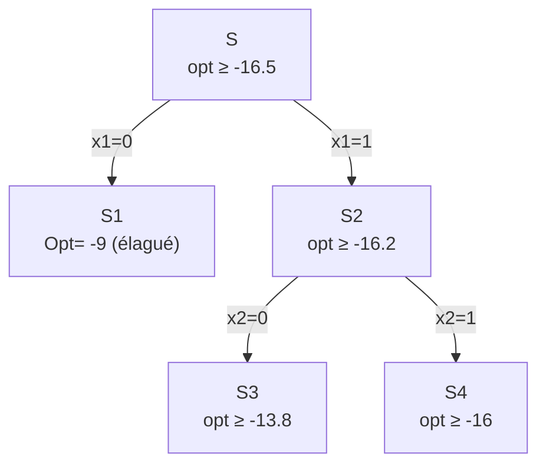
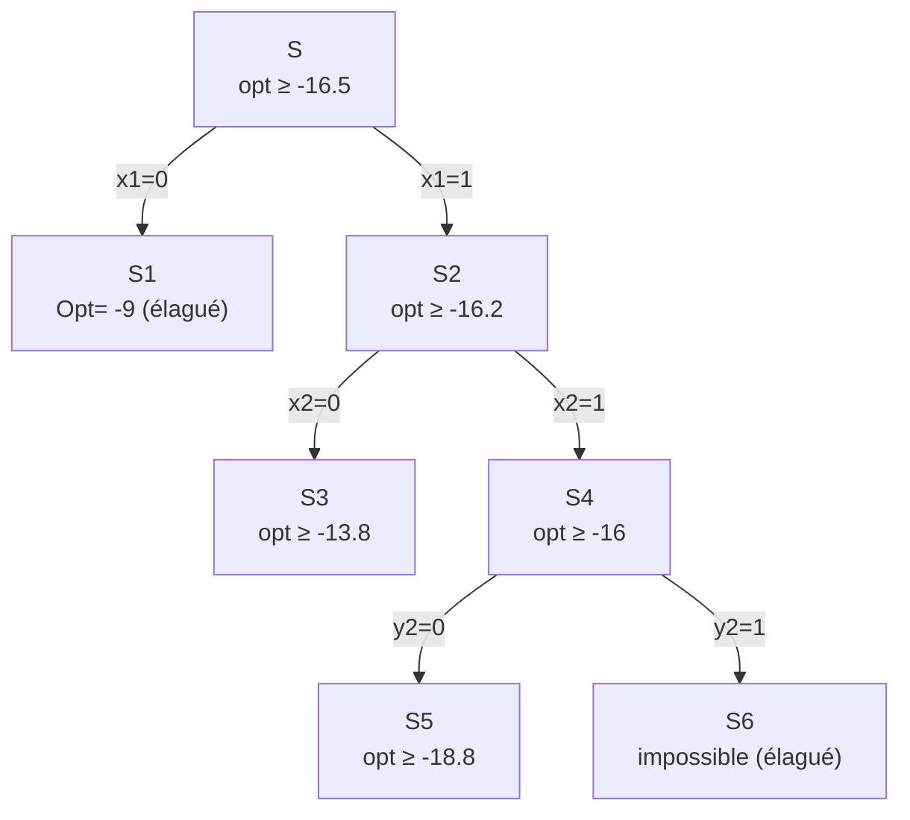
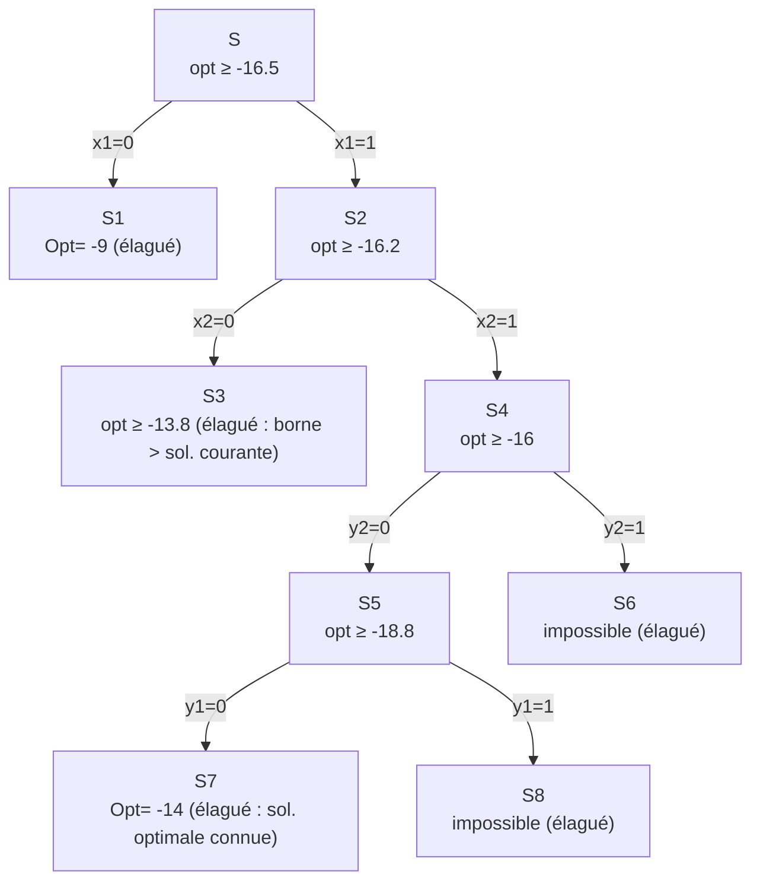

import Tabs from '@theme/Tabs';
import TabItem from '@theme/TabItem';

<Tabs>
<TabItem value="markdown" label="Markdown" default>

# Programmation Linéaire en Nombres Entiers : Méthode de Branch & Bound

*ENSI — N. Elloumi — Recherche opérationnelle*

## Définition PLNE

Programmation linéaire où certaines variables ne peuvent prendre que des valeurs entières.

- Programmation pure (resp. mixte) en NE : la totalité (resp. un sous-ensemble) des variables sont entières.
- Programmation 0-1 ou binaire : les variables entières ne peuvent être que 0 ou 1.

## Exemple 1

$$\max\ x_1 + 0.64x_2$$
$$\text{s.c. :}$$
$$50x_1 + 31x_2 \le 250$$
$$3x_1 - 2x_2 \ge -4$$
$$x_1, x_2 \ge 0 \text{ et entiers}$$

<!-- TODO: page 4 is a geometric figure (feasible triangle with integer lattice points, the continuous optimum (1.95, 4.92) and the integer optimum (5, 0) with objectif 5 marked) — genuine plotted figure illustrating that the continuous and integer optima can be far apart; described here rather than re-rendered, see PDF tab. -->

- Point optimal continu $\left(\dfrac{376}{193}, \dfrac{950}{193}\right) \approx (1.95, 4.92)$, objectif $Z = \dfrac{984}{193} \approx 5.0984$
- Point optimal entier $(5, 0)$, objectif $5$

**Constat** : PL et PLNE sont TRÈS différentes — Optimisation continue convexe / Optimisation discrète.

Suite de ce cours : Utilité de la PLNE, Résolution des PLNE.

## Application 1 : choix d'usines et d'entrepôts

**But** : choisir de nouveaux emplacements pour construire des usines et des entrepôts.

Deux emplacements : Lyon et Toulouse. On ne peut construire plus d'un entrepôt. On ne peut construire un entrepôt que dans une ville où l'on a aussi une usine. On connaît, pour chaque ville : coefficient de rentabilité usine ou entrepôt, coût de construction usine ou entrepôt. Le coût total de construction ne peut pas dépasser 10. **Objectif** : maximiser la rentabilité.

|                | Rentabilité | Coût |
|----------------|-------------|------|
| Usine à L      | 9           | 6    |
| Usine à T      | 5           | 3    |
| Entrepôt à L   | 6           | 5    |
| Entrepôt à T   | 4           | 2    |

**Variables (de décision)** :

- $x_1 = 1$ si une usine est construite à Lyon et 0 sinon
- $x_2 = 1$ si une usine est construite à Toulouse et 0 sinon
- $y_1 = 1$ si un entrepôt est construit à Lyon et 0 sinon
- $y_2 = 1$ si un entrepôt est construit à Toulouse et 0 sinon

**Contraintes** :

1. On ne peut construire plus d'un entrepôt : $y_1 + y_2 \le 1$
2. On ne peut construire un entrepôt que dans une ville où l'on a aussi une usine : $y_1 \le x_1$, $y_2 \le x_2$
3. Le coût total de construction ne peut pas dépasser 10 : $6x_1 + 3x_2 + 5y_1 + 2y_2 \le 10$

**Objectif** : $\max\ 9x_1 + 5x_2 + 6y_1 + 4y_2$

**Résumé du modèle** (c'est notre exemple de base) :

$$
\max\ Z = 9x_1 + 5x_2 + 6y_1 + 4y_2
$$
$$\text{s.c. :}$$
$$y_1 + y_2 \le 1$$
$$y_1 \le x_1$$
$$y_2 \le x_2$$
$$6x_1 + 3x_2 + 5y_1 + 2y_2 \le 10$$
$$0 \le x_1, x_2, y_1, y_2 \le 1 \text{ et entiers}$$

### Exemple de base : résolution par Mosel et Xpress-MP

```
model ExempleBase
 uses "mmxprs"                 ! utilise le solveur Xpress-Optimizer
 Declarations
  x1, x2, y1, y2 : mpvar        ! variables
 end-declarations
! le modèle
Z:=  (-9)*x1 -5*x2 -6*y1 -4*y2       !fonction objectif
! les contraintes
y1 +y2<=1
y1 <= x1
y2 <= x2
6*x1 +3*x2 +5*y1 +2*y2 <= 10
x1 is_binary
x2 is_binary
y1 is_binary
y2 is_binary
! résolution du problème
minimize (Z)
 writeln("Solution: ", getobjval) ! affichage de la valeur de Z
 writeln("valeur de x1 : ", getsol(x1))
 writeln("valeur de x2  : ", getsol(x2))
 writeln("valeur de y1  : ", getsol(y1))
 writeln("valeur de y2 : ", getsol(y2))

end-model
```

Résultat : `Solution: 14`, `valeur de x1 : 1`, `valeur de x2 : 1`, `valeur de y1 : 0`, `valeur de y2 : 0`.

## Résolution des PLNE

Nous allons voir comment résoudre les PLNE :

1. Dans le cas particulier des problèmes purement binaires PL01
2. Dans le cas général des PLNE

### Résolution des PL01 - Exemple de base

$$-\min(-Z) = -9x_1 - 5x_2 - 6y_1 - 4y_2$$

$$\text{s.c. :}$$
$$y_1 + y_2 \le 1$$
$$y_1 \le x_1$$
$$y_2 \le x_2$$
$$6x_1 + 3x_2 + 5y_1 + 2y_2 \le 10$$
$$0 \le x_1, x_2, y_1, y_2 \le 1 \text{ et entiers}$$

#### 1ère idée : énumération

**Idée** : il existe un nombre fini de solutions. Énumérons-les !

<!-- TODO: page 17 is a binary enumeration tree over (x1, x2, y1, y2) with leaf objective values Z=0, Z=-5, Z=-9, Z=-14 labeled at four of the sixteen leaves — genuine tree diagram in the source, described here rather than re-rendered since only 4 of 16 leaf values are legible in the source slide; see PDF tab. -->

Pour $n$ variables binaires, $2^n$ cas possibles. Pour $n=20$, plus d'un million. Pour $n=30$, plus d'un milliard…

**Idée d'énumération de tous les cas possibles impraticable en Optimisation Discrète en général.**

#### 2ème idée : encadrement de la valeur optimale

### Relaxation continue - exemple de base

Relaxation continue = on « oublie » le caractère entier des variables. On obtient un programme linéaire (continu) qu'on sait résoudre, par exemple par la méthode du simplexe :

- Solution $(x_1, x_2, y_1, y_2) = (5/6, 1, 0, 1)$
- Valeur optimale : $-Z = -33/2 = -16.5$

### Relaxation continue : interprétation

Valeurs possibles de toutes les solutions admissibles, entières ou non : de $-\infty$ à $+\infty$, avec $-16.5$ marqué comme borne.

**Conclusion** : la valeur optimale (en entier) $\ge -16.5$.

**Propriété générale** :

- Pour un problème de maximisation, la valeur optimale en entier $\le$ la valeur optimale en continu.
- Pour un problème de minimisation, la valeur optimale en entier $\ge$ la valeur optimale en continu.

On dit que la valeur optimale de la relaxation continue est une **borne** supérieure (si objectif de maximisation) ou une borne inférieure (si objectif de minimisation) de la valeur optimale en entier.

### Connaissance d'une solution admissible

**Question** : quelle information a-t-on si l'on dispose d'une solution admissible ?

**Exemple de base** : Admettons que l'on connaisse la solution $(x_1, x_2, y_1, y_2) = (1, 0, 0, 0)$ de valeur $-Z = -9$.

**Conclusion** : la valeur d'une solution optimale est comprise entre $-16.5$ et $-9$.

**Propriété générale** :

- Pour un problème de minimisation : val. optimale en continu $\le$ **val. optimale en entier** $\le$ val. d'une solution admissible (borne inférieure / borne supérieure).
- Pour un problème de maximisation : val. d'une solution admissible $\le$ **val. optimale en entier** $\le$ val. optimale en continu.

## Algorithme Branch-and-Bound pour résoudre un PLNE

**Ingrédients de base** :

- Encadrement de la valeur optimale (borne inférieure, borne supérieure)
- Énumération limitée dans le but d'obtenir un encadrement de plus en plus fin

Chaque nœud enfant est obtenu à partir de la relaxation du nœud parent en ajoutant les contraintes de branchement accumulées ; sa région réalisable est donc incluse dans celle de son parent.

### B&B - Exemple de base

Dans la solution de la relaxation continue : $(x_1, x_2, y_1, y_2) = (5/6, 1, 0, 1)$, $x_1$ n'est pas entier. On va « brancher » selon les deux valeurs possibles de $x_1$ : 0 et 1.



**Sous-ensemble S1** : $x_1 = 0$

$$-\min -Z = -5x_2 - 6y_1 - 4y_2$$
$$\text{s.c. :}$$
$$y_1 + y_2 \le 1;\ y_1 \le 0;\ y_2 \le x_2$$
$$3x_2 + 5y_1 + 2y_2 \le 10$$
$$0 \le x_2, y_1, y_2 \le 1 \text{ et entiers}$$

Solution de la relaxation continue : $(x_2, y_1, y_2) = (1, 0, 1)$ et $-Z = -9$, et c'est une solution entière ! Solution courante : $-9$.

**Sous-ensemble S2** : $x_1 = 1$

$$-\min -Z = -9 - 5x_2 - 6y_1 - 4y_2$$
$$\text{s.c. :}$$
$$y_1 + y_2 \le 1;\ y_1 \le 1;\ y_2 \le x_2$$
$$3x_2 + 5y_1 + 2y_2 \le 4$$
$$0 \le x_2, y_1, y_2 \le 1 \text{ et entiers}$$

Solution de la relaxation continue : $(x_2, y_1, y_2) = (4/5, 0, 4/5)$ et $-Z = -16.2$.

**Conclusion actuelle** : Meilleure solution admissible connue (solution courante) de valeur $-9$. Meilleure borne inférieure connue : $-16.2$. La valeur optimale est donc comprise entre $-9$ et $-16.2$. Comment continuer ?

Le nœud **S1** peut être **élagué** car on connaît la valeur d'une solution entière optimale dans cet ensemble (valeur solution courante $\ge$ relaxation continue).

Pour le nœud **S2**, on applique le même traitement que pour **S**. Solution de la relaxation continue : $(x_1, x_2, y_1, y_2) = (1, 4/5, 0, 4/5)$ et $-Z = -16.2$. On va brancher sur $x_2$.

**Sous-ensemble S3** : $x_1=1$ et $x_2=0$. Solution de la relaxation continue : $(x_1,x_2,y_1,y_2)=(1,0,4/5,0)$ et $-Z=-13.8$.

**Sous-ensemble S4** : $x_1=1$ et $x_2=1$. Solution de la relaxation continue : $(x_1,x_2,y_1,y_2)=(1,1,0,0.5)$ et $-Z=-16$.



**Conclusion actuelle** : Valeur meilleure solution connue : $-9$. Meilleure borne inférieure connue : $-16$. On ne peut élaguer ni S3 ni S4. On « repart » avec S4 qui a la plus petite borne inférieure. Comme $y_2=0.5$ est fractionnaire, on branche sur $y_2$.

**Sous-ensemble S5** : $x_1=1$, $x_2=1$ et $y_2=0$. Solution de la relaxation continue : $(x_1,x_2,y_1,y_2)=\left(1,1,\dfrac45,0\right)$ et $-Z=-18.8$.

**Sous-ensemble S6** : $x_1=1$, $x_2=1$ et $y_2=1$ : impossible. S6 peut donc être élagué.



**Conclusion actuelle** : Valeur meilleure solution connue : $-9$. Meilleure borne inférieure connue : $-18.8$. On peut repartir soit avec S3 soit avec S5 ; on repart avec S5 qui a la plus petite borne inférieure. Comme $y_1=\dfrac45$ est fractionnaire, on branche sur $y_1$.

**Sous-ensemble S7** : $x_1=1, x_2=1, y_2=0$ et $y_1=0$. Solution unique entière et $-Z=-14 < -9$ donc **Nouvelle solution courante**.

**Sous-ensemble S8** : $x_1=1, x_2=1, y_2=0$ et $y_1=1$ : impossible. S8 peut donc être élagué.



**Conclusion** : on peut s'arrêter car tous les nœuds ont été élagués. On prouve ainsi que la solution optimale est : $x_1=1, x_2=1, y_1=0$ et $y_2=0$. Solution unique entière avec $Z=14$.

### Gain par rapport à l'énumération complète

<!-- TODO: page 46 overlays the B&B exploration path (bold blue) on the full 16-leaf enumeration tree from page 17 — genuine tree diagram, described in prose rather than re-rendered; see PDF tab. -->

Le Branch & Bound n'a exploré que les nœuds S1 à S8, soit 4 décisions de branchement, au lieu des 16 feuilles de l'énumération complète.

## Algorithme B&B (min) - Résumé

**Initialisation** : calculer une solution entière réalisable de valeur $Z^*$ ou poser $Z^*=+\infty$, puis créer le nœud racine.

**Pour chaque nœud non élagué** :

1. Résoudre sa relaxation continue. Si elle est infaisable, élaguer le nœud.
2. Si son optimum satisfait toutes les contraintes d'intégralité, il fournit une solution entière réalisable : mettre à jour $Z^*$ si sa valeur est meilleure, puis élaguer le nœud.
3. Sinon, si une solution courante existe et si la borne inférieure de ce nœud est supérieure ou égale à $Z^*$, élaguer le nœud.
4. Sinon, choisir une variable entière de valeur fractionnaire et créer les deux nœuds fils par branchement.

Lorsque tous les nœuds sont élagués, la solution courante $Z^*$ est optimale.

### Résumé - suite

Pour ce problème de minimisation, la valeur optimale de la relaxation continue d'un nœud est une borne inférieure ; une solution entière courante est une borne supérieure. Un nœud est donc élagué si :

- sa relaxation continue est infaisable ;
- son optimum de relaxation satisfait les contraintes d'intégralité ;
- une solution courante existe et la valeur optimale de sa relaxation continue est $\ge Z^*$.

La mise en place de l'algorithme nécessite de préciser :

- La règle de sélection : quel nœud non élagué choisir ?
- La règle de branchement : sur quelle variable brancher ?

Dans le cas général des variables entières (non seulement 0-1), on choisit une variable de valeur fractionnaire dans la solution optimale de la relaxation continue et on branche sur l'arrondi supérieur et inférieur de cette valeur.

**Exemple** : $x_5 = 132.48$ → on branche sur $x_5 \le 132$ et $x_5 \ge 133$.

## Problème des solutions admissibles

- Ce n'est pas toujours facile (problème général NP-complet).
- Il n'existe pas de méthode générale rapide.
- On peut se contenter de celles qu'on trouve lors de la résolution des relaxations continues.
- Il existe des algorithmes qui fonctionnent bien dans des cas particuliers, par exemple l'arrondi.

## Problème d'efficacité

C'est le nombre de nœuds explorés qui déterminera le temps de calcul. À chaque nœud, on résout un programme linéaire (continu). On ne peut pas prévoir à l'avance le nombre maximal de nœuds qu'il faudra explorer.

En règle générale, un programme linéaire continu se résout « vite ». Un PLNE nécessite du temps…

### Efficacité - Exemple

$$\min Z = \sum_{j=1}^n c_j x_j$$
$$\text{s.c. :}$$
$$\sum_{j=1}^n a_{1j}x_j \le b_1$$
$$\sum_{j=1}^n a_{2j}x_j \le b_2$$
$$x_j \text{ variables binaires}$$

- Problème avec $n=1000$ variables données engendrées aléatoirement.
- Relaxation continue : 0.03 secondes.
- Résolution en entier : 43 secondes (251 402 nœuds).

</TabItem>
<TabItem value="pdf" label="PDF">

<PdfViewer file="/pdfs/pl-plne-branch-and-bound.pdf" />

</TabItem>
</Tabs>
