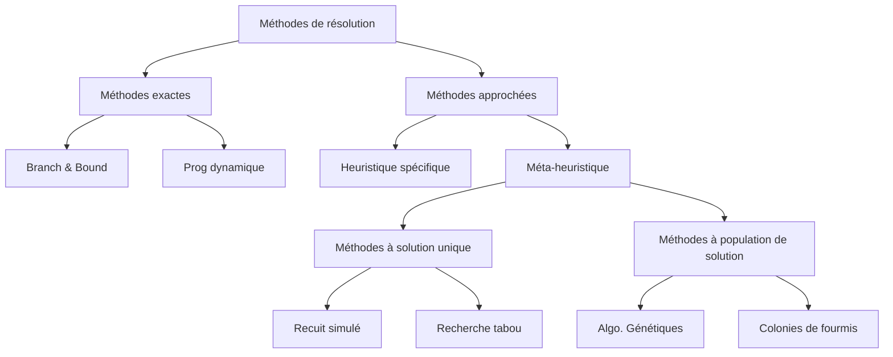

import Tabs from '@theme/Tabs';
import TabItem from '@theme/TabItem';

<Tabs>
<TabItem value="markdown" label="Markdown" default>

# PLNE : Programmation Linéaire en Nombres Entiers

*ENSI — N. Elloumi — Recherche opérationnelle*

## Les objectifs principaux de cette partie du cours

- Savoir modéliser des problèmes en nombres entiers
- Étudier quelques méthodes de résolution
- Savoir utiliser des solveurs

Dans ce cours on s'intéressera à la programmation en nombres entiers.

## Définitions

**Définition 1** : Un **programme en nombres entiers** est un programme dont les variables sont contraintes à ne prendre que des valeurs entières.

**Définition 2** : Si les variables sont contraintes à prendre les valeurs 0 ou 1, on parle alors d'un **programme binaire**. Noté PL01.

**Définition 3** : Un **programme mixte en nombres entiers** est un programme dont certaines variables sont contraintes à ne prendre que des valeurs entières.

## PLNE : Exemple 1

Choisir de nouveaux emplacements pour construire des usines et des entrepôts.

Deux emplacements : V1 et V2.

On ne peut construire un entrepôt que dans une ville où l'on a aussi une usine ; on ne peut construire plus d'un entrepôt.

On associe à chaque construction (d'une usine ou d'un entrepôt dans chacun des lieux envisagés) :

- Sa valeur estimée
- Son coût de construction

**Objectif** : maximiser la valeur totale estimée, en ne dépassant pas une limite maximum sur les coûts.

|                | Valeur estimée | Coût de construction |
|----------------|-----------------|-----------------------|
| Usine à V1     | 9               | 6                     |
| Usine à V2     | 5               | 3                     |
| Entrepôt à V1  | 6               | 5                     |
| Entrepôt à V2  | 4               | 2                     |
| Limite Max     |                 | 10                    |

**Variables** :

$$x_j = \begin{cases} 1 : \text{si la décision } j \text{ est approuvée (oui)} \\ 0 : \text{si la décision } j \text{ est approuvée (non)} \end{cases}$$

**Objectif** : Maximiser la valeur estimée totale.

$$\max Z = 9x_1 + 5x_2 + 6x_3 + 4x_4$$

**Contraintes fonctionnelles**

- Limite maximum sur les coûts de construction : $6x_1 + 3x_2 + 5x_3 + 2x_4 \le 10$
- On ne peut construire plus d'un entrepôt : $x_3 + x_4 \le 1$
- Entrepôt à V1 seulement si usine V1 : $x_3 \le x_1$
- Entrepôt à V2 seulement si usine V2 : $x_4 \le x_2$
- Contraintes 0-1 (intégralité) : $x_j \in \{0,1\}\ \ j=1,2,3,4$ (ou encore $0 \le x_j \le 1$ et $x_j$ entier)

**Modèle** :

$$
\left\{
\begin{aligned}
&Max\ Z = 9x_1 + 5x_2 + 6x_3 + 4x_4 \\
&\text{sous contraintes} \\
&6x_1 + 3x_2 + 5x_3 + 2x_4 \le 10 \\
&x_3 + x_4 \le 1 \\
&-x_1 + x_3 \le 0 \\
&-x_2 + x_4 \le 0 \\
&x_1, x_2, x_3, x_4 \in \{0,1\}
\end{aligned}
\right.
$$

Formulation équivalente de l'intégralité binaire :

$$
\left\{
\begin{aligned}
&Max\ Z = 9x_1 + 5x_2 + 6x_3 + 4x_4 \\
&\text{sous contraintes} \\
&6x_1 + 3x_2 + 5x_3 + 2x_4 \le 10 \\
&x_3 + x_4 \le 1 \\
&-x_1 + x_3 \le 0 \\
&-x_2 + x_4 \le 0 \\
&x_1, x_2, x_3, x_4 \le 1 \\
&x_1, x_2, x_3, x_4 \ge 0 \\
&x_1, x_2, x_3, x_4 \text{ entiers}
\end{aligned}
\right.
$$

## PLNE : Exemple 2

$$
PLNE
\left\{
\begin{aligned}
&\text{Minimiser } Z = x + 10y \\
&\text{sous contraintes} \\
&x, y \text{ entiers} \in X_{ad}
\end{aligned}
\right.
\qquad\text{(Le cas discret — Programme linéaire en nombres entiers)}
$$

**PR** est le Programme de relaxation continue associé à **PLNE** :

$$
PR
\left\{
\begin{aligned}
&\text{Minimiser } Z = x + 10y \\
&\text{sous contraintes} \\
&x, y \text{ réelles} \in X_{ad}
\end{aligned}
\right.
\qquad\text{(Le cas continu — Programme linéaire en nombres réels)}
$$

<!-- TODO: pages 9 and 10 are geometric figures (the feasible polygon X_ad with the integer lattice points marked, showing the PLNE optimum vs. the PR optimum, and then the convex hull P of the integer points) — genuine plotted figures illustrating that the relaxation's optimum need not be integer while the convex hull of integer points gives the exact PLNE optimum via simplex; described here rather than re-rendered, see PDF tab. -->

**Idée** : trouver l'enveloppe convexe des solutions entières et appliquer simplexe.

## Méthodes de résolution

On distingue 4 familles de méthodes de résolution des PLNE :

- **Les recherches arborescentes** : procédure de séparation et évaluation (Branch & Bound, algorithme de Little pour le TSP, Dakin pour la PLNE).
- **Les méthodes de coupes** (ou troncatures) : exemple troncatures de Gomory.
- **La programmation dynamique** : plus court chemin, sac à dos, …
- **Les méthodes approchées** : tabou, recuit simulé, algorithme génétique, colonie de fourmis.

<!-- TODO: page 11's diagram (a classification tree: Méthodes de résolution → Méthodes exactes [Branch & Bound, Prog dynamique] / Méthodes approchées → Heuristique spécifique / Méta-heuristique → Méthodes à solution unique [Recuit simulé, Recherche tabou] / Méthodes à population de solution [Algo. Génétiques, Colonies de fourmis]) is reproduced below as Mermaid since it is a faithful re-rendering of an existing source diagram, not new content. -->

### Des logiciels disponibles

- Cplex / OPL Studio
- GLPK, libre ([http://www.gnu.org/software/glpk/glpk.html](http://www.gnu.org/software/glpk/glpk.html))
- MPL, version étudiant ([http://www.maximal-usa.com](http://www.maximal-usa.com))
- Xpress-MP, version étudiant ([http://www.artelys.fr](http://www.artelys.fr))
- …

**Gratuits**

- COIN-OR ([www.coin-or.org](http://www.coin-or.org))
- GLPK ([www.gnu.org/software/glpk](http://www.gnu.org/software/glpk))

</TabItem>
<TabItem value="pdf" label="PDF">

<PdfViewer file="/pdfs/pl-plne-introduction.pdf" />

</TabItem>
</Tabs>
