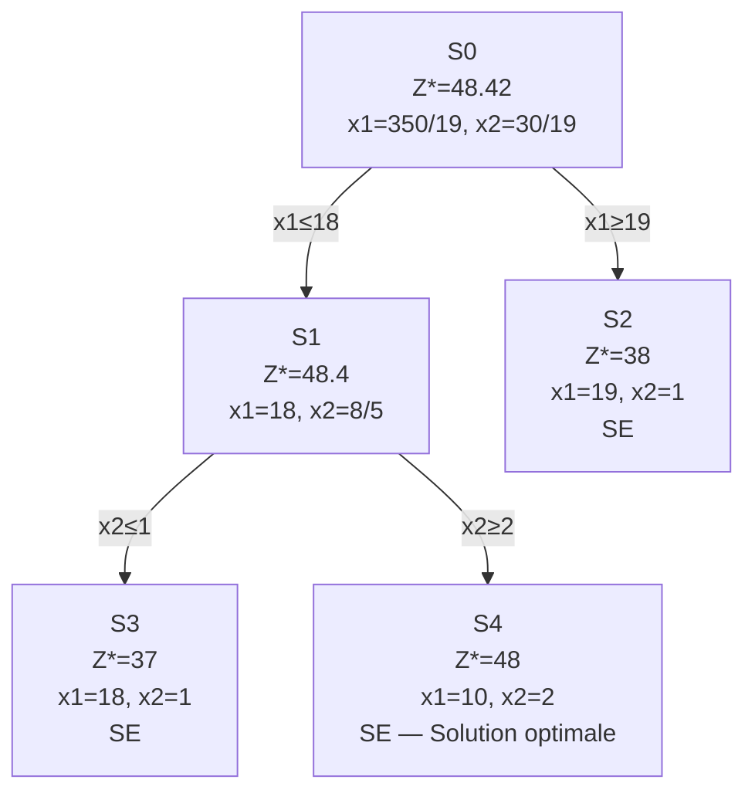

import Tabs from '@theme/Tabs';
import TabItem from '@theme/TabItem';

<Tabs>
<TabItem value="markdown" label="Markdown" default>

# Correction : Série PLNE (Exercices 1 à 9)

*ENSI — Recherche opérationnelle — notes manuscrites*

<!-- TODO: this source PDF ("correct serie plne exo 1-9.pdf") is correction-only — no matching statement PDF was found in this batch (it does not correspond to any of the other PLNE Cours/TD documents already converted: PLNE Introduction, Branch & Bound, or the Gomory/B&B TD series, whose exercise numbers and content don't line up with this one). Transcribed as a standalone correction/reference document per CLAUDE.md §5 rather than inventing the missing exercise statements. Exercice 6's page (page 6) is itself a printed exercise+solution (not handwritten) reproduced in full below since it is the one exercise here whose statement is given in the source. -->

## Exercice 1

a) Vrai — b) Faux — c) Vrai — d) Vrai — e) Faux — f) Faux

## Exercice 2

Nous utilisons les variables : $x_i = \begin{cases}1 & \text{si } P_i \text{ est vraie} \\ 0 & \text{sinon}\end{cases}$

1. $x_1=1$
2. $x_1=1, x_2=1,...,x_n=1 \Leftrightarrow \sum_{i=1}^m x_i = n$
3. $\sum_{i=1}^m x_i \ge k$
4. $x_1 \le x_2$
5. $x_1=x_2$
6.
$$\sum_{i=3}^m x_i \le 2x_1+(n-2)(1-x_1) = n-2-(n-4)x_1$$
$$\sum_{i=3}^m x_i \le 2x_2+(n-2)(1-x_2) = n-2-(n-4)x_2$$

## Exercice 3

Nous utilisons les variables : $x_{ij} = \begin{cases}1 & \text{si le voyageur va de } i \text{ vers } j \\ 0 & \text{sinon}\end{cases}$

Nous souhaitons minimiser $\displaystyle\sum_{i=1}^m\sum_{j=1}^m c_{ij}x_{ij}$

**Les contraintes**

- $\displaystyle\sum_{i=1}^m x_{ij} = 1\ \forall j=1,2,...,n$ (le voyageur entre une seule fois dans chaque ville)
- $\displaystyle\sum_{j=1}^m x_{ij} = 1\ \forall i=1,2,...,n$ (le voyageur quitte une seule fois chaque ville)
- Pour éliminer les sous-tours : $\displaystyle\sum_{i\in S}\sum_{j\in S} x_{ij} \le |S|-1\ \forall S\subset\{1,2,...,n\}$ avec $2\le|S|\le n-1$.

  ou : par connexité $\displaystyle\sum_{i\in S}\sum_{j\notin S} x_{ij} \ge 1\ \forall S\subset\{1,2,...,n\}$ avec $S\ne\emptyset$, $S\ne\{1,2,...,n\}$.

  En remarquant qu'une solution du problème forme un sous-graphe partiel connexe.

- $x_{ij}\in\{0,1\}$

## Exercice 4

Nous utilisons les variables :

- $x_i$ : nombre de poulets qui pondent lors de la période $i=1,2,3,4$
- $y_i$ : nombre de poulets qui éclosent lors de la période $i=1,2,3,4$
- $z$ : nombre de poules qui sont vendues après la 4ème période.

**Fonction objectif** : Maximiser $\displaystyle\sum_{i=1}^4(12\times0,5\times x_i)+3z$

**Les contraintes** :

| Période 1 | 2 | 3 | 4 |
|---|---|---|---|
| $x_1+y_1$ | $x_2+y_2$ | $x_3+y_3$ | $x_4+y_4$ |

$x_1+y_1 = 100$ (poulets au début de la 1ère période)
$x_2+y_2 = x_1+y_1$ (poulets à la 2ème période)
$x_3+y_3 = x_2+y_2+4y_1$ (poulets à la 3ème période)
$x_4+y_4 = x_3+y_3+4y_2$ (poulets à la 4ème période)
$z \le x_4+y_4+4y_3+4y_4-80$ (pour garder 80 poulets)
$x_i,y_i,z\in\mathbb{N}$

## Exercice 5

- On numérote toutes les boîtes du cube (de 1 à 27). À chaque boîte on associe une variable binaire $x_i$ : $x_i = \begin{cases}1 & \text{si la boîte } i \text{ contient une boule noire} \\ 0 & \text{si la boîte } i \text{ contient une boule blanche}\end{cases}$
- On a 49 lignes différentes dans le cube. À chaque ligne on associe la variable binaire $y_j$ : $y_j=\begin{cases}1 & \text{si la ligne } j \text{ contient des boules de la même couleur} \\ 0 & \text{s'il y a des boules de couleurs différentes}\end{cases}$
- Fonction objectif : Minimiser $\displaystyle\sum_{j=1}^{49} y_j$
- Les contraintes :
  - On impose qu'on dispose de 14 boules noires : $\displaystyle\sum_{i=1}^{27} x_i = 14$
  - Assurant que si on a 3 boules identiques sur la ligne $j \Rightarrow y_j=1$. Notons $j_1,j_2$ et $j_3$ les 3 boîtes situées sur la ligne $j$. On a donc à modéliser :

$$x_{j_1}+x_{j_2}+x_{j_3}=0 \quad \text{ou} \quad x_{j_1}+x_{j_2}+x_{j_3}=3 \;\Rightarrow\; y_j=1 \text{ dans les 2 cas.}$$

Ceci peut être modélisé par :

$$y_j \ge 1-x_{j_1}-x_{j_2}-x_{j_3} \qquad y_j\ge x_{j_1}+x_{j_2}+x_{j_3}-2 \qquad \text{pour } j=1,...,49$$

D'où le modèle complet :

$$
\left\{
\begin{aligned}
&\text{Minimiser } \sum_{j=1}^{49} y_j \\
&\text{s.c.} \\
&\sum_{i=1}^{27}x_i=14 \\
&y_j\ge1-x_{j_1}-x_{j_2}-x_{j_3} \qquad 1\le j\le49 \\
&y_j\ge x_{j_1}+x_{j_2}+x_{j_3}-2 \qquad 1\le j\le49 \\
&x_i,y_j\in\{0,1\}
\end{aligned}
\right.
$$

## Exercice 6 — Décision en production industrielle

Une entreprise produisant des billes de plastique veut s'implanter sur une nouvelle zone géographique. Ces billes de plastique sont la matière première de nombreux objets industriels (sièges, manches d'outils, bidons,...). L'entreprise a démarché $n$ clients et prévoit de vendre, sur un horizon de 5 années à venir, $d_i$ tonnes de billes de plastique à chaque client $i\in\{1,...,n\}$. L'entreprise dispose de $m$ sites potentiels $s_1,...,s_m$ pour installer ses usines. On a évalué à $c_j$ euros le coût d'installation d'une usine sur le site $s_j$, $j=1,...,m$. Les usines prévues ne sont pas toutes de même capacité de production : un site $s_j$ aura une capacité de $M_j$ tonnes de billes sur les 5 années à venir, $j=1,...,m$. On suppose que le coût de production est indépendant du lieu de production. Enfin, on connaît les coûts de transport par tonne $c_{ij}$ entre un client $i$ et un site $s_j$, pour $i=1,...,n$ et $j=1,...,m$.

L'entreprise souhaite déterminer les sites sur lesquels établir ses usines pour pouvoir satisfaire la demande de ses clients tout en minimisant le coût total (installation, production et livraison) sur les 5 prochaines années.

Remarquons tout d'abord que, comme le coût de production ne dépend pas du lieu de production, ce coût est fixe quelque soient les choix d'implantation des usines. Les variables du problème se limitent donc à :

- $y_j$ valant 1 si l'on décide d'implanter une usine sur le site $s_j$ et 0 sinon, $j=1,...,m$.
- $x_{ij}$ la quantité en tonnes de billes de plastique à transporter du site $s_j$ au client $i$, $i=1,...,n$ et $j=1,...,m$.

Le problème est alors équivalent au PLNE suivant :

$$\text{Min}\ \sum_{j=1}^m c_jy_j + \sum_{i=1}^n\sum_{j=1}^m c_{ij}x_{ij}$$

$$\sum_{j=1}^m x_{ij}=d_i, \qquad \text{pour tout } i\in\{1,...,n\}, \tag{4.1}$$
$$\sum_{i=1}^n x_{ij}\le M_jy_j, \qquad \text{pour tout } j\in\{1,...,m\}, \tag{4.2}$$
$$y_j\in\{0,1\}, \qquad \text{pour tout } j\in\{1,...,m\},$$
$$x_{ij}\ge0, \qquad \text{pour tout } i\in\{1,...,n\} \text{ et } j\in\{1,...,m\}.$$

Les contraintes (4.1) modélisent le fait qu'il faut couvrir la demande de chacun des clients. On peut noter que ces contraintes pourraient être de manière équivalente écrites $\sum_{j=1}^m x_{ij}\ge d_i$. Les variables de décision $y_j$, $j=1,...,n$ désignent donc le fait qu'une usine est implantée ou non. Ainsi les contraintes (4.2) indiquent que si le site $s_j$, $j=1,...,m$ n'est pas choisi pour l'implantation d'une usine, alors aucune production n'en sortira vers aucun des clients. Dans le cas contraire, cette production devra être limitée à $M_j$ pour l'usine $j$.

On peut noter qu'il s'agit ici d'un problème mixte mêlant des variables continues et des variables de décision binaires.

## Exercice 7

1) On remarque que la valeur de $Z$ diminue lorsqu'on explore l'arbre en profondeur, d'où il s'agit d'un problème de maximisation.

2) Après avoir exploré $P_1$, $P_2$ et $P_3$, on dispose de la meilleure borne sup en $P_3$ et la meilleure borne inf en $P_2$ : $29 \le Z_{opt} \le 32$.

$P_2$ présente une solution entière donc c'est un nœud à élaguer. $P_3$ présente une solution non entière donc on branche par rapport à ce nœud, on aura $P_4$ et $P_5$. $P_4$ présente un programme impossible donc à élaguer. $P_5$ présente une solution non entière avec une nouvelle meilleure borne sup (31) : $29\le Z_{opt}\le31$.

On branche maintenant à $P_5$ : $P_7$ présente une solution entière avec $Z=27$. On a un meilleur résultat en $P_2$ donc $P_7$ à élaguer. $P_6$ présente une solution entière avec $Z=30$, meilleure solution que celle de $P_2$. Tous les nœuds sont élagués, d'où la solution optimale est en $P_6$.

3) Finalement, meilleure borne sup est 30, meilleure borne inf est 30. Ce qui nous donne une solution optimale avec $Z_{opt}=30$.

## Exercice 8

- $S_0$ → Solution non entière : meilleure borne sup 48,42
- $S_2$ → Sol. entière : meilleure borne inf 38
- $S_1$ → Sol. non entière : nouvelle meilleure borne sup 48,4, donc $38\le Z_{opt}\le48,4$
- $S_3$ → Sol. entière, la solution de $S_2$ est meilleure, donc nœud à élaguer.
- $S_4$ → Solution entière, meilleure que celle de $S_2$, donc $S_2$ à élaguer.

Tous les nœuds sont élagués et la solution optimale est en $S_4$ : $x_1=10$, $x_2=2$ et $Z_{opt}=48$.

## Exercice 9

**Tableaux du simplexe et coupes de Gomory** :

<!-- TODO: page 10's sequence of simplex tableaux (columns x1, x2, y1, then e1, then e2) is a dense handwritten derivation; the pivot values and intermediate cell contents are transcribed as best-effort reconstructions below where legible — the key boxed intermediate results (Coupe 1, Coupe 2) and final tableau are clearly legible and transcribed with confidence. Verify against the original page image if you need to re-derive every pivot step. -->

**Coupe 1** : $Frac\left(\dfrac{33}8\right) \le Frac\left(\dfrac54\right)x_2+Frac\left(\dfrac18\right)y_1$

$$\frac78 \le \frac14x_2+\frac18y_1 \;\Rightarrow\; 7\le2x_2+y_1$$

soit la variable d'écart $e_1$ : $-2x_2-y_1+e_1=-7$

**Coupe 2** : $Frac\left(\dfrac72\right) \le Frac\left(\dfrac12\right)y_1+Frac\left(-\dfrac12\right)e_1$

$$\frac12 \le \frac12y_1+\frac12e_1 \;\Rightarrow\; 1\le y_1+e_1$$

soit la variable d'écart $e_2$ : $-y_1-e_1+e_2=-1$

**Tableau optimal** : solution optimale $x_1=1$, $x_2=3$, $Z^*=35$.

**2) Les coupes de Gomory** (exprimées en fonction de $x_1$ et $x_2$)

**Coupe 1** : $7\le2x_2+y_1$, or $y_1=39-8x_1-10x_2 \Rightarrow 7\le2x_2+39-8x_1-10x_2=39-8x_1-8x_2$

$$\Rightarrow 8x_1+8x_2\le32 \;\Rightarrow\; \boxed{x_1+x_2\le4}$$

**Coupe 2** : $1\le y_1+e_1$, on a $e_1=32-8x_1-8x_2$, $y_1=39-8x_1-10x_2 \Rightarrow 1\le71-16x_1-18x_2$

$$\Rightarrow 16x_1+18x_2\le70 \;\Rightarrow\; \boxed{8x_1+9x_2\le35}$$

<!-- TODO: page 11 is a hand-drawn graph plotting the original feasible region, the two Gomory cuts (x1+x2≤4 and 8x1+9x2≤35), and the constraint lines 8x1+10x2=39, marking the optimal solution (1,3) — genuine plotted figure, described in prose here rather than re-rendered; see PDF tab. -->

D'après le graphique, la solution optimale $(1,3)$ correspond bien au point entier obtenu après application des deux coupes de Gomory.

</TabItem>
<TabItem value="pdf" label="PDF">

<PdfViewer file="/pdfs/pl-correction-serie-plne-exo1-9.pdf" />

</TabItem>
</Tabs>
