import Tabs from '@theme/Tabs';
import TabItem from '@theme/TabItem';

<Tabs>
<TabItem value="markdown" label="Markdown" default>

# Série : Programmation linéaire en nombres entiers (Branch and Bound)

*ENSI — Recherche opérationnelle — 2019/2020*

<!-- TODO: the source PDF for this file (pl-td2-branch-and-bound.pdf, Drive-side name "RO - TD2 B&B.pdf") already bundles the exercise statements AND a handwritten correction together, so no separate correction doc was created for it — see the correction inline below each exercise. -->

## Exercice 1

On considère le programme linéaire en variables entières suivant :

$$
(P)
\left\{
\begin{aligned}
&Max[Z(x_1,x_2) = 2x_1+x_2] \\
&x_1+x_2 \le 2 \\
&x_1-x_2 \le 1 \\
&x_i \in \mathbb{N} \quad \text{pour } i=1,2
\end{aligned}
\right.
$$

1) Dessiner le domaine réalisable de (P)
2) Préciser la solution optimale de (P)
3) Résoudre (P) par l'algorithme de Branch and Bound.

Correction

On désigne par : $\Delta_1 : x_1+x_2=2$ ; $(1,1)$ et $(2,0)$ ; $\Delta_2 : x_1-x_2=1$ ; $(1,0)$ et $(0,-1)$.

<!-- TODO: page 4 (correction) is a hand-drawn graph of the feasible region with Δ1, Δ2, Δ0 (the direction Z=3) plotted and the integer feasible points marked — genuine plotted figure, described in prose here rather than re-rendered; see PDF tab. -->

$\Delta_0 : 2x_1+x_2=0$ ; $(0,0)$ et $(1,-2)$. La solution optimale de (P) est $(1,1)$.

Résolution du problème de relaxation lié au problème (P) : on obtient la solution optimale continue $\left(\dfrac32;\dfrac12\right)$ et $Z=\dfrac72$.

La valeur $\dfrac72$ est une borne supérieure pour l'optimum en entiers. La solution optimale continue n'est pas entière. Les deux variables sont fractionnaires. Pour faire la séparation on choisit arbitrairement une variable. On prend $x_1$. On sépare ainsi le domaine : $x_1\le1$ ; $x_1\ge2$.

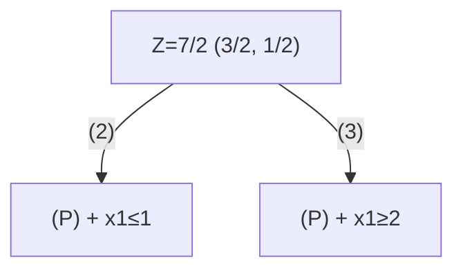

- Le sous-problème (3) n'est pas réalisable car le domaine réalisable est le vide.
- On résout le problème de relaxation lié au sous-problème (2), on obtient $(1,1)$ et $Z=3$.
- Le sous-problème (3) est **stérilisé** car il n'est pas réalisable.
- Le sous-problème (2) est **stérilisé** car on a une solution réalisable candidate.

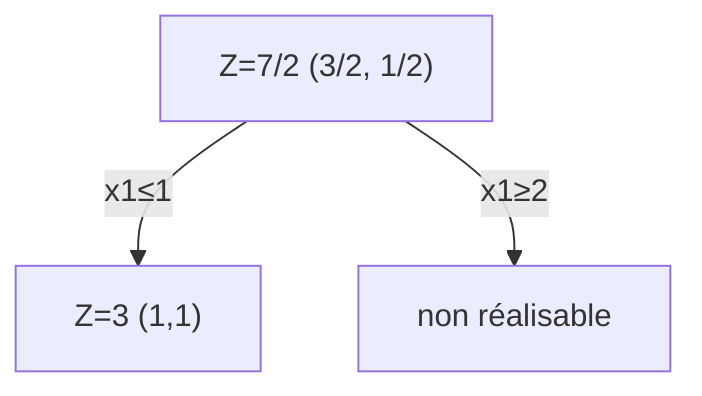

D'où la solution optimale entière est $(1,1)$ et $Z=3$.

## Exercice 2

<!-- TODO: page 1 shows the branch-and-bound tree for this exercise as a diagram (P branching into P1, P2; P1 into P3, P4; P2 into P5, P6; P4 into P7, P8) with Z_inf values labeled on each branch/node — reproduced below as Mermaid since it is a faithful re-rendering of the source diagram, not new content. -->

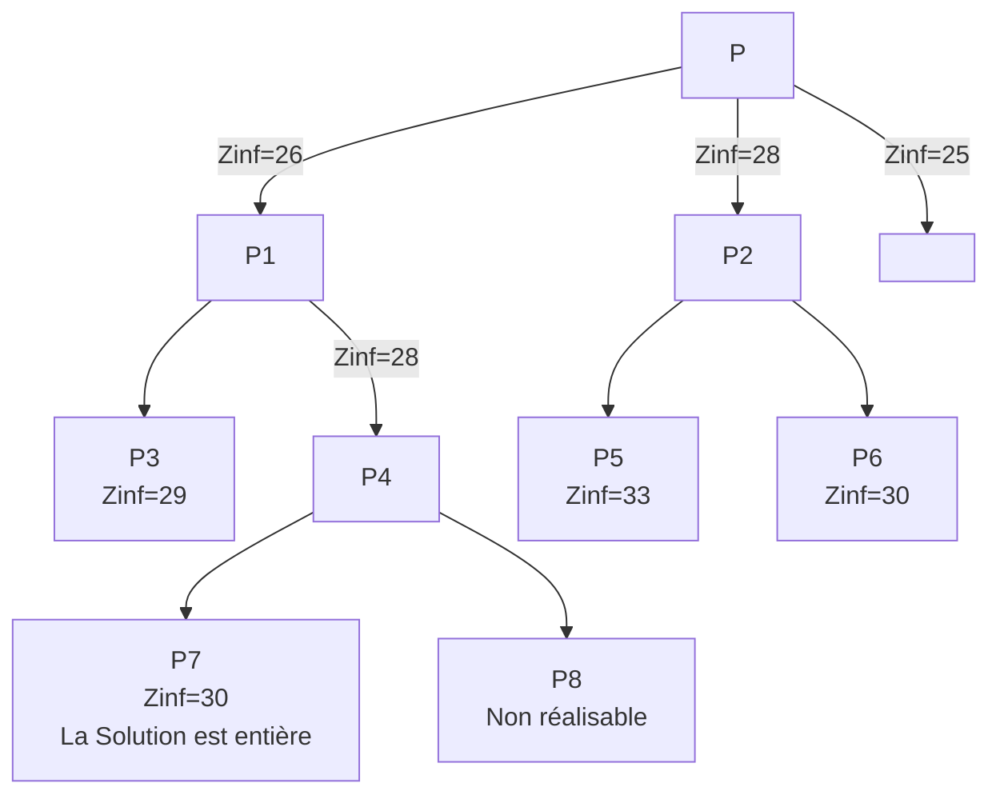

<!-- TODO: the "Zinf=25" edge in the source is drawn directly under node P (a label on the P→P1/P2 split area, not clearly attached to a specific child) — transcribed as a floating label per the source layout; see PDF tab for the exact positioning. -->

1) Préciser si cet arbre représente un problème de minimisation ou de maximisation.
2) Sachant que les nœuds P, P₁, P₂ et P₄ sont explorés, discuter l'exploration des nœuds restants.
3) Donner la meilleure borne inférieure et supérieure possible pour la valeur optimale de Z.

Correction

1) Il s'agit d'un problème de minimisation car la valeur optimale du problème continu qui vaut 25 est une borne inférieure (minorant).

2)
- $P_3$ n'est pas stérilisé car sa valeur 29 est inférieure à la borne supérieure candidate courante 30.
- $P_5$ est stérilisé car sa valeur 33 est supérieure à la borne supérieure candidate courante 30.
- $P_6$ est stérilisé car sa valeur 30 est égale à la borne supérieure candidate courante 30.
- $P_7$ est stérilisé car le sommet est associé à une solution réalisable candidate.
- $P_8$ est stérilisé car le sommet est associé à un sous-problème non réalisable.

3) La meilleure borne inférieure est 29 et la meilleure borne supérieure est 30.

## Exercice 3

On considère le programme linéaire en nombres entiers suivant :

$$
(PLNE)
\left\{
\begin{aligned}
&Max[Z(x_1,x_2) = 10x_1+50x_2] \\
&-x_1+2x_2 \le 5 \\
&x_1+2x_2 \le 14 \\
&x_1 \le 8 \\
&x_i \in \mathbb{N} \quad \text{pour } i=1,2
\end{aligned}
\right.
$$

1) Résoudre graphiquement la relaxation linéaire du programme ci-dessus.
2) On donne l'arbre ci-dessous. Sachant que le premier nœud $P_0$ représente la solution optimale de la relaxation linéaire du PLNE, et que les nœuds $P_1$ et $P_2$ sont déjà explorés, poursuivre la résolution du programme en question par la méthode Branch and Bound.

$$P_0 : Z=282.5,\ x_1=4.5,\ x_2=4.75$$
$$P_1 : Z=265,\ x_1=4,\ x_2=4.5 \qquad P_2 : Z=275,\ x_1=5,\ x_2=4.5$$

Correction

On désigne par : $\Delta_1 : -x_1+2x_2=5$ ; $(-1,2)$ et $(-3,1)$. $\Delta_2 : x_1+2x_2=14$ ; $(6,4)$ et $(2,6)$. $\Delta_3 : x_1=8$. $\Delta_0 : 10x_1+50x_2=0$ ; $(0,0)$ et $(5,-1)$.

<!-- TODO: page 6 (correction) is a hand-drawn graph of the feasible triangle with Δ1, Δ2, Δ3 plotted, the lattice points shown, and the continuous optimum marked — genuine plotted figure, described in prose here rather than re-rendered; see PDF tab. -->

1) La solution optimale du problème relaxé lié à (PLNE) est $(4.5;\ 4.75)$ et $Z=282.5$.
2) D'après les deux premières branches de l'arbre, on voit bien que la deuxième variable des deux sous-problèmes ((1) et (2)) est fractionnaire.

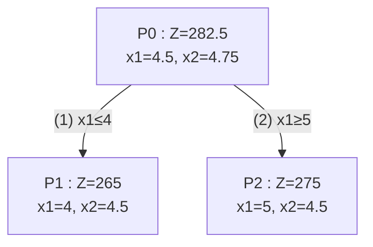

On choisit le sous-problème (1). On sépare ainsi le domaine sur $x_1$ avec les contraintes supplémentaires : $x_2 \le 4$ et $x_2 \ge 5$.

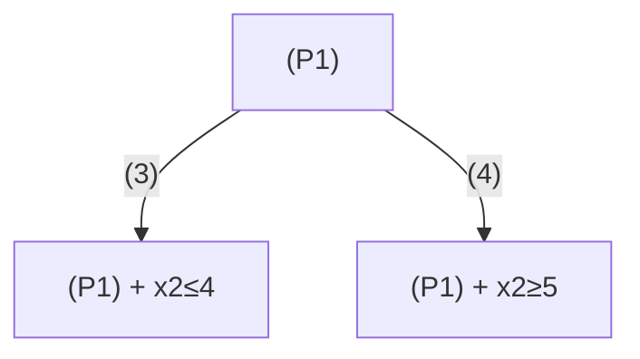

- Le sous-problème (4) n'est pas réalisable donc il est **stérilisé**.
- On résout le problème de relaxation lié au sous-problème (3), on obtient $(4,4)$ et $Z=240$. (il est **stérilisé**)

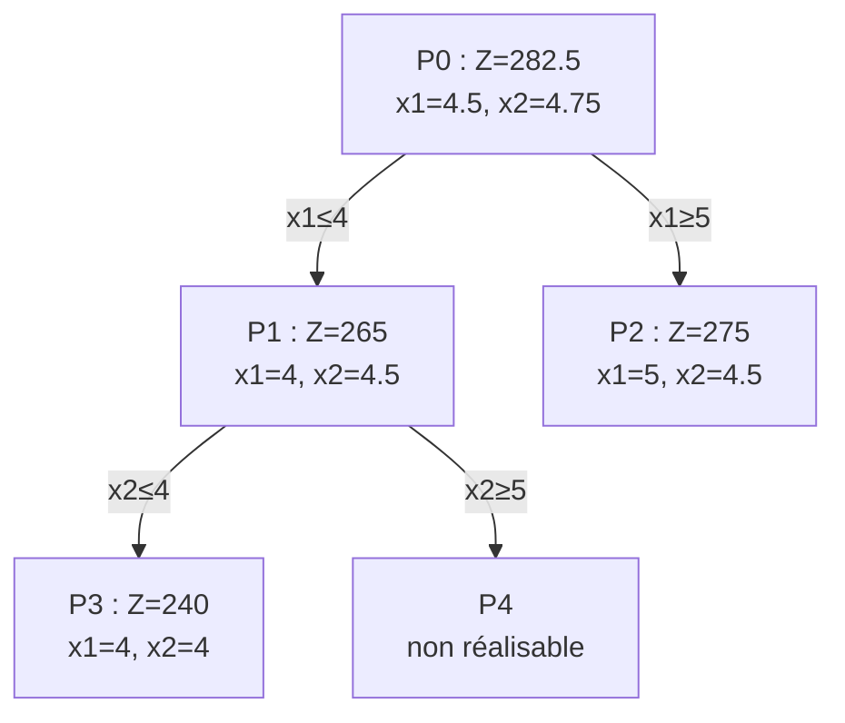

On passe maintenant à la résolution du problème relaxé lié au sous-problème (2). $x_2$ est fractionnaire. On sépare ainsi le domaine : $x_2 \le 4$ ; $x_2 \ge 5$.

- Le sous-problème (6) n'est pas réalisable donc il est **stérilisé**.
- On résout le problème de relaxation lié au sous-problème (5), on obtient $(6,4)$ et $Z=260$. (il est **stérilisé**)

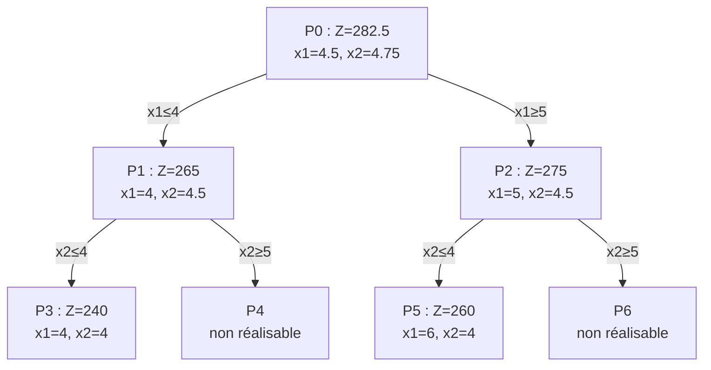

D'où la solution optimale entière est $(6,4)$ et $Z=260$.

## Exercice 4

Résoudre le programme linéaire suivant, par la méthode de séparation et évaluation (Branch and Bound) :

$$
(PL)
\left\{
\begin{aligned}
&Max[Z(x_1,x_2,y_1,y_2) = -9x_1-5x_2-6y_1-4y_2] \\
&y_1+y_2 \le 1 \\
&y_1-x_1 \le 0 \\
&y_2-x_2 \le 0 \\
&6x_1+3x_2+5y_1+2y_2 \le 10 \\
&0 \le x_i \le 1 \text{ et entiers pour } i=1,2
\end{aligned}
\right.
$$

Correction

Il existe un nombre fini de solutions. Énumérons-les !

<!-- TODO: page 9's binary enumeration tree over (x1, x2, y1, y2) with leaf values Z=0, Z=-5, Z=-9, Z=-14 labeled at four of the sixteen leaves is a genuine tree diagram in the source, summarized in prose here rather than individually re-rendered; see PDF tab. -->

Pour $n$ variables binaires, il existe $2^n$ cas possibles. Par exemple : pour $n=20$, il existe plus d'un million de cas possibles ; pour $n=30$, il existe plus d'un milliard de cas possibles.

Par conséquent, l'idée d'énumération de tous les cas possibles est impraticable en optimisation discrète.

**1ère étape** : on va essayer de trouver un encadrement de la valeur optimale de (P). Pour ce faire, on commence par résoudre le problème de relaxation lié à (P), par exemple par la méthode du simplexe, on obtient : $\left(\dfrac56, 1, 0, 1\right)$ et $Z=-16.5$ (la valeur optimale (en entier) $\ge -16.5$).

Admettons que l'on connaisse la solution $(x_1,x_2,y_1,y_2)=(1,0,0,0)$ de valeur $Z=-9$.

**Conclusion** : la valeur d'une solution optimale est comprise entre $-16.5$ et $-9$.

**2ème étape** : $\left(\dfrac56,1,0,1\right)$ est la solution optimale du problème relaxé lié à (P). $x_1$ n'est pas entière donc on va « brancher » selon les deux valeurs possibles de $x_1$ : 0 et 1.

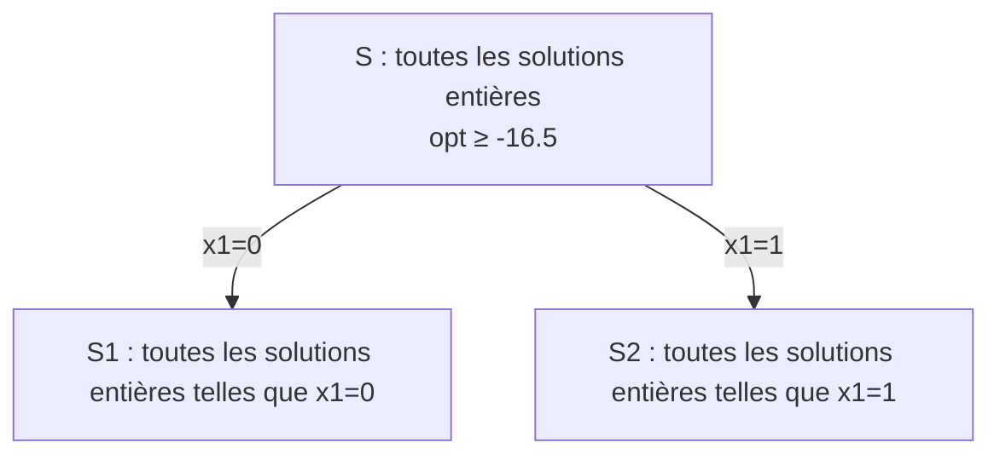

**Sous-ensemble S1** : $x_1=0$

$$\min[Z(x_2,y_1,y_2) = -5x_2-6y_1-4y_2]$$
$$y_1+y_2\le1;\ y_1\le0;\ y_2-x_2\le0;\ 3x_2+5y_1+2y_2\le10$$
$$0\le x_2,y_1,y_2\le1 \text{ et entiers}$$

Solution de la relaxation continue : $(x_2,y_1,y_2)=(1,0,1)$ et $Z=-9$ est une solution entière !

**Sous-ensemble S2** : $x_1=1$

$$\min[Z(x_2,y_1,y_2)=-9-5x_2-6y_1-4y_2]$$
$$y_1+y_2\le1;\ y_1-1\le0;\ y_2-x_2\le0;\ 6+3x_2+5y_1+2y_2\le10$$
$$0\le x_2,y_1,y_2\le1 \text{ et entiers}$$

Solution de la relaxation continue : $(x_2,y_1,y_2)=(4/5,0,4/5)$ et $Z=-16.2$.

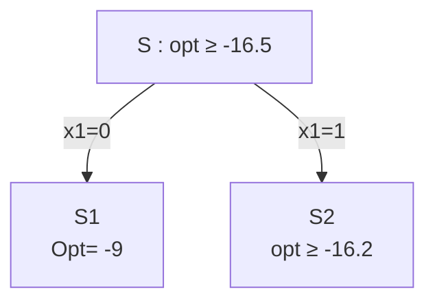

Meilleure solution admissible connue (solution courante) de valeur $-9$. Meilleure borne inférieure connue : $-16.2$. Par conséquent, la valeur optimale est comprise entre $-16.2$ et $-9$.

- Le nœud S1 peut être élagué car la solution est entière (valeur solution courante $\ge$ relaxation continue).
- Pour le nœud S2, on applique le même traitement que pour S.

Solution de la relaxation continue : $(x_1,x_2,y_1,y_2)=(1,4/5,0,4/5)$ et $Z=-16.2$. On va brancher maintenant sur $x_2$.

- **Sous-ensemble S3** : $x_1=1$ et $x_2=0$. Solution de la relaxation continue : $(x_1,x_2,y_1,y_2)=(1,0,4/5,0)$ et $Z=-13.8$.
- **Sous-ensemble S4** : $x_1=1$ et $x_2=1$. Solution de la relaxation continue : $(x_1,x_2,y_1,y_2)=(1,1,0,0.5)$ et $Z=-16$.

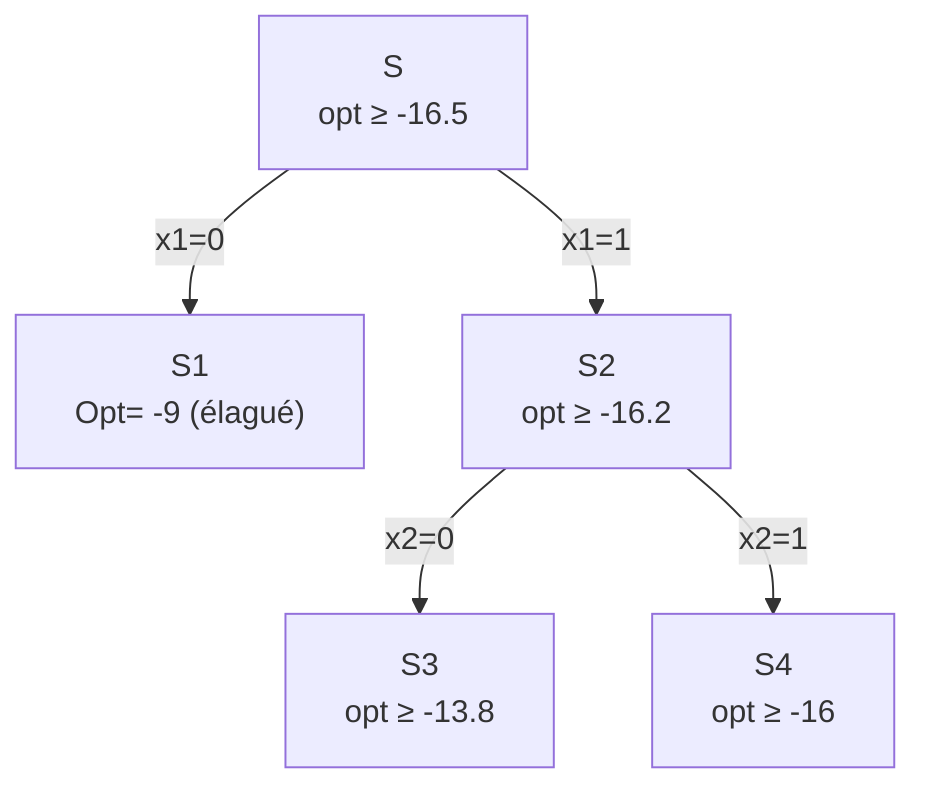

Meilleure borne supérieure connue : $-9$. Meilleure borne inférieure connue : $-16$. Par conséquent, la valeur optimale est comprise entre $-16$ et $-9$.

On ne peut élaguer ni S3 ni S4. On « repart » avec S4 qui a la plus petite borne inférieure. On branche maintenant sur $y_1$.

- **Sous-ensemble S5** : $x_1=1$, $x_2=1$ et $y_1=0$. Solution de la relaxation continue : $(x_1,x_2,y_1,y_2)=(1,1,0,0.5)$ et $Z=-16$.
- **Sous-ensemble S6** : $x_1=1$, $x_2=1$ et $y_1=1$ : impossible. S6 peut donc être élagué.

On peut repartir soit avec S3 soit avec S5, on repart avec S5, on branche maintenant sur $y_2$.

- **Sous-ensemble S7** : $x_1=1$, $x_2=1$, $y_1=0$ et $y_2=0$. Solution unique entière et $Z=-14$ ($<-9$ donc **nouvelle solution courante**).
- **Sous-ensemble S8** : $x_1=1$, $x_2=1$, $y_1=0$ et $y_2=1$ : impossible. S8 peut donc être élagué.

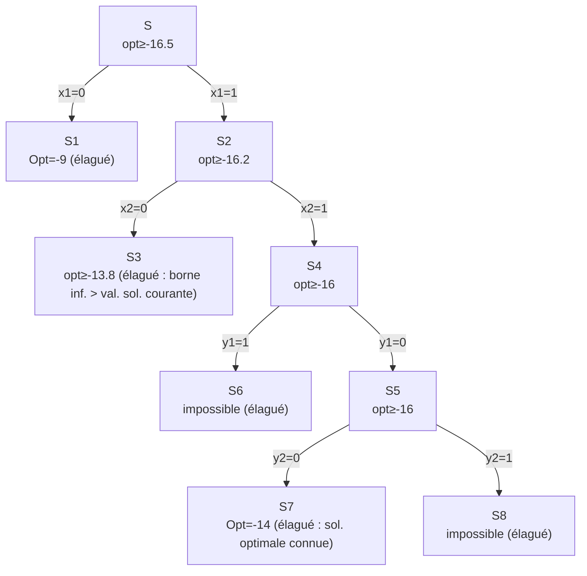

On peut s'arrêter car tous les nœuds ont été élagués. On prouve ainsi que la solution de valeur $-14$ est optimale.

</TabItem>
<TabItem value="pdf" label="PDF">

<PdfViewer file="/pdfs/pl-td2-branch-and-bound.pdf" />

</TabItem>
</Tabs>
