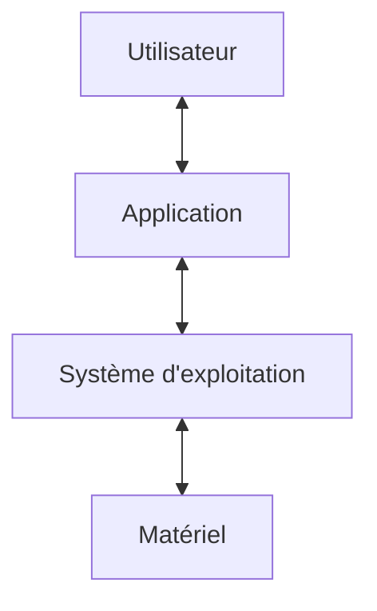

import Tabs from '@theme/Tabs';
import TabItem from '@theme/TabItem';

<Tabs>
<TabItem value="markdown" label="Markdown" default>

# Systèmes d'Exploitation et Programmation Concurrente — II2

*ENSI — chiraz.houaidia@ensi-uma.tn*

## Approche du cours

- Cours intégré (semestre 3) de 45 Heures (3h/semaine)
- Evaluation : 30% DS + 20% CC (Participation + TPs + TDs) + 50% Examen
- Ressources :
  - A. Silberschatz, & P. Glavin and G. Gagne. *Operating Systems Concepts*, 9th edition, John Wiley & sons, inc. 2012 (ISBN-13: 978-1118063330).
  - A. Tanenbaum, & Herbert Bos, *Modern Operating Systems*, 4th edition, Pearson, ISBN-13: 978-0133591620 (2014)
  - Introduction aux systèmes et aux réseaux (S. Krakowiak, Grenoble) [sardes.inrialpes.fr/~krakowia](http://sardes.inrialpes.fr/~krakowia)
  - Operating Systems and System Programming (B. Pfa, Stanford) [cs140.stanford.edu](http://cs140.stanford.edu/)

### Objectifs

- Mieux comprendre les concepts et les mécanismes de base d'un SE multitâches/multithreads
- Techniques et algorithmes de gestion des ressources (processus, threads, mémoire centrale, …) …etc.
- Maîtriser les éléments de la programmation système → Focaliser sur Unix/Linux et le multithread devient nécessaire
  - Fork, wait, exec, pipe, ….
  - `pthread_create`, `pthread_mutex`, `sem_wait`, …
- Prérequis : Pratique du langage C et shell Unix

### Plan du cours

1. Introduction aux systèmes d'exploitation
   - Principe de base d'un SE
   - Structuration des SEs
2. Gestion des Processus et des Threads
   - Notion de ressource/processus/threads
   - Concurrence dans les SEs
   - Commutation de contexte d'un processus
   - Programmation système sous Unix (Programmation multithreadée POSIX/java threads)
3. Ordonnancement (Scheduling)
   - Notion de files d'attentes
   - Politiques d'ordonnancement et comportement des processus/threads
4. Synchronisation et communication des processus/threads – IPC
   - Les mécanismes de synchronisation
   - Verrous (mutex de Pthread), sémaphores, moniteurs, passage par messages, les signaux Unix, les tubes Unix
5. Gestion de la mémoire (physique + virtuelle)
   - Concepts fondamentaux ; allocation statique/dynamique ; politiques d'allocation
6. Interblocage (deadlock)
   - Notion d'interblocage
   - Solutions à l'interblocage (détection/guérison, prévention, évitement)

## Chapitre 1 — Introduction aux systèmes d'exploitation

*Vous avez dit « Système d'exploitation » ? (exemple : Debian)*

### Motivations — Pourquoi étudier les SEs ?

**Domaine mâture**

- Meilleurs programmes (corrects, performants, complexes, …etc)
- Besoin de comprendre l'interaction entre logiciel et matériel
- Tout utilisateur est concerné → Meilleure maîtrise
- Tout programme est concerné → Améliorer l'efficacité
- Les serveurs de haute performance sont confrontés aux mêmes problèmes (afin de ne pas réinventer la roue)

**Challenges**

- Programmation multithread (multicore)/Programmation Parallèle
- Consommation de ressources (batterie, …)
- Sécurité

### Introduction

- Utilisateur = l'humain devant la machine
  - Suivant le contexte : utilisateur final ou développeur
  - Interagit avec la machine, typiquement via les applications
- Applications = les logiciels avec lesquels veut interagir l'utilisateur final
  - Messagerie, traitement de texte, lecteur de musique, etc.
- Matériel = la machine physique
- Et Donc : Operating System = tout le reste
  - Logiciel d'infrastructure : noyau + pilotes + services, etc.
  - Entre le matériel et les applications



### Définition

- Un système d'exploitation est le logiciel qui fait fonctionner une machine.
- C'est le logiciel qui exploite l'universalité de la machine et qui la transforme en un système opératoire apte à accomplir des tâches spécifiques.
- L'environnement d'un utilisateur se construit par des couches logicielles successives basées sur la couche matérielle.
- Le passage par un système d'exploitation est nécessaire.

### Rôle de l'OS : les deux fonctions essentielles

**Machine virtuelle**

- cacher la complexité sous une interface « plus jolie »
- fournir certains services de base aux applications
  - IHM, stockage persistant, accès internet, gestion du temps
- permettre la portabilité des programmes
  - une API normalisée facilite la portabilité du **code source**, mais une recompilation ou une réédition de liens peut rester nécessaire
  - un exécutable binaire dépend généralement de l'ISA, de l'ABI et de la plate-forme cible ; l'exécuter sur une plate-forme incompatible demande une couche compatible, par exemple une virtualisation ou une émulation

**Gestionnaire de ressources**

- Partager chaque ressource entre les applications
- Exploiter « au mieux » les ressources disponibles
- Assurer la protection des applications (et du système)

### Interfaces d'un système d'exploitation

**Notion d'interface (service)**

- L'interface est l'ensemble des fonctions accessibles aux utilisateurs du service
- Chaque fonction est définie par son format (syntaxe), sa spécification (sémantique).
- Ces descriptions doivent être précises, complètes (y compris les cas d'erreur), non ambiguës.
- Une interface permet l'accès à un service tel que :
  - Exécution de programmes
    - charger un programme en mémoire, le lancer, l'arrêter
    - choisir quel programme est au premier-plan
  - Exploration et administration des espaces de stockage
    - naviguer dans les fichiers, copier, supprimer
  - Confort et ergonomie
    - presse-papiers, drag-and-drop, corbeille

**Au moins deux interfaces d'un SE**

- Appels systèmes (System call) : Interface programmable
  - Fonctions fournies par le SE aux applications utilisateurs
  - Généralement accédée par des API (Application Programming Interface) afin de comprendre les réponses des appels systèmes.
    - Les 3 plus courantes : Win32 API, POSIX API et JAVA API
    - Exp. en C : `read(FD, &buffer, nbytes)`
- Interface de commandes (textuelle – CLI ou graphique — GUI)
  - CLI : `rm *.ps`
  - GUI : déplacer l'icône du fichier vers la corbeille

*Appels système : exemples — source : Silberschatz, Operating Systems Concepts Essentials (2011), p 59*

### Le noyau du système

**Définition : Noyau ou kernel** — Le noyau c'est la partie de l'OS qui n'est pas une application.

- **Monolithique** : « Tout en un » seul morceau
  - Plus facile à écrire
  - Moins élégant que les micro-noyaux
- **Micronoyaux** : Client/serveur
  - Plus difficile à écrire
  - Plus résistants aux bugs (donc plus sûrs)

**Noyau monolithique**

- Un seul programme
  - Plus facile à écrire
  - Moins élégant
  - Lourd et difficile à débugger
  - Gâchis de mémoire (tout est chargé)

**Micronoyau**

- Noyau réduit au presque minimum (microkernel), le reste chargé en serveurs
  - Structure client/serveur
  - Gère principalement l'ordonnancement et les transferts de messages entre les programmes
  - Les drivers et les applications s'exécutent en mode utilisateur
  - Portable et facilement maintenable
  - Exemples : Mach, Minix, …etc.

### Modes d'utilisation du système

- Deux modes d'exécution :
  - Le mode superviseur (noyau, maître, …), mode privilégié qui autorise notamment l'appel à des instructions interdites en mode utilisateur (manipulation des interruptions).
  - Ce mode assure la protection du système d'exploitation assisté par le matériel
- Un appel système, une exception ou une interruption transfère le contrôle vers le noyau et peut faire passer le processeur en mode superviseur.
- Ce transfert ne constitue pas nécessairement une commutation de processus : celle-ci n'a lieu que si le noyau ou l'ordonnanceur choisit ensuite d'exécuter un autre processus.

### Interruptions, exceptions et appels système

- **Interruption matérielle** : événement asynchrone signalé par le matériel au processeur.
- **Exception ou trap** : événement synchrone provoqué par l'instruction en cours d'exécution (par exemple division par zéro ou instruction invalide).
- **Appel système** : demande volontaire et contrôlée d'un programme au noyau.

### Sources d'interruptions matérielles

- Minuteur système, ou System Timer
  - interruptions périodiques, typiquement 100Hz ou 1000Hz
  - permet à l'OS de percevoir le passage du temps
  - bonus : permet au noyau de reprendre la main sur les applications
- Périphériques d'entrées-sorties
  - clavier, souris, disque, GPU, réseau, etc
- Pannes matérielles
  - température excessive, coupure de courant, etc

### Architecture d'une machine typique

```
CPU1 CPU2 CPU3 --- System bus --- main memory
                 |
        I/O bridge --- I/O bus --- disk controller --- disk
                                 --- network adapter --- network
USB bus: mouse, keyboard --- USB controller
```

### Applications = CPU en « mode restreint »

**Définition : restricted mode = slave mode = user mode**

- Vue partielle de la machine : 1 CPU + 1 mémoire
- Certaines instructions interdites, certaines adresses interdites
- Utile pour exécuter sereinement du code applicatif
- Instructions disponibles : opérations AL, accès mémoire, sauts

```
ADD R1 <- R3, R4
WRITE [R8] <- R5
CALL 123456
```

### Rappel : le cycle de Von Neumann

```
while True do:
    Charger une instruction depuis la « mémoire »
    Décoder ses bits : quelle opération, quelles opérandes, etc
    Exécuter l'opération et enregistrer le résultat
repeat
```

**Le cycle de Von Neumann avec interruptions**

```
while True do:
    Charger une instruction depuis la mémoire
    Décoder ses bits : quelle opération, quelles opérandes, etc
    Exécuter l'opération et enregistrer le résultat
    If interruption demandée then:
        Sauvegarder le contenu des registres
        déterminer l'adresse de la routine de traitement
        passer en mode superviseur
        Sauter à la routine = écrire son adresse dans le compteur ordinal
    endif
repeat
```

Note : à la fin de la routine de traitement, une instruction de retour d'interruption telle que `RETI` restaure le contexte sauvegardé et l'état de privilège antérieur : le processeur revient donc en mode utilisateur **ou** en mode noyau selon le contexte interrompu.

**Mécanisme d'interruptions : déroulement**

```
Programme principal          Routine de traitement d'interruption
requête d'interruption  -->  sauvegarder les registres
                              charger dans PC l'adresse de début de la routine
                              ISR: ...
                                   ...
                                   RETI
restauration des registres  <--  instruction "retour d'interruption"
```

**Mécanisme d'interruptions : vocabulaire**

- **IRQ = Interrupt Request**
  - un « message » envoyé par un périphérique vers le processeur de façon asynchrone (vs polling, inefficace)
  - chaque IRQ porte un numéro identifiant le périphérique d'origine
- **ISR = Interrupt Service Routine**
  - un fragment de programme (= séquence d'instructions) exécuté à chaque occurrence de l'évènement matériel associé
  - se termine par une instruction de retour d'interruption, telle que `RETI`, qui restaure le contexte interrompu
  - la mise en attente, l'activation, la priorité ou l'imbrication de nouvelles IRQ pendant une ISR dépendent de l'architecture et de la politique du SE
- **Table des Vecteurs d'Interruptions**
  - tableau de pointeurs indiquant l'adresse de chaque ISR
  - le CPU utilise le numéro d'IRQ pour savoir où sauter

**Définition : Noyau ou kernel** — Le noyau c'est (exactement) l'ensemble des ISR de la machine et de toutes les fonctions que celles-ci appellent.

### Démarrage du système (séquence)

1. Au démarrage c'est le Bios qui est exécuté et qui charge aussitôt le noyau du système d'exploitation dans la mémoire (*Kernel is loaded from disk*).
2. Une fois que c'est fait, le bios effectue un saut vers l'adresse du noyau dans la RAM pour débuter son exécution (*Kernel starts*).
3. Le noyau peut ainsi créer son premier processus P0. Il procède comme le bios, il charge le processus dans la mémoire puis il lui cède la main au moyen d'un saut (*P0 starts*).
4. Que se passe-t-il si P0 entre dans une boucle infinie (c'est après tout du code) ? … Le noyau ne pourra jamais reprendre le contrôle …
5. La solution c'est de générer des interruptions périodiques permettant au noyau de reprendre la main de façon régulière et empêcher ainsi les processus qui ont tendance à monopoliser le processeur.
6. Grâce à ces interruptions périodiques, le noyau reprend son rôle d'arbitre pour partager le temps entre plusieurs processus (P0, P1, …).

</TabItem>
<TabItem value="pdf" label="PDF">

<PdfViewer file="/pdfs/se2-ch1.pdf" />

</TabItem>
</Tabs>
