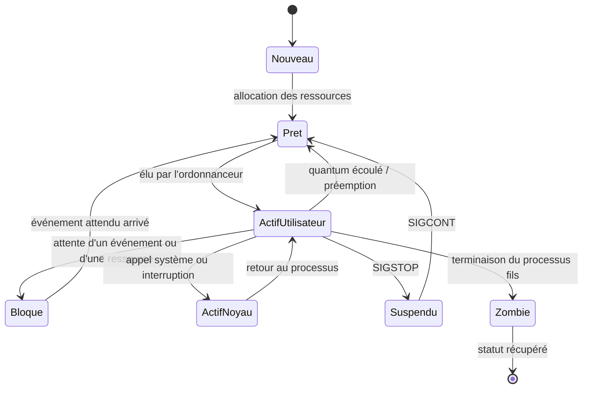
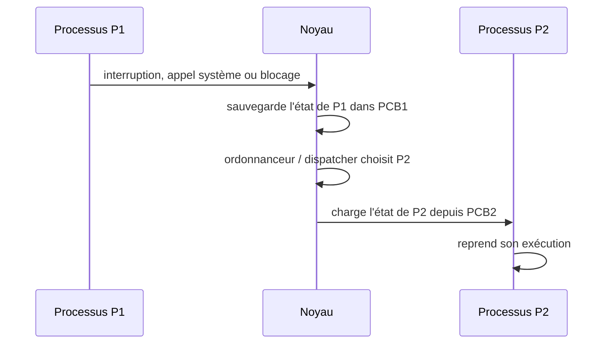

import Tabs from '@theme/Tabs';
import TabItem from '@theme/TabItem';

<Tabs>
<TabItem value="markdown" label="Markdown" default>

# Gestion des processus et des Threads — Partie 1 : Les processus

*ENSI — chiraz.houaidia@ensi-uma.tn*

:::info Vous allez apprendre
- Distinguer un programme d'un processus et identifier son contexte.
- Lire les états d'un processus et les causes de leurs transitions.
- Comprendre quand une entrée dans le noyau devient une commutation de contexte.
- Utiliser les notions essentielles de `fork`, `exec`, `wait` et `waitpid` sous Unix.
:::

## Plan

- Notion de processus
- Parallélisme et concurrence
- Structuration des processus
- Processus en Mémoire Centrale
- Contexte d'un processus
- Etats d'un processus
- Mécanisme de commutation entre processus
- Interactions entre processus
- Les processus sous Unix
  - Identification
  - Création
  - Terminaison

## Notion de processus

**Qu'est-ce qu'un programme ?**

- Ensemble de modules sources/objets
- Résultat de l'édition des liens (Actions manipulant des données)
- Code + Données

**Qu'est-ce qu'un processeur ?**

- Entité matérielle capable d'exécuter des instructions

**Qu'est-ce qu'un processus ?**

:::info Définition — processus
Un processus est une entité dynamique représentant l'exécution d'un programme. Il est créé à un instant donné, son état évolue au cours du temps et il disparaît en général au bout d'un temps fini.
:::

Deux types de processus :

- Système : lancés par le système d'exploitation (démons) ou le super-utilisateur
- Utilisateur : lancés par les utilisateurs

Code de retour d'un processus :

- `=0` : fin normale
- `!=0` : comportement anormal

Un processus a besoin de ressources (mémoire, CPU, données, unités d'E/S) pour s'exécuter → Abstraction du SE pour :

- L'allocation de la MC (code, données, pile) → Espace d'adressage
- L'allocation du processeur

Exemples de processus :

- `echo $PATH` : Exécution d'une commande
- `gcc -o TP TP.c` : Compilation d'un programme C
- `java TP_sys` : Exécution d'un programme
- `firefox` : Navigateur web

Un processus est associé à un contexte qui lui est propre :

- Il a une vision de la mémoire qui lui est propre
- Il ne peut pas voir la mémoire des autres processus
- Il est isolé sur la machine et a l'impression d'être seul
- Les autres processus sont cachés, de même que le système

**Caractéristiques statiques**

- PID : Process Identifier, identifiant unique d'un processus
- PPID : Parent Process Identifier, identifiant unique du parent dans l'arborescence des processus
- Utilisateur propriétaire
- Droits d'accès aux ressources (fichiers, . . . )

**Caractéristiques dynamiques**

- Priorité
- état des registres, . . .
- Données statistiques : temps CPU consommé, …
- Liste des fichiers ouverts

## Processus en mémoire

:::info Définition — contexte d'un processus
Ensemble d'informations nécessaires à la gestion d'un programme en cours d'exécution : code, données et état d'exécution.
:::

:::info Définition — BCP / PCB
Le **bloc de contrôle de processus** (*Process Control Block*, PCB) est la structure de données associée à l'exécution d'un programme ; il regroupe notamment les informations nécessaires à gérer et reprendre le processus.
:::

## Modes d'exécution de processus

Un processus peut s'exécuter au travers de deux modes d'exécution du processeur.

**Mode utilisateur (non-privilégié)**

- Par défaut le processeur exécute le code en mode non privilégié
- Les programmes peuvent juste faire des additions, lectures, écritures, . . . dans leur mémoire
- Quand ils exécutent ces instructions basiques, le processeur ne touche que les données privées du processus

**Mode noyau (privilégié)**

- Si un processus veut faire autre chose que les opérations précédentes, il doit demander l'autorisation à l'OS par une instruction spéciale : un appel système (syscall)
- Le matériel passe en mode privilégié et s'assure via l'OS que l'opération demandée par le processus est possible :
  - ouvrir un fichier, le modifier, le renommer, allouer de la mémoire, créer une tâche, terminer une tâche, . . .
  - tout ce qui est potentiellement sensible et qui pourrait nuire aux autres tâches et utilisateurs

## Visualisation des processus

- La commande `ps` permet de visualiser les processus existant à son lancement sur la machine
- Sans option, elle ne concerne que les processus associés au terminal depuis lequel elle est lancée

## Structuration des processus

- Chaque processus possède un processus parent
  - Sauf le premier processus (`systemd` ou `init`, PID=1)
- Deux types de processus :
  - Processus utilisateurs (attachés à un terminal)
  - Daemons : processus qui assurent un service (détachés de tout terminal)
- La commande `pstree` permet d'afficher l'arborescence des processus s'exécutant à un instant t.
- La commande `top` permet d'afficher dynamiquement les processus avec leur occupation des ressources.

## Parallélisme et concurrence

Deux processus P1 et P2 en mémoire centrale (prêts à s'exécuter). Comment mettre en œuvre l'exécution (concrète) de P1 et P2 ? 2 possibilités (extrêmes) + 1 (intermédiaire).

**Multiprogrammation / Concurrence (Pseudo-parallélisme)**

- Un SE doit, en général, traiter plusieurs processus en même temps
- Entrelacement des exécutions (simuler une exécution parallèle)
- Un cœur de CPU n'exécute qu'un seul flot matériel d'instructions à la fois : sur une machine à un seul cœur, un seul processus/thread s'exécute à un instant donné ; sur une machine multicœur, plusieurs peuvent s'exécuter simultanément sur des cœurs distincts.
- La commutation étant très rapide → Illusion d'un traitement simultané

Les processus peuvent rendre la main eux-mêmes quand :

- ils ont terminé
- ils s'endorment volontairement en attendant un évènement (attente passive)
  - un clic, une frappe clavier,
  - arrivée d'un message réseau,
  - lecture/écriture disque
  - . . .

Mais le système peut aussi leur prendre de force (Preemption) :

- Garantie que tous les processus pourront s'exécuter un peu de temps en temps
- Même si certains sont « méchants » et ne rendent jamais la main (boucle infinie)

## États d'un processus



Le passage de **prêt** à **actif** correspond à la sélection par l'ordonnanceur. Un processus actif redevient prêt lors d'une préemption ou à la fin de son quantum ; il devient bloqué lorsqu'il attend une E/S, une ressource ou un événement, puis redevient prêt quand cet événement survient.

L'entrée en mode noyau (`ActifUtilisateur → ActifNoyau`) est provoquée par un appel système ou une interruption ; elle ne signifie pas à elle seule qu'un autre processus sera exécuté. L'état `Zombie` désigne ici un fils terminé dont le statut reste à récupérer.

## Principes d'ordonnancement

L'ordonnanceur :

- Suit une certaine stratégie (algorithme) pour pouvoir décider de l'allocation de la ressource convoitée
  - FIFO, avec ou sans priorité, …
- Encore faut-il que le processus qui détient actuellement la ressource (CPU) veuille bien la rendre !
  - ordonnancement sans réquisition : la ressource est rendue volontairement
  - ordonnancement avec réquisition : la ressource est réquisitionnée (dès que possible)

## Mécanisme de commutation de processus

Commutation de processus = commutation des contextes de processus. Enchaînement indivisible des opérations suivantes :

- Sauvegarde du contexte du processus
- Chargement d'un autre contexte (depuis un emplacement spécifique de la mémoire vers le processeur)
- Le nouveau processus peut alors être exécuté à partir de l'état où il se trouvait lorsqu'il a été lui-même interrompu

Cette commutation de contexte ne peut s'effectuer que lorsque le processeur se trouve dans un état interruptible.



Une entrée dans le noyau ne déclenche donc pas automatiquement une commutation : elle peut simplement être suivie du retour vers P1. Il y a commutation seulement lorsque le noyau sauvegarde un contexte et restaure celui d'un **autre** processus, comme P2 ici.

Pour pouvoir retarder, et dans certains cas annuler, la prise en compte d'une interruption on utilise le masquage et le désarmement :

- Protéger un processus contre les interruptions les moins prioritaires
- Retarder la commutation jusqu'à ce que le processus le plus prioritaire ait terminé son exécution ou soit lui-même interrompu par un autre plus prioritaire

## Interactions entre processus

Il existe entre les processus un certain nombre de relations, appelées INTERACTIONS. Ces interactions peuvent être de compétition ou de coopération.

**Compétition**

- Situation dans laquelle plusieurs processus doivent utiliser simultanément une ressource à accès exclusif (1 seul processus à la fois), encore appelée ressource critique.
- Exp. : L'usage du processeur (pseudo-parallélisme), Accès à un périphérique (imprimante)
- 2 processus en compétition sont dits en exclusion mutuelle pour cette ressource critique.
- Une solution possible : Faire attendre les processus demandeurs que l'occupant actuel ait fini (FIFO)

**Coopération**

- Situation dans laquelle plusieurs processus collaborent à une tâche commune et doivent se synchroniser pour réaliser cette tâche.
- Deux processus qui coopèrent peuvent également se trouver en exclusion mutuelle pour une ressource commune.

## Les processus sous Unix

### Création d'un processus

La primitive `fork()` permet de créer un nouveau processus (fils) par duplication. Afin de distinguer le père du fils, `fork()` retourne :

- `-1` : en cas d'erreur de création
- `0` : indique le fils
- `> 0` : le pid du processus fils au processus père

Les primitives `getpid()` et `getppid()` permettent d'identifier un processus et son père.

```c
#include <unistd.h>
pid_t fork(void);   // crée un nouveau processus
pid_t getpid(void); // donne le pid du processus
pid_t getppid(void);// donne le pid du père du processus
```

**Exemple 1 :**

```c
#include <stdio.h>
#include <unistd.h>
#include <stdlib.h>
int main(void) {
    printf("%d Bonjour \n", getpid());
    fork();
    printf("%d Au revoir \n", getpid());
    return 0;
}
```

**Exemple 2 :**

```c
#include <stdio.h>
#include <unistd.h>
#include <stdlib.h>
int main(void) {
    int p;
    p = fork();
    if (p == 0) printf("je suis le processus fils\n");
    if (p > 0) printf("je suis le processus père\n");
    return 0;
}
```

**Exemple 3 :**

```c
#include <stdio.h>
#include <unistd.h>
#include <stdlib.h>
int main(void) {
    int p;
    p = fork();
    if (p > 0) printf("processus père: %d-%d-%d\n", p, getpid(), getppid());
    if (p == 0) { printf("processus fils: %d-%d-%d\n", p, getpid(), getppid()); }
    if (p < 0) printf("Probleme de creation par fork()\n");
    system("ps -l");
    return 0;
}
```

### Héritage du processus fils

Le processus fils reçoit un nouveau PID et conserve dans son PPID l'identifiant de son père. Il hérite ou copie une grande partie de l'état du père selon les sémantiques Unix ; certains attributs restent propres au fils :

- Son propre PID est nouveau
- Des temps d'exécution qui sont initialisés à 0
- Des verrous sur les fichiers détenus par le père

L'héritage de la politique et de la priorité d'ordonnancement dépend de la plate-forme et de sa politique : il ne faut pas le présenter comme une non-hérédité universelle ni comme une réinitialisation systématique.

Le fils travaille sur les données du père s'il accède seulement en lecture. S'il accède en écriture à une donnée, celle-ci est alors recopiée dans son espace local.

### Terminaison d'un processus

Un processus se termine lorsque :

- exit normal : dernière instruction (volontaire) `void exit(int status)`
- exit d'erreur (volontaire)
- Erreur fatale/Violation de protection (involontaire)
- Signal envoyé par un autre processus via `int kill(pid_t pid, int sig)`

`kill()` envoie le signal `sig` au processus ou groupe désigné par `pid`. Il ne termine la cible que si le signal et son action entraînent effectivement cette terminaison.

Note : certains processus ne se terminent pas avant l'arrêt de la machine — nommés "demons" (daemon) ou serveurs, ils réalisent des fonctions système (login user, impression, serveur web, …).

### Mauvaise terminaison d'un processus

- Si le processus père termine son exécution avant son fils, ce dernier devient un **processus orphelin** et est adopté par un processus chargé de le recueillir (traditionnellement `init`).

:::info Définition — processus zombie
Un **zombie** est un processus fils qui a terminé, mais dont le statut de terminaison n'a pas encore été récupéré (*reaped*) par son père. Son entrée reste alors disponible pour que le père puisse récupérer ce statut.
:::

### Synchronisation Père-Fils — les primitives `wait` et `waitpid`

`wait()` attend puis récupère le statut d'un fils terminé éligible. `waitpid()` permet de sélectionner plus précisément le fils concerné ; avec l'option `WNOHANG`, elle peut retourner sans bloquer si aucun fils demandé n'est encore prêt à être récupéré. Ces primitives éliminent les zombies et permettent la synchronisation père-fils.

```c
#include <sys/types.h>
#include <sys/wait.h>
pid_t wait(int *etat);
pid_t waitpid(pid_t pid, int *etat, int options);
```

**Exemple — processus zombie :**

```c
#include <stdio.h>
#include <unistd.h>
#include <stdlib.h>
#include <sys/wait.h>

int main(void) {
    pid_t p = fork();
    if (p == 0) {
        _exit(0);              // le fils se termine immédiatement
    }
    if (p < 0) return 1;

    sleep(2);                  // le père reste vivant : le fils est zombie
    system("ps -la");
    waitpid(p, NULL, 0);       // récupère le statut du fils
    return 0;
}
```

**Exemple — processus orphelin :**

```c
#include <stdio.h>
#include <unistd.h>
#include <stdlib.h>
int main(void) {
    int p;
    p = fork();
    if (p == 0) {
        printf("je suis le processus fils %d \n", getpid());
        sleep(2);
        system("ps -la");
    }
    if (p > 0) printf("je suis le processus père %d \n", getpid());
    return 0;
}
```

Le démarrage d'un nouveau processus passe par :

1. Création du nouveau processus (`fork`)
2. Test pour identifier les deux processus et distinguer le père du fils
3. Décider de faire exécuter un nouveau code différent du père : substituer le code du fils par le code qu'on désire exécuter au moyen de l'appel système `exec`

### Questions / Réponses

**1. Un processus est une entité produite après compilation.**

<details>
<summary>Correction</summary>

Non, car un processus est une image d'un programme en exécution.

</details>

**2. Un processus est une entité produite après chargement d'un binaire en mémoire.**

<details>
<summary>Correction</summary>

Non dans le modèle Unix : `fork()` crée un nouveau processus, tandis que `exec*()` remplace l'image exécutable du processus courant. `exec*()` ne crée pas un nouveau processus à lui seul.

</details>

**3. Le pseudo-parallélisme impose aux processus de se connaître mutuellement.**

<details>
<summary>Correction</summary>

Non, car en pseudo-parallélisme les processus perdent la main au profit du système d'exploitation qui allouera le CPU pour un processus éligible.

</details>

**Prochaine étape** : [les threads](./se2-ch2-threads) — les processus peuvent contenir plusieurs flots d'exécution partageant certaines ressources.

</TabItem>
<TabItem value="pdf" label="PDF">

<PdfViewer file="/pdfs/se2-ch2-processus.pdf" />

</TabItem>
</Tabs>
