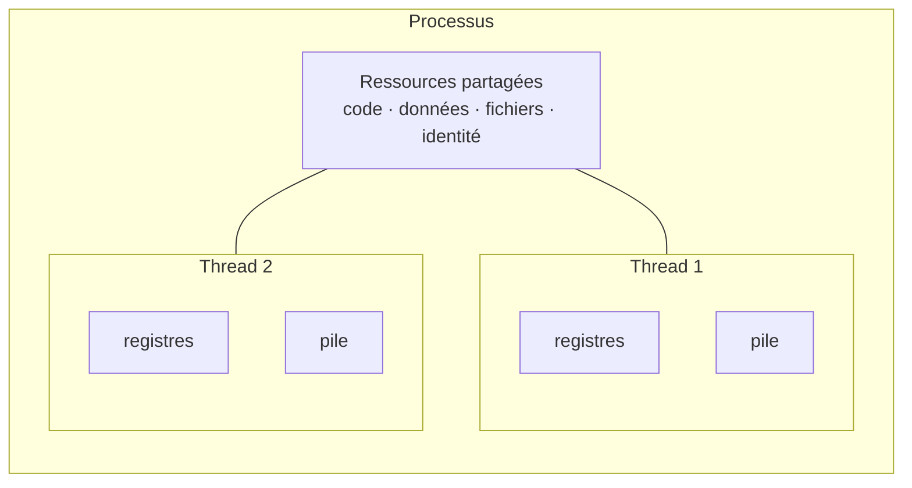
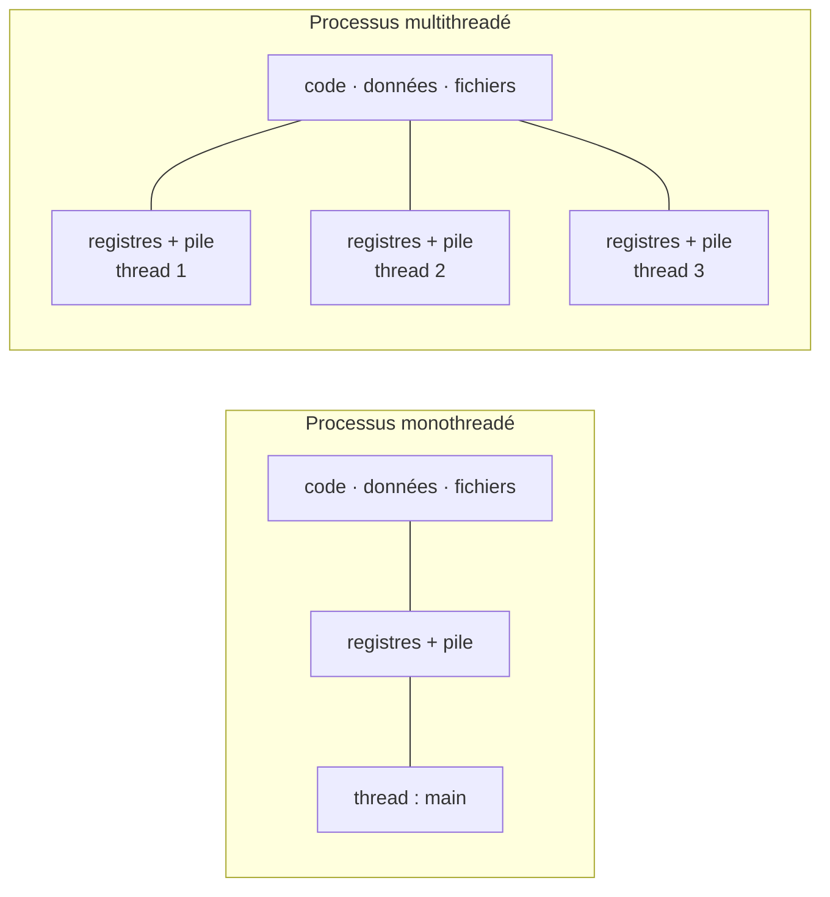
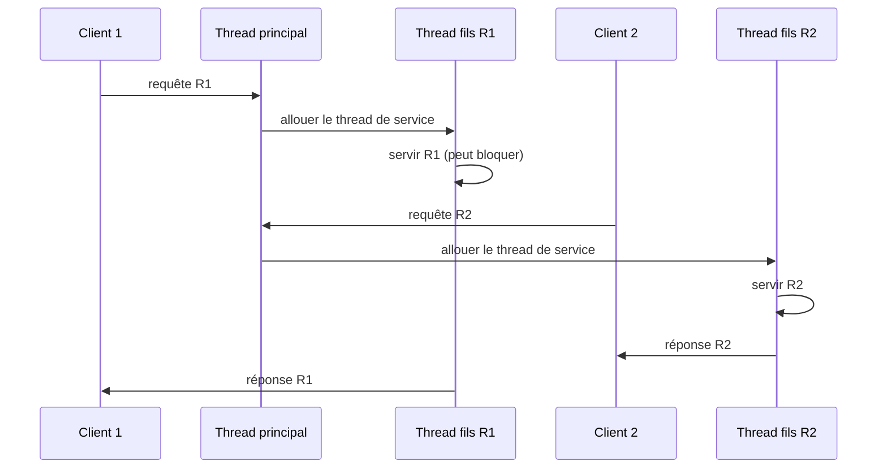
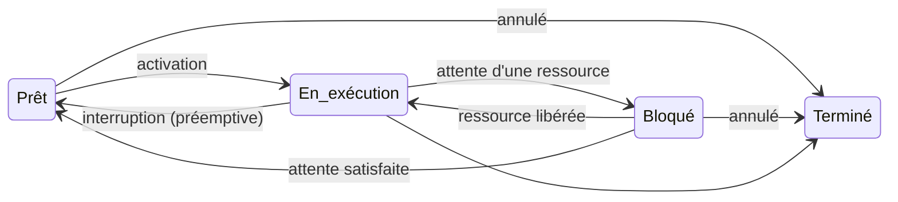
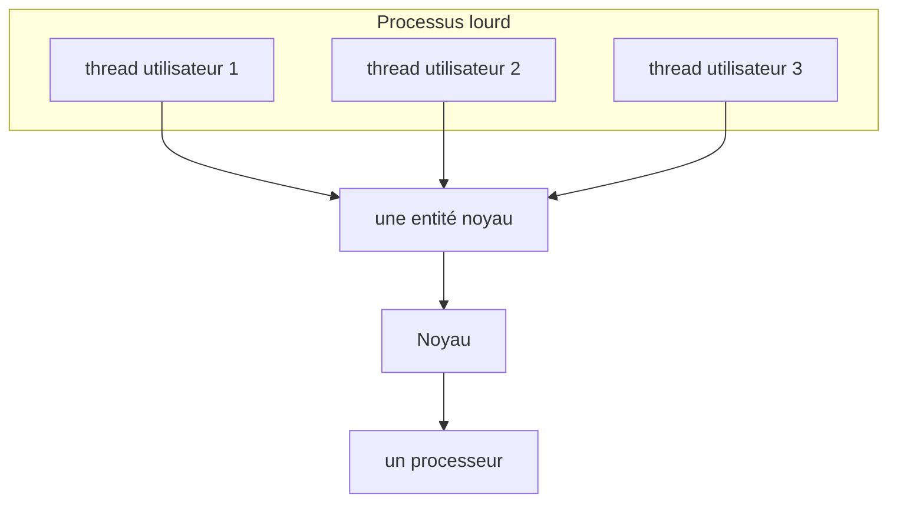
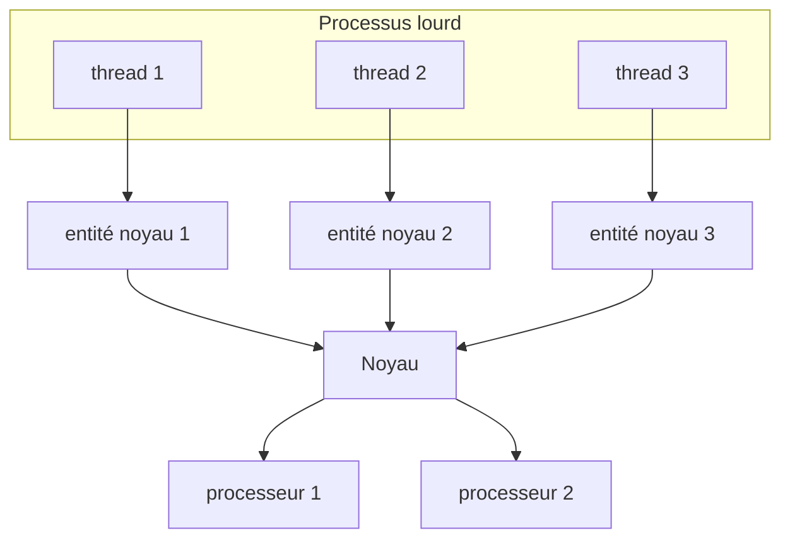
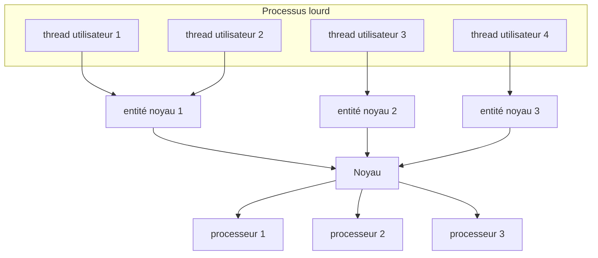

import Tabs from '@theme/Tabs';
import TabItem from '@theme/TabItem';

<Tabs>
<TabItem value="markdown" label="Markdown" default>

# Gestion des processus et des Threads — Partie 2 : Les Threads

*ENSI — II2*

:::info Vous allez apprendre
- Distinguer les ressources d'un processus de celles de chacun de ses threads.
- Lire les états d'un thread et les transitions représentées dans le cours.
- Expliquer pourquoi un serveur multithreadé reste réactif lorsqu'une requête bloque.
- Utiliser `pthread_create`, `pthread_join`, `pthread_exit` et `pthread_self`.
:::

## Motivations

Inconvénients des processus classiques (processus lourds) :

- leur création nécessite des appels systèmes coûteux en temps,
- le changement de contexte entre processus est une opération lente, en particulier pour de nombreux transferts en mémoire,
- 90% de ce temps est consacré à la gestion de la mémoire,
- le coût des mécanismes de protection associés au processus,
- l'interaction, la synchronisation ou la communication entre processus nécessite l'utilisation de mécanismes de communication spéciaux (tube communicant appelé "pipe", socket, …),
- le partage de mémoire entre processus s'effectue par ajout de mécanismes lourds (bibliothèque de partage de mémoire).

## Notion de Thread

:::info Définition — thread
Un **thread** (processus léger, activité ou fil d'exécution) est l'unité d'exécution à laquelle le SE alloue le processeur. C'est un sous-processus — une procédure ou fonction — qui appartient à un processus et peut s'exécuter indépendamment du `main`.
:::

Un processus classique créé par `fork()` ne comporte qu'un seul thread : il est **monothreadé** (`main` en C). Un processus **multithreadé** contient plusieurs flots d'instructions : ils peuvent réellement s'exécuter en parallèle sur plusieurs CPU/cœurs, ou être entrelacés sur un seul cœur.



Chaque thread possède donc son **contexte d'exécution** (registres, compteur ordinal et pile), tandis que les threads du même processus partagent le code, les données, les fichiers et l'identité. C'est précisément ce partage qui rend les threads plus légers que les processus, mais qui rend aussi nécessaire la synchronisation.



Dans le processus monothreadé, le seul fil déroule le code à partir de `main()`. Chaque thread supplémentaire d'un processus multithreadé démarre à la fonction indiquée lors de sa création.

**Multi-threading :**

- avoir plusieurs fils d'exécution dans un même processus
- En quelque sorte, plusieurs petits processus "légers" au sein d'un processus "hôte", "lourd", qui sont les unités à scheduler
- Programmation plus complexe : activités concurrentes, pouvant se dérouler dans un ordre quelconque

Exemples :

- serveurs (http, nfs, …) : un thread pour chaque client qui se connecte
- explorateur de fichiers sous Windows (un thread par fenêtre)
- Éditeur de texte, outils de courrier, navigateur web multi-onglets, …

## Intérêt du multi-threading

**Un serveur programmé sans threads (monothreadé)**

Algorithme :

1. Attendre une requête
2. Analyser la requête
3. Servir la requête
4. Renvoyer réponse au client

Problème : si « servir la requête » se bloque (par ex. dans un appel système de lecture depuis un périphérique lent), tout le serveur est bloqué.

**Un serveur programmé avec des threads**

Algorithme :

- Thread principal
  - Attendre une requête
  - Analyser la requête
  - Allouer un thread « fils » au service
- Un thread fils (requête R1)
  - Servir requête R1 (peut bloquer ici)
  - Renvoyer réponse au client
- Un thread fils (requête R2)
  - Servir requête R2 (peut bloquer ici)
  - Renvoyer réponse au client



Si le service de `R1` attend une E/S lente, le thread principal peut recevoir `R2` et son thread de service peut avancer. L'ordre des réponses n'est donc pas nécessairement celui des requêtes.

## Propriétés d'un Thread

Un processus léger est caractérisé par :

- Un numéro d'identification (thread ID), unique et affecté à la création du processus léger.
- Des registres, pointeur de pile, pointeur d'instruction (compteur ordinal)…
- Un masque de signaux permettant de spécifier quels sont les signaux à intercepter.
- Une priorité utilisée au moment de déterminer quel processus léger peut s'exécuter.
- Des données privées dont l'accès ne peut être réalisé qu'à l'aide d'une clé.

## États d'un Thread

- **Prêt** : le thread est prêt à être exécuté. Cas d'un thread nouvellement créé, d'un thread débloqué, …
- **En exécution** : le thread est en cours d'exécution sur le processeur. Plusieurs threads peuvent être en exécution dans le cas d'une machine multi-processeur.
- **Bloqué** : le thread est en attente sur une synchronisation ou sur la fin d'une opération (entrée/sortie par exemple).
- **Terminé** : le thread a terminé son exécution ou a été annulé. Les ressources du thread vont être libérées et le thread disparaîtra.



Le diagramme reprend les quatre états et les flèches du support. Une annulation peut donc terminer un thread prêt ou bloqué ; lorsque l'attente d'une ressource est satisfaite, le support montre un retour vers `Prêt`, et lorsqu'une ressource est libérée il montre aussi la reprise vers `En exécution`.

## Types des Threads

### User-Level Thread

- tous les processus légers d'un processus lourd se partagent la même entité noyau pour leur exécution
- ça peut être réalisé sous forme de bibliothèque sans modification du noyau du système d'exploitation
- l'application gère les threads (librairie) => Le noyau ignore l'existence de threads



Tous les threads utilisateur sont multiplexés sur la même entité noyau : le noyau voit cette entité, pas les threads individuels.

**Avantages**

- La gestion et la commutation des processus légers sont rapides car elles ne nécessitent pas d'appel au noyau (coûteux en temps).
- La mise en œuvre de cette implantation est possible sur tout système d'exploitation.

**Inconvénients**

- Quand un fil d'exécution fait un appel système bloquant, tous les fils du même processus lourd se bloquent.
- Les processus légers d'un même processus lourd ne peuvent pas exploiter plusieurs processeurs physiques, car l'entité noyau associée est placée sur un processeur physique donné.
- Les processus légers sont invisibles du noyau.
- La gestion de l'ordonnancement des processus légers est laissée à la charge de l'utilisateur.

### Kernel-Level Thread

- chaque processus léger est pris en charge par une entité noyau
- Les processus légers sont totalement implantés dans le noyau du système d'exploitation



Ici, le noyau connaît et ordonnance les threads individuellement ; il peut donc placer des entités différentes sur des processeurs distincts.

**Avantages**

- Les blocages des processus légers se font dans le noyau par le biais d'un blocage de l'entité noyau.
- Les machines multiprocesseurs conviennent mieux à cette implantation, car le système d'exploitation peut placer des entités noyau différentes sur différents processeurs physiques.
- L'ordonnancement des processus légers est laissé à la charge du noyau.

**Inconvénients**

- La gestion des processus légers est réalisée par des appels systèmes coûteux en temps : la commutation de fil ou la synchronisation implique un changement de contexte et des vérifications par le noyau de la validité des paramètres.
- Les entités noyau occupent de la place mémoire, or la mémoire disponible dans le noyau n'est pas illimitée. Cet aspect limite le nombre de processus légers disponibles pour l'ensemble du système.

### Approche Mixte (hybride-combinée)

- Plusieurs processus légers en niveau utilisateur ont à leur disposition plusieurs entités noyau.
- Lorsqu'une entité noyau est bloquée en attente d'une synchronisation ou d'une entrée/sortie, le noyau informe la bibliothèque de niveau utilisateur. Un autre processus léger est engendré pour maintenir le nombre de processus légers en cours d'exécution.



Plusieurs threads utilisateur disposent de plusieurs entités noyau. Si l'une attend une synchronisation ou une E/S, le noyau informe la bibliothèque utilisateur afin qu'un autre thread puisse être exécuté.

**Avantages**

- L'implantation en niveau utilisateur garantit des temps de commutation et de synchronisation très courts et favorise l'extension du système (scalability).
- La présence de plusieurs entités noyau permet d'éviter les blocages des autres fils quand un fil se bloque.
- La multiplicité des entités noyau rend efficace l'exploitation des multiprocesseurs.
- La latence d'un processus bloqué au niveau du noyau est très courte, car une autre entité noyau est réactivée.

**Inconvénients**

- Complexité de la mise en œuvre de cette implantation.
- Cela nécessite une gestion rigoureuse dans la création et la destruction des entités noyau.

## Principales fonctions de manipulation

| Fonction POSIX | Rôle |
| --- | --- |
| `pthread_create(&tid, attr, fonction, arg)` | Crée un thread qui commence dans `fonction(arg)`. |
| `pthread_exit(etat)` | Termine **le thread appelant** et fournit éventuellement une valeur de retour. À la différence de `exit()`, il ne termine pas automatiquement les autres threads du processus. |
| `pthread_self()` | Renvoie l'identifiant du thread courant, l'équivalent conceptuel de `getpid()` pour un processus. |
| `pthread_join(tid, &etat)` | Attend la fin du thread identifié par `tid` et peut récupérer sa valeur de retour. |

Les exemples ci-dessous emploient les primitives du tableau. Pour compiler un programme POSIX threads : `cc -pthread fichier.c -o programme`.

### Exemple 1 — deux flots d'exécution

Deux threads affichent l'alphabet en minuscules et en majuscules, tandis que le thread principal attend leur fin avec `pthread_join()`.

```c title="Deux threads"
#include <pthread.h>
#include <stdio.h>

static void *minuscule(void *arg) {
    (void)arg;
    for (char c = 'a'; c <= 'z'; c++) putchar(c);
    putchar('\n');
    return NULL;
}

static void *majuscule(void *arg) {
    (void)arg;
    for (char c = 'A'; c <= 'Z'; c++) putchar(c);
    putchar('\n');
    return NULL;
}

int main(void) {
    pthread_t thread[2];
    pthread_create(&thread[0], NULL, minuscule, NULL);
    pthread_create(&thread[1], NULL, majuscule, NULL);
    pthread_join(thread[0], NULL);
    pthread_join(thread[1], NULL);
    return 0;
}
```

Les caractères et les deux lignes peuvent s'entrelacer : le système ne promet pas l'ordre d'exécution des threads. Les `join` empêchent seulement le processus de se terminer avant eux.

### Exemple 2 — donnée globale partagée

Le support crée deux threads qui incrémentent tous les deux `x`. C'est un exemple volontairement dangereux : `x++` n'est pas une opération atomique.

```c title="Course critique sur x"
#include <pthread.h>
#include <stdio.h>

#define N 10000
static int x = 0;

static void *incrementer(void *arg) {
    (void)arg;
    for (int c = 0; c <= N; c++) x++;
    return NULL;
}

int main(void) {
    pthread_t thread[2];
    pthread_create(&thread[0], NULL, incrementer, NULL);
    pthread_create(&thread[1], NULL, incrementer, NULL);
    pthread_join(thread[0], NULL);
    pthread_join(thread[1], NULL);
    printf("x = %d (attendu : %d)\n", x, 2 * (N + 1));
    return 0;
}
```

La valeur affichée peut être inférieure à la valeur attendue : deux threads peuvent lire la même ancienne valeur avant qu'un seul écrive. La correction par mutex sera étudiée dans le chapitre sur la synchronisation.

### Exemple 3 — passer un argument au thread

Chaque création reçoit l'adresse d'un élément différent du tableau `id`; la fonction `hello` reconvertit ensuite `void *` en `int *`.

```c title="Argument d'un thread"
#include <pthread.h>
#include <stdio.h>

static void *hello(void *arg) {
    int *id = arg;
    printf("thread %d : hello world\n", *id);
    return NULL;
}

int main(void) {
    pthread_t thread[3];
    int id[3] = {1, 2, 3};

    for (int i = 0; i < 3; i++)
        pthread_create(&thread[i], NULL, hello, &id[i]);
    for (int i = 0; i < 3; i++)
        pthread_join(thread[i], NULL);
    return 0;
}
```

Le tableau `id` reste vivant jusqu'aux `join`, donc chaque thread peut lire l'entier qui lui a été confié. Passer l'adresse de la variable de boucle `i` aurait au contraire créé une course sur une même variable partagée.

**Prochaine étape** : [l'ordonnancement](./se2-ch3-ordonnancement) choisit quel thread prêt reçoit le processeur et pendant combien de temps.

</TabItem>
<TabItem value="pdf" label="PDF">

<PdfViewer file="/pdfs/se2-ch2-threads.pdf" />

</TabItem>
</Tabs>
