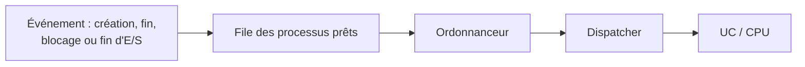
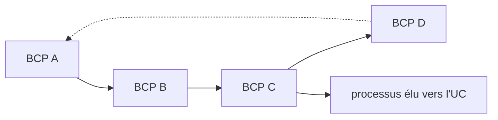
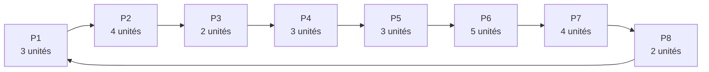
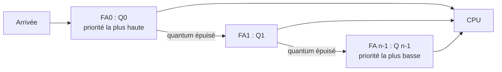

import Tabs from '@theme/Tabs';
import TabItem from '@theme/TabItem';

<Tabs>
<TabItem value="markdown" label="Markdown" default>

# Chapitre 3 : Ordonnancement des Processus — II2-ENSI

:::info Vous allez apprendre
- Identifier les moments où l'ordonnanceur doit choisir un processus.
- Distinguer les politiques préemptives et non préemptives.
- Calculer les temps de séjour et d'attente à partir d'un diagramme de Gantt.
- Comparer FIFO, SJF, Round Robin et SRTF sur les exemples du cours.
:::

## Motivations

- Lorsqu'un ordinateur est multiprogrammé, il possède fréquemment plusieurs processus/threads en concurrence pour l'obtention de temps processeur.
- S'il n'y a qu'un seul processeur, un choix doit être fait quant au prochain processus à exécuter.
- La partie du système d'exploitation qui effectue ce choix se nomme l'ordonnanceur (*scheduler*) et l'algorithme qu'il emploie s'appelle algorithme d'ordonnancement (*scheduling algorithm*).

## Quand ordonnancer

- Lorsqu'un nouveau processus est créé → il faut se décider s'il faut exécuter d'abord le processus parent ou le processus enfant.
- Lorsqu'un processus se termine → un autre processus doit être choisi parmi les processus prêts.
- Lorsqu'un processus bloque sur des E/S, un sémaphore ou autre → un autre processus doit être sélectionné pour être exécuté.
- Lorsqu'une interruption d'E/S se produit → il faut prendre une décision d'ordonnancement parmi les processus qui étaient bloqués en attente d'E/S.



À chaque événement, l'ordonnanceur choisit dans la file des prêts ; le dispatcher effectue ensuite le changement de contexte nécessaire pour remettre le choix sur l'UC.

## Objectifs de l'ordonnanceur

Le SE doit faire un choix — algorithme d'ordonnancement :

- **Equité** : chaque processus doit recevoir sa part du temps processeur
- **Efficacité** : le processeur doit être utilisé à 100%
- **Temps de réponse** : l'utilisateur devant sa machine ne doit pas trop attendre (mode interactif)
- **Temps d'exécution** : une séquence d'instructions ne doit pas trop durer (minimiser le temps d'attente en traitement par lots)
- **Rendement** ("throughput") : il faut faire le plus de choses en une unité de temps

## Organisation des files d'attente (FA)

Une file d'attente, soit FA, des processus prêts :

- Espace réservé dans la mémoire centrale, contenant les informations relatives aux entités que gère la FA (pointeur sur les BCPi).
- Principe de chaînage d'une FA : avant / arrière / mixte
- Plusieurs processus sont mis dans une FA, et le service demandé leur est fourni tour à tour, en fonction de critères de gestion spécifiques à la FA.



La politique d'ordonnancement détermine quel BCP est retiré ou consulté en premier ; la file elle-même contient donc des références vers les BCP, pas les programmes complets.

## Types d'ordonnancement

**Ordonnancement non préemptif (sans réquisition)**

- Sélectionne un processus, puis le laisse s'exécuter jusqu'à ce qu'il se bloque, ou qu'il libère volontairement le processeur.
- Même s'il s'exécute pendant des heures, il ne sera pas suspendu de force.
- Aucune décision d'ordonnancement n'intervient pendant les interruptions d'horloge.

**Ordonnancement préemptif (avec réquisition)**

- Sélectionne un processus et le laisse s'exécuter pendant un délai déterminé.
- si le processus est toujours en cours d'exécution à l'issue de ce délai, il est suspendu et l'ordonnancement sélectionne un autre processus à exécuter.

| Sans réquisition | Avec réquisition |
| --- | --- |
| Le processus garde l'UC jusqu'à son blocage ou sa libération volontaire. | Le processus peut perdre l'UC à la fin de son quantum ou lorsqu'un choix plus prioritaire s'impose. |
| Pas de décision pendant les interruptions d'horloge. | Les interruptions d'horloge peuvent déclencher une décision. |

## Ordonnancement non préemptif (sans réquisition)

### FIFO (First In First Out)

- Premier arrivé, premier servi
- Un processus s'exécute jusqu'à sa terminaison, sans retrait forcé de la ressource
- Même priorité pour les processus (aucun privilège entre les processus)
- Facile à implanter, mais peu efficace (le choix n'est pas lié à l'utilisation de l'UC)

| Processus | Durée estimée | Date d'arrivée |
| --- | ---: | ---: |
| P1 | 24 | 0 |
| P2 | 8 | 1 |
| P3 | 12 | 2 |
| P4 | 3 | 3 |

```text title="FIFO — diagramme de Gantt"
P1                      P2      P3          P4
0-----------------------24-------32-----------44---47
```

Exemple — Temps de traitement moyen = [(24 − 0) + (32 − 1) + (44 − 2) + (47 − 3)] / 4 = 35,25

### SJF — Shortest Job First

Algorithme du "Plus Court d'Abord" :

- Suppose la connaissance des temps d'exécution : estimation de la durée de chaque processus en attente
- Les processus sont disponibles simultanément → Algorithme optimal (sans préemption)
- Exécuter le processus le plus court → Minimise le temps moyen d'exécution

En général, en considérant un lot de quatre processus dont les temps respectifs d'exécution sont a, b, c, d :

- Le premier processus se termine au bout du temps a,
- le deuxième processus se termine au bout du temps a+b,
- le troisième processus se termine au bout du temps a+b+c,
- le quatrième processus se termine au bout du temps a+b+c+d

Le temps moyen de séjour est t = (4a+3b+2c+d)/4

:::note Résultat — optimalité de SJF
Lorsque tous les processus sont disponibles simultanément et que leurs durées sont connues, SJF minimise le temps moyen de séjour parmi les ordonnancements non préemptifs.
:::

<details>
<summary>Pourquoi l'ordre croissant est optimal</summary>

Considérons deux travaux consécutifs de durées $x$ puis $y$, avec $x > y$. Leur contribution au total des temps de séjour est $(t+x) + (t+x+y)$. En les échangeant, elle devient $(t+y) + (t+y+x)$, plus petite de $x-y$. Tout ordre contenant une telle inversion peut donc être amélioré ; l'ordre croissant des durées est optimal.

</details>

### Exemple comparatif FIFO / SJF

Considérons les cinq travaux suivants. Calculer les temps de séjour et d'attente avec FIFO puis SJF.

| Processus | Temps d'exécution | Temps d'arrivée |
| --- | ---: | ---: |
| A | 3 | 0 |
| B | 6 | 1 |
| C | 4 | 4 |
| D | 2 | 6 |
| E | 1 | 7 |

**FIFO :**

- A l'instant 0, seulement le processus A est dans le système et il s'exécute.
- A l'instant 1 le processus B arrive mais il doit attendre que A termine car il a encore 2 unités de temps.
- Ensuite B s'exécute pendant 4 unités de temps.
- Aux instants 4, 6, et 7 les processus C, D et E arrivent mais B a encore 2 unités de temps.
- Une fois que B a terminé, C, D et E entrent au système dans l'ordre.
- Le temps de séjour pour chaque processus est obtenu en soustrayant le temps d'entrée du processus du temps de terminaison.
- Le temps moyen de séjour est : (3+8+9+9+9)/5 = 7.6
- Le temps d'attente est calculé en soustrayant le temps d'exécution du temps de séjour.
- Le temps moyen d'attente est (0+2+5+7+8)/5 = 4.4

```text title="FIFO — A, B, C, D, E"
A       B                   C           D       E
0-------3-------------------9-----------13------15-16
```

| Processus | Séjour | Attente |
| --- | ---: | ---: |
| A | $3-0=3$ | $3-3=0$ |
| B | $9-1=8$ | $8-6=2$ |
| C | $13-4=9$ | $9-4=5$ |
| D | $15-6=9$ | $9-2=7$ |
| E | $16-7=9$ | $9-1=8$ |

Ainsi, le temps moyen de séjour est $7{,}6$ et le temps moyen d'attente est $4{,}4$.

**SJF :**

- Pour la stratégie SJF nous aurons la séquence d'exécution A, B, E, D, C.
- Le temps moyen d'attente est (0+2+2+4+8)/5 = 3.2

```text title="SJF — A, B, E, D, C"
A       B                   E   D       C
0-------3-------------------9---10------12----------16
```

| Processus | Séjour | Attente |
| --- | ---: | ---: |
| A | $3-0=3$ | $3-3=0$ |
| B | $9-1=8$ | $8-6=2$ |
| E | $10-7=3$ | $3-1=2$ |
| D | $12-6=6$ | $6-2=4$ |
| C | $16-4=12$ | $12-4=8$ |

Le temps moyen de séjour est $(3+8+3+6+12)/5=6{,}4$ ; le temps moyen d'attente est $3{,}2$.

## Ordonnancement préemptif (avec réquisition)

### RR (Round Robin)

Algorithme du Tourniquet : l'un des plus utilisés et des plus fiables.

- Ordonnancement selon l'ordre FIFO + préemption (équitable)
- Chaque processus possède un quantum de temps pendant lequel il s'exécute
- Lorsqu'un processus épuise son quantum de temps : au suivant !
- S'il n'a pas fini : le processus passe en queue du tourniquet et au suivant !

Exemple : le quantum de temps, Q, est égal à 2 unités ; quel est le temps de traitement moyen ?



Le tourniquet illustre la rotation des processus prêts ; chaque passage accorde ici $Q=2$ unités au processus placé en tête de file.

Temps de séjour moyen = [(17−0) + (19−1) + (6−2) + (20−3) + (21−4) + (26−5) + (25−6) + (16−7)] / 8 = 15,25

Problème = réglage du quantum (petit/grand ; fixe/variable ; est-il le même pour tous les processus ?)

- Les quanta égaux rendent les différents processus égaux
- Quantum trop petit provoque trop de commutations de processus
  - Le changement de contexte devient coûteux (perte de temps CPU)
- Quantum trop grand : augmentation du temps de réponse d'une commande (même simple)

**Exemple** : Soient deux processus A et B prêts tels que A est arrivé en premier suivi de B, 2 unités de temps après. Les temps d'exécution nécessaires pour l'exécution des processus A et B sont respectivement 15 et 4 unités de temps. Le temps de commutation est supposé nul.

Calculer le temps de séjour de chaque processus A et B, le temps moyen de séjour, le temps d'attente, le temps moyen d'attente, et le nombre de changements de contexte pour :

- Round Robin (quantum = 10 unités de temps)
- Round Robin (quantum = 3 unités de temps)

```text title="Round Robin — quantum 10"
A                             B           A
0-----------------------------10----------14----------19
```

| Processus | Séjour | Attente |
| --- | ---: | ---: |
| A | $19-0=19$ | $19-15=4$ |
| B | $14-2=12$ | $12-4=8$ |

Temps moyen de séjour : $15{,}5$ ; temps moyen d'attente : $6$ ; **3 changements de contexte**.

```text title="Round Robin — quantum 3"
A       B       A       B   A
0-------3-------6-------9---10-------------------------19
```

| Processus | Séjour | Attente |
| --- | ---: | ---: |
| A | $19-0=19$ | $19-15=4$ |
| B | $10-2=8$ | $8-4=4$ |

Temps moyen de séjour : $13{,}5$ ; temps moyen d'attente : $4$ ; **5 changements de contexte**.

### RR (Round Robin) avec priorités

- Le système de gestion possède n FA à différents niveaux de priorités (+ différents quanta)
- A son arrivée, le processus est rangé dans la FA la plus prioritaire FA0
- Si un processus dans FAi épuise son quantum de temps Qi (0 ≤ i ≤ n-2), il sera placé dans la FAi+1 (moins prioritaire)
- Une FAi (0 ≤ i ≤ n-1) ne peut être servie que si toutes les FAj (0 ≤ j < i) sont vides
- un processus qui a traversé toutes les FA sans épuiser son temps de traitement reste dans la FA la moins prioritaire.



Une file $FA_i$ n'est servie que si toutes les files plus prioritaires sont vides ; le support indique $Q_0 \le Q_1 \le \cdots \le Q_{n-1}$.

### SRTF (Shortest Remaining Time First)

- Choisir le processus dont le temps d'exécution restant est le plus court
- Il y a réquisition selon le critère de temps d'exécution restant et l'arrivée d'un processus
- Possibilité de morcellement d'un processus
- Nécessité de sauvegarder le temps restant

Exemple : Temps de séjour moyen = [(20 − 0) + (9 − 2) + (14 − 3) + (6 − 4)] / 4 = 9,5

| Processus | Durée estimée | Date d'arrivée |
| --- | ---: | ---: |
| P1 | 8 | 0 |
| P2 | 5 | 2 |
| P3 | 5 | 3 |
| P4 | 2 | 4 |

```text title="SRTF — diagramme de Gantt"
P1  P2  P4  P2      P3          P1
0---2---4---6-------9-----------14---------20
```

**Comparaison (reprise de l'exemple A/B — A : 15 unités, arrivée 0 ; B : 4 unités, arrivée 2) :**

- Round Robin (quantum = 10 unités de temps) : Temps moyen de séjour = 15,5 — Temps moyen d'attente = 6 — 3 changements de contexte
- Round Robin (quantum = 3 unités de temps) : Temps moyen de séjour = 13,5 — Temps moyen d'attente = 4 — 5 changements de contexte
- SRTF : Temps moyen de séjour = 11,5 — Temps moyen d'attente = 2 — 3 changements de contexte

```text title="SRTF — A : 15 (arrivée 0), B : 4 (arrivée 2)"
A       B           A
0-------2-----------6----------------------------------19
```

| Processus | Séjour | Attente |
| --- | ---: | ---: |
| A | $19-0=19$ | $19-15=4$ |
| B | $6-2=4$ | $4-4=0$ |

Le résultat SRTF est donc : temps moyen de séjour $11{,}5$, temps moyen d'attente $2$, et **3 changements de contexte**.

**Prochaine étape** : [la synchronisation](./se2-ch4-synchronisation) traite la coordination des threads lorsque l'ordonnancement les fait progresser concurremment.

</TabItem>
<TabItem value="pdf" label="PDF">

<PdfViewer file="/pdfs/se2-ch3-ordonnancement.pdf" />

</TabItem>
</Tabs>
