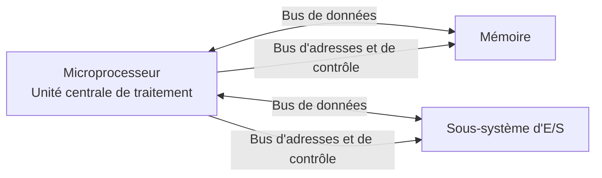
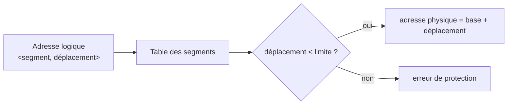
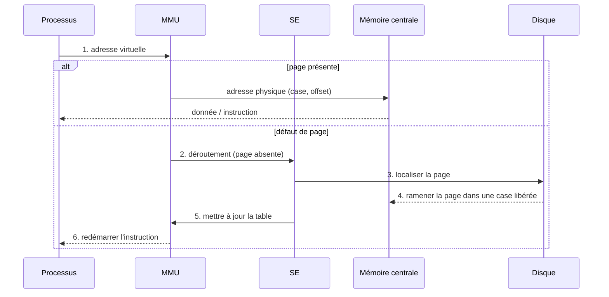

import Tabs from '@theme/Tabs';
import TabItem from '@theme/TabItem';

<Tabs>
<TabItem value="markdown" label="Markdown" default>

# La Gestion de Mémoire — Mémoire Physique et Mémoire Virtuelle

*ENSI — II-2*

:::info Vous allez apprendre

- pourquoi la multiprogrammation impose une gestion de la mémoire ;
- choisir une politique d'allocation contiguë et suivre ses fragments ;
- traduire une adresse segmentée ou paginée ;
- suivre un défaut de page et comparer les politiques de remplacement.

:::

## Introduction et motivations



Le processeur communique avec la mémoire centrale et les E/S par les bus de données, d'adresses et de contrôle. La gestion mémoire organise ce qui réside dans la mémoire centrale et protège les espaces des processus.

**Mémoire Centrale** : la mémoire physique sur un système se divise en deux catégories :

- la mémoire vive (RAM) : composée de circuits intégrés, donc très rapide.
- la mémoire de masse (secondaire) : composée de supports magnétiques (disque dur, bandes magnétiques...), qui est beaucoup plus lente que la mémoire vive.

**En Mono-Programmation** :

- Un seul processus en mémoire à un instant t
- Toute la mémoire disponible est au service de ce processus
- L'utilisateur tape une commande, l'OS charge le programme en mémoire, puis exécute
- Une nouvelle commande charge un nouveau processus qui remplace le précédent
- → Pas besoin d'un mécanisme de gestion de mémoire

**En Multi-Programmation** :

- Technique permettant l'optimisation du taux d'utilisation du processeur en réduisant notamment les attentes sur les E/S.
- Activité du processeur : 400 ms sur 520 ms, soit 77% (exemple)
- Plusieurs processus en mémoire à un instant t
- Diviser la mémoire en n partitions de tailles différentes
- Protéger les espaces d'adressage des processus entre eux
- → Besoin d'une gestion optimale de la mémoire centrale. En dépit de sa grande disponibilité, elle n'est, en général, jamais suffisante, en raison de la taille continuellement grandissante des programmes.

## Principe de gestion

Deux grandes familles de méthodes d'allocation mémoire :

- **Allocation contiguë** : le programme occupe un ensemble de mots contigus insécables → espace d'adressage linéaire. Allocation en partitions fixes ou variables.
- **Allocation non contiguë** : le programme occupe un ensemble de mots sécables. Le programme peut être divisé en morceaux, chaque morceau étant lui-même un ensemble de mots contigus. Chaque morceau peut alors être alloué de manière indépendante → mécanismes de pagination et de segmentation.

Dans beaucoup de cas, il n'est pas possible de faire tenir tous les processus ensemble en mémoire. Parfois même, la taille d'un programme est trop importante.

- Mettre en œuvre une stratégie de recouvrement (overlay) : restructurer le programme sous forme arborescente → très fastidieux.
- Le SE s'en occupe et décharge le programmeur de cette tâche en mettant en œuvre :
  - le va-et-vient (manque de mémoire pour héberger plusieurs programmes)
  - la mémoire virtuelle (taille d'un programme dépasse la taille de la mémoire)

### Plan du chapitre

- Allocation contiguë
  - Allocation statique
  - Allocation dynamique : First fit, Best fit, Worst fit, Buddy system
- Allocation non contiguë
  - Segmentation
  - Pagination
  - Swapping
- La mémoire virtuelle
  - Translation d'adresses
  - Remplacement de pages

## L'allocation contiguë

- La mémoire physique est découpée en zones disjointes.
- Nécessité de connaître l'état de la mémoire (zones libres/occupées).
- Disposer d'une stratégie d'allocation et enfin de procédures de libération.
- 2 types d'allocation :
  - **STATIQUE** : la MC est découpée en zones fixes — PARTITIONS (nombre fixe)
  - **DYNAMIQUE** : la MC est constituée de zones fixes/variables — RÉGIONS (nombre variable)

### Allocation contiguë — allocation statique

- Un programme est considéré comme un espace d'adresses insécable ; les partitions sont de taille fixe, non nécessairement identiques.
- Allocation d'un seul tenant : une partition ne peut contenir qu'un seul processus.

**Deux méthodes de gestion :**

- Une file d'attente par partition : chaque nouveau processus est placé dans la file d'attente de la plus petite partition pouvant le contenir. Il peut y avoir des partitions inutilisées (leur file d'attente est vide).
- Une seule file d'attente globale.
  - Dès qu'une partition se libère, on lui affecte la première tâche de la file qui peut y tenir : on peut ainsi affecter une partition de grande taille à une petite tâche et perdre beaucoup de place.
  - Dès qu'une partition se libère, on lui affecte la plus grande tâche de la file qui peut y tenir : on pénalise les processus de petite taille.

**Étant données la taille(partition) et la taille(processus), 3 cas se présentent :**

- Cas 1 : taille(partition) = taille(processus) : aucune perte de mémoire
- Cas 2 : taille(partition) > taille(processus) → FRAGMENTATION INTERNE — perte de mémoire
- Cas 3 : taille(partition) < taille(processus) : le processus ne peut pas être chargé dans cette partition. Ce n'est pas, à lui seul, de la fragmentation externe ; celle-ci désigne des espaces libres séparés qui ne forment pas un bloc contigu suffisant.

Inconvénient : Fragmentation — phénomène de gruyère. Comment charger un processus de taille 6 Ko ? Récupérer les fragments et faire un tassement (bas/haut) :

- Garbage Collector
- Translation des adresses dynamiques
- Les partitions restent fixes jusqu'au prochain tassement

Avantages :

- Protection assez simple à réaliser
- Adaptée aux systèmes temps réel (partitionnement fixe car les programmes sont toujours les mêmes)

### Allocation contiguë — allocation dynamique

- Allocation en fonction de la taille du programme à exécuter — le nombre et la taille des zones varient dynamiquement.
- Il faut prévoir des protections entre processus car ils fonctionnent dans le même espace, et tout débordement de l'un risquerait de perturber le fonctionnement des autres.
- Représenter la mémoire par des listes chaînées (libres/occupées).
- Libération de zones libres : si zones adjacentes alors fusionner, sinon chaîner.
- Risque de fragmentation externe → compactage/tassement (coûteux). La récupération est une condition nécessaire et non suffisante.

### Politiques d'allocation de mémoire

**Questions générales :**

- **Q1** : Quand charger ?
  - Chargement à la demande, quand on en a besoin
  - Pré-chargement avant d'en avoir besoin
- **Q2** : Où charger en mémoire centrale ?
  - S'il y a de la place, quel emplacement doit-on choisir ? → PROBLÈME DE PLACEMENT
  - S'il n'y a pas de place, quel est le processus victime à décharger pour le charger à sa place ? → PROBLÈME DE REMPLACEMENT (swapping — va-et-vient)

**Algorithmes de placement**

La mémoire est formée d'un ensemble de zones libres et de zones occupées (allouées). Allouer un programme P de taille Taille(P) : trouver une zone libre telle que Taille(zone libre) >= Taille(P). 3 stratégies principales :

- **First Fit** — la première zone qui convient
- **Best Fit** — le meilleur ajustement
- **Worst Fit** — le pire ajustement

**First Fit** : trouver la première zone libre suffisamment grande pour pouvoir y placer le programme. Solution simple, peu coûteuse et la recherche est accélérée par la concentration des résidus en tête de la liste chaînée des zones libres.

**Best Fit** : chercher dans toute la liste des zones libres, et choisir la plus petite zone libre qui puisse contenir le programme à allouer. Produit le plus petit trou résiduel. Parcourir toute la liste chaînée de zones libres n'est pas assez efficace → trier (ordre croissant) la liste selon les tailles des zones libres. Inconvénient : génération de trous inutilisables.

**Worst Fit** : politique du plus grand résidu — chercher à placer un programme dans la zone libre la plus grande. Possibilité d'utiliser le fragment pour le chargement du prochain programme, combattre l'émiettement en réutilisant les résidus. Amélioration de la méthode : fixer une limite inférieure à la taille des résidus — si Taille(résidu) >= Taillemin alors création d'une zone libre, sinon le résidu ne fait pas partie des zones libres. Inconvénient : fragmentation interne.

**Buddy System**

- Subdiviser la mémoire en zones dont les tailles (nombre de mots) forment une suite croissante.
- Les tailles des zones sont quantifiées (multiple d'une certaine unité).
- L'allocation se fait par une relation de récurrence — stratégie Best Fit.
- Essentiellement deux algorithmes :
  - Système binaire (1, 2, 4, 8, 16, 32, 64, ...) : un bloc `Si+1 = 2*Si`
  - Suite de Fibonacci (1, 2, 3, 5, 8, 13, 21, ...) : un bloc `Si+1 = Si + Si-1`

**Allocation (Buddy System)** : soit une demande de taille Si.

- Cas 1 : bloc libre existe et taille satisfaisante → Allocation du bloc Si
- Cas 2 : le bloc Si n'existe pas → créer le bloc par la relation de récurrence (création par subdivision)

**Libération** : mise à jour des blocs libres, création éventuelle d'un nouveau bloc en consultant le "compagnon".

**Exercice d'application (Buddy System)** : Soit un ordinateur gérant sa mémoire centrale en utilisant la technique du Buddy System, avec un seul bloc de 128 Ko. On dispose de 4 processus P1, P2, P3 et P4 dont les demandes de tailles respectives sont 25, 12, 4 et 28 Ko.

1. Chargement de P1
2. Chargement de P2
3. Chargement de P3
4. Terminaison de P2
5. Chargement de P4
6. Terminaison de P1
7. Terminaison de P3

En utilisant le système binaire, donnez à chaque fois l'état de la mémoire après l'exécution des demandes ci-dessus.

:::tip Exemple — trace Buddy System binaire

Chaque demande est arrondie au plus petit bloc de puissance de deux qui la contient : P1 → 32 Ko, P2 → 16 Ko, P3 → 4 Ko et P4 → 32 Ko. En lisant la mémoire de l'adresse 0 à 128 Ko :

| Étape | État de la mémoire |
|---|---|
| initiale | `libre 128` |
| P1 (25 Ko) | `P1 32 \| libre 32 \| libre 64` |
| P2 (12 Ko) | `P1 32 \| P2 16 \| libre 16 \| libre 64` |
| P3 (4 Ko) | `P1 32 \| P2 16 \| P3 4 \| libre 4 \| libre 8 \| libre 64` |
| fin P2 | `P1 32 \| libre 16 \| P3 4 \| libre 4 \| libre 8 \| libre 64` |
| P4 (28 Ko) | `P1 32 \| libre 16 \| P3 4 \| libre 4 \| libre 8 \| P4 32 \| libre 32` |
| fin P1 | `libre 32 \| libre 16 \| P3 4 \| libre 4 \| libre 8 \| P4 32 \| libre 32` |
| fin P3 | `libre 64 \| P4 32 \| libre 32` |

Les fusions finales sont possibles parce que les blocs libérés sont des compagnons de même taille : 4 + 4, puis 8 + 8, 16 + 16 et enfin 32 + 32.

:::

### Faiblesses de l'allocation contiguë

- Exigence d'allouer le programme en une zone d'un seul tenant
- Fragmentation
- Nécessité d'une opération de compactage de la mémoire

→ Diviser le programme :

- en **segments** : (code, données, pile), qui peuvent être de taille différente. Correspond à l'image que le programmeur a de son programme (données manipulées par le programme, programme principal, procédures séparées, ...)
- en **pages** : portions de taille fixe et égale à l'unité de la mémoire centrale

## L'allocation non contiguë

### Segmentation

**Principe** :

- Le programme est divisé en segments.
  - Du point de vue mémoire : un segment est un espace d'adressage linéaire formé d'adresses contiguës.
  - Du point de vue utilisateur : une partie logique du programme (segment de code, segment de données, segment de pile).
- Intérêt : faciliter la gestion par les processus de leur espace propre (exemple le partage)
- Espace à deux dimensions `<Nº Segment, Déplacement>` — simulé par éditeur de liens et chargeur, pris en compte par le matériel

Il faut convertir l'adresse segmentée, générée au niveau du processeur, en une adresse physique équivalente : Adresse physique = adresse implantation segment + déplacement.



La table fournit la base et la limite du segment. Le déplacement doit être inférieur à la limite avant que la MMU ne calcule l'adresse physique.

Allouer un segment S de taille Taille(S) : trouver une zone libre telle que Taille(Zone libre) ≥ Taille(S). Allocations et libérations successives des segments peuvent créer également un problème de fragmentation.

### Pagination

- La pagination permet d'avoir en mémoire un processus dont les adresses sont non contiguës.
- L'espace d'adressage du programme est découpé en morceaux linéaires de même taille — la page (quelques Ko).
- L'espace de la mémoire physique est lui-même découpé en morceaux linéaires de même taille — la case.
- Charger un programme en mémoire centrale consiste à placer les pages dans n'importe quelle case disponible.
- Une adresse générée par le processeur est de la forme `<Nº Page, Déplacement>`.
- La table des pages du processus permet de traduire l'adresse paginée en adresse physique.

| Page du processus P | Case physique |
|---:|---:|
| 1 | 2 |
| 2 | 6 |
| 3 | 5 |
| 4 | 8 |

Les pages du même processus peuvent donc occuper des cases non adjacentes ; la table est le lien qui rend cet éclatement transparent au programme.

### Le swap

Lorsque tous les processus ne peuvent pas tenir simultanément en mémoire (Taille des processus en cours d'exécution > taille de la mémoire physique) :

- Déplacer temporairement certains sur une mémoire provisoire (partie réservée du disque).
- Allocation à la demande de la zone de va-et-vient sur disque :
  - Quand un processus est déchargé de la MC, on lui cherche une place (même gestion que celle de la MC).
  - Lors d'un déchargement, le processus est sûr d'avoir une zone d'attente libre sur le disque.
- La zone de va-et-vient doit être suffisamment grande pour contenir à la fois les images des processus actifs et celles de ceux qui ont été déchargés, car l'espace qu'ils occupaient a été réquisitionné.
- Le swapping ne résout pas le problème d'un processus trop volumineux, de taille supérieure à celle de la MC.

### Récapitulatif — allocation non contiguë

- L'allocation en partitions ou en régions considère le programme comme un ensemble d'adresses insécables : problème de fragmentation, nécessité d'une opération de compactage de la mémoire centrale.
1. La segmentation découpe l'espace d'adressage du programme en segments correspondant à des morceaux logiques du programme.
   - Une adresse générée par le processeur est de la forme `<Nº Segment, Déplacement>`
   - La table des segments du processus permet de transformer l'adresse segmentée en adresse physique
2. La pagination découpe l'espace d'adressage du programme en pages et la mémoire physique en cases de même taille.
   - Une adresse générée par le processeur est de la forme `<Nº Page, Déplacement>`
   - La table des pages du processus permet de traduire l'adresse paginée en adresse physique
3. Segmentation et pagination sont très souvent associées.

## Gestion de la Mémoire Virtuelle

**Objectif** : fournir un espace d'adressage indépendant de celui de la mémoire physique.

- La mémoire virtuelle permet d'exécuter des programmes dont la taille excède celle de la mémoire physique.
- L'espace d'adressage virtuel >> l'espace physique.
- Allocation non contiguë. Facilité de mise en œuvre de la multiprogrammation.
- Réalisation de la mémoire virtuelle (MV) :
  - Représentation physique : MC + MS (disque)
  - Gestion basée sur les techniques de pagination

### Pagination — principe

On ne charge qu'un ensemble de pages en mémoire : ne charger que les pages utiles à un instant donné. Ce sous-ensemble est appelé l'espace physique ou réel.

**Adresse virtuelle vs adresse physique**

L'adresse logique du processus est composée d'un numéro de page et d'un offset (déplacement). Le numéro de page est relatif à la position de la page dans l'espace du processus, l'offset au déplacement à partir du début de la page. L'adresse physique correspondante est formée du numéro de la case où le processus est chargé et du même offset que celui de l'adresse logique.

### Translation d'adresses

Ce transcodage est effectué par des circuits matériels de gestion : MMU (Memory Management Unit). Si l'adresse générée peut correspondre à une adresse mémoire physique, le MMU transmet sur le bus l'adresse réelle ; sinon il se produit un DÉFAUT DE PAGE (Page Fault – PF).

Chaque table des pages contient les champs nécessaires au transcodage, avec notamment :

- 1 bit de présence (P : 1/0) pour marquer la présence de la page en mémoire physique
- 1 bit de modification (M : 0/1) pour signaler si on écrit dans la page

**Exemple** : les pages, dans cet exemple, ont une taille de 4 Ko.

1. Donner l'adresse physique correspondant à l'adresse virtuelle 12292.
2. Que se passe-t-il lorsqu'on fait appel à l'adresse virtuelle 8200 ?

**Correction :**

<details>
<summary>Correction</summary>

1. L'adresse virtuelle 12292 correspond à un déplacement de 4 octets dans la page virtuelle 3 (car 12292 = 12288 + 4 et 12288 = 3\*4\*1024). La page virtuelle 3 correspond à la page physique 2. L'adresse physique correspond donc à un déplacement de 4 octets dans la page physique 2, soit : (8\*1024) + 4 = 8196.
2. L'adresse 8200 appartient à la page virtuelle 2. Or celle-ci n'est pas mappée → défaut de page. Une adresse virtuelle comprise entre 8192 et 12287 donnera lieu à un défaut de page.

</details>

Lors d'une référence, le chemin suivi par la MMU et le SE est le suivant :



Le déplacement ne change jamais pendant la traduction : seule la partie « numéro de page » devient un numéro de case physique.

### Algorithmes de remplacement

A la suite d'un défaut de page, le SE doit retirer une page de la MC pour libérer de la place manquante. Problème : quelle page choisir à décharger afin de récupérer l'espace et minimiser le nombre de défauts de pages ? Plusieurs considérations doivent être tenues en compte :

- il est moins coûteux de remplacer une page qui n'a pas été modifiée en MC (inutile de la recopier sur disque car elle existe déjà !)
- une page d'un segment de code est préférable par rapport à une page d'un segment de données, qui aura certainement été modifiée depuis son chargement
- partage de pages entre plusieurs processus
- date d'utilisation

**Plusieurs algorithmes de remplacement :**

- Aléatoire
- Première entrée, première sortie — FIFO
- Remplacement de la page la moins récemment utilisée — LRU (Least Recently Used)
- Remplacement d'une page non récemment utilisée — NRU (Not Recently Used)
- Optimal

**Algorithme aléatoire (Random)** : la page victime est choisie au hasard.

**FIFO** : lors d'un défaut de page, la page la plus anciennement chargée est la page retirée.

- ✓ Facile à implanter
- ✗ On peut retirer une page très référencée → trop de défauts de pages

:::tip Exemple — FIFO avec trois cases

Pour la suite de références `A B C A B D A D B C B`, FIFO donne :

| Référence | A | B | C | A | B | D | A | D | B | C | B |
|---|---:|---:|---:|---:|---:|---:|---:|---:|---:|---:|---:|
| Case 1 | A | A | A | A | A | D | D | D | D | C | C |
| Case 2 | — | B | B | B | B | B | A | A | A | A | A |
| Case 3 | — | — | C | C | C | C | C | C | B | B | B |
| Défaut de page | ✓ | ✓ | ✓ |  |  | ✓ | ✓ |  | ✓ | ✓ |  |

Il y a **7 défauts de page** : trois chargements initiaux puis quatre remplacements. FIFO évince `A` au premier défaut `D` parce que `A` est la page chargée depuis le plus longtemps, même si elle vient d'être utilisée.

:::

**Algorithme Optimal** : choisir comme victime la page qui sera référencée le plus tard possible.

- Nécessite la connaissance, pour chacune des pages, du nombre d'instructions qui seront exécutées avant que la page soit référencée.
- ✗ Algorithme irréalisable dans un contexte "offline" (connaissance des références qui seront faites)
- ✓ Permet de comparer les performances des autres algorithmes

*Exemple : reprendre l'exemple 1 (ABCABDADBCB) en appliquant Optimal.*

Avec les mêmes trois cases, Optimal fait 5 défauts : après `A B C`, la référence `D` évince `C` (sa prochaine utilisation est la plus éloignée), puis la référence `C` évince une page qui ne sera plus référencée. Cet optimum est une borne de comparaison, car le SE ne connaît pas les futures références.

**Algorithme LRU (Least Recently Used)** : remplacer la page la moins récemment utilisée (accédée) — remplacer la page qui est restée inutilisée le plus de temps.

- ✓ Une bonne approximation de l'algorithme optimal
- ✓ Théoriquement réalisable
- ✗ Très coûteux, nécessite des dispositifs matériels particuliers (compteur pour chaque référence)

*Exemple : A B C D A B C D A B C D*

Pour cette suite cyclique de quatre pages avec seulement trois cases, LRU produit 12 défauts : chaque nouvelle référence est précisément celle qui a été évincée comme la moins récemment utilisée. Cela illustre le coût possible d'une capacité insuffisante malgré une politique plus informée que FIFO.

**Algorithme NRU (Not Recently Used)** : marquer les pages référencées. A chaque page sont associés deux bits R et M :

- R=1 chaque fois que la page est référencée (lecture/écriture), R=0 sinon
- M=1 lorsque la page a été modifiée dans la mémoire centrale

Au lancement d'un processus, le SE met à zéro R et M de toutes les pages. Périodiquement, le bit R est remis à 0 pour différencier les pages qui n'ont pas été récemment référencées des autres. Lors d'un défaut de page, le SE retire une page au hasard dont la valeur MR est la plus petite :

- MR = 00 : non référencée, non modifiée
- MR = 01 : non modifiée, référencée
- MR = 10 : modifiée, non référencée
- MR = 11 : référencée, modifiée

✗ Algorithme basé sur une solution matérielle.

**Récapitulatif — performance**

La taille de la MC influe beaucoup sur les performances de l'algorithme : n'essayez pas de raffiner un algorithme, mais plutôt d'augmenter, si nécessaire, la taille de la mémoire, afin de minimiser le remplacement.

Est-ce que le rajout de mémoire réduit toujours le nombre de défauts de pages ?

- Oui pour Optimal et LRU seulement
- Non pour FIFO

### Autres détails — représentation d'une table de pages

On parle souvent de PTE (Page Table Entries) pour définir les entrées qu'on peut trouver dans la table de pages :

- M=1 si la page a été accédée en écriture, =0 sinon
- R=1 si la page a été référencée, =0 sinon
- V=1 si ce PTE est valide, =0 sinon
- P indique les opérations permises sur cette page (Read, Write, Execute)
- Page Frame Number correspond au numéro de case physique

### Tables de pages à un et deux niveaux

```mermaid
flowchart LR
    VA[Adresse virtuelle<br/>numéro de page | offset] --> PT[Table des pages]
    PT --> PF[Numéro de case — PTE]
    PF --> PA[Adresse physique<br/>numéro de case | même offset]
```

Dans une table à un niveau, le numéro de page indexe directement une PTE. L'offset est recopié sans modification dans l'adresse physique.

```mermaid
flowchart LR
    VA[Adresse virtuelle<br/>index maître | index secondaire | offset] --> M[Table maître]
    M --> S[Table secondaire sélectionnée]
    S --> PTE[PTE : numéro de case]
    PTE --> PA[Adresse physique<br/>numéro de case | même offset]
```

Une table à deux niveaux évite d'allouer d'emblée une grande table plate pour les plages virtuelles inutilisées. Dans l'exemple du PDF (adresses sur 32 bits, pages de 4 Ko et PTE de 4 octets), les 20 bits du numéro de page sont partagés en deux index de 10 bits : chaque table contient donc $2^{10} = 1024$ entrées.

**Étapes suivantes :** applique ces traces à des suites de références différentes : le chapitre suivant sur les fichiers réutilise la même idée d'accès à une ressource limitée et de choix d'une politique de remplacement.

</TabItem>
<TabItem value="pdf" label="PDF">

<PdfViewer file="/pdfs/se2-ch5-gestion-memoire.pdf" />

</TabItem>
</Tabs>
