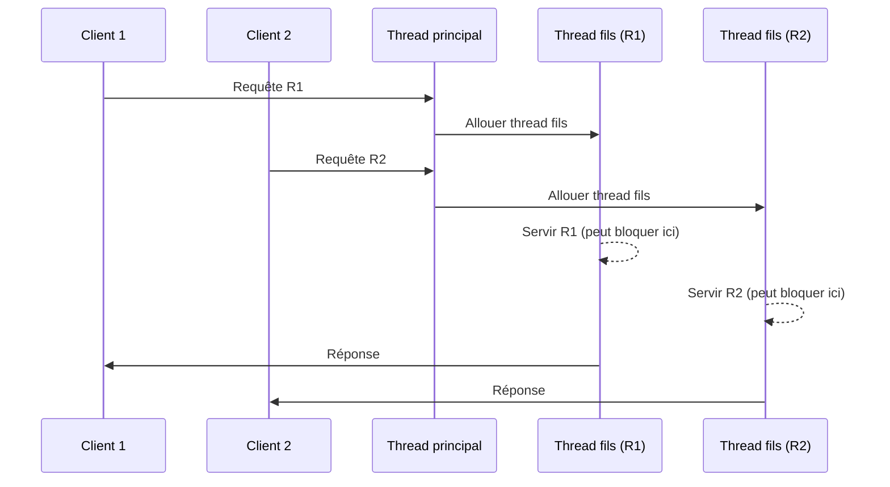
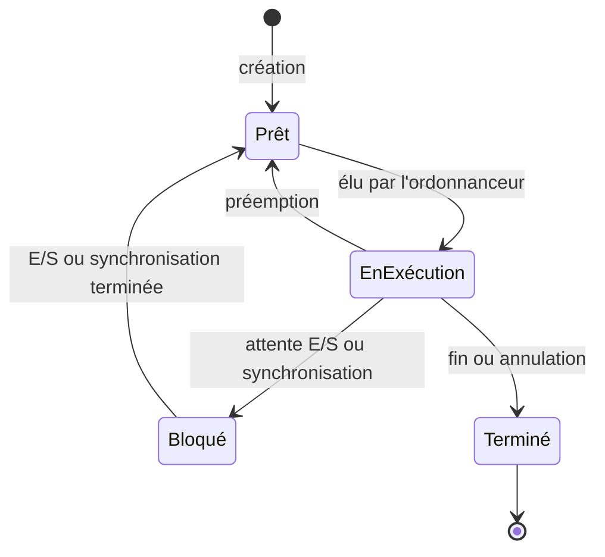

import Tabs from '@theme/Tabs';
import TabItem from '@theme/TabItem';

<Tabs>
<TabItem value="markdown" label="Markdown" default>

# Gestion des processus et des Threads — Partie 2 : Les Threads

*ENSI — II2*

:::info You will learn

- Pourquoi les processus classiques ("lourds") sont coûteux, et ce qu'un thread résout
- Les 4 états d'un thread et leurs transitions
- Comment le multi-threading évite qu'un serveur entier se bloque sur une seule requête lente
- Les trois modèles d'implémentation (User-Level, Kernel-Level, hybride) et leurs compromis
:::

*(Ce chapitre est classé "mixte" — la section états/transitions ci-dessous suit un traitement protocole/diagramme, tandis qu'une section complexité-lourde comme l'ordonnancement — voir [Ch3](../../SE/Cours/se2-ch3-ordonnancement.md), qui est un vrai chapitre déjà converti de ce même cours — suivrait plutôt le patron Archétype 1 (Théorème/Preuve). La classification se fait par section, pas par cours entier.)*

## Motivations

Les processus classiques ("lourds") ont plusieurs inconvénients :

- leur création nécessite des appels systèmes coûteux en temps ;
- le changement de contexte entre processus est lent, notamment pour les transferts en mémoire (90 % du temps y est consacré) ;
- les mécanismes de protection associés au processus ont un coût ;
- l'interaction/synchronisation entre processus nécessite des mécanismes spéciaux (pipe, socket, …) ;
- le partage de mémoire entre processus demande des mécanismes lourds (bibliothèque de partage de mémoire).

## Notion de Thread

:::info Definition
Un **thread** (processus léger, activité, fil d'exécution) est l'abstraction du SE pour l'allocation du processeur — une unité d'exécution qui appartient à un processus lourd et s'exécute indépendamment de son `main`.

Un processus classique (`fork` Unix) ne comporte qu'**un seul** thread (processus monothreadé). Les threads permettent de dérouler plusieurs suites d'instructions **en parallèle**, à l'intérieur du **même** processus (processus multithreadé).
:::

**Exemples de programmes multithreadés** : serveurs (http, nfs, …) — un thread par client connecté ; explorateur de fichiers (un thread par fenêtre) ; navigateur multi-onglets, éditeurs, clients mail.

## Pourquoi le multi-threading : le cas du serveur

**Serveur monothreadé** :

```text title="Boucle serveur (sans thread)"
Attendre une requête
Analyser la requête
Servir la requête
Renvoyer réponse au client
```

:::danger
Si « servir la requête » se bloque (ex. lecture depuis un périphérique lent), **tout le serveur** est bloqué — aucune autre requête ne peut être traitée en attendant.
:::

**Serveur multithreadé** — le thread principal ne fait que dispatcher, chaque requête est servie par son propre thread fils :



Si le thread de `R1` bloque sur une E/S lente, le thread de `R2` continue de s'exécuter — c'est exactement le problème du serveur monothreadé que le multi-threading résout.

## États d'un Thread

:::info Definition

- **Prêt** : prêt à être exécuté (thread nouvellement créé, ou débloqué).
- **En exécution** : en cours d'exécution sur le processeur (plusieurs threads peuvent être "en exécution" simultanément sur une machine multi-processeur).
- **Bloqué** : en attente d'une synchronisation ou de la fin d'une opération (E/S, par exemple).
- **Terminé** : exécution terminée ou annulée — les ressources vont être libérées.
:::



<!-- TODO: reconstructed from the 4 states' textual definitions above — the
source PDF's own state-transition diagram (mentioned across several
slides) didn't extract as text. The 4 states and their names are exact;
the specific transition arrows are a standard-textbook reconstruction,
not lifted from the source's actual diagram. Verify against the original
PDF slides if a more precise transition set is needed. -->

## Types de Threads

Trois modèles d'implémentation, chacun avec ses compromis :

### User-Level Thread

Tous les threads d'un processus lourd partagent la même entité noyau — l'application (bibliothèque) gère les threads, le noyau ignore leur existence.

| Avantages | Inconvénients |
| --- | --- |
| Commutation rapide (pas d'appel noyau) | Un appel bloquant bloque **tous** les threads du processus |
| Fonctionne sur tout OS, sans modification du noyau | Ne peut pas exploiter plusieurs processeurs physiques |
| | L'ordonnancement des threads est à la charge de l'utilisateur |

### Kernel-Level Thread

Chaque thread est pris en charge par une entité noyau — implantation totale dans le noyau.

| Avantages | Inconvénients |
| --- | --- |
| Un thread bloqué ne bloque pas les autres | Gestion coûteuse (appels systèmes pour chaque commutation/synchronisation) |
| Adapté aux machines multiprocesseurs | Les entités noyau consomment une mémoire noyau limitée |
| Ordonnancement à la charge du noyau | |

### Approche hybride

Plusieurs threads niveau utilisateur partagent plusieurs entités noyau — si une entité noyau bloque, le noyau en informe la bibliothèque utilisateur, qui active un autre thread.

:::tip
C'est un compromis délibéré entre les deux approches : commutation rapide (comme User-Level) **et** pas de blocage global (comme Kernel-Level) — au prix d'une implémentation plus complexe à mettre en œuvre et à maintenir.
:::

</TabItem>
<TabItem value="pdf" label="PDF">

<PdfViewer file="/pdfs/se2-ch2-threads.pdf" />

</TabItem>
</Tabs>
